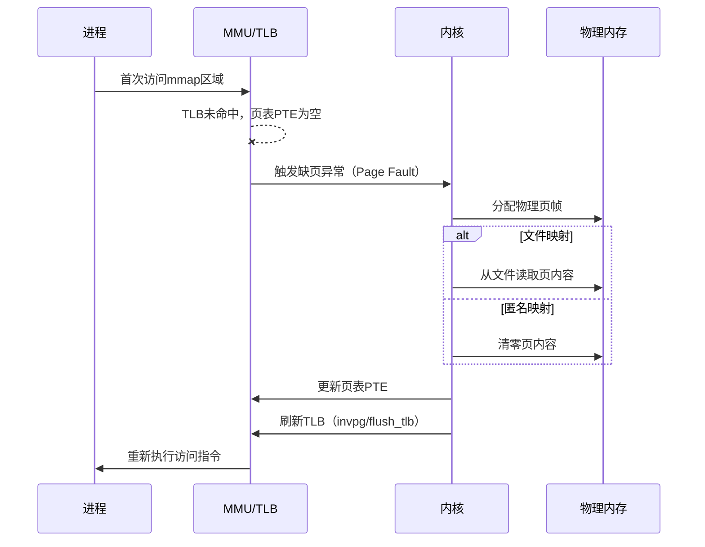

# 共享内存与mmap深度

> 📊 **本章难度等级：** <span class="badge-i">**I级 (Intermediate)**</span> → <span class="badge-e">**E级 (Expert)**</span>

---

## mmap内存映射原理

---

### <strong>mmap的内核页表机制</strong>

<span class="badge-i">I</span><br>
<span class="red">mmap()</span>是Linux最核心的内存管理原语之一，既可将文件映射到进程地址空间，也可创建匿名映射用于进程间共享内存。
<br>
内核通过建立页表映射关系，使多个进程的虚拟地址指向同一物理页帧，从而实现零拷贝数据共享。
<br>

```c
// mmap创建共享内存映射
// 文件路径：examples/mmap_shared.c
#include <sys/mman.h>
#include <fcntl.h>
#include <unistd.h>
#include <stdio.h>

#define SHM_SIZE 4096
#define SHM_NAME "/shm_example"

int main(void) {
    // 创建共享内存对象（POSIX shm_open）
    int fd = shm_open(SHM_NAME, O_CREAT | O_RDWR, 0666);
    if (fd < 0) { perror("shm_open"); return 1; }

    // 设置共享内存大小（必须先ftruncate）
    ftruncate(fd, SHM_SIZE);

    // 映射到进程地址空间
    char *addr = mmap(NULL, SHM_SIZE,
                        PROT_READ | PROT_WRITE,
                        MAP_SHARED,        // MAP_SHARED使修改对其他进程可见
                        fd, 0);
    if (addr == MAP_FAILED) { perror("mmap"); return 1; }

    // 写入数据（直接内存访问，无系统调用）
    snprintf(addr, SHM_SIZE, "shared_data_from_pid_%d", getpid());

    // 同步到文件（可选，仅当需要持久化时）
    msync(addr, SHM_SIZE, MS_SYNC);

    munmap(addr, SHM_SIZE);
    close(fd);
    // shm_unlink(SHM_NAME);  // 最后退出时销毁
    return 0;
}
```

<span class="orange"><strong>1. MAP_SHARED：</strong></span>修改会写回文件，且对所有映射该文件的进程可见。
<br>
<span class="orange"><strong>2. MAP_PRIVATE：</strong></span>写时复制（COW），修改不影响其他进程或底层文件。
<br>
<span class="orange"><strong>3. 文件描述符可关闭：</strong></span>mmap成功后即可关闭fd，映射关系由内核vma独立维护。
<br>

<span class="blue">核心原理：mmap的优势不在于"映射"本身，而在于映射完成后所有数据访问均为用户态直接内存操作，彻底绕过了read/write的系统调用开销。</span><br>

---

### <strong>mmap的页故障与TLB交互</strong>

<span class="badge-e">E</span><br>
<span class="red">mmap建立的是虚拟地址到文件的映射关系</span>，而非立即分配物理页。
<br>
首次访问映射区域时触发缺页异常（Page Fault），内核分配物理页并将文件内容读入（或清零匿名页），随后更新页表和TLB。
<br>



<span class="blue">性能启示：mmap后的首次访问存在延迟惩罚，实时系统应在初始化阶段完成"预热访问"，避免运行时触发Page Fault。</span><br>

---

## POSIX共享内存shm_open

---

### <strong>POSIX共享内存与System V shm的对比</strong>

<span class="badge-i">I</span><br>
<span class="red">POSIX共享内存</span>通过shm_open()创建，在/dev/shm目录下生成对应的tmpfs文件节点。
<br>
与System V共享内存相比，POSIX版本具备文件系统可见性、权限控制更直观、API更简洁的优势。
<br>

| 对比维度 | System V共享内存 | POSIX共享内存 |
|---------|-----------------|---------------|
| 创建API | shmget() | shm_open() |
| 命名方式 | key_t数值键 | 文件路径字符串 |
| 文件系统可见 | 否 | 是（/dev/shm/xxx） |
| 权限控制 | ipc_perm结构 | 标准Unix文件权限 |
| 大小调整 | 创建时固定 | ftruncate动态调整 |
| 持久化 | 内核重启丢失 | tmpfs重启丢失 |

```c
// POSIX共享内存动态扩容示例
// 文件路径：examples/shm_resize.c
#include <sys/mman.h>
#include <fcntl.h>
#include <unistd.h>
#include <stdio.h>

#define SHM_NAME "/dynamic_shm"

int main(void) {
    int fd = shm_open(SHM_NAME, O_CREAT | O_RDWR, 0666);

    // 初始大小1页
    ftruncate(fd, 4096);
    char *addr = mmap(NULL, 4096, PROT_READ | PROT_WRITE, MAP_SHARED, fd, 0);
    strcpy(addr, "initial_data");

    // 运行时扩容到2页
    munmap(addr, 4096);
    ftruncate(fd, 8192);
    addr = mmap(NULL, 8192, PROT_READ | PROT_WRITE, MAP_SHARED, fd, 0);
    printf("data after resize: %s\n", addr);

    munmap(addr, 8192);
    close(fd);
    shm_unlink(SHM_NAME);
    return 0;
}
```

<span class="blue">关键结论：shm_open创建的共享内存对象本质是tmpfs中的文件，因此受/dev/shm挂载大小限制，嵌入式系统需要提前规划容量。</span><br>

---

## 进程间互斥锁

---

### <strong>pthread_mutex在共享内存中的跨进程使用</strong>

<span class="badge-e">E</span><br>
<span class="red">pthread_mutex</span>默认仅在同进程线程间生效，但通过设置<span class="green">PTHREAD_PROCESS_SHARED</span>属性，可使其在共享内存中跨进程工作。
<br>
互斥锁的底层依赖futex（Fast Userspace muTEX）机制：无竞争时完全用户态，竞争时才陷入内核等待队列。
<br>

```c
// 共享内存中的跨进程互斥锁
// 文件路径：examples/shm_mutex.c
#include <pthread.h>
#include <sys/mman.h>
#include <fcntl.h>
#include <unistd.h>
#include <stdio.h>

#define SHM_NAME "/mutex_shm"

struct shared_data {
    pthread_mutex_t mutex;
    int counter;
};

int main(void) {
    int fd = shm_open(SHM_NAME, O_CREAT | O_RDWR, 0666);
    ftruncate(fd, sizeof(struct shared_data));

    struct shared_data *sd = mmap(NULL, sizeof(struct shared_data),
                                   PROT_READ | PROT_WRITE,
                                   MAP_SHARED, fd, 0);

    // 初始化互斥锁（仅首次创建时执行）
    pthread_mutexattr_t attr;
    pthread_mutexattr_init(&attr);
    pthread_mutexattr_setpshared(&attr, PTHREAD_PROCESS_SHARED);
    pthread_mutex_init(&sd->mutex, &attr);
    pthread_mutexattr_destroy(&attr);

    // 跨进程互斥操作
    pthread_mutex_lock(&sd->mutex);
    sd->counter++;
    printf("counter = %d\n", sd->counter);
    pthread_mutex_unlock(&sd->mutex);

    munmap(sd, sizeof(struct shared_data));
    close(fd);
    return 0;
}
```

<span class="blue">代码带读：第23-26行的PTHREAD_PROCESS_SHARED是关键——没有此属性，mutex的等待队列仅记录线程ID而非进程ID，跨进程时将无法正确唤醒。</span><br>

---

## 零拷贝与环形缓冲区

---

### <strong>共享内存环形缓冲区的无锁设计</strong>

<span class="badge-e">E</span><br>
<span class="red">环形缓冲区（Ring Buffer）</span>是共享内存中最经典的数据结构，单生产者-单消费者模型可通过内存序（Memory Order）实现无锁同步。
<br>
生产者写入数据后更新write_index，消费者读取后更新read_index；当write_index追上read_index时缓冲区满。
<br>

```c
// 无锁单生产者单消费者环形缓冲区
// 文件路径：examples/ring_buffer_lockfree.h
// 行号：1-50
#ifndef RING_BUFFER_H
#define RING_BUFFER_H

#include <stdint.h>
#include <stdatomic.h>

#define RB_SIZE 1024

struct ring_buffer {
    _Atomic uint32_t write_idx;   // 生产者索引
    _Atomic uint32_t read_idx;    // 消费者索引
    uint8_t data[RB_SIZE];        // 环形数据区
};

static inline int rb_write(struct ring_buffer *rb,
                           const uint8_t *src, uint32_t len) {
    uint32_t w = atomic_load_explicit(&rb->write_idx, memory_order_relaxed);
    uint32_t r = atomic_load_explicit(&rb->read_idx, memory_order_acquire);

    uint32_t avail = (r > w) ? (r - w - 1) : (RB_SIZE - w + r - 1);
    if (avail < len) return -1;  // 缓冲区满

    for (uint32_t i = 0; i < len; i++) {
        rb->data[(w + i) % RB_SIZE] = src[i];
    }
    atomic_store_explicit(&rb->write_idx,
                          (w + len) % RB_SIZE,
                          memory_order_release);
    return 0;
}

static inline int rb_read(struct ring_buffer *rb,
                          uint8_t *dst, uint32_t len) {
    uint32_t w = atomic_load_explicit(&rb->write_idx, memory_order_acquire);
    uint32_t r = atomic_load_explicit(&rb->read_idx, memory_order_relaxed);

    uint32_t used = (w >= r) ? (w - r) : (RB_SIZE - r + w);
    if (used < len) return -1;  // 缓冲区空

    for (uint32_t i = 0; i < len; i++) {
        dst[i] = rb->data[(r + i) % RB_SIZE];
    }
    atomic_store_explicit(&rb->read_idx,
                          (r + len) % RB_SIZE,
                          memory_order_release);
    return 0;
}

#endif
```

<span class="orange"><strong>1. write_idx使用release语义：</strong></span>确保数据写入完成后再更新索引，消费者通过acquire语义保证看到完整数据。
<br>
<span class="orange"><strong>2. 幂次容量简化取模：</strong></span>若RB_SIZE为2^n，可用位掩码代替取模运算，提升嵌入式性能。
<br>
<span class="orange"><strong>3. 多生产者变体：</strong></span>需引入reserve/commit两阶段协议，或使用原子CAS操作。
<br>

<span class="blue">性能结论：无锁环形缓冲区在ARM Cortex-A53上可实现亚微秒级读写延迟，是嵌入式高频数据交换的首选方案。</span><br>

---

## 掉电安全与持久化

---

### <strong>共享内存的易失性与持久化策略</strong>

<span class="badge-e">E</span><br>
<span class="red">POSIX共享内存基于tmpfs</span>，系统掉电后数据全部丢失，这在工业控制等场景中是不可接受的。
<br>
持久化策略需要在性能与可靠性之间权衡：实时路径使用共享内存，异步路径落盘到日志文件或数据库。
<br>

| 策略 | 机制 | 延迟影响 | 可靠性 |
|------|------|---------|--------|
| 纯共享内存 | tmpfs | 最低 | 掉电即失 |
| msync+MAP_SHARED | 强制刷盘 | 高（同步IO） | 每次msync后可靠 |
| 双缓冲+后台刷盘 | 共享内存 + 后台线程 | 低（异步） | 最后N秒可能丢失 |
| mmap文件 | ext4 + MAP_SHARED | 中 | 依赖文件系统日志 |

```c
// 双缓冲持久化策略示例
// 文件路径：examples/dual_buffer_persist.c
#include <sys/mman.h>
#include <fcntl.h>
#include <unistd.h>
#include <pthread.h>
#include <stdio.h>

#define SHM_SIZE (1 * 1024 * 1024)  // 1MB 共享内存
#define SYNC_INTERVAL_MS 1000

static void *persist_thread(void *arg) {
    int fd = *(int*)arg;
    while (1) {
        usleep(SYNC_INTERVAL_MS * 1000);
        fsync(fd);  // 异步刷盘，不阻塞生产者
    }
    return NULL;
}

int main(void) {
    int fd = open("/var/data/sensor_log.bin",
                  O_CREAT | O_RDWR, 0644);
    ftruncate(fd, SHM_SIZE);

    // 文件映射到共享内存区域
    char *addr = mmap(NULL, SHM_SIZE,
                        PROT_READ | PROT_WRITE,
                        MAP_SHARED, fd, 0);

    // 启动后台持久化线程
    pthread_t tid;
    pthread_create(&tid, NULL, persist_thread, &fd);

    // 生产者直接写addr，延迟等同于共享内存
    // ... 生产逻辑 ...

    return 0;
}
```

<span class="blue">工程原则：嵌入式系统中，"实时路径用共享内存，审计路径用文件日志"是掉电安全与性能的经典折中。</span><br>

---

## 历史演进与小结

---

### <strong>共享内存机制的演进</strong>

<span class="badge-i">I</span><br>

| 年代 | 事件 | 意义 |
|------|------|------|
| 1983 | System V shmget/shmat | 内核级共享内存标准化 |
| 1993 | POSIX shm_open/mmap | 文件系统语义统一 |
| 2001 | tmpfs成为/dev/shm默认 | 共享内存与tmpfs融合 |
| 2002 | Linux 2.5 futex引入 | 用户态快速路径互斥 |
| 2011 | C11 _Atomic标准化 | 跨平台无锁编程基础 |
| 2015 | DAX（Direct Access） | 绕过页缓存的NVM直接映射 |

---

## 本章小结

| 要点 | 核心结论 |
|------|---------|
| mmap原理 | 页表映射，首次访问触发Page Fault |
| POSIX shm | 文件系统可见，权限直观，tmpfs承载 |
| 跨进程互斥 | PTHREAD_PROCESS_SHARED + futex |
| 无锁环形缓冲 | release/acquire语义，单生产者单消费者最优 |
| 持久化策略 | 双缓冲+后台刷盘是经典折中 |

---

## 课后练习

1. **代码实现**：基于C11 _Atomic实现一个多生产者多消费者的无锁环形缓冲区，要求支持变长消息。<br>
2. **性能测试**：在ARM Cortex-A53上对比mmap+自旋锁、mmap+互斥锁、UDS三种方案的延迟CDF，分析99.9分位差异。<br>
3. **工程设计**：一个工业PLC系统需要在掉电后恢复最后100ms的控制指令。设计共享内存+持久化的双缓冲架构，给出内存布局和刷盘策略。<br>
