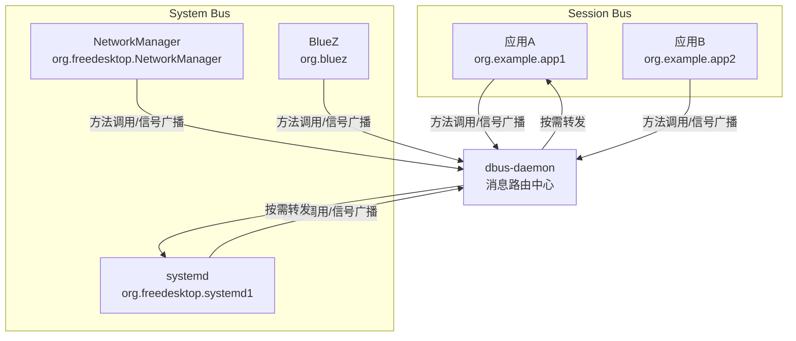

# D-Bus与系统总线

> 📊 **本章难度等级：** <span class="badge-i">**I级 (Intermediate)**</span> → <span class="badge-e">**E级 (Expert)**</span>

---

## D-Bus架构（总线-服务-对象）

---

### <strong>D-Bus的三层对象模型</strong>

<span class="badge-i">I</span><br>
<span class="red">D-Bus（Desktop Bus）</span>是freedesktop.org推出的进程间消息总线系统，旨在为Linux桌面和服务进程提供统一的对象通信框架。
<br>
D-Bus将通信抽象为三层：总线（Bus）负责路由，服务（Service）标识进程，对象（Object）承载接口和方法。
<br>



<span class="orange"><strong>1. 总线守护进程：</strong></span><span class="green">dbus-daemon</span>作为中心路由器，维护所有连接和订阅关系，转发消息到目标进程。
<br>
<span class="orange"><strong>2. 系统总线（System Bus）：</strong></span>系统级服务注册于此，如NetworkManager、systemd、udev等，需要root权限或PolicyKit授权。
<br>
<span class="orange"><strong>3. 会话总线（Session Bus）：</strong></span>用户级应用注册于此，如桌面环境、浏览器、即时通讯客户端等。
<br>

<span class="blue">架构要义：D-Bus的"总线"模式将N个进程的N*(N-1)条直接连接简化为N条到总线的连接，但引入了单点路由延迟。</span><br>

---

### <strong>对象路径、接口与方法</strong>

<span class="badge-i">I</span><br>
<span class="red">D-Bus对象模型</span>借鉴了面向对象编程的术语，但运行于进程间通信层面。
<br>
每个服务对象暴露一个或多个对象路径，每个对象路径实现一个或多个接口，每个接口包含方法和信号。
<br>

| 概念 | 类比 | 示例 |
|------|------|------|
| 服务名 | 进程标识 | org.freedesktop.NetworkManager |
| 对象路径 | 对象地址 | /org/freedesktop/NetworkManager/Devices/0 |
| 接口 | 类定义 | org.freedesktop.DBus.Properties |
| 方法 | 同步调用 | GetDevices、ActivateConnection |
| 信号 | 异步广播 | StateChanged、PropertiesChanged |

```bash
# 查询系统总线上的所有服务
$ dbus-send --system --print-reply \
    --dest=org.freedesktop.DBus / \
    org.freedesktop.DBus.ListNames

# 调用NetworkManager的GetDevices方法
$ dbus-send --system --print-reply \
    --dest=org.freedesktop.NetworkManager \
    /org/freedesktop/NetworkManager \
    org.freedesktop.NetworkManager.GetDevices
```

<span class="blue">核心洞察：D-Bus的对象模型使进程间通信从"向PID发数据"升级为"向服务路径发消息"，实现了服务发现与解耦。</span><br>

---

## 信号与槽机制

---

### <strong>D-Bus信号：跨进程的发布-订阅</strong>

<span class="badge-i">I</span><br>
<span class="red">D-Bus信号（Signal）</span>是异步广播机制，发布者不等待响应，订阅者通过匹配规则接收感兴趣的广播。
<br>
信号的匹配规则可基于接口名、成员名、对象路径或发送者进行过滤。
<br>

```c
// sd-bus订阅D-Bus信号
// 文件路径：examples/sdbus_signal_sub.c
#include <systemd/sd-bus.h>
#include <stdio.h>

static int on_signal(sd_bus_message *m, void *userdata,
                     sd_bus_error *error) {
    const char *iface, *member;
    sd_bus_message_get_interface(m, &iface);
    sd_bus_message_get_member(m, &member);
    printf("signal: %s.%s\n", iface, member);

    // 读取信号参数
    const char *key;
    sd_bus_message_read(m, "s", &key);
    printf("  param: %s\n", key);
    return 0;
}

int main(void) {
    sd_bus *bus = NULL;
    sd_bus_open_system(&bus);  // 连接系统总线

    // 添加匹配规则：订阅所有PropertiesChanged信号
    sd_bus_match_signal(bus, NULL,
                        NULL,                       // 任意发送者
                        "org.freedesktop.DBus.Properties",
                        "PropertiesChanged",
                        on_signal, NULL);

    // 事件循环
    for (;;) {
        sd_bus_process(bus, NULL);
        sd_bus_wait(bus, (uint64_t)-1);
    }

    sd_bus_unref(bus);
    return 0;
}
```

<span class="blue">代码带读：第28行的sd_bus_match_signal是订阅核心——通过通配NULL实现"广播监听"，匹配条件越具体，守护进程的过滤效率越高。</span><br>

---

## 嵌入式D-Bus裁剪

---

### <strong>嵌入式场景的资源约束与裁剪策略</strong>

<span class="badge-e">E</span><br>
<span class="red">D-Bus在嵌入式系统</span>中的主要挑战是资源占用：dbus-daemon守护进程常驻内存约2-4MB，每条消息涉及多次内存拷贝和序列化。
<br>
嵌入式裁剪策略包括：替换dbus-daemon为轻量实现、降低序列化开销、以及改用直接连接模式。
<br>

| 策略 | 方案 | 效果 |
|------|------|------|
| 守护进程替换 | dbus-broker（eBPF加速） | 降低延迟30%~50% |
| 库裁剪 | 弃用libdbus，改用sd-bus | 减少依赖、代码更小 |
| 点对点连接 | 绕过总线，直接socket连接 | 消除路由延迟 |
| 编译裁剪 | dbus-daemon编译时去掉X11/SELinux | 减少二进制体积 |

```c
// 点对点D-Bus连接（绕过守护进程）
// 文件路径：examples/dbus_p2p.c
#include <systemd/sd-bus.h>

int main(void) {
    sd_bus *bus = NULL;
    // 直接连接到指定Unix socket，不经过dbus-daemon
    sd_bus_open_address(&bus, "unix:path=/run/myapp/bus");

    // 后续方法调用和信号收发与总线模式API相同
    sd_bus_message *reply = NULL;
    sd_bus_call_method(bus,
        "org.example.service",
        "/org/example/Object",
        "org.example.Interface",
        "DoSomething",
        NULL, &reply,
        "s", "argument");

    sd_bus_unref(bus);
    return 0;
}
```

<span class="blue">裁剪原则：资源充裕的嵌入式Linux（>256MB RAM）可直接使用标准D-Bus；资源受限系统（<128MB）应评估是否可用Unix Domain Socket直接替代。</span><br>

---

## 与Unix Socket性能对比

---

### <strong>D-Bus vs UDS：延迟与吞吐量</strong>

<span class="badge-i">I</span><br>
<span class="red">D-Bus与Unix Domain Socket</span>并非对立关系，D-Bus底层实际使用UDS作为传输层。
<br>
两者的差异在于协议层：D-Bus在UDS之上增加了消息编解码、路由、对象模型和类型系统，这些功能带来了额外开销。
<br>

| 对比维度 | D-Bus（通过守护进程） | Unix Domain Socket（直接） |
|---------|----------------------|--------------------------|
| 单次RTT | 100~500 us | 30~100 us |
| 消息序列化 | 自动（类型安全） | 应用层自行定义 |
| 服务发现 | 总线自动管理 | 需预定义socket路径 |
| 广播能力 | 原生支持 | 需应用层实现 |
| 权限控制 | PolicyKit/policy规则 | 文件系统权限 |
| 内存拷贝 | 用户态->守护进程->目标进程 | 用户态->内核->目标进程 |

<span class="blue">选型结论：需要服务发现、动态广播、类型安全时选D-Bus；追求极致延迟、固定拓扑时选UDS直连。</span><br>

---

## systemd集成实战

---

### <strong>systemd的D-Bus接口管理</strong>

<span class="badge-e">E</span><br>
<span class="red">systemd</span>将D-Bus作为其对外控制的标准接口，<span class="green">systemctl</span>命令本质上是sd-bus客户端。
<br>
通过D-Bus可直接启动、停止、查询和监控systemd管理的所有单元（unit）。
<br>

```c
// 通过sd-bus远程启动systemd服务
// 文件路径：examples/sdbus_systemctl.c
#include <systemd/sd-bus.h>
#include <stdio.h>

int main(void) {
    sd_bus *bus = NULL;
    sd_bus_open_system(&bus);

    // 调用StartUnit方法启动服务
    sd_bus_message *reply = NULL;
    sd_bus_call_method(bus,
        "org.freedesktop.systemd1",
        "/org/freedesktop/systemd1",
        "org.freedesktop.systemd1.Manager",
        "StartUnit",
        NULL, &reply,
        "ss",                     // 两个字符串参数
        "sshd.service",           // 单元名称
        "replace");               // 启动模式

    const char *job_path;
    sd_bus_message_read(reply, "o", &job_path);
    printf("job created: %s\n", job_path);

    sd_bus_message_unref(reply);
    sd_bus_unref(bus);
    return 0;
}
```

<span class="blue">工程价值：将systemd的D-Bus接口集成到嵌入式管理守护进程中，可实现统一的进程生命周期管理和状态监控。</span><br>

---

## 历史演进与小结

---

### <strong>D-Bus的演进与生态</strong>

<span class="badge-i">I</span><br>

| 年代 | 事件 | 意义 |
|------|------|------|
| 2002 | D-Bus项目启动 | 替代DCOP和Bonobo，统一桌面IPC |
| 2003 | D-Bus 0.1发布 | freedesktop.org标准化 |
| 2006 | D-Bus 1.0发布 | API稳定，进入主流发行版 |
| 2011 | sd-bus引入systemd | C原生API，零依赖，替代libdbus |
| 2017 | dbus-broker项目启动 | eBPF加速的消息总线替代方案 |
| 2020 | D-Bus规范1.14 | 容器和沙箱环境下的安全增强 |

---

## 本章小结

| 要点 | 核心结论 |
|------|---------|
| 三层模型 | 总线路由->服务标识->对象方法 |
| 信号机制 | 异步广播，匹配规则过滤 |
| 嵌入式裁剪 | dbus-broker/sd-bus/点对点连接 |
| 性能对比 | D-Bus比UDS慢3~5倍，但功能更完整 |
| systemd集成 | D-Bus是systemd的标准控制接口 |

---

## 课后练习

1. **代码实现**：使用sd-bus实现一个D-Bus服务，暴露一个对象路径和两个方法（GetStatus/SetConfig），并广播PropertiesChanged信号。<br>
2. **性能测试**：在同一嵌入式平台上对比dbus-daemon和dbus-broker的消息往返延迟，分析延迟差异来源。<br>
3. **工程决策**：一个嵌入式网关需要在前端UI进程与后端守护进程之间传递配置变更事件（每秒<10条，每条<1KB）。评估D-Bus和UDS+自定义协议两种方案，给出选型理由。<br>
