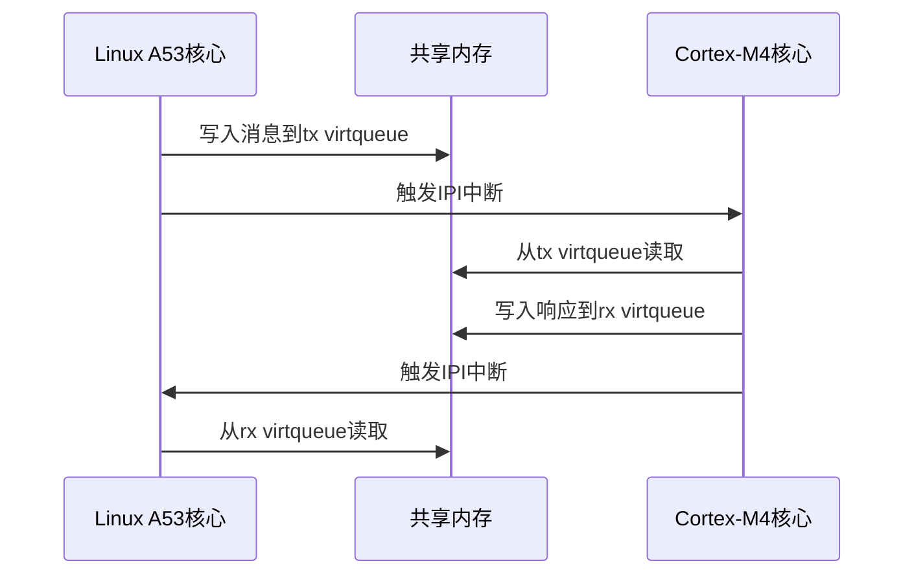
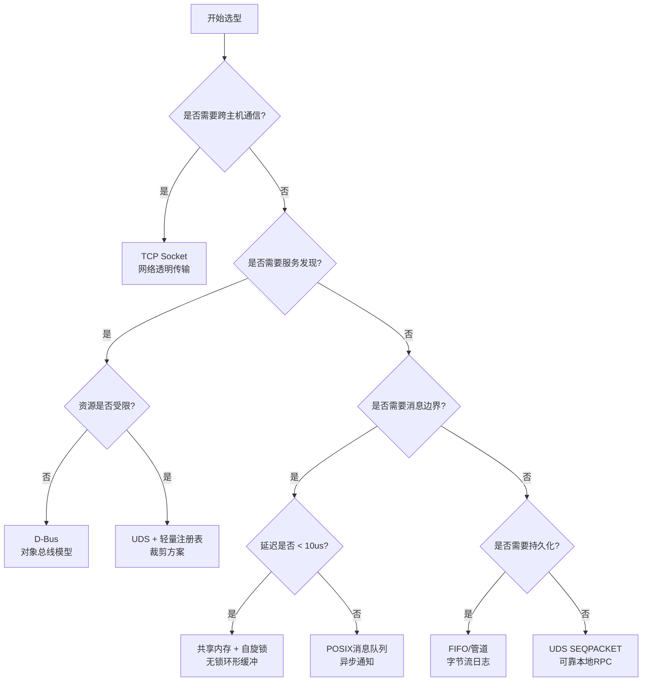

# Socket域套接字与高级IPC

> 📊 **本章难度等级：** <span class="badge-e">**E级 (Expert)**</span>

---

## Unix Domain Socket类型

---

### <strong>UDS的两种语义模式</strong>

<span class="badge-e">E</span><br>
<span class="red">Unix Domain Socket（UDS）</span>是本地进程间通信的最通用机制，支持流式（SOCK_STREAM）和报文（SOCK_DGRAM）两种语义。
<br>
流式UDS提供可靠有序的字节流，报文UDS保留消息边界但不保证顺序，两者均不经过网络协议栈。
<br>

| 类型 | 语义 | 连接模式 | 消息边界 | 典型场景 |
|------|------|---------|---------|---------|
| SOCK_STREAM | 字节流 | 面向连接 | 不保留 | 服务-客户端长连接 |
| SOCK_DGRAM | 数据报 | 无连接 | 保留 | 短消息、控制命令 |
| SOCK_SEQPACKET | 顺序报文 | 面向连接 | 保留 | 可靠消息传输 |

```c
// SOCK_STREAM UDS服务端
// 文件路径：examples/uds_stream_server.c
#include <sys/socket.h>
#include <sys/un.h>
#include <unistd.h>
#include <stdio.h>

#define SOCK_PATH "/tmp/uds_socket"

int main(void) {
    int fd = socket(AF_UNIX, SOCK_STREAM, 0);
    struct sockaddr_un addr = {
        .sun_family = AF_UNIX,
    };
    strncpy(addr.sun_path, SOCK_PATH, sizeof(addr.sun_path)-1);

    unlink(SOCK_PATH);
    bind(fd, (struct sockaddr*)&addr, sizeof(addr));
    listen(fd, 5);

    int client = accept(fd, NULL, NULL);
    char buf[256];
    int n = read(client, buf, sizeof(buf));
    buf[n] = '\0';
    printf("received: %s\n", buf);

    close(client);
    close(fd);
    unlink(SOCK_PATH);
    return 0;
}
```

```c
// SOCK_STREAM UDS客户端
// 文件路径：examples/uds_stream_client.c
#include <sys/socket.h>
#include <sys/un.h>
#include <unistd.h>

#define SOCK_PATH "/tmp/uds_socket"

int main(void) {
    int fd = socket(AF_UNIX, SOCK_STREAM, 0);
    struct sockaddr_un addr = {
        .sun_family = AF_UNIX,
    };
    strncpy(addr.sun_path, SOCK_PATH, sizeof(addr.sun_path)-1);

    connect(fd, (struct sockaddr*)&addr, sizeof(addr));
    write(fd, "hello_uds", 9);
    close(fd);
    return 0;
}
```

<span class="blue">关键优势：UDS在本地传输时完全绕过TCP/IP协议栈，数据在内核中直接通过socket缓冲区拷贝，延迟比TCP环回低约30%~50%。</span><br>

---

## SCM_RIGHTS描述符传递

---

### <strong>通过UDS传递文件描述符</strong>

<span class="badge-e">E</span><br>
<span class="red">SCM_RIGHTS</span>是Unix Domain Socket独有的控制消息机制，允许进程间传递打开的文件描述符。
<br>
接收进程获得的描述符指向同一个内核文件表项，共享文件偏移量和状态标志，这在权限隔离和服务化架构中极具价值。
<br>

```c
// SCM_RIGHTS发送端：将打开的文件描述符传递给子进程
// 文件路径：examples/scm_rights_send.c
#include <sys/socket.h>
#include <sys/un.h>
#include <unistd.h>
#include <fcntl.h>
#include <stdio.h>
#include <string.h>

#define SOCK_PATH "/tmp/fd_passing"

int main(void) {
    int uds[2];
    socketpair(AF_UNIX, SOCK_STREAM, 0, uds);  // 创建已连接UDS对

    pid_t pid = fork();
    if (pid == 0) {
        // 子进程：接收描述符
        close(uds[1]);

        char buf[CMSG_SPACE(sizeof(int))];
        struct iovec iov = { .iov_base = "dummy", .iov_len = 5 };
        struct msghdr msg = {
            .msg_iov = &iov, .msg_iovlen = 1,
            .msg_control = buf, .msg_controllen = sizeof(buf),
        };
        recvmsg(uds[0], &msg, 0);

        struct cmsghdr *cmsg = CMSG_FIRSTHDR(&msg);
        int fd = *(int*)CMSG_DATA(cmsg);  // 提取传递的描述符

        char content[64];
        read(fd, content, sizeof(content));
        printf("child read via passed fd: %s\n", content);
        close(fd);
        close(uds[0]);
        return 0;
    }

    // 父进程：打开文件并传递描述符
    close(uds[0]);
    int fd = open("/tmp/testfile", O_RDONLY);

    char buf[CMSG_SPACE(sizeof(int))];
    struct iovec iov = { .iov_base = "dummy", .iov_len = 5 };
    struct msghdr msg = {
        .msg_iov = &iov, .msg_iovlen = 1,
        .msg_control = buf, .msg_controllen = sizeof(buf),
    };
    struct cmsghdr *cmsg = CMSG_FIRSTHDR(&msg);
    cmsg->cmsg_level = SOL_SOCKET;
    cmsg->cmsg_type = SCM_RIGHTS;
    cmsg->cmsg_len = CMSG_LEN(sizeof(int));
    *(int*)CMSG_DATA(cmsg) = fd;

    sendmsg(uds[1], &msg, 0);
    close(fd);
    close(uds[1]);
    wait(NULL);
    return 0;
}
```

<span class="blue">代码带读：第35-38行的CMSG_FIRSTHDR+CMSG_DATA宏是提取辅助数据的标准手法；传递的描述符在接收进程中表现为新的fd数值，但底层指向同一文件表项。</span><br>

---

## 本地RPC框架

---

### <strong>基于UDS的轻量RPC设计</strong>

<span class="badge-e">E</span><br>
<span class="red">在嵌入式系统中</span>，当D-Bus过于沉重时，可基于UDS SOCK_SEQPACKET构建轻量RPC框架。
<br>
SOCK_SEQPACKET兼具连接可靠性（无丢包、无乱序）和消息边界保留，是本地RPC的理想传输层。
<br>

```c
// SOCK_SEQPACKET服务端骨架
// 文件路径：examples/seqpacket_rpc_server.c
#include <sys/socket.h>
#include <sys/un.h>
#include <stdint.h>
#include <stdio.h>

#define SOCK_PATH "/tmp/rpc.sock"

struct rpc_request {
    uint32_t seq;       // 序列号
    uint32_t cmd;       // 命令码
    uint32_t len;       // 载荷长度
    char payload[256];  // 变长载荷
};

struct rpc_response {
    uint32_t seq;       // 对应请求序列号
    int32_t status;     // 返回码
    char payload[256];
};

int main(void) {
    int fd = socket(AF_UNIX, SOCK_SEQPACKET, 0);
    struct sockaddr_un addr = {.sun_family = AF_UNIX};
    strncpy(addr.sun_path, SOCK_PATH, sizeof(addr.sun_path)-1);
    unlink(SOCK_PATH);
    bind(fd, (struct sockaddr*)&addr, sizeof(addr));
    listen(fd, 5);

    int client = accept(fd, NULL, NULL);
    struct rpc_request req;
    recv(client, &req, sizeof(req), 0);  // 完整消息边界

    struct rpc_response resp = {
        .seq = req.seq,
        .status = 0,
    };
    snprintf(resp.payload, sizeof(resp.payload),
             "handled_cmd_%u", req.cmd);
    send(client, &resp, sizeof(resp), 0);

    close(client);
    close(fd);
    return 0;
}
```

<span class="blue">设计要点：本地RPC无需序列化框架（Protobuf/JSON），可直接传递结构体指针；但需注意32/64位和大小端对齐问题。</span><br>

---

## 跨核IPC：RPMsg原理

---

### <strong>异构多核系统的核间通信</strong>

<span class="badge-e">E</span><br>
<span class="red">RPMsg（Remote Processor Messaging）</span>是Linux内核中用于异构多核系统（如ARM+DSP、ARM+Cortex-M）核间通信的标准框架。
<br>
RPMsg基于virtio规范，在共享内存中构建virtio ring缓冲区，通过处理器间中断（IPI）触发对端响应。
<br>



| 组件 | 功能 | 所在侧 |
|------|------|--------|
| rpmsg_bus | virtio设备驱动 | Linux侧 |
| rpmsg_device | 通道端点 | 两侧各一个 |
| virtqueue | 环形缓冲区 | 共享内存中 |
| IPI | 中断触发 | 硬件中断控制器 |

```c
// Linux侧RPMsg端点回调
// 文件路径：drivers/rpmsg/rpmsg_core.c（内核源码参考）
// 行号：约 150-180 行
static int rpmsg_cb(struct rpmsg_device *rpdev, void *data,
                    int len, void *priv, u32 src) {
    // data指向共享内存中的消息，无需拷贝
    printk("rpmsg recv from 0x%x: %.*s\n", src, len, (char*)data);

    // 发送响应（rpmsg_send触发virtqueue+IPI）
    rpmsg_send(rpdev->ept, "ack", 3);
    return 0;
}
```

<span class="blue">核心优势：RPMsg将核间通信抽象为"本地socket"语义，Linux侧通过<span class="green">/dev/rpmsg0</span>字符设备读写，RTOS侧通过OpenAMP/rpmsg-lite库对接。</span><br>

---

## 嵌入式IPC选型决策树

---

### <strong>基于约束条件的系统化选型方法</strong>

<span class="badge-e">E</span><br>
<span class="red">嵌入式IPC选型</span>应建立系统化决策流程，避免凭直觉或习惯选择。
<br>



| 场景 | 推荐方案 | 理由 |
|------|---------|------|
| 高频传感器数据（>1kHz） | 共享内存+无锁环形缓冲 | 亚微秒延迟，零拷贝 |
| 配置下发、控制指令 | POSIX消息队列 | 消息边界、优先级、异步通知 |
| 系统服务状态同步 | D-Bus | 服务发现、对象模型、信号广播 |
| 日志聚合（低频） | FIFO或管道 | 简单、低开销、Shell兼容 |
| 跨核通信（AMP架构） | RPMsg | 异构标准化、virtio共享内存 |
| 安全沙箱进程通信 | UDS + SCM_RIGHTS | fd传递实现最小权限 |

<span class="blue">选型金律：没有最好的IPC，只有最匹配约束条件的IPC；同一系统中通常需要组合多种机制。</span><br>

---

## 历史演进与小结

---

### <strong>高级IPC的演进</strong>

<span class="badge-e">E</span><br>

| 年代 | 事件 | 意义 |
|------|------|------|
| 1983 | Unix Domain Socket | 本地高效通信标准化 |
| 1986 | SCM_RIGHTS引入BSD | 描述符传递机制诞生 |
| 2008 | virtio规范发布 | 虚拟化I/O标准化 |
| 2011 | Linux RPMsg驱动 | 异构多核IPC进入内核主线 |
| 2014 | OpenAMP项目成立 | 开源AMP通信框架 |
| 2018 | Linux 5.0 rpmsg char | /dev/rpmsgX设备节点标准化 |

---

## 本章小结

| 要点 | 核心结论 |
|------|---------|
| UDS类型 | STREAM字节流、DGRAM报文、SEQPACKET可靠报文 |
| SCM_RIGHTS | UDS独有，跨进程传递文件描述符 |
| 本地RPC | SEQPACKET + 结构体协议，轻量高效 |
| RPMsg | virtio共享内存 + IPI中断，异构多核标准 |
| 选型决策 | 按延迟、边界、发现、资源四维度系统化选择 |

---

## 课后练习

1. **代码实现**：使用socketpair+SCM_RIGHTS实现一个"文件服务守护进程"，客户端通过发送路径字符串请求，服务端打开文件并传递fd回客户端。<br>
2. **架构设计**：为双核异构系统（Cortex-A53 Linux + Cortex-M4 RTOS）设计RPMsg通信协议，定义通道、消息格式和错误恢复策略。<br>
3. **性能优化**：在UDS SOCK_STREAM传输中，批量发送1000条小消息时延迟劣化严重。分析原因并给出优化方案（提示：TCP_NODELAY等价物、批处理）。<br>
