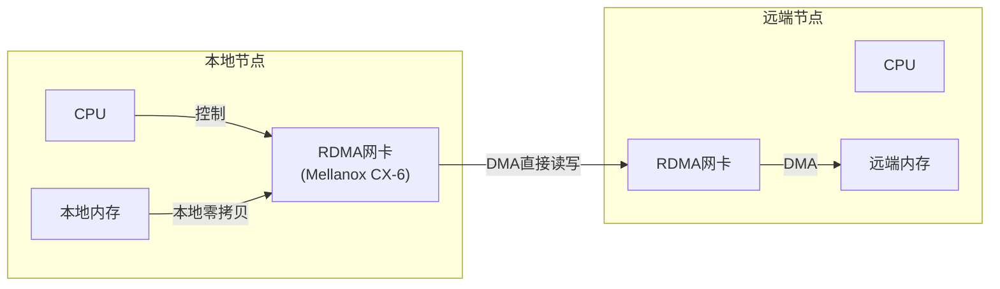

# IPC历史演进与嵌入式前沿

> 📊 **本章难度等级：** <span class="badge-e">**E级 (Expert)**</span> → <span class="badge-m">**M级 (Master)**</span>

---

## Unix IPC演进脉络

---

### <strong>从管道到对象的五十年演进</strong>

<span class="badge-e">E</span><br>
<span class="red">Unix IPC</span>的演进史映射了操作系统从简单工具到复杂生态系统的变革。
<br>
每一次IPC机制的革新，都对应着计算架构和应用需求的双重驱动。
<br>

| 时期 | 代表机制 | 核心特征 | 驱动因素 |
|------|---------|---------|---------|
| 1970s | pipe | 字节流、亲缘限制 | 简单流水线 |
| 1980s | System V IPC | 键值命名、内核持久 | AT&T标准化 |
| 1990s | POSIX IPC + BSD Socket | 路径命名、网络兼容 | 可移植性需求 |
| 2000s | D-Bus | 对象模型、总线路由 | 桌面生态复杂化 |
| 2010s | Binder + RPMsg | 面向对象、异构多核 | 移动+嵌入式爆发 |
| 2020s | 共享内存+RDMA | 用户态直接访问 | 数据中心级延迟需求 |

<span class="blue">演进规律：IPC机制从"匿名字节流"走向"命名对象消息"，从"内核中介"走向"用户态直连"，从"单机"走向"分布式内存池"。</span><br>

---

## CORBA-D-Bus-Binder对比

---

### <strong>三代对象IPC的技术谱系</strong>

<span class="badge-e">E</span><br>
<span class="red">CORBA、D-Bus和Android Binder</span>代表了对象模型IPC的三个世代，各自针对不同的计算生态和性能约束。
<br>

| 维度 | CORBA | D-Bus | Android Binder |
|------|-------|-------|----------------|
| 诞生年代 | 1991 | 2003 | 2008 |
| 序列化 | GIOP/CDR | D-Bus Message | Parcel |
| 传输层 | IIOP（TCP） | UDS | 内核驱动（/dev/binder） |
| 对象定位 | IOR | 服务名+对象路径 | Handle（整数标识） |
| 内存拷贝 | 多次（网络栈） | 2~3次（UDS缓冲） | 1次（mmap共享） |
| 适用场景 | 分布式企业系统 | Linux桌面/服务 | 移动设备进程间 |
| 嵌入式适配 | 极重（ORB运行时） | 中等（裁剪后可用） | 原生轻量 |

<span class="blue">技术洞察：Binder的核心创新是将"对象引用"压缩为整数Handle，将"方法调用"映射为内核ioctl，将"数据传递"优化为单次内存拷贝。</span><br>

---

## Android Binder驱动原理

---

### <strong>Binder的内存拷贝优化机制</strong>

<span class="badge-m">**[M]**</span><br>
<span class="red">Binder驱动</span>通过内核中的内存映射实现单次拷贝：发送进程将数据写入内核映射的缓冲区，接收进程直接映射同一物理页，无需额外拷贝。
<br>
这与传统IPC的"用户态->内核->用户态"两次拷贝形成鲜明对比。
<br>

```c
// Binder驱动核心：mmap分配内核缓冲区
// 文件路径：drivers/android/binder.c（内核源码参考）
// 行号：约 5000-5050 行
static int binder_mmap(struct file *filp, struct vm_area_struct *vma) {
    struct binder_proc *proc = filp->private_data;
    const char *failure_string;

    // binder分配器管理内核页，与用户vma映射
    struct binder_buffer *buffer;
    buffer = binder_alloc_new_buf(&proc->alloc,
                                  vma->vm_end - vma->vm_start,
                                  0, 0, NULL);
    if (IS_ERR(buffer)) {
        failure_string = "allocate buffer";
        goto err_alloc_buf_failed;
    }

    // 用户态通过mmap直接访问binder缓冲区
    // 数据从发送方用户态写入，接收方mmap后直接读取
}
```

<span class="orange"><strong>1. 单拷贝机制：</strong></span>发送进程将Parcel数据写入内核binder_alloc缓冲区，接收进程mmap同一页，仅需一次物理页写入。
<br>
<span class="orange"><strong>2. Handle映射：</strong></span>Binder驱动维护进程ID到Binder对象的映射表，跨进程引用通过Handle而非指针传递。
<br>
<span class="orange"><strong>3. 引用计数：</strong></span>内核自动管理Binder对象的引用计数，进程退出时自动释放，避免内存泄漏。
<br>

<span class="blue">扩展阅读：Binder的线程池模型和同步调用语义使其在移动场景中成为"本地RPC"的理想实现，但引入内核驱动也增加了移植和维护成本。</span><br>

---

## 微内核IPC（seL4-L4）

---

### <strong>微内核的最小IPC原语设计</strong>

<span class="badge-m">**[M]**</span><br>
<span class="red">微内核架构</span>将文件系统、网络协议栈、驱动程序全部移至用户态，仅保留地址空间、线程和IPC三个核心机制在内核态。
<br>
seL4通过形式化验证证明了其IPC机制的正确性，将IPC延迟压缩到微秒级以下。
<br>

| 特性 | seL4 IPC | Linux IPC |
|------|----------|-----------|
| 内核代码量 | ~9000行C | ~3000万行 |
| IPC形式化验证 | 已证明无漏洞 | 无 |
| 单次IPC延迟 | ~1 us | ~10~100 us |
| 能力模型 | 基于Capability | 基于UID/GID |
| 适用场景 | 高安全关键系统 | 通用嵌入式/服务器 |

```c
// seL4 IPC调用示例（概念性伪代码）
// 文件路径：参考seL4_libs/libsel4/sel4_arch/syscalls.h
// seL4_Call发起同步IPC，传递消息寄存器MR
seL4_MessageInfo_t tag = seL4_MessageInfo_new(0, 0, 0, 2);
seL4_SetMR(0, 0xCAFEBABE);          // 消息寄存器0
seL4_SetMR(1, 0xDEADBEEF);          // 消息寄存器1
seL4_Call(endpoint_cap, tag);       // 同步调用，等待响应
// 消息通过CPU寄存器传递（短消息）或共享页（长消息）
```

<span class="blue">扩展阅读：微内核IPC的高性能来源于极简内核路径和直接上下文切换，但其生态系统（驱动、文件系统）的成熟度远不及Linux。</span><br>

---

## 未来趋势：共享内存+RDMA

---

### <strong>从单机零拷贝到分布式零拷贝</strong>

<span class="badge-m">**[M]**</span><br>
<span class="red">RDMA（Remote Direct Memory Access）</span>将"零拷贝"理念从单机共享内存扩展到网络：网卡直接读写远端内存，绕过操作系统内核和CPU。
<br>
在嵌入式领域，类似思想正通过CXL（Compute Express Link）和CCIX等互联协议进入异构芯片设计。
<br>



| 技术 | 传输延迟 | 适用距离 | 嵌入式关联 |
|------|---------|---------|-----------|
| 单机共享内存 | <1 us | 片内/板内 | 已成熟 |
| CXL.mem | ~100 ns | 板内/机架内 | 异构内存池 |
| RDMA over Ethernet | 1~3 us | 数据中心 | 边缘服务器 |
| NVLink | ~50 ns | GPU互联 | AI加速器 |

<span class="blue">前沿展望：未来嵌入式SoC可能集成CXL控制器，使CPU、GPU、NPU、FPGA共享同一物理地址空间，届时"跨设备IPC"将简化为同一共享内存模型的访问。</span><br>

---

## 历史演进与小结

---

### <strong>IPC演进全景总结</strong>

<span class="badge-e">E</span><br>

| 年代 | 代表 | 核心创新 | 嵌入式启示 |
|------|------|---------|-----------|
| 1973 | pipe | 字节流通道 | 最简IPC，仍有用武之地 |
| 1983 | System V IPC | 键值持久化 | 遗留系统维护 |
| 1993 | POSIX IPC | 路径+通知 | 现代嵌入式首选 |
| 2003 | D-Bus | 对象总线 | 资源充裕系统服务 |
| 2008 | Binder | 单次拷贝+Handle | 移动设备标准 |
| 2014 | RPMsg | 异构标准化 | AMP架构必备 |
| 2020+ | CXL/RDMA | 分布式零拷贝 | 下一代异构互联 |

---

## 本章小结

| 要点 | 核心结论 |
|------|---------|
| 演进规律 | 从字节流到对象消息，从内核中介到用户态直连 |
| Binder | 单次拷贝、Handle映射、引用计数，移动设备IPC标杆 |
| 微内核 | 形式化验证+极简路径，安全关键场景 |
| RDMA/CXL | 分布式零拷贝，异构内存池的未来方向 |

---

## 课后练习

1. **深度分析**：对比Binder和RPMsg在内存拷贝次数、上下文切换次数和地址空间隔离三个维度的差异，画出对比表格。<br>
2. **架构推演**：假设2028年一款SoC集成CXL.mem控制器，CPU与FPGA共享物理内存。设计该架构下进程与FPGA加速核之间的"IPC"接口。<br>
3. **安全评估**：分析传统Linux IPC机制在可信执行环境（TEE）中的适用性——哪些IPC可以穿透Normal World与Secure World边界？哪些不行？为什么？<br>
