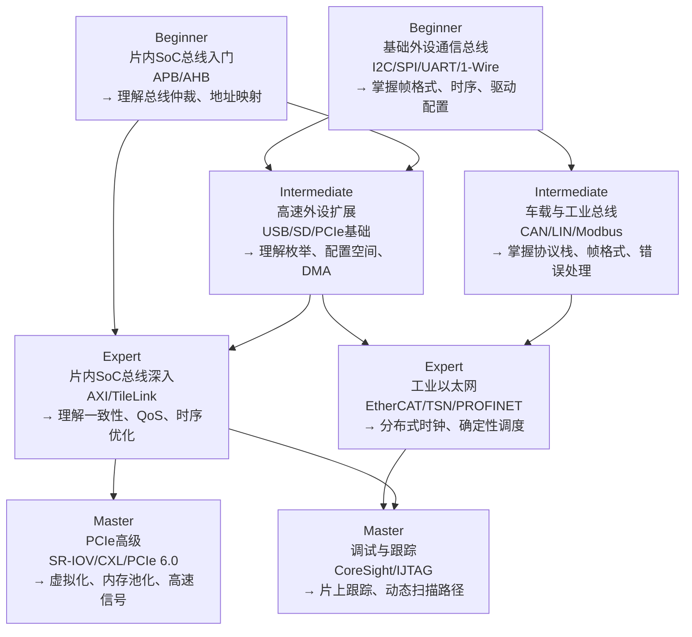
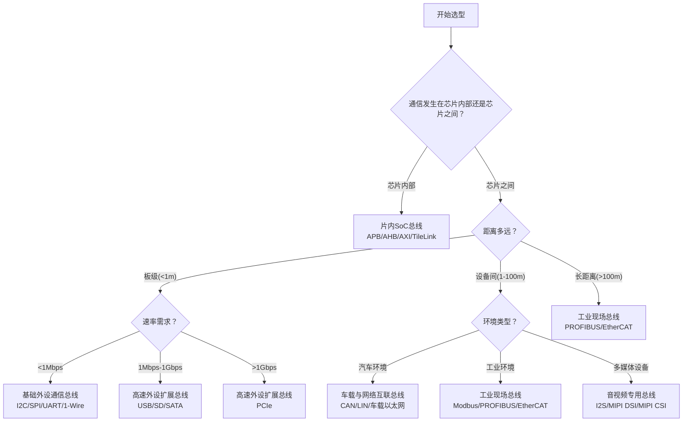

# 08-总线协议

[Beginner] [Intermediate] [Expert] [Master]

总线协议是嵌入式系统的通信基础设施，决定了设备之间如何交换数据、如何共享资源、如何协调时序。
 
从片内SoC总线到工业现场总线，从基础外设通信到高速数据扩展，总线协议覆盖了嵌入式系统从纳米级芯片互联到千米级工厂网络的全尺度通信需求。
 
理解总线协议的选择逻辑、性能约束和演进方向，是构建可靠嵌入式系统的核心能力。
 
本模块将总线协议划分为八个类别，遵循BIEM渐进式学习模型。
 

---

## <strong>模块总览：八大总线类别</strong>

本模块将总线协议划分为八个类别，覆盖嵌入式系统通信的完整光谱：
 

| 类别 | 难度 | 核心总线 | 典型速率 | 应用场景 |
|------|------|----------|----------|----------|
| 片内SoC总线 | B→M | AXI/AHB/APB/TileLink | 数百MHz~GHz | 芯片内部IP互联 |
| 基础外设通信总线 | B→I | I2C/SPI/UART/1-Wire/MDIO/MIPI-I3C | 1kbps~50Mbps | 传感器、存储器、低速外设 |
| 高速外设扩展总线 | I→E | PCIe/USB/SD/SATA | 100Mbps~64Gbps | 存储扩展、网络、高速通信 |
| 存储设备专用总线 | I→E | eMMC/UFS/QPI/OPI | 100Mbps~25GT/s | 闪存、内存、处理器互联 |
| 车载与网络互联总线 | I→E | CAN/LIN/TSN/车载以太网 | 20kbps~10Gbps | 汽车电子、工业网络 |
| 工业现场总线 | I→E | Modbus/PROFIBUS/EtherCAT | 9.6kbps~1Gbps | 工厂自动化、过程控制 |
| 音视频专用总线 | I→E | I2S/PCM/MIPI DSI/MIPI CSI | 1MHz~4.5Gbps/lane | 音频、显示、摄像头 |
| 调试与跟踪专用总线 | I→M | JTAG/SWD/CoreSight/ETM | 1MHz~100MHz | 芯片调试、系统跟踪 |

---

## <strong>BIEM学习路径图</strong>

本模块遵循BIEM（Beginner→Intermediate→Expert→Master）渐进式学习模型：
 

### <strong>学习路径建议</strong>

| 背景 | 推荐起点 | 学习顺序 | 目标时长 |
|------|----------|----------|----------|
| 硬件设计新手 | 基础外设通信总线 | I2C → SPI → UART → APB → AXI | 4-6周 |
| 软件驱动开发 | 基础外设通信总线 | I2C/SPI驱动 → USB枚举 → PCIe配置空间 | 3-5周 |
| 汽车电子工程师 | 车载与网络互联总线 | CAN → LIN → 车载以太网 → TSN | 3-4周 |
| 工业自动化工程师 | 工业现场总线 | Modbus → PROFIBUS → EtherCAT → OPC UA | 4-6周 |
| SoC架构师 | 片内SoC总线 | APB → AHB → AXI → TileLink → 一致性协议 | 6-8周 |

---

## <strong>总线选择决策树</strong>

面对具体的嵌入式项目，如何选择合适的总线协议？以下决策树提供系统化的选型框架：
 

### <strong>选型关键约束</strong>

| 约束维度 | 决策问题 | 影响总线 |
|----------|----------|----------|
| 距离 | 通信距离是否超过1米？ | I2C/SPI限于板级，CAN/LIN可达数十米 |
| 速率 | 带宽需求是否超过100Mbps？ | USB3/PCIe替代I2C/SPI |
| 成本 | 每节点成本是否敏感？ | LIN替代CAN，1-Wire替代I2C |
| 可靠性 | 是否需要错误检测和重传？ | CAN优于UART，EtherCAT优于Modbus |
| 实时性 | 延迟是否要求<1ms确定性？ | EtherCAT/TSN替代标准以太网 |
| 安全性 | 是否需要功能安全认证？ | CAN FD + TSN可达ASIL-D |
| 拓扑 | 是否需要多主或动态拓扑？ | USB/PCIe支持热插拔，I2C仅支持多主 |
| 调试 | 是否需要边界扫描或跟踪？ | JTAG/SWD用于调试，CoreSight用于跟踪 |

---

## <strong>为什么总线协议如此重要</strong>

总线协议是嵌入式系统的"神经系统"——它决定了数据如何在组件之间流动，直接影响系统的性能、功耗、成本和可靠性。
 
选错总线协议的代价是巨大的：
 
- 在车载场景中，用UART替代CAN意味着失去错误检测和仲裁能力，可能导致安全隐患
 
- 在工业场景中，用标准以太网替代EtherCAT意味着失去确定性实时性，可能导致产线停摆
 
- 在SoC设计中，用AHB替代AXI意味着无法支持多主并发和乱序传输，可能成为性能瓶颈
 
- 在消费电子中，用SPI替代MIPI DSI意味着需要数十根线连接显示屏，无法制造轻薄设备
 

关键认知：总线协议的选择不是"选最快的"，而是"选最合适的"——在距离、速率、成本、可靠性和生态之间找到工程最优解。
 

---

## <strong>小结</strong>

| 要点 | 内容 |
|------|------|
| 模块范围 | 8大总线类别，覆盖片内到工业现场 |
| 学习路径 | BIEM渐进式：基础外设 → 片内总线 → 高速扩展 → 专用领域 |
| 选型框架 | 距离→速率→成本→可靠性→实时性→安全性→拓扑→调试 |
| 核心认知 | 总线是嵌入式系统的神经系统，选对比选快更重要 |

## <strong>练习</strong>

1. 为一个智能家居网关设计总线方案：需要连接Zigbee模块（UART）、温度传感器（I2C）、SPI Flash、USB WiFi模块和SD卡。绘制总线拓扑图并说明每个总线的选型理由。
2. 在汽车电子架构中，为什么CAN用于动力系统和安全系统，而LIN用于车身控制？从实时性、成本和可靠性三个维度分析。
3. 比较AXI和PCIe在"多主并发"和"乱序传输"方面的异同。为什么AXI可以在片内实现乱序，而PCIe需要Transaction Layer来保证顺序？

| 题目 | 考查点 | 难度 |
|------|--------|------|
| 1 | 多总线系统集成，拓扑设计 | Intermediate |
| 2 | 车载总线选型，CAN vs LIN | Intermediate |
| 3 | 片内总线 vs 片外总线架构差异 | Expert |

---

## <strong>学习路径</strong>

- [Beginner] 从I2C、SPI和UART入手，掌握帧格式、时序和Linux驱动配置。
 
- [Intermediate] 深入USB枚举、PCIe配置空间和CAN仲裁机制，理解高速总线的握手和流控。
 
- [Expert] 研究AXI一致性协议、EtherCAT分布式时钟和PCIe SR-IOV虚拟化。
 
- [Master] 掌握TileLink缓存一致性、CXL内存池化和CoreSight片上跟踪系统。
 
- 扩展阅读：AMBA AXI and ACE Protocol Specification、PCI Express Base Specification 6.0、CAN Specification 2.0B、LIN Specification Package 2.2A、EtherCAT Technology Group规范、MIPI Alliance规范集。
 
