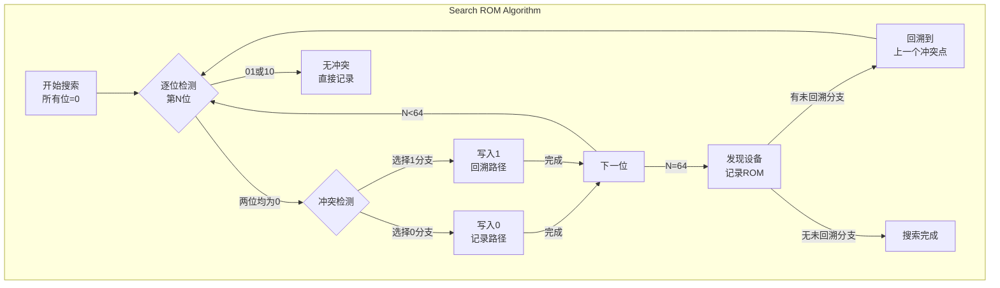
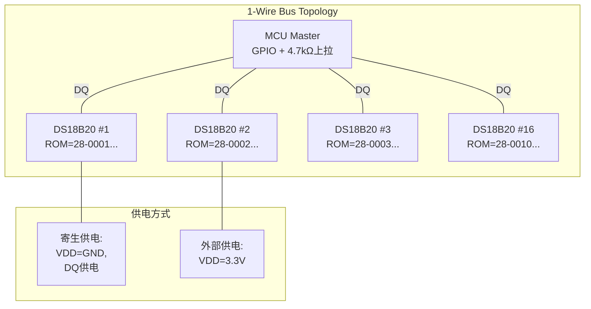

# 1-Wire逻辑级与工业应用

<span class="badge-b">[Beginner]</span> <span class="badge-i">[Intermediate]</span> <span class="badge-e">[Expert]</span>

---

<span class="red">为什么1-Wire能在工业场景中长盛不衰？</span> 1-Wire总线仅用一根信号线（加地线）即可实现供电、双向通信和设备寻址，这种极端简化的布线使其在空间受限、成本敏感的工业场景中不可替代。DS18B20温度传感器在暖通空调系统中单线并联数十个节点，iButton在物流追踪中作为电子标签使用——理解1-Wire的ROM搜索算法、CRC8校验和多机并联网络设计，是掌握这一极简总线的核心。

---

## <strong>1-Wire ROM搜索算法</strong>

### <strong>为什么需要搜索算法</strong>

1-Wire网络上的每个从设备都有一个唯一的64位ROM ID（含8位家族码、48位序列号、8位CRC8）。当多个设备并联在同一总线上时，主设备必须能够逐一识别每个设备——这就是ROM搜索算法（Search ROM）的使命。



| ROM ID结构 | 位域 | 内容 | 示例（DS18B20） |
|-----------|------|------|---------------|
| 家族码 | [7:0] | 设备类型标识 | 0x28 = 温度传感器 |
| 序列号 | [55:8] | 唯一48位编号 | 随机分配 |
| CRC8 | [63:56] | 前56位校验 | Dallas标准多项式 |

---

### <strong>二叉树搜索机制</strong>

<span class="red">Search ROM</span>本质是在64层二叉树上做深度优先遍历：

```c
// 1-Wire ROM搜索算法实现（简化版）
#define MAX_DEVICES 16

uint8_t rom_ids[MAX_DEVICES][8];  // 存储发现的ROM ID
uint8_t device_count = 0;

void onewire_search_rom(void) {
    uint8_t last_conflict = 0;   // 上一冲突位位置
    uint8_t rom_byte = 0;         // 当前ROM字节索引
    uint8_t rom_bit = 0;          // 当前位索引（0-63）
    uint8_t id_bit = 0;
    uint8_t cmp_id_bit = 0;
    uint8_t search_direction = 0;

    do {
        // 初始化搜索
        if (!onewire_reset()) break;  // 无设备响应
        onewire_write_byte(0xF0);     // Search ROM命令

        uint8_t last_zero = 0;
        rom_byte = 0;
        rom_bit = 0;

        for (int bit_pos = 0; bit_pos < 64; bit_pos++) {
            id_bit = onewire_read_bit();      // 读实际位
            cmp_id_bit = onewire_read_bit();  // 读补码位

            if (id_bit == 1 && cmp_id_bit == 1) {
                // 无设备响应，搜索失败
                return;
            }

            if (id_bit == 0 && cmp_id_bit == 0) {
                // 冲突：两位均为0
                if (bit_pos == last_conflict) {
                    search_direction = 1;  // 上次走0，这次走1
                } else if (bit_pos > last_conflict) {
                    search_direction = 0;  // 新冲突，优先走0
                    last_zero = bit_pos;
                } else {
                    // 回溯路径，沿用之前的方向
                    search_direction = (rom_ids[device_count][rom_byte] >> (rom_bit % 8)) & 0x01;
                }
            } else {
                // 无冲突，直接采用读到的值
                search_direction = id_bit;
            }

            // 写入搜索方向
            onewire_write_bit(search_direction);
            rom_ids[device_count][rom_byte] |= (search_direction << (rom_bit % 8));

            rom_bit++;
            if (rom_bit % 8 == 0) {
                rom_byte++;
                if (rom_byte < 8) rom_ids[device_count][rom_byte] = 0;
            }
        }

        last_conflict = last_zero;
        device_count++;

    } while (last_conflict != 0 && device_count < MAX_DEVICES);
}
```

<span class="blue">关键结论：搜索算法的时间复杂度为O(N×64)，N为设备数——
<br>
每发现一台设备需要64个位周期，加上命令和复位，总时间 ≈ N × 10ms。
<br>
对于16台设备的网络，搜索耗时约160ms，在大多数监控场景中可接受。
</span>

---

## <strong>CRC8校验</strong>

### <strong>Dallas/Maxim CRC8多项式</strong>

1-Wire使用CRC-8-MAXIM（多项式x⁸ + x⁵ + x⁴ + 1，即0x31）：

| 应用场景 | CRC位置 | 校验范围 | 错误检测能力 |
|---------|---------|---------|------------|
| ROM ID | [63:56] | 家族码+序列号 | 单比特错误、突发错误≤8位 |
| 数据帧 | 最后1字节 | 所有数据字节 | 单比特错误、双比特错误 |
| 命令校验 | 附加字节 | 命令+数据 | 传输噪声检测 |

```c
// CRC8计算：Dallas/Maxim标准多项式 0x31
uint8_t crc8_table[256];  // 预计算查找表

void crc8_init(void) {
    for (int i = 0; i < 256; i++) {
        uint8_t crc = i;
        for (int j = 0; j < 8; j++) {
            crc = (crc >> 1) ^ ((crc & 0x01) ? 0x8C : 0);
            // 0x8C = reversed 0x31: x^8 + x^5 + x^4 + 1
        }
        crc8_table[i] = crc;
    }
}

uint8_t crc8_calculate(const uint8_t *data, uint8_t len) {
    uint8_t crc = 0;
    for (uint8_t i = 0; i < len; i++) {
        crc = crc8_table[crc ^ data[i]];
    }
    return crc;
}

// 验证ROM ID的CRC8
uint8_t verify_rom_crc(const uint8_t *rom_id) {
    uint8_t calc_crc = crc8_calculate(rom_id, 7);  // 前7字节
    return (calc_crc == rom_id[7]) ? 0 : 1;        // 比较第8字节
}
```

<span class="blue">为什么用查表法而非逐位计算？
<br>
CRC8查表法仅需N次XOR和查表操作（N=数据字节数），
<br>
而逐位计算需要8N次循环和条件分支，在8位MCU上速度慢约8倍。
</span>

---

## <strong>DS18B20多机并联网络设计</strong>

### <strong>硬件拓扑</strong>



| 设计参数 | 推荐值 | 极限值 | 说明 |
|---------|--------|--------|------|
| 总线长度 | <30m | <100m | 长线需降低速率或加中继 |
| 设备数量 | <20 | <100 | 受搜索时间和电容限制 |
| 上拉电阻 | 4.7kΩ | 1kΩ-10kΩ | 平衡速度与功耗 |
| 电缆类型 | CAT5 UTP | 电话线 | 双绞线减少干扰 |
| 供电方式 | 外部3.3V | 寄生供电 | 寄生模式节省布线 |

---

### <strong>多机温度采集流程</strong>

```c
// DS18B20多机温度采集（Linux驱动风格）
#define CONVERT_T       0x44   // 启动温度转换
#define READ_SCRATCHPAD 0xBE   // 读取9字节暂存器
#define MATCH_ROM       0x55   // 匹配指定ROM
#define SKIP_ROM        0xCC   // 跳过ROM（单设备）

struct ds18b20_dev {
    uint8_t rom_id[8];
    int16_t temperature;  // 精度0.0625°C
};

struct ds18b20_dev sensors[MAX_DEVICES];

void ds18b20_start_conversion_all(void) {
    // 广播：所有设备同时启动转换
    onewire_reset();
    onewire_write_byte(SKIP_ROM);      // 跳过ROM匹配
    onewire_write_byte(CONVERT_T);     // 启动转换
    // 转换期间总线必须保持高电平（寄生供电需要上拉）
    delay_ms(750);  // 12-bit精度转换时间：750ms
}

int16_t ds18b20_read_temperature(const uint8_t *rom_id) {
    uint8_t scratchpad[9];

    onewire_reset();
    onewire_write_byte(MATCH_ROM);     // 匹配指定设备
    for (int i = 0; i < 8; i++) {
        onewire_write_byte(rom_id[i]); // 发送64位ROM
    }
    onewire_write_byte(READ_SCRATCHPAD);

    for (int i = 0; i < 9; i++) {
        scratchpad[i] = onewire_read_byte();
    }

    // CRC校验
    if (crc8_calculate(scratchpad, 9) != 0) {
        return -27315;  // CRC错误标记（不可能的温度值）
    }

    // 温度解析：16位有符号，LSB=0.0625°C
    int16_t raw = (scratchpad[1] << 8) | scratchpad[0];
    return raw * 625 / 100;  // 转换为0.01°C单位
}
```

| 精度配置 | 分辨率 | 转换时间 | 适用场景 |
|---------|--------|---------|---------|
| 9-bit | 0.5°C | 93.75ms | 粗略监控 |
| 10-bit | 0.25°C | 187.5ms | 通用应用 |
| 11-bit | 0.125°C | 375ms | 精密控制 |
| 12-bit | 0.0625°C | 750ms | 实验室级 |

---

## <strong>历史演进：从iButton到IoT传感器网络</strong>

1-Wire技术的发展史是一部"极简主义"在工业界获胜的典型案例。1990年代初，Dallas Semiconductor（后被Maxim Integrated收购，现属Analog Devices）推出了iButton——一种封装在不锈钢外壳里的1-Wire存储芯片，最初用于巡更系统和物流追踪。iButton的物理耐久性和1-Wire的单线连接使其在恶劣工业环境中迅速普及。
<br>
<br>
1996年，Dallas发布了DS18S20温度传感器，将1-Wire从"存储总线"扩展到"传感总线"。2000年后的DS18B20改进了分辨率（从9-bit到12-bit可配置）和精度（±0.5°C），成为暖通空调、数据中心环境监测和冷链物流的标准温度传感器。2010年后，随着IoT概念的兴起，1-Wire网络被重新审视——在智慧农业大棚中，单根双绞线串联数十个DS18B20监测土壤和空气温度，布线成本仅为传统4-20mA模拟方案的十分之一。
<br>
<br>
近年来，1-Wire与LoRa、NB-IoT等无线技术的结合催生了新的应用场景：1-Wire传感器网络作为"最后一公里"有线采集层，通过LoRa网关上传云端。Analog Devices持续推出新一代1-Wire产品（如DS28E40安全认证器），将这一极简总线的生命力延续到安全IoT时代。

---

## <strong>本章小结</strong>

| 要点 | 内容 |
|------|------|
| ROM搜索 | 64层二叉树深度优先遍历，逐位检测冲突并回溯 |
| CRC8 | Dallas多项式0x31，查表法实现高效校验 |
| 多机并联 | 寄生/外部供电，4.7kΩ上拉，CAT5双绞线 |
| DS18B20 | 12-bit可配置精度，9字节暂存器，CRC校验 |
| 采集流程 | 广播启动转换→逐设备Match ROM→读取暂存器 |

## <strong>练习</strong>

| 编号 | 题目 | 难度 |
|------|------|------|
| 1 | 画出3台DS18B20并联的Search ROM过程：假设ROM前4位分别为0000、0010、0011，画出二叉树搜索路径 | <span class="badge-b">[Beginner]</span> |
| 2 | 为DS18B20的9字节暂存器设计CRC8验证流程：写出计算温度的完整代码，包含精度配置（9-12bit）和CRC错误处理 | <span class="badge-i">[Intermediate]</span> |
| 3 | 设计一个支持32台DS18B20的工业温度监控网络：画出拓扑图（含中继器、供电方案），计算最坏情况下的总线搜索时间，并给出总线电容和阻抗匹配建议 | <span class="badge-e">[Expert]</span> |

---

<span class="purple">扩展阅读：Dallas/Maxim 1-Wire Design Guide (AN937)、DS18B20数据手册、CRC8-MAXIM算法详解、Analog Devices iButton应用笔记、IEEE IoT Journal论文"1-Wire Networks for Low-Cost Industrial Sensing"。</span>
