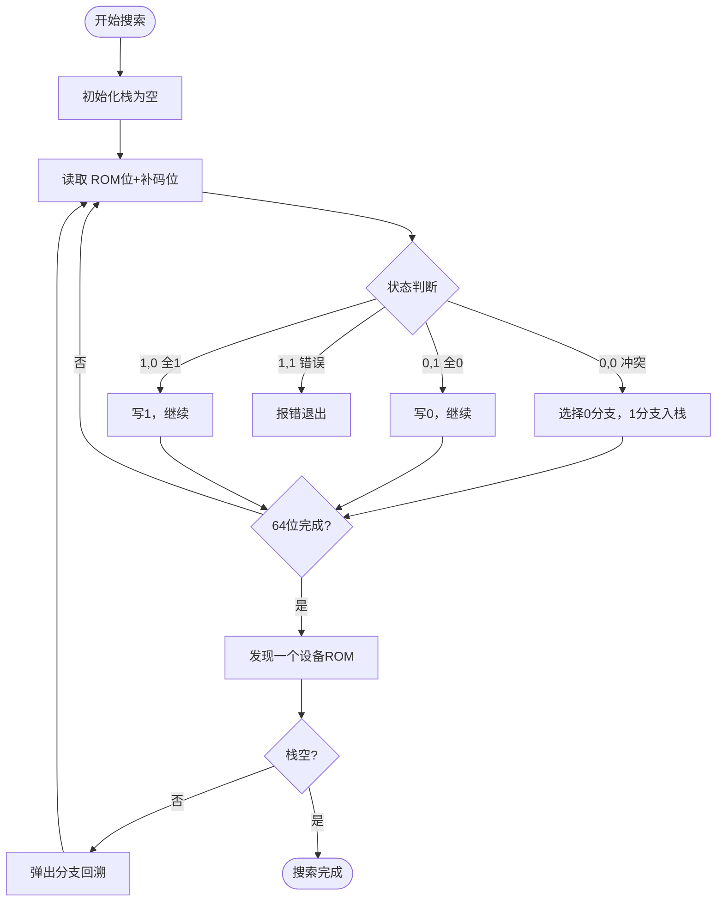
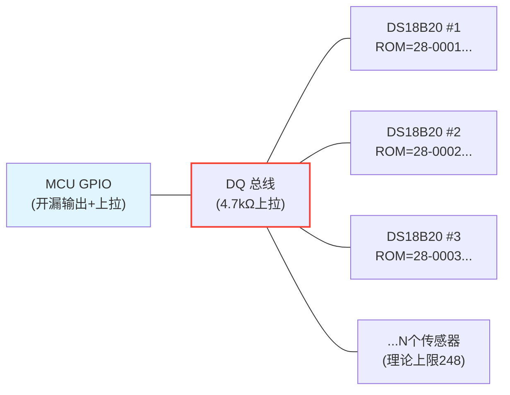

# 1-Wire ROM搜索算法与工业级传感器网络

<span class="badge-e">[Expert]</span>

---

<span class="red">1-Wire ROM搜索算法</span> 是单总线多设备共存的核心机制。
<br>
每个从设备拥有全球唯一的 64-bit ROM ID（含 8-bit 家族码 + 48-bit 序列号 + 8-bit CRC）。
<br>
主机通过二进制搜索遍历总线，在冲突位逐层分支，最终枚举所有挂接设备。
<br>
CRC-8 校验则确保 ROM 读取与温度数据传送的完整性。

---

## <strong>ROM ID 结构与家族码</strong>

### <strong>64-bit ROM 布局</strong>

1-Wire 设备 ROM ID 固定为 8 字节，结构如下：

| 字节 | 位宽 | 含义 | 示例（DS18B20） |
|------|------|------|----------------|
| Byte 0 | 8 bit | 家族码（Family Code） | 0x28 |
| Byte 1-6 | 48 bit | 唯一序列号（Serial Number） | 随机分配 |
| Byte 7 | 8 bit | CRC-8 校验值 | 计算生成 |

<span class="blue">关键结论：家族码决定设备类型，DS18B20 为 0x28，DS1990A 为 0x01。
<br>
同一总线可混挂不同家族码设备，搜索算法自动区分。</span>
<br>

---

## <strong>ROM 搜索算法原理</strong>

### <strong>为什么需要搜索而非直接广播</strong>

单总线只有一条数据线，所有设备并联挂接。
<br>
若同时响应，信号冲突导致主机无法解析任何 ROM 位。
<br>
因此必须引入冲突检测与逐位仲裁机制，让设备按 ROM 位值分层响应。
<br>
这种设计与以太网 CSMA/CD 的冲突检测思想同源，但 1-Wire 采用确定性搜索而非随机退避。

---

### <strong>搜索循环：冲突位分支</strong>

搜索过程每次读取 2 个位（ROM 位 + 补码位），根据组合判断总线状态：

| ROM 位 | 补码位 | 总线状态 | 含义 |
|--------|--------|----------|------|
| 0 | 0 | 冲突（Collision） | 有 0 和 1 两种设备 |
| 0 | 1 | 全部 0 | 所有设备该位为 0 |
| 1 | 0 | 全部 1 | 所有设备该位为 1 |
| 1 | 1 | 无设备 | 总线空闲或错误 |

<span class="blue">关键结论：冲突位（0,0）是分支点，主机选择 0 分支继续搜索，
<br>
并将 1 分支压入栈中备用，回溯时弹出继续。
<br>
N 个设备最多产生 N-1 次冲突，搜索复杂度为 O(N * 64)。</span>
<br>

---

### <strong>搜索流程图</strong>



---

### <strong>完整搜索代码实现</strong>

```c
#define OW_ROM_SIZE 8

uint8_t rom_buffer[OW_ROM_SIZE];        // 当前搜索路径
uint8_t branch_stack[64];               // 冲突位分支栈
int8_t  last_discrepancy = -1;          // 上次冲突位索引

// 搜索下一个设备 ROM；返回 1=找到，0=无更多设备
uint8_t ow_search_next(uint8_t rom[OW_ROM_SIZE]) {
    uint8_t id_bit, cmp_id_bit;
    uint8_t rom_byte_mask = 1;
    uint8_t rom_byte_idx = 0;
    int8_t  discrepancy_marker = -1;
    
    if (ow_reset() == 0) return 0;      // 无设备响应
    ow_write_byte(0xF0);                 // Search ROM 命令
    
    for (uint8_t i = 0; i < 64; i++) {
        id_bit = ow_read_bit();          // ROM 位
        cmp_id_bit = ow_read_bit();      // 补码位
        
        if (id_bit && cmp_id_bit) return 0;  // 无设备或错误
        
        if (id_bit != cmp_id_bit) {
            // 无冲突，所有设备该位相同
            rom_buffer[rom_byte_idx] |= (id_bit ? rom_byte_mask : 0);
        } else {
            // 冲突位（0,0）
            if (i < last_discrepancy) {
                // 沿用上次选择的分支
                id_bit = (rom_buffer[rom_byte_idx] & rom_byte_mask) ? 1 : 0;
            } else if (i == last_discrepancy) {
                id_bit = 1;              // 上次选了0，这次选1
            } else {
                id_bit = 0;              // 新冲突，先选0分支
                discrepancy_marker = i; // 记录冲突位
            }
            rom_buffer[rom_byte_idx] |= (id_bit ? rom_byte_mask : 0);
        }
        
        ow_write_bit(id_bit);            // 写回选择的分支值
        
        // 推进位掩码
        rom_byte_mask <<= 1;
        if (rom_byte_mask == 0) {
            rom_byte_mask = 1;
            rom_byte_idx++;
        }
    }
    
    last_discrepancy = discrepancy_marker;
    memcpy(rom, rom_buffer, OW_ROM_SIZE);
    return (last_discrepancy >= 0) ? 1 : 0;  // 0=最后一个设备
}
```

<span class="green">`0xF0`</span> 是 Search ROM 命令，触发所有设备同时响应。
<br>
<span class="green">`last_discrepancy`</span> 记录上次回溯位置，确保下次搜索从新的分支开始。
<br>
<span class="green">`discrepancy_marker`</span> 标记本次最深的冲突位，用于下一次回溯。

---

## <strong>CRC-8 校验机制</strong>

### <strong>为什么 1-Wire 选用 CRC-8</strong>

64-bit ROM 仅需 8-bit 校验即可覆盖。
<br>
CRC-8 多项式为 `x^8 + x^5 + x^4 + 1`（即 0x31，初值 0x00）。
<br>
校验覆盖全部 ROM 字节，错误检出率高于简单累加和。
<br>
DS18B20 的温度数据也附加 8-bit CRC，确保 9 字节数据包的完整。

---

### <strong>软件 CRC-8 实现</strong>

```c
uint8_t crc8_table[256];

// 预计算查表法（空间换时间，嵌入式推荐）
void crc8_init(void) {
    for (int i = 0; i < 256; i++) {
        uint8_t crc = i;
        for (int j = 0; j < 8; j++) {
            crc = (crc << 1) ^ ((crc & 0x80) ? 0x31 : 0);
        }
        crc8_table[i] = crc;
    }
}

// 计算数据流的 CRC-8
uint8_t crc8_compute(uint8_t *data, uint8_t len) {
    uint8_t crc = 0;
    for (uint8_t i = 0; i < len; i++) {
        crc = crc8_table[crc ^ data[i]];
    }
    return crc;
}

// 验证 ROM ID：前7字节计算CRC，与第8字节比对
uint8_t verify_rom(uint8_t rom[8]) {
    uint8_t calc = crc8_compute(rom, 7);
    return (calc == rom[7]) ? 0 : 1;  // 0=OK, 1=Error
}

// 验证 Scratchpad 数据（9字节含CRC）
uint8_t verify_scratchpad(uint8_t data[9]) {
    return (crc8_compute(data, 9) == 0) ? 0 : 1;  // CRC覆盖全部9字节
}
```

<span class="green">`crc8_table`</span> 预先计算避免循环移位，256 字节 RAM 换每次 CRC 计算仅需 1 次查表。
<br>
<span class="green">`0x31`</span> 对应多项式 `x^8 + x^5 + x^4 + 1` 的位掩码表示，LFSR 实现时用此异或掩码。

---

## <strong>DS18B20 多机并联网络</strong>

### <strong>工业温度采集拓扑</strong>



---

### <strong>多点温度读取流程</strong>

```c
// 多机温度读取：先搜索ROM，再逐个匹配转换
void ds18b20_scan_and_read(void) {
    uint8_t rom_list[MAX_DEVICES][8];
    int count = 0;
    
    // Step 1: ROM搜索枚举所有设备
    if (ow_search_first(rom_list[count])) {
        count++;
        while (ow_search_next(rom_list[count]) && count < MAX_DEVICES) {
            count++;
        }
    }
    printf("Found %d devices\n", count);
    
    // Step 2: 广播启动温度转换（跳过ROM匹配）
    ow_reset();
    ow_skip_rom();          // 0xCC: 跳过ROM，所有设备响应
    ow_write_byte(0x44);    // Convert T 命令
    delay_ms(750);          // 12-bit分辨率需要750ms转换时间
    
    // Step 3: 逐个读取温度（必须匹配ROM，防止冲突）
    for (int i = 0; i < count; i++) {
        ow_reset();
        ow_match_rom(rom_list[i]);  // 0x55 + 8字节 ROM ID
        ow_write_byte(0xBE);        // Read Scratchpad 命令
        
        uint8_t data[9];
        for (int j = 0; j < 9; j++) data[j] = ow_read_byte();
        
        // CRC校验（9字节整体CRC应为0）
        if (crc8_compute(data, 9) == 0) {
            int16_t raw = (data[1] << 8) | data[0];
            float temp = raw / 16.0f;  // 12-bit: 0.0625°C/LSB
            printf("Dev%d (ROM=%02X...): %.2f C\n", i, rom_list[i][0], temp);
        } else {
            printf("Dev%d: CRC ERROR\n", i);
        }
    }
}
```

<span class="blue">关键结论：温度转换可广播（所有设备同时转换），节省 N*750ms 时间。
<br>
但读取 Scratchpad 必须逐个匹配 ROM，否则多设备同时输出会冲突。
<br>
CRC-8 覆盖 9 字节 Scratchpad，通信错误可被立即检出。</span>
<br>

---

### <strong>总线容量与寄生电源</strong>

| 参数 | 典型值 | 限制条件 |
|------|--------|----------|
| 最大设备数 | ~248 | 总线电容 < 600pF |
| 总线长度 | ≤100m | 速率 16.3kbps，优质双绞线 |
| 标准上拉电阻 | 4.7kΩ | 标准模式，外部供电 |
| 寄生供电上拉 | ≤2.2kΩ | 需更强上拉提供转换电流 |
| 转换峰值电流 | ~1.5mA | 12-bit 分辨率转换期间 |
| 强上拉时长 | 750ms | 12-bit 转换全程需维持 |

<span class="blue">易错点：寄生电源模式下，温度转换瞬间电流可达 1.5mA。
<br>
4.7kΩ 上拉在 3.3V 下仅能提供 0.7mA，必须外加强上拉 MOSFET 直接短接到 VCC。
<br>
强上拉激活时，DQ 线被拉至 VCC，此时禁止任何 1-Wire 通信。</span>
<br>

---

## <strong>Linux w1 子系统驱动</strong>

### <strong>内核温度传感器 sysfs 接口</strong>

```bash
# 查看已发现的 1-Wire 设备
$ ls /sys/bus/w1/devices/
28-00000123abcd  28-00000456efgh  w1_bus_master1

# 直接读取温度（驱动自动完成 ROM 匹配+转换+读取）
$ cat /sys/bus/w1/devices/28-00000123abcd/w1_slave
5e 01 4b 46 7f ff 0c 10 5a : crc=5a YES
5e 01 4b 46 7f ff 0c 10 5a : t=21937
# t=21937 表示 21.937°C

# 查看驱动挂载的 GPIO 主控制器
$ ls /sys/bus/w1/devices/w1_bus_master1/
28-00000123abcd  28-00000456efgh  driver  power  subsystem  uevent  w1_master_add  w1_master_remove  w1_master_search  w1_master_slaves
```

<span class="green">`w1_slave`</span> 文件输出 9 字节 Scratchpad 原始数据，内核自动完成 CRC 校验。
<br>
<span class="green">`crc=YES`</span> 表示 CRC 校验通过，驱动已做验证；`NO` 则数据不可信。
<br>
<span class="green">`t=21937`</span> 即 21937/1000 = 21.937°C，内核自动完成定点数到浮点转换。
<br>
<span class="green">`w1_master_search`</span> 写入 1 触发新一轮 ROM 搜索，动态发现新挂接设备。

---

### <strong>Device Tree 配置示例</strong>

```dts
// arch/arm/boot/dts/am335x-boneblack.dts 示例片段
&ocp {
    onewire@0 {
        compatible = "w1-gpio";
        gpios = <&gpio1 28 GPIO_ACTIVE_HIGH>;  // P9_12 引脚
        pinctrl-names = "default";
        pinctrl-0 = <&onewire_pins>;
    };
};

&am33xx_pinmux {
    onewire_pins: onewire_pins {
        pinctrl-single,pins = <
            AM33XX_IOPAD(0x878, PIN_OUTPUT_PULLUP | INPUT_EN | MUX_MODE7)  /* gpmc_ben1.gpio1_28 */
        >;
    };
};
```

<span class="green">`compatible = "w1-gpio"`</span> 绑定 Linux w1-gpio 驱动，将任意 GPIO 变为 1-Wire 主控制器。
<br>
<span class="green">`PIN_OUTPUT_PULLUP`</span> 配置内置上拉，简化外部电路设计。

---

## <strong>历史演进与工业应用</strong>

1-Wire 于 1989 年由 Dallas Semiconductor（现 Maxim Integrated）推出。
<br>
最早应用于 iButton 电子钥匙（DS1990），用于门禁与资产追踪。
<br>
1996 年 DS18B20 数字温度传感器发布，将 1-Wire 带入工业测温领域。
<br>
2000 年代后，1-Wire 在粮仓温控、冷链物流、数据中心机柜测温中广泛应用。
<br>
其单线拓扑大幅降低传感器布线成本，但 16.3kbps 速率限制使其无法替代 I2C/SPI 的高速场景。
<br>
现代 IoT 中，1-Wire 常与 ESP8266/ESP32 等 WiFi 网关配合，实现远程分布式温度监控。

---

## 小结

| 要点 | 内容 |
|------|------|
| ROM 搜索 | 二进制搜索+冲突分支栈，逐位枚举 64-bit ROM，复杂度 O(N*64) |
| CRC-8 | 多项式 0x31，覆盖 ROM 与 Scratchpad 全部字节，错误检出率高 |
| 多机并联 | 广播转换+逐个匹配读取，总线电容 < 600pF 为硬性上限 |
| 寄生电源 | 强上拉 MOSFET 必备，转换时电流 > 1mA，4.7kΩ 上拉不足 |
| Linux 驱动 | w1 子系统提供 sysfs 自动温度读取，支持 Device Tree 即插即用 |

## 练习

| 题号 | 问题 |
|------|------|
| 1 | 为什么 1-Wire 搜索算法在冲突位需要将 1 分支压栈？若只选 0 分支继续而不回溯，最终会丢失哪些设备？请用二叉树模型说明。 |
| 2 | DS18B20 的 9 字节 Scratchpad 中，温度数据占 2 字节（LSB+MSB）。若读取到 `0x5E 0x01`，对应的温度值是多少摄氏度？若 MSB 为 `0xFF`，LSB 为 `0xE0`，温度又是多少？ |
| 3 | 在寄生电源模式下，为什么温度转换命令发出后必须立即激活强上拉？用总线电流与电阻关系推导：4.7kΩ 上拉在 3.3V 下最大提供多少电流？DS18B20 转换需多少电流？差值由谁补足？ |

---

## 学习路线

- <span class="badge-b">[Beginner]</span> 掌握：单总线时序、GPIO 模拟 1-Wire 基础读写、DS18B20 单点温度采集。
<br>
- <span class="badge-i">[Intermediate]</span> 掌握：ROM 搜索算法实现、CRC-8 校验、DS18B20 温度解析与多点网络搭建。
<br>
- <span class="badge-e">[Expert]</span> 掌握：寄生电源强上拉电路设计、多机网络拓扑优化、Linux w1 子系统集成与 Device Tree 配置。

---

<span class="purple">扩展阅读</span>：Maxim Integrated Application Note 187 "1-Wire Search Algorithm"；
<br>
Linux Kernel Documentation: `Documentation/w1/w1-generic.rst`
