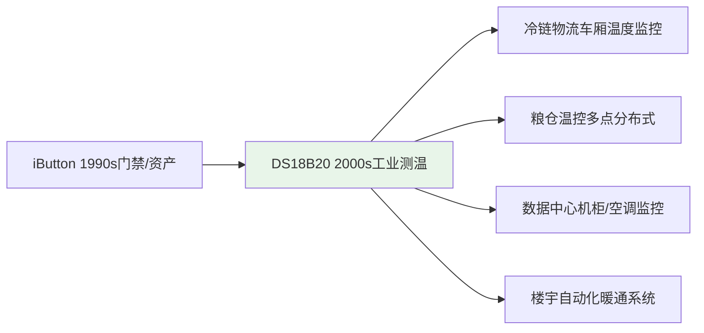
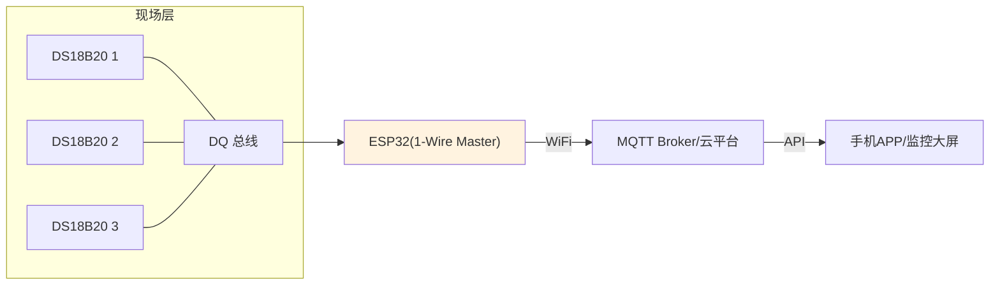
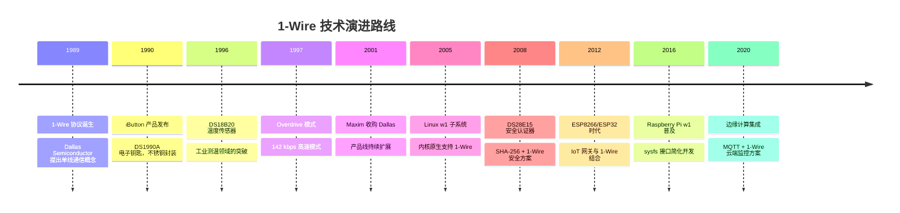

# 1-Wire 从 iButton 到现代 IoT 的演进

[Expert]

---

1-Wire 总线 是 Dallas Semiconductor（现 Maxim Integrated）于 1989 年推出的单线串行通信协议。
 
从最早的 iButton 电子钥匙到现代 IoT 温度传感器网络，1-Wire 以其极简的布线拓扑在特定场景中保持不可替代性。
 
理解其演进脉络，有助于在 I2C/SPI/1-Wire 之间做出正确的接口选型决策。

---

## <strong>1989-1995：iButton 时代与协议诞生</strong>

### <strong>为什么 Dallas 要发明单总线</strong>

1980 年代末，Dallas Semiconductor 需要一种极低引脚占用的身份识别方案。
 
传统 EEPROM 需要电源、地、时钟、数据四线，而门禁系统希望传感器与钥匙都能用两线接触实现。
 
1-Wire 应运而生：仅需数据线+地线，通过寄生电容从数据线窃取能量维持工作。
 
这种设计让纽扣大小的不锈钢封装（iButton）成为可能，Durability 达到 10 万次插拔。

---

### <strong>早期产品家族</strong>

| 年份 | 产品 | 家族码 | 应用场景 |
|------|------|--------|----------|
| 1990 | DS1990A | 0x01 | iButton 身份识别、门禁卡 |
| 1992 | DS1992 | 0x08 | 1KB NV RAM 数据存储 |
| 1993 | DS1993 | 0x06 | 4KB NV RAM 数据存储 |
| 1994 | DS1994 | 0x04 | 带实时时钟的 NV RAM |

关键结论：早期 1-Wire 产品以 NV RAM 和 RTC 为核心，
 
iButton 形态使其成为比磁条卡更安全的物理密钥载体。

 

---

### <strong>1-Wire 与 Dallas 半导体战略</strong>

Dallas Semiconductor 在 1990 年代以"非易失性存储+安全"为核心竞争力。
 
1-Wire 协议作为其产品的统一接口，降低了客户多产品集成的复杂度。
 
1995 年，Dallas 推出 DS2502 1KB EEPROM（家族码 0x09），用于存储设备配置信息。
 
这些 EEPROM 与 iButton 共享同一总线，客户无需为不同产品学习不同协议。

---

## <strong>1996-2005：温度传感器革命与工业渗透</strong>

### <strong>DS18B20 的诞生与影响</strong>

1996 年，DS18B20 数字温度传感器发布，家族码 0x28。
 
这是 1-Wire 协议第一次大规模进入工业测量领域。
 
12-bit 分辨率（0.0625°C/LSB）、-55°C 至 +125°C 量程、±0.5°C 精度，参数媲美当时主流模拟传感器。
 
但单线拓扑使其在分布式测温场景中布线成本降低 60% 以上。

---

### <strong>工业应用爆发</strong>

关键结论：1-Wire 在"点位多、距离短、速率低"的场景中展现出独特优势。
 
每个传感器节省 2-3 根线，在 50 点以上的系统中布线成本差异显著。

 

---

### <strong>协议增强：Overdrive 模式</strong>

| 模式 | 速率 | 推出时间 | 适用场景 |
|------|------|----------|----------|
| Standard | 16.3 kbps | 1989 | 长距离、高电容 |
| Overdrive | 142 kbps | 1997 | 短距离、低电容 |

Overdrive 模式将位时隙从 61μs 缩短至 7μs，速率提升近 9 倍。
 
但要求总线电容 < 100pF，设备数 < 10，限制了其应用范围。
 
Overdrive 的推出标志着 1-Wire 试图向更高性能拓展，但单线物理层的天花板很快显现。

---

### <strong>竞争格局初现</strong>

2000 年前后，I2C 已成为板级传感器接口的事实标准。
 
Philips（NXP）推动的 I2C 规范从 100kHz 标准模式扩展到 400kHz 快速模式。
 
SPI 则在存储器和高速 ADC 领域占据主导。
 
1-Wire 的 16.3kbps 速率使其无法进入板级高速通信市场，只能深耕布线受限的分布式场景。

---

## <strong>2006-2015：与 I2C/SPI 的竞争定位</strong>

### <strong>为什么 1-Wire 没有成为主流总线</strong>

1-Wire 的 16.3kbps 速率在 2000 年代后成为硬伤。
 
I2C Fast-mode（400kHz）和 SPI（MHz 级）已占据传感器接口主流。
 
1-Wire 的独特优势只剩下"单线布线"和"寄生供电"，这恰好是 I2C/SPI 无法做到的。
 
因此 1-Wire 选择差异化定位：在布线极度受限的场景中保持存在。

---

### <strong>三种总线的选型矩阵</strong>

| 维度 | 1-Wire | I2C | SPI |
|------|--------|-----|-----|
| 信号线数 | 1 (DQ) | 2 (SDA+SCL) | 4 (MOSI+MISO+SCK+CS) |
| 典型速率 | 16.3 kbps | 100-400 kHz | 1-50 MHz |
| 设备供电 | 寄生/外部 | 外部 | 外部 |
| 多设备共享 | 是（ROM匹配） | 是（寻址） | 否（每设备CS） |
| 最大距离 | 100m | 1m | <30cm |
| 布线成本 | 最低 | 中等 | 最高 |
| 适用场景 | 分布式测温 | 板级传感器 | 高速存储/ADC |

关键结论：1-Wire 不是 I2C/SPI 的替代品，而是互补品。
 
当布线成本大于性能需求时选择 1-Wire；反之选择 I2C/SPI。

 

---

### <strong>Maxim 收购与标准维护</strong>

2001 年，Maxim Integrated 收购 Dallas Semiconductor，继承 1-Wire 产品线。
 
Maxim 持续发布新型温度传感器（DS18S20、DS18B20-PAR 寄生供电版、DS1822 经济版）。
 
2008 年推出 DS28E15 安全认证器，将 1-Wire 与 SHA-256 加密结合，进入物联网安全领域。
 
Maxim 的维护确保了 1-Wire 在 2010 年代后仍有新品发布，而非成为遗产协议。

---

## <strong>2016-2026：IoT 时代的新生机</strong>

### <strong>现代 IoT 网关架构</strong>

---

### <strong>新应用形态</strong>

| 场景 | 架构 | 1-Wire 角色 |
|------|------|-------------|
| 智能家居 | ESP32 + 多个 DS18B20 | 房间多点温度采集 |
| 智慧农业 | LoRa网关 + 1-Wire 采集节点 | 大棚土壤/空气温度 |
| 冷链监控 | 4G模组 + iButton 历史记录 | 运输全程温度轨迹 |
| 工业预测维护 | 树莓派 + w1 子系统 | 电机/变压器绕组测温 |
| 数据中心 | BMC + 1-Wire 温度探头 | 机柜进/出风口温差 |

关键结论：IoT 网关（ESP32、树莓派、BeagleBone）的普及，
 
让 1-Wire 从"MCU 直连"升级为"边缘采集 + 云端分析"的分层架构。
 
1-Wire 负责末端低功耗采集，高速通信由 WiFi/4G/LoRa 承担。

 

---

### <strong>Linux 生态的完善</strong>

Linux 内核 w1 子系统于 2005 年合并，随后不断完善。
 
2010 年后，主流嵌入式 Linux 发行版（Buildroot、Yocto、OpenWrt）均默认支持 w1-gpio 驱动。
 
Device Tree 绑定标准化，任意 GPIO 可通过设备树声明为 1-Wire 主控制器。
 
2020 年后，w1 子系统增加了对新型 Maxim 温度传感器的自动识别支持。

---

### <strong>开源硬件社区的推动</strong>

Arduino OneWire 库（Paul Stoffregen 维护）于 2010 年代成为最广泛使用的 1-Wire 软件实现。
 
该库支持 ROM 搜索、寄生电源、多机网络等全部功能，跨平台兼容 AVR、ARM、ESP32。
 
树莓派的 1-Wire 教程在社区中大量传播，降低了入门门槛。
 
开源生态的繁荣使 1-Wire 在 Maker 和工业开发者中保持了活跃度。

---

## <strong>历史演进时间线</strong>

---

## 小结

| 要点 | 内容 |
|------|------|
| 起源 | 1989 年 Dallas Semiconductor，为 iButton 身份识别发明 |
| 突破 | 1996 年 DS18B20 将 1-Wire 带入工业温度测量 |
| 竞争定位 | 单线布线优势 vs I2C/SPI 性能劣势，差异化互补 |
| IoT 新生 | ESP32/树莓派网关 + Linux w1 子系统，边缘采集上云 |
| 未来 | 持续深耕布线受限+低速传感 niche 市场 |

## 练习

| 题号 | 问题 |
|------|------|
| 1 | 对比 1-Wire、I2C、SPI 在"50 个温度传感器分布式采集"场景中的布线成本。计算信号线总数并分析 1-Wire 节省的比例。 |
| 2 | 为什么 1-Wire 的 Overdrive 模式（142kbps）未能像 I2C Fast-mode（400kHz）那样普及？从物理层限制和市场需求两个角度分析。 |
| 3 | 在现代 IoT 架构中，1-Wire 与 WiFi/Zigbee 的分工是什么？为什么 1-Wire 不直接承担长距离通信，而是作为末端采集层？ |

---

## 学习路线

- [Beginner] 掌握：1-Wire 基础时序、GPIO 模拟读写、单点温度采集。
 
- [Intermediate] 掌握：ROM 搜索、多点网络、CRC 校验、与 I2C/SPI 的选型对比。
 
- [Expert] 掌握：历史演进分析、IoT 网关集成、Linux w1 子系统深度配置、寄生电源电路设计。

---

扩展阅读：Maxim Integrated "1-Wire Technology Overview"；
 
《The Art of Electronics》第三版第 14 章串行总线对比分析。
