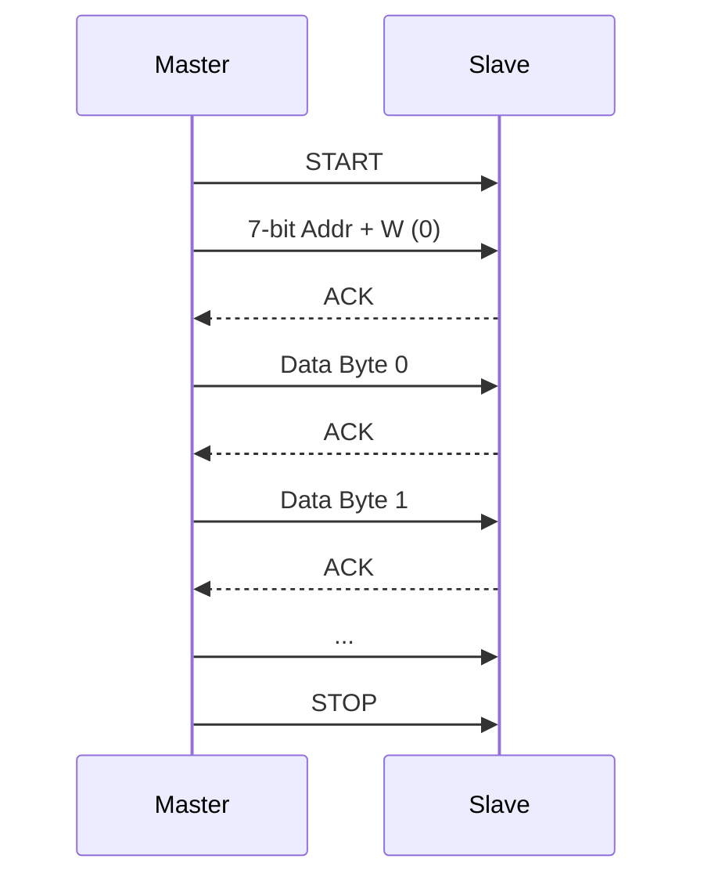
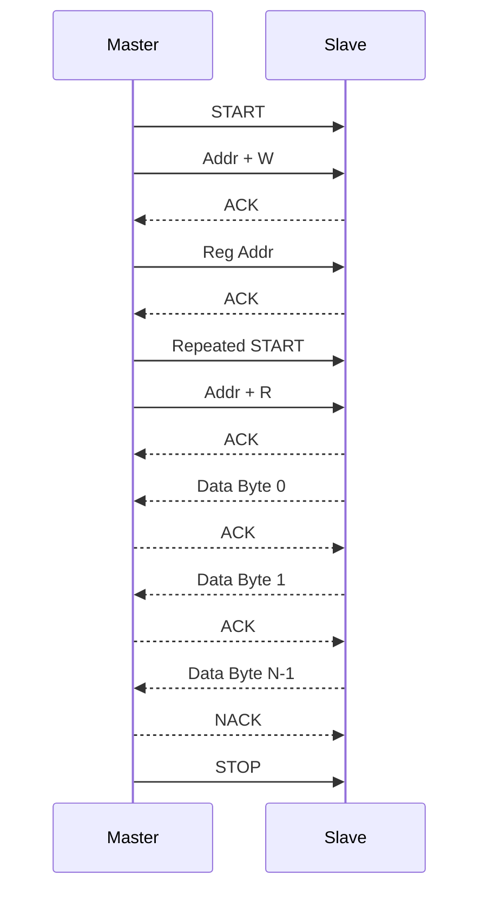
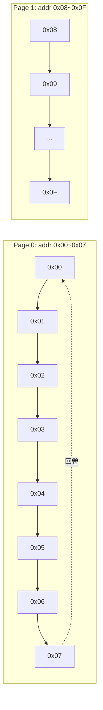

# I2C 寻址与数据传输

<span class="badge-i">[I]</span> <span class="badge-e">[E]</span>

---

### 7 位与 10 位地址格式

<span class="red">I2C 地址在第一字节中传输</span>，
格式决定了设备数量和兼容范围。
<br>

**7 位地址格式（最常用）：**
<br>
第 1 字节 = [7 位地址][R/W 位]
<br>
R/W = 0 表示主设备向从设备写数据，R/W = 1 表示主设备从从设备读数据。
<br>

```
Bit:    7   6   5   4   3   2   1   0
        ├─   7位地址   ─┤  R/W
```

实际可用地址：0x08 ~ 0x77（0x00~0x07 和 0x78~0x7F 为保留）。
<br>
共 112 个有效地址。
<br>

**10 位地址格式（扩展）：**
<br>
需要两个字节传输地址：
<br>
第一字节 = [1][1][1][1][0][X][R/W]（前 5 位固定 11110，X 是地址 bit9）
<br>
第二字节 = [地址 bit8~bit0]
<br>

```
First  byte:  1   1   1   1   0   A9  R/W
Second byte:  A8  A7  A6  A5  A4  A3  A2  A1
Third  byte:  A0  -   -   -   -   -   -   -
```

<span class="blue">关键认知：10 位地址兼容 7 位地址设备——
<br>
因为 11110 开头的第一字节落在 7 位保留区，7 位设备不会误响应。
</span>
<br>

---

### 写操作完整流程

<span class="red">写操作 = 主设备向从设备写入数据</span>，
完整帧序列：
<br>
`S + ADDR + W + ACK + DATA[0] + ACK + ... + DATA[N-1] + ACK + P`
<br>



示例：向地址 0x50 的 EEPROM 写数据 0xA5 到寄存器 0x10
<br>

```c
[S] [0x50+W] [ACK] [0x10] [ACK] [0xA5] [ACK] [P]
  ↓    ↓      ↓     ↓      ↓     ↓      ↓     ↓
START 地址   应答  寄存器  应答  数据   应答  STOP
                寻址          地址      写入
```

<span class="green">带寄存器地址的写操作</span>是传感器/EEPROM 的标准格式：
<br>
先写目标寄存器/存储地址，再写数据值。
<br>
部分设备支持自动递增地址（Auto-Increment），
<br>
连续写入多字节时内部指针自动 +1。
<br>

---

### 读操作完整流程

<span class="red">读操作 = 主设备从从设备读取数据</span>，
需要先写寄存器地址，再切换方向读取。
<br>
完整帧序列：
<br>
`S + ADDR + W + ACK + RegAddr + ACK + Sr + ADDR + R + ACK + DATA[0] + ACK + ... + DATA[N-1] + NACK + P`
<br>



Repeated START（Sr）在读操作中不可替代——
<br>
如果用 STOP 代替 Sr，总线被释放，
<br>
另一个主设备可能抢走总线，导致读取数据不一致。
<br>

示例：从地址 0x50 的 EEPROM 读取寄存器 0x10
<br>

```c
[S] [0x50+W] [ACK] [0x10] [ACK] [Sr] [0x50+R] [ACK] [Data] [NACK] [P]
  ↓    ↓      ↓     ↓      ↓     ↓      ↓       ↓      ↓      ↓     ↓
START 地址   应答  寄存器  应答   Sr    地址   应答   数据   终止   STOP
                寻址          地址        读方向                最后一字节
```

<span class="blue">关键认知：最后一个数据字节后，主设备发送 NACK 告诉从设备"停止发送"，
<br>
随后发 STOP 释放总线。
</span>
<br>

---

### 多字节 Page Write

<span class="red">Page Write（页写入）</span>是 EEPROM 类设备的高效写入方式。
<br>
普通写入每字节都需要完整的 [ADDR][Reg][Data][ACK] 开销；
<br>
Page Write 允许在发送起始地址后连续写入多字节，内部指针自动递增。
<br>

AT24C02 的页大小为 8 字节：
<br>

| 器件型号 | 容量 | 页大小 | 总页数 |
|----------|------|--------|--------|
| AT24C02  | 256B | 8B     | 32     |
| AT24C04  | 512B | 16B    | 32     |
| AT24C08  | 1KB  | 16B    | 64     |
| AT24C16  | 2KB  | 16B    | 128    |
| AT24C32  | 4KB  | 32B    | 128    |
| AT24C64  | 8KB  | 32B    | 256    |

写入跨越页边界时，
<br>
内部地址指针会从页首重新开始（回卷），
<br>
而非进入下一页。
<br>
例如向地址 0x07 写入 3 字节：0x07→0x00→0x01（回卷到页首）。
<br>



<span class="blue">易错点：跨越页边界的写入会覆盖页首数据，
<br>
而不是自动进入下一页。
</span>
<br>

---

### 代码：AT24C02 读写

```c
#include <stdint.h>

#define AT24C02_ADDR  0x50  // 7-bit 地址，A0=A1=A2=GND

// 页写入，返回 0=成功
uint8_t at24c02_page_write(uint8_t mem_addr, uint8_t *data, uint8_t len) {
    uint8_t page_remain = 8 - (mem_addr % 8);  // 当前页剩余空间
    if (len > page_remain) len = page_remain;    // 限制不跨页
    
    i2c_start();
    i2c_send_byte((AT24C02_ADDR << 1) | 0);  // W
    if (i2c_wait_ack()) return 1;
    
    i2c_send_byte(mem_addr);
    if (i2c_wait_ack()) return 1;
    
    for (uint8_t i = 0; i < len; i++) {
        i2c_send_byte(data[i]);
        if (i2c_wait_ack()) return 1;
    }
    i2c_stop();
    
    // EEPROM 内部写入周期约 5ms
    for (volatile uint32_t d = 0; d < 50000; d++);
    return 0;
}

// 连续写入（自动分页）
uint8_t at24c02_write(uint8_t mem_addr, uint8_t *data, uint16_t len) {
    while (len > 0) {
        uint8_t page_remain = 8 - (mem_addr % 8);
        uint8_t chunk = (len < page_remain) ? len : page_remain;
        if (at24c02_page_write(mem_addr, data, chunk)) return 1;
        mem_addr += chunk;
        data += chunk;
        len -= chunk;
    }
    return 0;
}

// 读取（支持连续读，无页限制）
uint8_t at24c02_read(uint8_t mem_addr, uint8_t *data, uint16_t len) {
    i2c_start();
    i2c_send_byte((AT24C02_ADDR << 1) | 0);  // W
    if (i2c_wait_ack()) return 1;
    i2c_send_byte(mem_addr);
    if (i2c_wait_ack()) return 1;
    
    i2c_start();  // Repeated START
    i2c_send_byte((AT24C02_ADDR << 1) | 1);  // R
    if (i2c_wait_ack()) return 1;
    
    for (uint16_t i = 0; i < len; i++) {
        data[i] = i2c_recv_byte(i < (len - 1) ? 1 : 0);  // 最后字节 NACK
    }
    i2c_stop();
    return 0;
}
```

波形解读（逻辑分析仪视角）：
<br>
- 写波形：S → [0xA0] ACK → [0x10] ACK → [0x55] ACK → P
<br>
  其中 0xA0 = (0x50 << 1) | 0，即地址+写方向
<br>
- 读波形：S → [0xA0] ACK → [0x10] ACK → Sr → [0xA1] ACK → [0x55] NACK → P
<br>
  其中 0xA1 = (0x50 << 1) | 1，即地址+读方向
<br>

<span class="blue">关键认知：地址字节发送的是 `(addr << 1) | R/W`，
<br>
不是裸地址。0x50 的设备写时发 0xA0，读时发 0xA1。
</span>
<br>

---

**学习路径提示**：
<br>
- <span class="badge-i">[I]</span> 读者：掌握 7/10 位地址格式，理解写→Sr→读的完整流程。
<br>
- <span class="badge-e">[E]</span> 读者：关注 Page Write 的页边界回卷问题，
<br>
  实际项目中 EEPROM 写入必须加 5ms 延时等待。

### 为什么需要 I2C

嵌入式系统中，<span class="red">传感器、EEPROM、RTC</span> 等外设数量动辄十几个。<br>
如果每个外设都用独立的数据+时钟线连接主控，引脚资源很快耗尽。<br>
SPI 虽快但每条从设备独占一条 CS 线，布线复杂。<br>
I2C（Inter-Integrated Circuit，集成电路互连总线）用 **两条线** 连接 **多个设备**，<br>
节省引脚、简化 PCB 走线，是低速外设通信的首选方案。

---

## 历史演进与发展趋势

I2C 由 Philips（现 NXP）于 1982 年发明，最初用于电视机内部芯片间的通信，目的是减少 PCB 走线数量。1992 年发布 1.0 规范，定义了 100kHz 标准模式和 400kHz 快速模式。2000 年推出 3.4MHz 高速模式（Hs），通过电流源上拉大幅压缩上升时间。2006 年 Fast-mode Plus（Fm+，1MHz）发布，2012 年推出 Ultra Fast-mode（UFm，5MHz，单向推挽）。2014 年后，I2C 与 SMBus（Intel 1995 年推出的系统管理总线）深度兼容，成为服务器、笔记本电池管理的标准。MIPI I3C 作为 I2C 的精神继承者于 2016 年发布，在保留两线架构的基础上引入动态地址和高达 12.5MHz 的 SDR 速率，正在逐步取代传统 I2C。

---

## 本章小结

| 要点 | 内容 |
|------|------|
| 物理层 | SDA + SCL 双线，开漏输出 + 上拉电阻，线与逻辑实现仲裁 |
| 时序 | START（SCL 高时 SDA 下降沿）+ STOP（SCL 高时 SDA 上升沿） |
| 寻址 | 7-bit 或 10-bit 从地址，广播地址 0x00，ACK/NACK 确认机制 |
| 速度模式 | Standard 100kHz / Fast 400kHz / Fm+ 1MHz / Hs 3.4MHz |
| 调试工具 | 逻辑分析仪、i2cdetect/i2cdump/i2cset/i2cget 命令行工具 |

## 练习

1. I2C 采用开漏输出（Open-Drain）而非推挽输出（Push-Pull）的根本原因是什么？开漏输出如何实现多设备共用一条总线的线与逻辑？
2. 标准模式（100kHz）和快速模式（400kHz）下，上拉电阻的典型取值分别是多少？如果总线电容过大（如 PCB 走线过长），为什么会导致通信失败？
3. I2C 的 7 位地址和 10 位地址有什么区别？在什么场景下必须使用 10 位地址？请写出 10 位地址传输的时序步骤。
