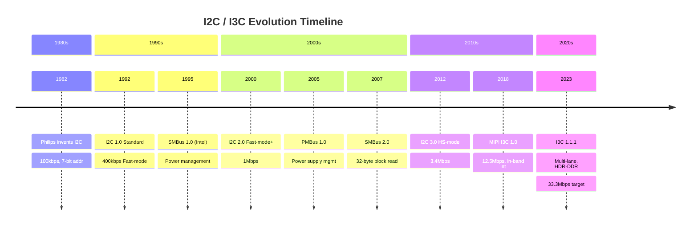
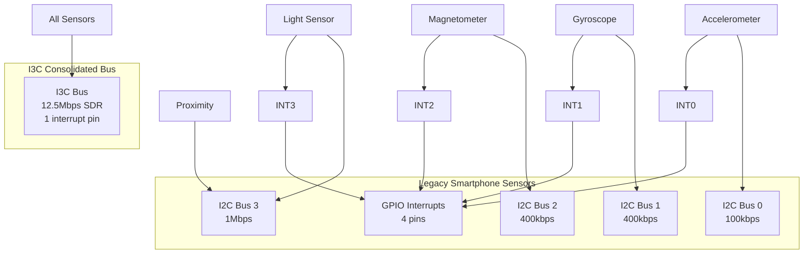

# I2C历史演进与未来展望

<span class="badge-b">[Beginner]</span> <span class="badge-i">[Intermediate]</span> <span class="badge-e">[Expert]</span>

---

<span class="red">为什么I2C能从1982年存活至今？</span> I2C（Inter-Integrated Circuit）由Philips（现NXP）在1982年发明时，目标是让电视机里的芯片用两根线互相通信。四十年后，它依然是智能手机、汽车电子、工业传感器的事实标准总线。其生命力源于极致的简约——两根线（SDA+SCL）、开漏输出、总线仲裁——以及持续演进的标准化体系（SMBus、PMBus、MIPI I3C）。理解I2C从7位地址到I3C的过渡历程，是预判嵌入式总线未来走向的关键。

---

## <strong>I2C标准演进时间线</strong>

### <strong>从I2C到I3C的里程碑</strong>



| 版本 | 年份 | 最大速率 | 关键特性 | 应用场景 |
|------|------|---------|---------|---------|
| Standard-mode | 1982 | 100kbps | 7/10位地址，开漏输出 | EEPROM，RTC |
| Fast-mode | 1992 | 400kbps | 推挽/开漏可选 | 传感器，触摸屏 |
| Fast-mode+ | 2000 | 1Mbps | 驱动能力增强 | LED控制器 |
| HS-mode | 2012 | 3.4Mbps | 电流源上拉，8mA驱动 | 高清摄像头 |
| Ultra Fast-mode | 2012 | 5Mbps | 推挽输出，无ACK | LED调光 |
| I3C SDR | 2018 | 12.5Mbps | 推挽+开漏，动态地址 | 手机传感器集线器 |
| I3C HDR-DDR | 2023 | 33.3Mbps | 双沿采样，多lane | 汽车ADAS |

---

## <strong>SMBus与PMBus标准</strong>

### <strong>SMBus：PC与嵌入式电源管理的桥梁</strong>

<span class="red">SMBus（System Management Bus）</span>由Intel于1995年定义，基于I2C物理层但增加了严格的时序和协议要求：

| 维度 | I2C | SMBus 2.0 | 差异原因 |
|------|-----|-----------|---------|
| 时钟低电平超时 | 无 | 35ms | 防止Slave死锁总线 |
| 总线频率 | 100-3400kbps | 10-100kbps | 兼容低速EC控制器 |
| 数据保持时间 | 0 | 300ns | 确保慢速设备正确采样 |
| 消息协议 | 自由格式 | 块读/块写/进程调用 | 标准化电源管理语义 |
| ARP（地址解析） | 无 | 有 | 支持动态地址分配 |
| PEC（包错误校验） | 无 | SMBus CRC-8 | 提高可靠性 |

```c
// SMBus Block Read（PEC校验）
uint8_t smbus_block_read(uint8_t dev_addr, uint8_t cmd,
                         uint8_t *data, uint8_t max_len) {
    uint8_t pec = 0;

    // Start + DevAddr(Write) + ACK
    i2c_start();
    pec = crc8_smbus(pec, (dev_addr << 1) | 0);
    i2c_write_byte((dev_addr << 1) | 0);

    // Command byte
    pec = crc8_smbus(pec, cmd);
    i2c_write_byte(cmd);

    // Repeated Start + DevAddr(Read)
    i2c_repeated_start();
    pec = crc8_smbus(pec, (dev_addr << 1) | 1);
    i2c_write_byte((dev_addr << 1) | 1);

    // Read Count byte
    uint8_t count = i2c_read_byte(ACK);
    pec = crc8_smbus(pec, count);

    // Read data bytes
    for (int i = 0; i < count; i++) {
        data[i] = i2c_read_byte(i == count - 1 ? NACK : ACK);
        pec = crc8_smbus(pec, data[i]);
    }

    // Read and verify PEC
    uint8_t recv_pec = i2c_read_byte(NACK);
    i2c_stop();

    return (recv_pec == pec) ? count : 0xFF;  // 0xFF = PEC error
}
```

---

### <strong>PMBus：数字电源管理的行业标准</strong>

<span class="red">PMBus（Power Management Bus）</span>基于SMBus，定义了电源转换器的标准化命令集：

| 命令码 | 名称 | 数据格式 | 功能 |
|--------|------|---------|------|
| 0x01 | OPERATION | Byte | 开启/关闭/边沿触发 |
| 0x21 | VOUT_COMMAND | Direct | 设置输出电压 |
| 0x8B | READ_VOUT | Linear16 | 读取输出电压 |
| 0x8D | READ_IOUT | Linear11 | 读取输出电流 |
| 0x8E | READ_TEMPERATURE | Linear11 | 读取温度 |
| 0x99 | MFR_ID | Block | 厂商标识 |

```c
// PMBus读取输出电压（Linear16格式）
float pmbus_read_vout(uint8_t dev_addr) {
    uint8_t raw[2];
    smbus_read_word(dev_addr, 0x8B, raw);  // READ_VOUT

    // Linear16: V = Y × 2^(N-16)
    uint16_t Y = (raw[1] << 8) | raw[0];
    int8_t N = -9;  // 典型Exponent（从VOUT_MODE读取）

    return Y * powf(2.0f, N - 16);  // 转换为伏特
}

// 设置输出电压
void pmbus_set_vout(uint8_t dev_addr, float voltage) {
    int8_t N = -9;
    uint16_t Y = (uint16_t)(voltage / powf(2.0f, N - 16));
    smbus_write_word(dev_addr, 0x21, Y);  // VOUT_COMMAND
}
```

---

## <strong>I3C：下一代传感器总线</strong>

### <strong>为什么需要I3C</strong>

传统I2C在智能手机中的痛点：



| 痛点 | I2C现状 | I3C解决方案 |
|------|---------|------------|
| 速率瓶颈 | 400kbps-3.4Mbps | 12.5Mbps SDR / 33.3Mbps HDR |
| 中断引脚多 | 每个传感器1个GPIO | In-band中断（IBI） |
| 静态地址冲突 | 7位地址空间紧张 | 动态地址分配（DA） |
| 功耗高 | 开漏上拉持续耗电 | 推挽+开漏混合，低功耗模式 |
| 热插拔困难 | 总线仲裁易冲突 | 支持Hot-Join |

---

### <strong>I3C协议核心特性</strong>

| 特性 | I3C实现 | 相比I2C改进 |
|------|---------|-----------|
| SDR模式 | 推挽数据，开漏ACK | 数据相位速度提升10倍 |
| HDR-DDR | 双沿采样，无ACK | 33.3Mbps，适合大批量数据 |
| IBI中断 | Slave通过SDA发中断请求 | 省去所有GPIO中断引脚 |
| CCC命令 | 标准化公共命令码 | 统一设备管理和配置 |
| Hot-Join | 动态加入总线 | 支持传感器热插拔 |

```c
// I3C动态地址分配流程（简化）
void i3c_assign_dynamic_address(void) {
    // 广播ENTDAA命令（进入动态地址分配）
    i3c_broadcast_ccc(0x07);  // ENTDAA

    // 依次为新设备分配地址
    uint8_t next_da = 0x08;   // 动态地址从0x08开始

    while (i3c_detect_ibi()) {  // 有设备等待分配
        uint8_t pid[6];         // 48-bit Provisioned ID
        i3c_read_pid(pid);

        // 发送SETNEWDA命令
        i3c_broadcast_ccc(0x08);   // SETNEWDA
        i3c_write_byte(next_da);   // 分配新地址

        // 设备确认
        if (i3c_get_ack()) {
            register_device(next_da, pid);
            next_da++;
        }
    }
}
```

---

## <strong>历史演进：从电视芯片到万物互联</strong>

I2C的历史是一部"简约力量"的教科书。1982年，Philips的工程师在设计新型电视机时，发现音频、视频和调谐芯片之间需要大量控制连线——传统的片选线方案在芯片数量增加时呈指数增长。两根线的I2C方案不仅减少了PCB走线，还简化了软件设计（所有设备共享同一组寄存器访问API）。1992年I2C成为Philips的标准专利（后开放授权），2000年代几乎所有消费电子产品都包含至少一个I2C接口。

<br>

2000年后，I2C的局限性开始显现：7位地址空间仅有112个可用地址（16个保留），在多传感器系统中频繁冲突；纯开漏输出限制了速率提升；每个传感器都需要独立的中断引脚，在手机中占据了宝贵的GPIO资源。Intel在1995年推出的SMBus和2005年推出的PMBus分别从PC电源管理和数字电源领域扩展了I2C的语义，但物理层瓶颈依然存在。

<br>

2017年MIPI联盟发布I3C 1.0，这是I2C家族最激进的升级：推挽+开漏混合输出使数据速率跃升至12.5Mbps；In-band中断消除了专用中断引脚的需求；动态地址分配彻底解决了地址空间冲突；Hot-Join支持传感器在系统运行时插拔。I3C的设计明确对标智能手机传感器集线器场景——在一个典型的旗舰手机中，可能有10-15个传感器（加速度计、陀螺仪、磁力计、气压计、光感、距离、指纹、心率等），I3C可以将它们全部挂在一根总线上。2023年I3C 1.1.1进一步引入了HDR-DDR（双沿采样）和多lane模式，目标速率33.3Mbps，开始进入汽车ADAS和工业视觉领域。I2C不会立即消失——在EEPROM、RTC和简单传感器中，它仍然是成本最低的选择——但I3C正在接棒成为新一代智能传感器的事实标准。

---

## <strong>本章小结</strong>

| 要点 | 内容 |
|------|------|
| I2C演进 | 100kbps→400kbps→1Mbps→3.4Mbps→5Mbps，40年持续升级 |
| SMBus | I2C+时序严格化+PEC+ARP，PC电源管理标准 |
| PMBus | SMBus+电源管理命令集，数字电源行业标准 |
| I3C核心 | SDR 12.5Mbps / HDR-DDR 33.3Mbps，IBI中断，动态地址 |
| I3C优势 | 10倍速率提升、省去中断引脚、支持热插拔、统一CCC命令 |
| 过渡路线 | I2C设备通过I3C的Legacy模式兼容，I3C-only设备逐渐普及 |

## <strong>练习</strong>

| 编号 | 题目 | 难度 |
|------|------|------|
| 1 | 对比I2C Fast-mode（400kbps）、SMBus 2.0（100kbps）和I3C SDR（12.5Mbps）的电气规范差异：时钟低电平超时、数据保持时间、ACK机制、最大电容负载 | <span class="badge-b">[Beginner]</span> |
| 2 | 为PMBus电源模块设计完整的监控软件：读取VOUT/IOUT/TEMPERATURE，检测过压/过流/过温告警，写出SMBus Block Read + PEC校验的完整代码 | <span class="badge-i">[Intermediate]</span> |
| 3 | 分析I3C HDR-DDR模式的时序图：为什么双沿采样可以达到33.3Mbps？画出SDR→HDR模式切换的完整时序，并说明Legacy I2C设备如何在不干扰I3C通信的前提下共存于同一总线 | <span class="badge-e">[Expert]</span> |

---

<span class="purple">扩展阅读：NXP I2C Specification 2021版、MIPI I3C Specification v1.1.1、SMBus 2.0规范（Intel）、PMBus 1.3.1规范（Power Management Bus）、MIPI白皮书"I3C for Sensor Connectivity in Mobile Devices"、IEEE论文"I3C vs I2C: A Performance Comparison"。</span>
