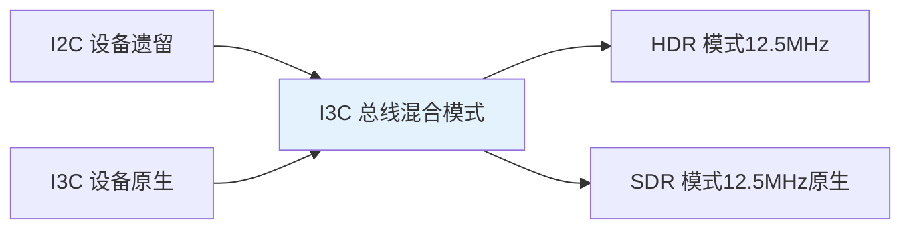
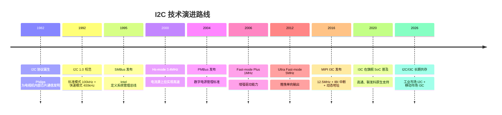

# I2C 从 1982 到 I3C 的历史演进与未来展望

[Expert]

---

I2C 总线 由 Philips（现 NXP）于 1982 年发明，最初用于电视机内部芯片通信。
 
四十余年间，从 100kHz 标准模式发展到 3.4MHz 高速模式，衍生出 SMBus、PMBus 等工业标准。
 
MIPI I3C 作为 I2C 的精神继承者，正逐步接管下一代传感器接口市场。
 
理解 I2C 的演进路线，是把握嵌入式总线技术发展趋势的关键。

---

## <strong>1982-1992：诞生与标准化</strong>

### <strong>为什么 Philips 发明 I2C</strong>

1980 年代初，电视机内部需要大量控制芯片（调谐器、音量控制、频道存储等）。
 
每增加一个功能就需要一组并行地址+数据线，PCB 布线越来越复杂。
 
Philips 工程师需要一种"只需两根线就能连接所有芯片"的方案。
 
I2C（Inter-Integrated Circuit）由此诞生：SDA（数据）+ SCL（时钟），开漏输出+上拉电阻。

---

### <strong>原始规范与局限性</strong>

1982 年的原始规范仅支持 100kHz 标准模式，7-bit 地址，无广播机制。
 
设备数量限于 112 个（0x08~0x77）。
 
最大总线电容 400pF，限制 PCB 走线长度。
 
但这些限制在电视机内部芯片通信中完全可接受。

---

### <strong>1992 年 1.0 版规范发布</strong>

1992 年，Philips 发布 I2C 1.0 规范，正式确立标准模式（100kHz）和快速模式（400kHz）。
 
引入 10-bit 扩展地址，设备上限提升至 1024 个。
 
定义完整的 START/STOP/ACK/NACK 时序，成为后续所有实现的基准。
 
I2C 从此走出电视机，进入更广阔的消费电子和工业控制领域。

---

## <strong>1993-2006：速率扩展与工业衍生</strong>

### <strong>高速模式 Hs-mode（3.4MHz）</strong>

| 模式 | 速率 | 推出时间 | 关键技术 |
|------|------|----------|----------|
| Standard | 100 kHz | 1982 | 开漏+上拉 |
| Fast | 400 kHz | 1992 | 开漏+上拉 |
| Fast-mode Plus | 1 MHz | 2006 | 增强驱动 |
| High-speed | 3.4 MHz | 2000 | 电流源上拉 |
| Ultra Fast-mode | 5 MHz | 2012 | 推挽输出（单向） |

2000 年推出的 Hs-mode（3.4MHz）使用电流源上拉替代电阻上拉。
 
电流源在 SCL 上升沿提供快速充电，下降沿仍由开漏管下拉。
 
但 Hs-mode 需要主设备切换电流源电路，硬件复杂度大幅增加。
 
实际部署中，Fast-mode（400kHz）仍是工业主流。

---

### <strong>SMBus：Intel 推动的系统管理总线</strong>

1995 年，Intel 推出 SMBus（System Management Bus），基于 I2C 物理层但重新定义协议层。
 
SMBus 严格规定超时机制（35ms 时钟低电平超时），防止设备死锁总线。
 
引入 Packet Error Checking（PEC），为关键数据附加 SMBus 特有的 CRC-8。
 
SMBus 成为 PC 主板上的标准接口：电池管理、温度监控、EEPROM 存储。

---

### <strong>PMBus：电源管理的数字化</strong>

2004 年，PMBus（Power Management Bus）发布，基于 SMBus 但专为电源转换器设计。
 
PMBus 定义标准命令集：输出电压设置、过流保护阈值、温度监控、故障报告。
 
数字电源（Digital Power）的兴起使 PMBus 成为服务器电源、通信电源的标配。
 
PMBus 1.2（2010 年）加入 Zone 概念，支持总线分段寻址，扩展至大规模电源系统。

---

## <strong>2007-2015：I2C 的瓶颈与变革前夜</strong>

### <strong>为什么 I2C 需要变革</strong>

智能手机的传感器数量从 2007 年的 3-4 个激增至 2015 年的 15+ 个。
 
加速度计、陀螺仪、磁力计、气压计、环境光、接近传感器、指纹识别等都需要总线连接。
 
I2C 的 400kHz 速率在多传感器并发读取时成为瓶颈。
 
更严重的是，I2C 的中断机制缺失：传感器事件必须通过主机轮询检测，功耗极高。

---

### <strong>MIPI Alliance 的介入</strong>

2003 年成立的 MIPI Alliance 最初专注于移动设备摄像头和显示接口。
 
2013 年，MIPI 成立传感器工作组，目标是定义下一代传感器接口。
 
工作组面临的约束：必须兼容现有 I2C 传感器生态，不能要求厂商重新设计全部产品。
 
2016 年，I3C（Improved Inter-Integrated Circuit）规范正式发布。

---

## <strong>2016-2026：I3C 过渡与未来展望</strong>

### <strong>I3C 对 I2C 的兼容性设计</strong>

I3C 总线支持 I2C 设备共存，但 I3C 设备启用 HDR（High Data Rate）模式时 I2C 设备被静默。
 
这种"向后兼容、向前演进"的设计降低了厂商迁移成本。
 
I3C 保留 SDA/SCL 双线命名，但电气特性改为推挽输出，速率跃升至 12.5MHz SDR。
 
更重要的是，I3C 引入 IBI（In-Band Interrupt）带内中断，传感器可主动通知主机事件。

---

### <strong>I2C 到 I3C 的关键改进对比</strong>

| 特性 | I2C | I3C |
|------|-----|-----|
| 最大速率 | 3.4 MHz (Hs) | 12.5 MHz (SDR) |
| 最小速率 | 无 | 12.5 MHz (无低速模式) |
| 中断机制 | 无（需轮询） | IBI 带内中断 |
| 动态地址 | 无（固定地址） | 有（总线枚举分配） |
| 热插拔 | 不支持 | 支持 |
| 功耗 | 较高（开漏上拉持续耗电） | 较低（推挽+时钟停止） |
| 兼容 I2C | - | 是（混合模式） |

关键结论：I3C 不是 I2C 的简单提速，而是重新设计了地址分配、中断、功耗管理机制。
 
12.5MHz 速率 + IBI 中断 + 动态地址，使其成为多传感器移动设备的理想接口。

 

---

### <strong>未来发展方向</strong>

I2C 在工业控制和传统嵌入式领域仍将继续存在。
 
SMBus/PMBus 生态已深度绑定 PC 电源管理，短期内不会被替代。
 
但在智能手机、可穿戴设备、AR/VR 等传感器密集型场景中，I3C 正在快速渗透。
 
高通骁龙 8 Gen 2、联发科天玑 9200 等旗舰 SoC 已原生支持 I3C。
 
未来 5-10 年，I2C 与 I3C 将长期共存，前者服务存量工业市场，后者主导新兴移动市场。

---

## <strong>历史演进时间线</strong>

---

## 小结

| 要点 | 内容 |
|------|------|
| 起源 | 1982 年 Philips，为电视机内部芯片通信发明 |
| 速率演进 | 100kHz -> 400kHz -> 1MHz -> 3.4MHz -> 5MHz |
| 工业衍生 | SMBus（PC 管理）、PMBus（数字电源） |
| 变革驱动 | 智能手机传感器激增，I2C 速率+中断机制不足 |
| I3C 继承 | 12.5MHz SDR、IBI 中断、动态地址、I2C 兼容 |
| 未来格局 | 工业 I2C 存量 + 移动 I3C 增量，长期共存 |

## 练习

| 题号 | 问题 |
|------|------|
| 1 | 为什么 I2C 的 Hs-mode（3.4MHz）使用电流源上拉而非电阻上拉？从 RC 充电时间常数和总线电容关系推导。 |
| 2 | SMBus 的 35ms 时钟超时机制解决了 I2C 的什么固有问题？设想一个 I2C 设备死锁时主机和总线的状态，说明 SMBus 超时如何恢复。 |
| 3 | 如果一颗 SoC 需要同时连接 20 个传感器，为什么 I3C 比 I2C 更适合？从速率、中断、功耗三个维度分析。 |

---

## 学习路线

- [Beginner] 掌握：I2C 基础时序、7/10-bit 地址、START/STOP 条件、ACK/NACK 机制。
 
- [Intermediate] 掌握：Fast-mode/Fm+/Hs-mode 时序差异、SMBus/PMBus 协议层、Linux i2c-dev 驱动。
 
- [Expert] 掌握：I2C 到 I3C 的演进逻辑、I3C HDR/SDR 模式、IBI 中断设计、动态地址分配机制、未来总线选型决策。

---

扩展阅读：NXP I2C Specification v6（2014）；MIPI Alliance I3C Specification v1.1.1；
 
Intel SMBus Specification 3.2；PMBus Power System Management Protocol Specification 1.3。
