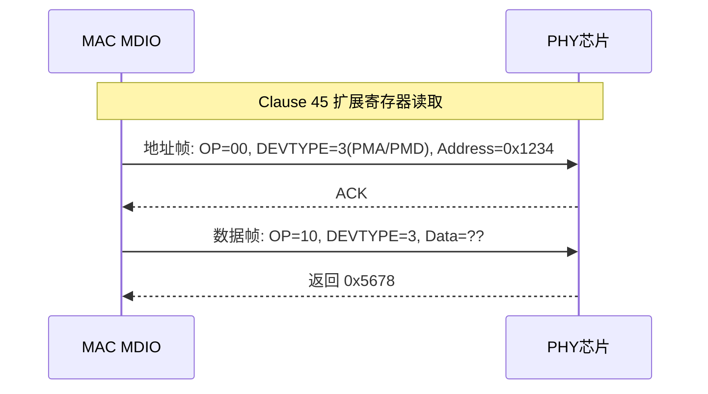

# MDIO 帧结构与 Linux 以太网 PHY 驱动

<span class="badge-e">[Expert]</span>

---

<span class="red">MDIO（Management Data Input/Output）</span> 是以太网 MAC 与 PHY 之间的管理接口，
<br>
通常与 MII/RGMII/SGMII 数据接口配合使用。
<br>
MDIO 仅包含 MDC（时钟）和 MDIO（双向数据）两条线，负责 PHY 寄存器的读写配置。
<br>
理解 MDIO 帧结构和 Linux mdio_bus 驱动，是嵌入式网络开发的必备技能。

---

## <strong>MDIO 帧结构详解</strong>

### <strong>Clause 22 帧格式（传统 MDIO）</strong>

IEEE 802.3 Clause 22 定义了 32 个 PHY 寄存器的标准读写帧格式：

```
| Preamble | ST  | OP   | PHYADR | REGADR | TA | Data (16bit) | Idle |
|----------|-----|------|--------|--------|----|-------------|------|
| 32 bit   | 2bit| 2bit | 5bit   | 5bit   | 2bit| 16bit       | -    |
```

| 字段 | 位宽 | 读操作值 | 写操作值 | 说明 |
|------|------|----------|----------|------|
| Preamble | 32 | 全 1 | 全 1 | 同步前导 |
| ST (Start) | 2 | 01 | 01 | 起始帧 |
| OP (Opcode) | 2 | 10 | 01 | 10=读，01=写 |
| PHYADR | 5 | 目标地址 | 目标地址 | 0-31 |
| REGADR | 5 | 寄存器号 | 寄存器号 | 0-31 |
| TA (Turnaround) | 2 | Z0 | 10 | 读时主机释放总线 |
| Data | 16 | 读出的值 | 写入的值 | 寄存器数据 |

<span class="blue">关键结论：Clause 22 限制最多 32 个 PHY 地址、32 个寄存器，
<br>
无法满足现代千兆/万兆 PHY 大量扩展寄存器的需求。
</span>
<br>

---

### <strong>Clause 45 帧格式（扩展 MDIO）</strong>

IEEE 802.3 Clause 45 扩展了地址空间和设备类型：

```
| Preamble | ST  | OP   | PHYADR | DEVTYPE | TA | Address/Data(16bit) | Idle |
|----------|-----|------|--------|---------|----|---------------------|------|
| 32 bit   | 2bit| 2bit | 5bit   | 5bit    | 2bit| 16bit               | -    |
```

| OP 码 | 含义 | 用途 |
|-------|------|------|
| 00 | 地址写入 | 设置目标扩展寄存器地址 |
| 01 | 数据写入 | 向当前地址写入 16-bit 数据 |
| 10 | 数据读取 | 从当前地址读取 16-bit 数据 |
| 11 | 地址读取 | 读取当前地址指针（较少用） |



<span class="green">`DEVTYPE`</span> 字段定义设备类型：
<br>
0=保留，1=PMA/PMD，2=WIS，3=PCS，4=PHY XS，5=DTE XS，6=TC，7=自动协商，29/30/31=厂商自定义。

---

## <strong>PHY 寄存器标准映射</strong>

### <strong>为什么寄存器地址是标准化的</strong>

IEEE 802.3 强制规定 Register 0-15 的标准语义，确保不同厂商 PHY 能被统一驱动管理。
<br>
Register 16-31 留给厂商自定义，用于实现芯片特有功能（LED 控制、时序调整等）。
<br>
这种分层设计使 Linux 内核可以编写通用 PHY 驱动框架，而厂商只需补充私有扩展。

---

### <strong>关键寄存器一览</strong>

| 寄存器 | 名称 | 标准定义 | 典型用途 |
|--------|------|----------|----------|
| Reg 0 | Control | 802.3 Clause 22 | 复位、自协商使能、速率/双工设置 |
| Reg 1 | Status | 802.3 Clause 22 | 自协商完成、链路状态、故障检测 |
| Reg 2 | PHY ID 1 | 802.3 Clause 22 | 厂商 ID 高 16 位（如 Marvell=0x0141） |
| Reg 3 | PHY ID 2 | 802.3 Clause 22 | 厂商 ID 低 16 位 + 型号 + 版本 |
| Reg 4 | Auto-Neg Adv | 802.3 Clause 22 | 通告支持的速率和双工模式 |
| Reg 9 | 1000BASE-X Ctrl | 802.3 Clause 22 | 千兆光纤自协商控制 |
| Reg 10 | 1000BASE-X Stat | 802.3 Clause 22 | 千兆光纤自协商状态 |
| Reg 17 | SGMII Control | Cisco/SerDes 私有 | SGMII 模式使能、链路定时器 |

---

### <strong>Link Status 检测机制</strong>

```c
// 轮询链路状态的典型代码
uint16_t reg1 = mdio_read(phy_addr, 1);  // Read Status Register
uint8_t link_up = (reg1 >> 2) & 0x1;      // Bit 2: Link Status
uint8_t aneg_done = (reg1 >> 5) & 0x1;    // Bit 5: Auto-Negotiation Complete

// Linux 内核 phylib 中的标准链路检测
// drivers/net/phy/phy.c: genphy_read_status()
// 1. 读 Reg 1 确认 link_up
// 2. 读 Reg 4/9 确认自协商结果
// 3. 读厂商私有寄存器确认实际速率
```

<span class="blue">关键结论：Link Status（Reg1 bit2）是 latch-low 位，
<br>
链路断开时会锁存 0，直到下一次 MDIO 读取才更新。
<br>
因此中断驱动方式比轮询更高效，链路变化由 PHY INT 引脚通知 MAC。
</span>
<br>

---

## <strong>Linux mdio_bus 驱动框架</strong>

### <strong>为什么内核需要 mdio_bus 抽象</strong>

现代 SoC 中 MDIO 控制器可能集成在 MAC（如 STM32 ETH）、独立存在（如 IP101GR），或由交换机芯片提供。
<br>
Linux 内核将 MDIO 控制器抽象为 `mdio_bus`，将 PHY 设备抽象为 `phy_device`，
<br>
实现控制器与 PHY 的解耦，同一驱动可适配不同硬件平台。

---

### <strong>设备树绑定与注册</strong>

```dts
// arch/arm/boot/dts/stm32f7.dts 示例
&mac {
    pinctrl-names = "default";
    pinctrl-0 = <&ethernet_mdc_pa1>;
    phy-mode = "rmii";
    phy-handle = <&phy0>;
    
    mdio {
        #address-cells = <1>;
        #size-cells = <0>;
        
        phy0: ethernet-phy@0 {
            reg = <0>;              // PHY 地址 0
            compatible = "ethernet-phy-ieee802.3-c22";
            reset-gpios = <&gpioa 0 GPIO_ACTIVE_LOW>;
        };
    };
};
```

<span class="green">`phy-mode = "rmii"`</span> 指定数据接口为 RGMII 之前的简化版，MDIO 独立管理。
<br>
<span class="green">`reg = <0>`</span> 是 PHY 在 MDIO 总线上的地址，硬件通过 PHYAD 引脚（上拉/下拉）配置。

---

### <strong>驱动核心结构</strong>

```c
// drivers/net/phy/mdio_bus.c 核心逻辑
struct mii_bus *devm_mdiobus_alloc(struct device *dev);
int mdiobus_register(struct mii_bus *bus);

// PHY 读写 API
int mdiobus_read(struct mii_bus *bus, int addr, u32 regnum);
int mdiobus_write(struct mii_bus *bus, int addr, u32 regnum, u16 val);

// PHY 设备探测
static int mdio_bus_match(struct device *dev, struct device_driver *drv) {
    struct phy_device *phydev = to_phy_device(dev);
    struct phy_driver *phydrv = to_phy_driver(drv);
    // 匹配 PHY ID（Reg 2/3）与驱动支持的 ID 列表
    return phydrv->phy_id == (phydev->phy_id & phydrv->phy_id_mask);
}
```

<span class="green">`phy_id`</span> 由 Reg 2 和 Reg 3 拼接而成：`(Reg2 << 16) | Reg3`，唯一标识 PHY 型号。
<br>
<span class="green">`mdiobus_read/write`</span> 是同步阻塞调用，底层触发 MDIO 状态机发送 Clause 22 帧。

---

### <strong>通用 PHY 驱动（phylib）</strong>

```c
// drivers/net/phy/phy_device.c: phy_init()
// 自动识别 PHY ID 并绑定对应驱动

// 若厂商未提供专用驱动，fallback 到 genphy（通用 PHY 驱动）
static struct phy_driver genphy_driver = {
    .phy_id         = 0xffffffff,
    .phy_id_mask    = 0xffffffff,
    .name           = "Generic PHY",
    .read_status    = genphy_read_status,
    .config_aneg    = genphy_config_aneg,
    .soft_reset     = genphy_soft_reset,
};
```

<span class="blue">关键结论：Linux phylib 框架通过 PHY ID 自动匹配驱动，
<br>
未知 PHY 回退到 genphy，基本功能（速率/双工/链路检测）仍可工作。
<br>
但厂商特有功能（EEE 节能、LED、RGMII 时序调谐）需要专用驱动支持。
</span>
<br>

---

## <strong>历史演进与工业应用</strong>

MDIO 随 MII 接口于 1995 年在 IEEE 802.3u（快速以太网）中标准化。
<br>
Clause 22 为 10/100M 时代设计，32 个寄存器足够覆盖基础配置。
<br>
2002 年千兆以太网普及后，32 个寄存器明显不足，Clause 45 于 IEEE 802.3ae（10G）中引入。
<br>
Clause 45 通过 DEVTYPE + 扩展地址空间，支持数千个寄存器，覆盖 SerDes、PMA、PCS 等子层。
<br>
在嵌入式 Linux 中，mdio_bus 框架于 2.6 内核时代成熟，Device Tree 绑定在 3.x 后标准化。
<br>
现代 SoC（i.MX、STM32、RK3588）均将 MDIO 集成到以太网 MAC 或独立作为 GPIO bitbang 实现。

---

## 小结

| 要点 | 内容 |
|------|------|
| Clause 22 | 32 地址 x 32 寄存器，OP=10/01 读/写，适用于 10/100M PHY |
| Clause 45 | 32 地址 x 32 DEVTYPE x 65536 寄存器，OP=00/01/10/11，适用于千兆+ PHY |
| 关键寄存器 | Reg0 控制、Reg1 状态、Reg2/3 PHY ID、Reg4 自协商通告 |
| Linux 框架 | mdio_bus 抽象控制器、phy_device 抽象 PHY、phylib 自动识别 |
| 设备树 | `phy-handle` + `mdio` 子节点 + `reg` 配置 PHY 地址 |

## 练习

| 题号 | 问题 |
|------|------|
| 1 | Clause 22 的 TA（Turnaround）字段在读操作时为什么要求主机先释放 MDIO 总线（Z 状态），再读取 PHY 数据？从开漏/推挽电气特性分析。 |
| 2 | 为什么现代千兆 PHY 需要 Clause 45 而非 Clause 22？计算两种帧格式可访问的寄存器总数并分析扩展性差异。 |
| 3 | 在 Linux 内核中，若一颗新 PHY 芯片没有专用驱动，genphy 如何保证基本功能（速率、双工、链路检测）可用？从 phy_id 匹配和通用寄存器语义分析。 |

---

## 学习路线

- <span class="badge-b">[Beginner]</span> 掌握：MDIO 引脚定义、 Clause 22 帧格式、基本寄存器读写。
<br>
- <span class="badge-i">[Intermediate]</span> 掌握：Clause 45 扩展帧格式、PHY 寄存器语义、Linux mdio_bus 框架。
<br>
- <span class="badge-e">[Expert]</span> 掌握：Linux phylib 驱动开发、Device Tree 绑定、厂商私有寄存器调试、RGMII/SGMII 时序配合。

---

<span class="purple">扩展阅读</span>：IEEE 802.3 Clause 22/45；Linux Kernel `Documentation/devicetree/bindings/net/ethernet-phy.yaml`；
<br>
`drivers/net/phy/` 目录下内核 PHY 驱动源码。
