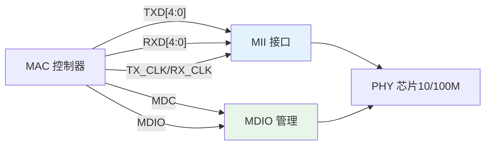
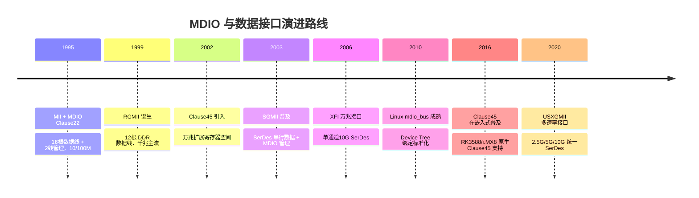

# MDIO 从 MII 到 XFI 的历史演进

<span class="badge-e">[Expert]</span>

---

<span class="red">MDIO 管理接口</span> 随 MII 数据接口于 1995 年标准化，最初仅支持 10/100M 以太网 PHY 配置。
<br>
随着以太网从百兆到万兆的演进，MDIO 先后经历 Clause 22、Clause 45 两次重大升级，
<br>
与 RGMII、SGMII、XFI 等数据接口协同演化。
<br>
理解 MDIO 的演进脉络，有助于在嵌入式网络选型中正确匹配 PHY 与 MAC 的管理接口。

---

## <strong>1995-2000：MII 时代与 Clause 22 诞生</strong>

### <strong>为什么 MII 需要配套管理接口</strong>

1995 年 IEEE 802.3u 定义快速以太网（100BASE-TX），引入 MII（Media Independent Interface）
<br>
将 MAC 与 PHY 解耦，同一 MAC 可适配不同物理层（双绞线、光纤）。
<br>
但速率协商、链路检测、环回测试等功能需要寄存器访问机制。
<br>
MDIO 应运而生：2 线串行接口，32 地址 x 32 寄存器，满足当时百兆 PHY 的配置需求。

---

### <strong>MII + MDIO 经典架构</strong>



MII 使用 16 根数据线（TXD/RXD 各 4-bit + 控制/时钟），MDIO 仅需 2 根线。
<br>
这种分离设计使 MAC 只需关注数据转发，PHY 配置由 MDIO 独立管理。

---

## <strong>2001-2005：RGMII/SGMII 精简与千兆普及</strong>

### <strong>为什么 MII 需要瘦身</strong>

千兆以太网（1000BASE-T）于 1999 年标准化，MII 的 16 根线在 PCB 上占用过多引脚。
<br>
RGMII（Reduced Gigabit Media Independent Interface）将数据线压缩至 12 根，
<br>
通过在时钟边沿双采样（DDR）保持 1Gbps 速率。
<br>
SGMII（Serial Gigabit MII）进一步将数据接口串行化，仅需 2 对差分线（TX/RX）。

---

### <strong>RGMII/SGMII 与 MDIO 的配合</strong>

| 数据接口 | 数据线数 | 时钟 | MDIO 角色 | 典型应用 |
|----------|----------|------|-----------|----------|
| MII | 16 | 25MHz | 独立管理 | 早期百兆嵌入式 |
| RMII | 10 | 50MHz | 独立管理 | 精简百兆（STM32） |
| RGMII | 12 | 125MHz DDR | 独立管理 | 千兆主流方案 |
| SGMII | 2对差分 | SerDes | 独立管理 | 千兆SerDes方案 |
| XFI | 1对差分 | 10.3125G SerDes | 扩展管理(Clause45) | 万兆光纤 |

<span class="blue">关键结论：数据接口从并行走向串行，但 MDIO 始终保持独立管理角色。
<br>
即使 SGMII/XFI 使用 SerDes，PHY 寄存器配置仍需 MDIO/Clause 45。
</span>
<br>

---

### <strong>RGMII 时序与 PHY 寄存器调谐</strong>

```c
// 典型 RGMII RX 时钟延迟调谐（Marvell PHY）
// 通过 MDIO 修改厂商私有寄存器
mdio_write(phy_addr, 0x1D, 0x1F);  // 选择 Page 31
mdio_write(phy_addr, 0x1E, 0x00B0); // 选择寄存器 0xB0 (RGMII 时序)
uint16_t val = mdio_read(phy_addr, 0x1E);
val |= (1 << 7);  // 设置 RX 时钟延迟使能
mdio_write(phy_addr, 0x1E, val);
```

RGMII 要求 TX 时钟与数据边沿对齐，RX 时钟需 1.5-2.0ns 延迟避免采样冲突。
<br>
这些时序参数通常通过 MDIO 访问 PHY 私有寄存器调整。
<br>
不同厂商（Marvell、Realtek、Micrel）的寄存器映射各不相同，驱动开发需查阅 datasheet。

---

## <strong>2006-2015：Clause 45 与万兆扩展</strong>

### <strong>为什么 Clause 22 无法满足万兆需求</strong>

10G 以太网 PHY 内部结构远比百兆复杂：PCS（物理编码子层）、PMA（物理媒介附加）、
<br>
PMD（物理媒介相关）、WIS（WAN 接口子层）、Auto-Neg 等子模块都需要独立寄存器空间。
<br>
Clause 22 的 32 个寄存器远远不够，且 DEVTYPE 字段缺失导致无法区分子模块。
<br>
Clause 45 通过引入 DEVTYPE（5-bit）和地址/数据分离帧，将可访问寄存器扩展至 32x32x64K。

---

### <strong>Clause 45 与 XFI 的协同</strong>

XFI（10 Gigabit Serial Electrical Interface）使用单通道 10.3125Gbps SerDes，
<br>
物理层通常是集成 MAC+PHY 的网卡芯片（如 Intel X710），或交换机 ASIC。
<br>
在此场景中，MDIO 不再连接外部 PHY，而是访问芯片内部的 SerDes 寄存器。
<br>
Clause 45 的 DEVTYPE=1（PMA/PMD）和 DEVTYPE=3（PCS）成为调谐误码率、预加重、均衡的关键接口。

---

## <strong>历史演进时间线</strong>



---

## 小结

| 要点 | 内容 |
|------|------|
| 起源 | 1995 年 MII 配套管理接口，Clause 22 标准化 |
| 数据接口瘦身 | MII(16) -> RMII(10) -> RGMII(12 DDR) -> SGMII(2差分) -> XFI(1差分) |
| MDIO 升级 | Clause 22(32x32) -> Clause 45(32x32x64K)，DEVTYPE 区分子模块 |
| 时序调谐 | RGMII RX 时钟延迟、SGMII 链路定时器通过 MDIO 厂商私有寄存器配置 |
| 嵌入式趋势 | 现代 SoC 通过 mdio_bus 框架统一支持 Clause 22/45，PHY 地址由设备树配置 |

## 练习

| 题号 | 问题 |
|------|------|
| 1 | RGMII 为什么需要在时钟边沿双采样（DDR）才能用 12 根线实现 1Gbps？计算单线速率并与 MII 对比。 |
| 2 | Clause 45 的地址帧（OP=00）和数据帧（OP=10）分离设计，相比 Clause 22 的直接读写有什么优势和劣势？从协议效率和实现复杂度分析。 |
| 3 | 在 SGMII 架构中，MDIO 管理的是外部 PHY 还是 MAC 内部的 SerDes 控制器？若使用 XFI 直连光模块（无外部 PHY），MDIO 还有存在的必要吗？ |

---

## 学习路线

- <span class="badge-b">[Beginner]</span> 掌握：MDIO 引脚定义、Clause 22 帧结构、基本寄存器读写。
<br>
- <span class="badge-i">[Intermediate]</span> 掌握：RGMII/SGMII 与 MDIO 的配合、PHY 地址配置、Linux mdio_bus 注册。
<br>
- <span class="badge-e">[Expert]</span> 掌握：Clause 45 扩展帧、万兆 SerDes 寄存器调谐、XFI/USXGMII 接口演进、厂商 PHY 私有寄存器逆向调试。

---

<span class="purple">扩展阅读</span>：IEEE 802.3 Clause 22/45；RGMII v2.0 Specification（RapidlIO Trade Association）；
<br>
Cisco SGMII Application Note；Linux `drivers/net/phy/` 源码。
