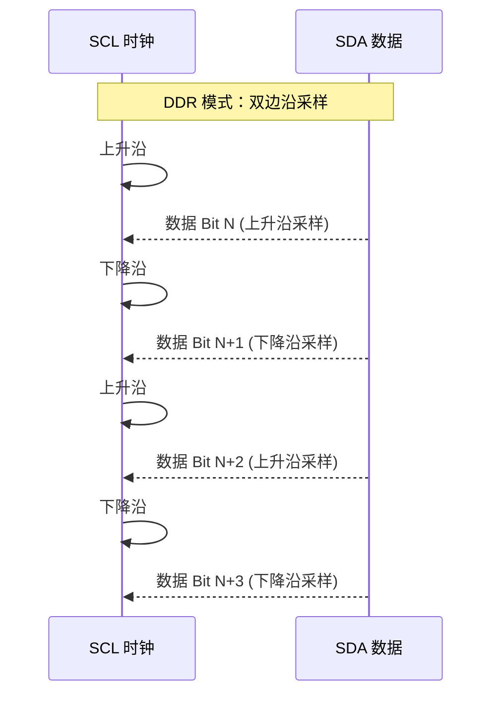
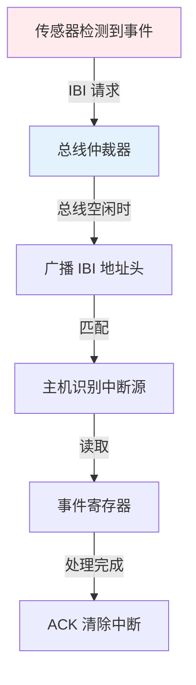

# I3C HDR 模式与内置测试调试机制

<span class="badge-e">[Expert]</span>

---

<span class="red">MIPI I3C 的 HDR（High Data Rate）模式</span> 是其超越 I2C 性能的核心机制。
<br>
通过 DDR（Double Data Rate）和 TSC（Ternary Symbol Coding）等编码方式，
<br>
I3C 在相同的 SDA/SCL 双线上实现最高 33.3 Mbps 的有效数据率。
<br>
此外，IBI（In-Band Interrupt）和 HJ（Hot-Join）机制为动态设备管理和带内调试提供了原生支持。

---

## <strong>I3C HDR 模式详解</strong>

### <strong>为什么 I3C 需要 HDR</strong>

I3C 的 SDR（Single Data Rate）模式最高 12.5MHz，已远超 I2C 的 3.4MHz。
<br>
但对于 4K 摄像头、高帧率 IMU 等场景，12.5Mbps 仍然不够。
<br>
HDR 模式通过在时钟和数据线上同时编码更多信息，突破单沿采样的速率限制。
<br>
这类似于 DDR 内存和 PCIe 的演进思路：不改变引脚数，提升每引脚的信息密度。

---

### <strong>DDR 模式：双边沿采样</strong>

DDR 模式在 SCL 的上升沿和下降沿各传输 1-bit 数据，有效速率翻倍。



| 参数 | SDR 模式 | DDR 模式 |
|------|----------|----------|
| 时钟频率 | 12.5 MHz | 12.5 MHz |
| 数据采样 | 单沿 | 双沿 |
| 有效数据率 | 12.5 Mbps | 25 Mbps |
| 总线状态 | 推挽输出 | 推挽输出 |

<span class="blue">关键结论：DDR 模式不改变时钟频率，仅通过双边沿采样将吞吐量翻倍。
<br>
但对 SDA 信号完整性要求更高，建立/保持时间减半。
</span>
<br>

---

### <strong>TSC 模式：三态编码</strong>

TSC（Ternary Symbol Coding）是 I3C 最高效的 HDR 变体。
<br>
传统二进制每时钟传输 1-bit，而 TSC 利用 SDA 的三态（高、低、高阻）编码更多状态。
<br>
两线组合（SCL + SDA）每周期可表示 3x3=9 种状态，实际使用 4 种数据符号 + 控制符号。
<br>
TSC 模式有效数据率可达 33.3 Mbps，是 SDR 的 2.66 倍。

```
TSC 符号映射：
SCL=Low,  SDA=Low   -> Symbol 0
SCL=Low,  SDA=High  -> Symbol 1
SCL=High, SDA=Low   -> Symbol 2
SCL=High, SDA=High  -> Symbol 3
```

---

## <strong>内置测试与调试机制</strong>

### <strong>为什么 I3C 需要带内中断 IBI</strong>

I2C 没有中断机制，传感器事件必须靠主机轮询检测。
<br>
在 20+ 传感器的智能手机中，轮询功耗占整体传感器子系统功耗的 40% 以上。
<br>
I3C 引入 IBI（In-Band Interrupt）：从设备通过在总线上发送特定序列主动请求中断。
<br>
主机收到 IBI 后，按优先级顺序读取各设备的事件寄存器，仅处理有事件的设备。

---

### <strong>IBI 工作流程</strong>



| I3C 特性 | I2C 对比 | 优势 |
|----------|----------|------|
| IBI 带内中断 | 无中断，纯轮询 | 降低 80% 轮询功耗 |
| HJ 热插拔 | 不支持 | 动态添加/移除设备 |
| CCC 通用命令 | 无标准命令集 | 统一的设备控制接口 |
| DAA 动态地址 | 固定地址（跳线/电阻） | 避免地址冲突，简化生产 |

---

### <strong>HJ（Hot-Join）动态加入</strong>

```c
// I3C Hot-Join 流程示意（伪代码）
void i3c_hotjoin_handler(struct i3c_bus *bus) {
    // 1. 新设备通过 HJ 请求加入总线
    u8 hj_addr = i3c_recv_broadcast(bus);
    
    // 2. 主机分配动态地址（DAA：Dynamic Address Assignment）
    u8 new_addr = i3c_alloc_address(bus);
    
    // 3. 发送 ENTDAA CCC 命令，设备进入地址分配模式
    i3c_ccc_cmd(bus, CCC_ENTDAA, new_addr);
    
    // 4. 设备返回 48-bit PID（Product ID）
    u64 pid = i3c_read_pid(bus);
    
    // 5. 注册到总线设备链表
    i3c_register_device(bus, new_addr, pid);
}
```

<span class="green">`CCC_ENTDAA`</span> 是 Enter Dynamic Address Assignment 命令，触发所有未分配地址的设备上报 PID。
<br>
<span class="green">`48-bit PID`</span> 由厂商 ID + 部件 ID + 实例 ID 组成，唯一标识芯片型号和个体。

---

## <strong>Linux I3C 子系统</strong>

### <strong>内核架构</strong>

```c
// drivers/i3c/master.c 核心结构
struct i3c_master_controller {
    struct i3c_bus bus;
    struct i3c_device *devs[I3C_MAX_DEVS];
    
    // CCC 命令发送
    int (*send_ccc_cmd)(struct i3c_master_controller *,
                        struct i3c_ccc_cmd *);
    // IBI 处理
    int (*request_ibi)(struct i3c_device *, ibi_handler_t);
};
```

<span class="blue">关键结论：Linux I3C 子系统于 4.19 内核合并，架构与 I2C 类似但增加了 CCC、IBI、DAA 支持。
<br>
主控制器驱动负责 HDR 模式物理层时序，设备驱动通过标准 API 访问功能。
</span>
<br>

---

## 小结

| 要点 | 内容 |
|------|------|
| SDR 模式 | 12.5MHz 单沿，基础模式，兼容 I2C |
| DDR 模式 | 12.5MHz 双沿，25Mbps，信号完整性要求更高 |
| TSC 模式 | 三态编码，33.3Mbps，最高效 HDR 变体 |
| IBI | 带内中断，传感器主动通知，消除轮询功耗 |
| HJ/DAA | 热插拔 + 动态地址分配，生产免跳线 |
| Linux 支持 | 4.19+ 内核 i3c 子系统，CCC/IBI/DAA 完整实现 |

## 练习

| 题号 | 问题 |
|------|------|
| 1 | I3C DDR 模式在 SCL 下降沿采样时，如何避免 SDA 信号在时钟翻转瞬间的亚稳态？从建立时间和保持时间要求分析。 |
| 2 | TSC 模式使用 SCL+SDA 的三态组合编码，为什么比 DDR 模式更高效？计算 TSC 和 DDR 在相同 12.5MHz 时钟下的有效数据率比值。 |
| 3 | 为什么 I3C 的热插拔（HJ）机制对可穿戴设备特别重要？设想 TWS 耳机充电仓内的传感器在取出/放入时的地址分配过程。 |

---

## 学习路线

- <span class="badge-b">[Beginner]</span> 掌握：I3C SDR 模式时序、CCC 基本命令、与 I2C 的兼容性。
<br>
- <span class="badge-i">[Intermediate]</span> 掌握：DDR/TSC HDR 模式原理、IBI 中断处理、DAA 地址分配流程。
<br>
- <span class="badge-e">[Expert]</span> 掌握：Linux I3C 子系统驱动开发、HDR 物理层信号完整性分析、多主控制器仲裁、与 MIPI CSI/DSI 的协同设计。

---

<span class="purple">扩展阅读</span>：MIPI I3C Specification v1.1.1；Linux Kernel `Documentation/i3c/`；
<br>
MIPI I3C HDR Mode Application Note。
