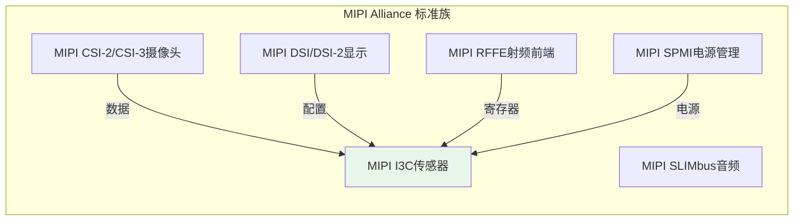
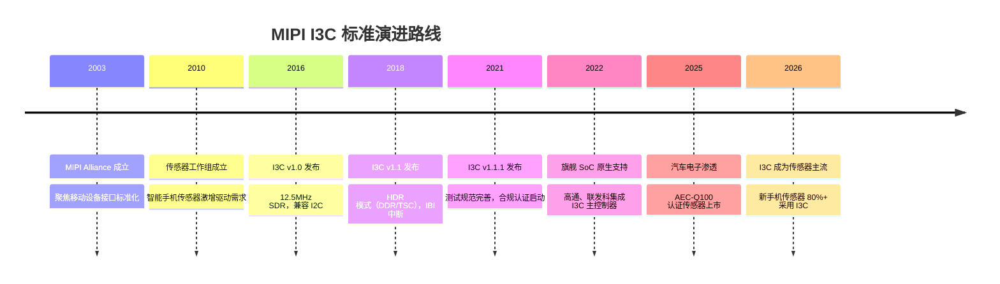

# MIPI I3C 标准路线与 I2C/SPI 替代关系

[Expert]

---

MIPI I3C 是 MIPI Alliance 于 2016 年发布的传感器接口标准，旨在解决 I2C 速率低、无中断、地址冲突等固有问题。
 
作为 I2C 的精神继承者，I3C 在智能手机、可穿戴设备、汽车电子中快速渗透。
 
理解 MIPI Alliance 的标准路线和 I3C 的生态布局，有助于预判未来嵌入式传感器接口格局。

---

## <strong>MIPI Alliance 标准路线</strong>

### <strong>为什么 MIPI 要定义 I3C</strong>

2003 年成立的 MIPI Alliance 最初专注于移动设备显示（DSI）和摄像头（CSI）接口。
 
2010 年后，智能手机传感器数量从 3-4 个激增至 15+ 个，I2C 成为瓶颈。
 
MIPI 发现传感器接口没有统一标准，各厂商使用 I2C+SPI+GPIO 混合方案，互操作性差。
 
2013 年，MIPI 传感器工作组成立，目标是定义"下一代传感器总线"。
 
2016 年，I3C v1.0 规范发布。2018 年 v1.1 增加 HDR 模式，2021 年 v1.1.1 完善测试规范。

---

### <strong>MIPI 标准族谱</strong>

MIPI I3C 定位为"传感器控制总线"，与 CSI/DSI 的数据总线形成互补。
 
RFFE（RF Front-End）也使用类似的寄存器访问模型，未来可能与 I3C 融合。

---

## <strong>I3C vs I2C/SPI 的替代关系</strong>

### <strong>为什么 I3C 能替代 I2C 但不能替代 SPI</strong>

I3C 的设计目标明确：替代 I2C 在传感器场景中的地位。
 
12.5MHz SDR + 33.3Mbps HDR 的速率，足以覆盖绝大多数传感器（加速度计、陀螺仪、环境光等）。
 
但 SPI 的 50MHz+ 速率对于高速 ADC、显示屏、Flash 存储仍然是刚需。
 
因此 I3C 不会完全替代 SPI，而是与 SPI 在"中速传感器"和"高速外设"之间形成新的分工。

---

### <strong>三种总线的新分工格局</strong>

| 场景 | 传统方案 | 新方案 | 原因 |
|------|----------|--------|------|
| 10+ 传感器手机 | I2C 多路复用 | I3C 单总线 | 动态地址+IBI中断 |
| 可穿戴设备 | I2C+GPIO中断 | I3C 单总线 | HJ热插拔+低功耗 |
| 汽车传感器 | CAN/LIN | I3C + CAN FD | 速率+可靠性并重 |
| 高速 ADC | SPI | SPI | I3C 速率不足 |
| 显示屏 | SPI/RGB | MIPI DSI | 视频专用协议 |
| 摄像头 | SPI/并行 | MIPI CSI-2 | 视频专用协议 |

关键结论：I3C 的核心替代目标是 I2C 传感器场景，而非 SPI 高速场景。
 
在多传感器移动设备中，I3C 将逐渐成为标配，I2C 退守工业存量市场。

 

---

### <strong>旗舰 SoC 的 I3C 支持现状</strong>

| SoC | 发布时间 | I3C 支持 | 典型应用 |
|-----|----------|----------|----------|
| 高通骁龙 888 | 2020 | I3C SDR | 小米11、三星S21 |
| 高通骁龙 8 Gen 1 | 2021 | I3C SDR+HDR | 旗舰手机 |
| 高通骁龙 8 Gen 2 | 2022 | I3C SDR+HDR+IBI | 主流旗舰 |
| 联发科天玑 9200 | 2022 | I3C SDR+HDR | vivo X90 |
| 苹果 A16/A17 | 2022/23 | 私有传感器总线 | iPhone 14/15 |

---

## <strong>历史演进时间线</strong>

---

## 小结

| 要点 | 内容 |
|------|------|
| MIPI 路线 | 2010 传感器工作组 -> 2016 I3C v1.0 -> 2018 v1.1 HDR -> 2021 v1.1.1 测试规范 |
| I2C 替代 | I3C 在传感器场景中逐步替代 I2C，工业市场 I2C 长期共存 |
| SPI 共存 | I3C 不替代 SPI，中速传感器 I3C + 高速外设 SPI 分工 |
| 旗舰支持 | 高通骁龙 8 Gen 2、联发科天玑 9200 已原生集成 I3C 主控 |
| 未来趋势 | 汽车电子、可穿戴、AR/VR 是 I3C 的下一个增长点 |

## 练习

| 题号 | 问题 |
|------|------|
| 1 | MIPI Alliance 已有 CSI（摄像头）和 DSI（显示）标准，为什么还需要单独定义 I3C 而非直接复用 CSI/DSI 的配置通道？从传感器数量、速率需求、功耗约束三个角度分析。 |
| 2 | 为什么高通和联发科在 2022 年后才开始原生支持 I3C，而不是在 2016 年 I3C 发布后立即集成？从 IP 验证周期、传感器生态、成本三个因素分析。 |
| 3 | 在汽车电子中，I3C 与 CAN FD 的分工是什么？为什么汽车传感器不全部改用 I3C，而是保留 CAN FD 作为主干总线？ |

---

## 学习路线

- [Beginner] 掌握：I3C 基础时序、SDR 模式、与 I2C 的兼容性。
 
- [Intermediate] 掌握：HDR 模式原理、IBI/HJ 机制、MIPI 标准族关系。
 
- [Expert] 掌握：MIPI Alliance 标准路线、SoC I3C 主控集成、汽车电子认证要求、I3C 与 CSI/DSI/RFFE 的协同设计。

---

扩展阅读：MIPI I3C Specification v1.1.1；MIPI Alliance Sensor WG Whitepaper；
 
高通 Snapdragon 8 Gen 2 Technical Reference Manual I3C 章节。
