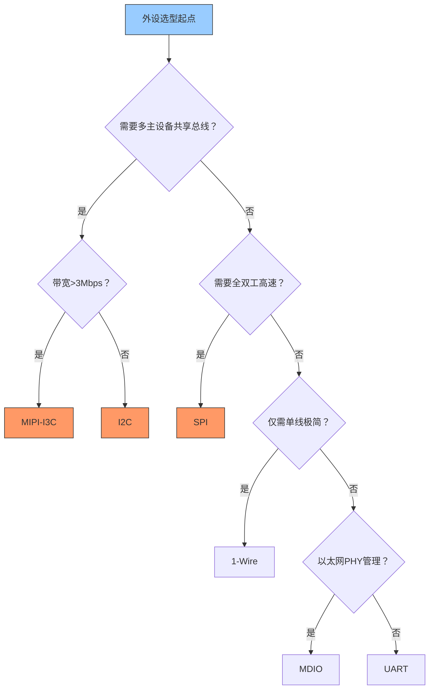

# 基础外设通信总线

[Beginner] [Intermediate]

基础外设通信总线是嵌入式系统中最常用、最基础的低速串行总线家族。
 
从I2C的两线半双工到SPI的四线全双工，从UART的异步通信到1-Wire的单线极简设计，从MDIO的以太网PHY管理到MIPI-I3C的新一代传感器接口，这些总线构成了嵌入式设备与传感器、存储器、显示器等外设交互的基本手段。
 
理解每种总线的电气特性、时序约束、寻址机制和Linux驱动模型，是嵌入式开发的入门必修课。
 
本类别覆盖六种核心总线：I2C、SPI、UART、1-Wire、MDIO和MIPI-I3C。
 

---

## <strong>本类别总线总览</strong>

| 总线 | 信号线数 | 最大速率 | 拓扑 | 寻址方式 | 典型应用 |
|------|----------|----------|------|----------|----------|
| I2C | 2（SDA+SCL） | 3.4Mbps（HS模式） | 多主总线 | 7/10位地址 | EEPROM、RTC、传感器 |
| SPI | 4+（MOSI+MISO+SCK+CS） | 100MHz+ | 主从星型 | 片选线 | Flash、ADC、DAC、显示屏 |
| UART | 2（TX+RX） | 10Mbps | 点对点 | 无 | 调试串口、GPS、蓝牙模块 |
| 1-Wire | 1（DQ） | 16.3kbps | 主从总线 | 64位ROM ID | 温度传感器、电子标签 |
| MDIO | 2（MDC+MDIO） | 2.5MHz | 主从总线 | 5位PHY地址 | 以太网PHY管理 |
| MIPI-I3C | 2（SDA+SCL） | 12.5Mbps（SDR） | 多主总线 | 7位动态地址 | 移动端传感器、摄像头 |

---

## <strong>选型对比表</strong>

### <strong>为什么I2C和SPI是最常见的选择</strong>

I2C和SPI占据了嵌入式外设通信的绝大部分场景，但它们的适用边界截然不同：
 

| 对比维度 | I2C | SPI | UART | 1-Wire |
|----------|-----|-----|------|--------|
| 信号线数 | 2 | 4+ | 2 | 1 |
| 通信模式 | 半双工 | 全双工 | 全双工 | 半双工 |
| 多设备支持 | 地址寻址 | 片选线 | 点对点 | ROM ID寻址 |
| 硬件复杂度 | 低（开漏+上拉） | 中（推挽+片选） | 低（推挽） | 极低（开漏） |
| 速率上限 | 3.4Mbps | 100MHz+ | 10Mbps | 16.3kbps |
| 流控机制 | 无（软件ACK） | 无 | RTS/CTS（可选） | 无 |
| 距离 | 板级（<1m） | 板级（<1m） | 板级/短距 | 板级（<10m） |
| 功耗 | 低（静态时上拉耗电） | 中 | 低 | 极低（寄生供电） |
| Linux子系统 | i2c-core | spi-core | tty/serial | w1-gpio |

关键认知：I2C的"两线"优势在引脚受限的场景（如8引脚MCU）至关重要；SPI的"四线+片选"在需要高速全双工时无可替代。选型的核心矛盾是"引脚数 vs 速率 vs 拓扑复杂度"。
 

### <strong>MDIO与MIPI-I3C的定位</strong>

MDIO和MIPI-I3C虽然不如I2C/SPI普及，但在特定领域不可替代：
 
| 总线 | 核心优势 | 不可替代原因 | 典型芯片 |
|------|----------|-------------|----------|
| MDIO | 标准化PHY寄存器 | 所有以太网PHY都遵循IEEE 802.3 Clause 22/45 | RTL8211、KSZ8081 |
| MIPI-I3C | 动态地址+HDR高速 | 手机传感器数量爆炸，静态地址耗尽 | BMI270、BMM150 |

---

## <strong>适用场景决策矩阵</strong>

### <strong>场景举例</strong>

| 场景 | 推荐总线 | 理由 |
|------|----------|------|
| 读取EEPROM配置 | I2C | 两线即可，EEPROM原生支持I2C |
| Flash存储器编程 | SPI | 全双工高速，Flash标准接口 |
| 调试日志输出 | UART | 异步简单，无需时钟线 |
| 温度传感器阵列 | 1-Wire | 单线并联，寄生供电 |
| 以太网PHY管理 | MDIO | 标准化寄存器映射 |
| 手机摄像头配置 | MIPI-I3C | 动态地址分配，HDR高速 |
| 多点触摸屏 | I2C | 地址寻址支持多个触摸控制器 |
| 音频Codec配置 | I2C/SPI | 大多数Codec同时支持两种接口 |

---

## <strong>为什么基础总线经久不衰</strong>

在USB、PCIe等高速接口普及的今天，I2C、SPI和UART依然不可替代。
 
原因有三：
 
- <strong>简单即可靠</strong>：3条线的SPI比32条线的PCIe更容易调试，故障定位成本更低
 
- <strong>生态锁定</strong>：全球数以亿计的传感器、存储器、RTC芯片采用I2C/SPI接口，替换成本巨大
 
- <strong>功耗优势</strong>：I2C开漏结构在待机时功耗极低，适合电池供电设备
 

MIPI-I3C的推出不是取代I2C，而是解决I2C的扩展瓶颈——当手机摄像头从1个增加到5个时，静态7位地址空间和400kbps速率成为瓶颈，I3C通过动态地址分配和HDR模式（12.5Mbps）解决了这个问题，同时保持对I2C设备的向后兼容。
 

### <strong>Linux驱动架构对比</strong>

| 总线 | 核心数据结构 | 驱动注册方式 | 用户空间接口 |
|------|-------------|-------------|-------------|
| I2C | `struct i2c_client`, `struct i2c_driver` | `i2c_register_driver()` | `/dev/i2c-N` (i2cdev) |
| SPI | `struct spi_device`, `struct spi_driver` | `spi_register_driver()` | `/dev/spidevN.M` |
| UART | `struct uart_port`, `struct uart_driver` | `uart_register_driver()` | `/dev/ttyS<N>` |
| 1-Wire | `struct w1_slave`, `struct w1_family` | `w1_register_family()` | sysfs (`/sys/bus/w1/devices/`) |
| MDIO | `struct mdio_device`, `struct mdio_driver` | `mdio_driver_register()` | netlink (ethtool) |

关键认知：基础外设总线的生命力不在于技术先进性，而在于"足够好"——它们以最低的成本满足了绝大多数外设通信需求。
 

---

## <strong>小结</strong>

| 要点 | 内容 |
|------|------|
| 核心总线 | I2C、SPI、UART、1-Wire、MDIO、MIPI-I3C |
| 选型核心 | 引脚数 vs 速率 vs 拓扑复杂度 |
| I2C优势 | 两线、多主、低功耗、生态庞大 |
| SPI优势 | 全双工、高速、简单协议 |
| UART优势 | 异步、点对点、调试友好 |
| 1-Wire优势 | 单线极简、寄生供电、长距离 |
| MDIO优势 | 标准化PHY管理接口 |
| I3C演进 | I2C向后兼容+动态地址+HDR高速 |

## <strong>练习</strong>

1. 在一个仅提供6个GPIO引脚的8位MCU上，需要连接一个SPI Flash（4线）、一个I2C温度传感器和一个UART调试接口。设计引脚复用方案，说明每个引脚的功能分配。
2. I2C的7位地址空间最多支持127个设备，为什么实际应用中通常不超过10个设备？从总线电容负载和信号完整性角度分析。
3. 比较MIPI-I3C的HDR模式与I2C的HS模式在时序上的差异。为什么I3C可以在同一总线上向后兼容I2C设备？

| 题目 | 考查点 | 难度 |
|------|--------|------|
| 1 | GPIO引脚复用，接口物理层 | Beginner |
| 2 | I2C总线负载，信号完整性 | Intermediate |
| 3 | I3C HDR时序，向后兼容机制 | Intermediate |

---

## <strong>学习路径</strong>

- [Beginner] 从I2C和SPI的帧格式入手，用逻辑分析仪捕获波形，理解START/STOP条件和时序参数。
 
- [Intermediate] 掌握Linux i2c-core和spi-core的驱动架构，实践多设备总线仲裁和错误处理，理解MIPI-I3C的动态地址分配。
 
- 扩展阅读：NXP I2C-bus specification and user manual（UM10204）、MIPI I3C Specification v1.1.1、Linux Kernel I2C/SPI子系统文档、Maxim 1-Wire Application Notes、IEEE 802.3 Clause 22（MDIO）。
 