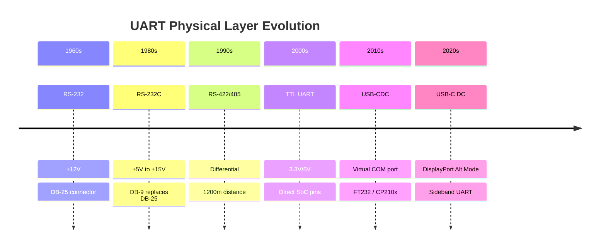
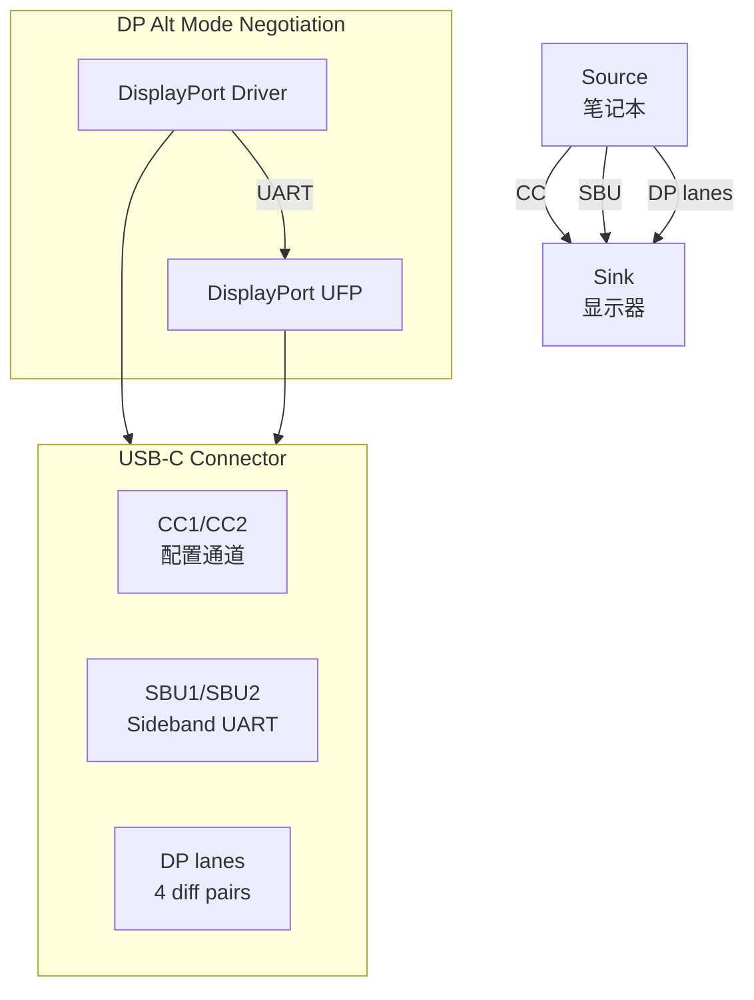
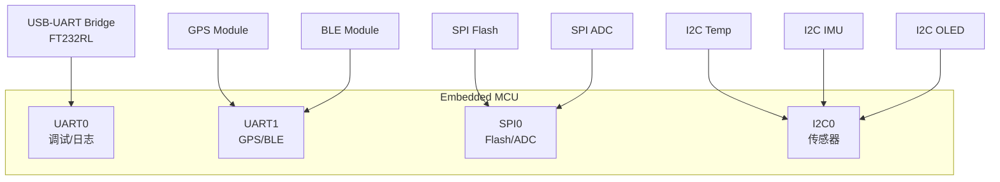
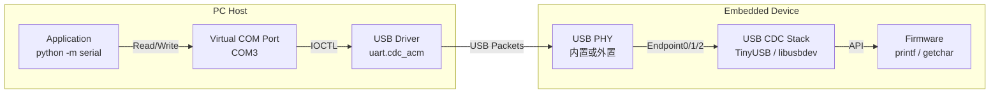

# UART历史演进与替代方案

<span class="badge-b">[Beginner]</span> <span class="badge-i">[Intermediate]</span> <span class="badge-e">[Expert]</span>

---

<span class="red">为什么UART在2020年代仍然是调试接口的首选？</span> 从1960年代的RS-232到今天的USB-C DisplayPort交替模式，UART的物理形态经历了翻天覆地的变化，但其核心语义——全双工异步串行传输，起始位+数据位+停止位——几乎原封不动地保留了六十年。在调试、日志输出、固件升级和低功耗传感器通信中，UART因其极简的硬件需求和几乎无处不在的软件支持而不可替代。理解UART从电平标准到协议替代品的演进，有助于在系统设计中做出正确的接口选择。

---

## <strong>从RS-232到USB-C DC的物理演进</strong>

### <strong>UART电平标准的五代变迁</strong>



| 标准 | 电平 | 最大速率 | 最大距离 | 连接器 | 应用场景 |
|------|------|---------|---------|--------|---------|
| RS-232 | ±3V to ±15V | 115.2kbps | 15m | DB-9 | 工业终端、调制解调器 |
| RS-422 | 差分±6V | 10Mbps | 1200m | DB-9/端子 | 工业控制、楼宇自动化 |
| RS-485 | 差分±6V | 10Mbps | 1200m | 端子 | 多节点总线、Modbus |
| TTL UART | 3.3V/5V CMOS | 3Mbps | <1m | 排针 | 嵌入式调试、MCU通信 |
| USB-CDC | 5V差分 | 12Mbps | 5m | USB-A/B | 虚拟串口、固件升级 |
| USB-C DC | 3.3V | 1Mbps | <0.3m | USB-C | 手机调试、Sideband |

---

### <strong>USB-C DisplayPort Alt Mode中的UART</strong>

USB-C的24个引脚中，SBU（Sideband Use）引脚承载UART信号用于DP协商：



| SBU引脚 | 方向 | 信号 | 速率 | 用途 |
|---------|------|------|------|------|
| SBU1 | Source→Sink | TX | 1Mbps | DP配置数据 |
| SBU2 | Sink→Source | RX | 1Mbps | DP状态反馈 |

```c
// USB-C DP Alt Mode Sideband UART初始化
#define SBU_UART_BASE   0xB000_2000

void dp_sbu_uart_init(void) {
    // 配置SBU引脚为UART功能
    SBU_PINMUX = (1 << 0) | (1 << 1);  // SBU0=TX, SBU1=RX

    // 1Mbps，8N1
    SBU_BAUD = SYS_CLK / 1000000;
    SBU_LCR = 0x03;  // 8-bit data, 1 stop bit, no parity
}

// 发送DP配置消息
void dp_send_config(const uint8_t *cfg, uint8_t len) {
    for (uint8_t i = 0; i < len; i++) {
        while (!(SBU_LSR & SBU_LSR_THRE));  // 等待发送缓冲空
        SBU_THR = cfg[i];
    }
}
```

---

## <strong>UART与SPI/I2C的互补关系</strong>

### <strong>三总线选型矩阵</strong>

| 维度 | UART | SPI | I2C | 选型建议 |
|------|------|-----|-----|---------|
| 信号线数 | 2（TX+RX） | 4（MOSI+MISO+SCK+CS） | 2（SDA+SCL） | 最少线数选I2C/UART |
| 速率 | 3Mbps | 50MHz+ | 3.4Mbps | 高速选SPI |
| 全双工 | 是 | 是 | 否 | 双向并发选UART/SPI |
| 多主控 | 否 | 否 | 是 | 多主选I2C |
| 多从机 | 点对点 | 需CS线 | 地址寻址 | 多从机选I2C |
| 调试友好 | 极佳（字符输出） | 差（需逻辑分析仪） | 中（需协议分析器） | 调试选UART |
| 线缆长度 | 短（TTL）/长（RS-485） | 极短（<30cm） | 短（<1m） | 长距选RS-485 UART |
| 硬件复杂度 | 极低 | 低 | 低 | 极简选UART |



<span class="blue">关键结论：UART不是"最慢"或"最差"的选择——
<br>
它是"最不需要额外考虑"的选择。两个引脚、一个外设、几行代码就能工作。
<br>
在调试接口和固件升级场景中，这种"无脑可用"的特性是UART不可替代的核心竞争力。
</span>

---

## <strong>UART的替代方案</strong>

### <strong>IrDA：红外UART的兴衰</strong>

IrDA（Infrared Data Association）将UART信号调制为38kHz红外载波：

| 时代 | 代表产品 | 速率 | 替代原因 |
|------|---------|------|---------|
| 1995-2005 | Palm PDA、诺基亚手机 | 115.2kbps | 蓝牙取代 |
| 2005-2015 | 电视遥控器 | 无数据 | WiFi/蓝牙 Smart取代 |
| 2015-至今 |  niche工业遥控 | 9600bps |  niche市场 |

```c
// IrDA编解码（调制解调）
// 发送：UART TX → 38kHz载波调制 → 红外LED
// 接收：红外光电二极管 → 38kHz解调 → UART RX

void irda_send_byte(uint8_t byte) {
    for (int i = 0; i < 8; i++) {
        if (byte & (1 << i)) {
            // 逻辑1 = 载波脉冲
            irda_pulse_38khz(1.6e-3);  // 1.6ms脉冲
        } else {
            // 逻辑0 = 无载波
            delay_us(1600);
        }
    }
}
```

---

### <strong>蓝牙BLE：无线UART的实现</strong>

BLE的UART透明传输（UART-to-BLE Bridge）是最常见的替代方案：

| BLE模块 | 串口速率 | BLE版本 | 功耗 | 距离 |
|---------|---------|--------|------|------|
| HC-05/06 | 921.6kbps | BLE 4.0 | 10mA | 10m |
| HM-10 | 115.2kbps | BLE 4.0 | 9mA | 60m |
| nRF52840 | 1Mbps | BLE 5.0 | 5.3mA TX | 100m+ |
| ESP32 | 5Mbps | BLE 5.0 + WiFi | 130mA TX | 100m |

```c
// nRF52840 UART-to-BLE透传配置
#include "nrf_uart.h"
#include "ble_nus.h"

void uart_ble_bridge_init(void) {
    // UART配置：115200, 8N1
    nrf_uart_config_t uart_cfg = {
        .baudrate = NRF_UART_BAUDRATE_115200,
        .parity   = NRF_UART_PARITY_EXCLUDED,
        .hwfc     = NRF_UART_HWFC_DISABLED
    };
    nrf_uart_init(NRF_UART0, &uart_cfg);

    // BLE NUS（Nordic UART Service）
    ble_nus_init_t nus_init = {
        .data_handler = nus_data_handler  // UART RX → BLE TX
    };
    ble_nus_init(&m_nus, &nus_init);
}

// UART RX中断：数据通过BLE发送
void UART0_IRQHandler(void) {
    if (nrf_uart_event_check(NRF_UART0, NRF_UART_EVENT_RXDRDY)) {
        uint8_t data = nrf_uart_rxd_get(NRF_UART0);
        ble_nus_data_send(&m_nus, &data, 1, m_conn_handle);
    }
}
```

---

### <strong>USB CDC ACM：虚拟串口的统治</strong>

USB CDC（Communication Device Class）ACM（Abstract Control Model）子类实现了USB上的UART语义：



| 特性 | 物理UART | USB CDC虚拟串口 | 差异 |
|------|---------|----------------|------|
| 硬件需求 | UART外设+电平转换 | USB PHY+CDC栈 | CDC更复杂 |
| 速率 | 3Mbps | 12Mbps (FS) / 480Mbps (HS) | CDC更快 |
| 驱动兼容性 | 需USB-UART芯片驱动 | 系统原生CDC驱动 | CDC更通用 |
| 热插拔 | 不支持 | 支持 | CDC更灵活 |
| 功耗 | 低（mA级） | 中高（USB PHY耗电） | 物理UART更省电 |

---

## <strong>历史演进：从电传打字机到无线透传</strong>

UART的历史可以追溯到1960年代的电传打字机（Teletype）接口，当时使用电流环（Current Loop）20mA信号传输字符。1970年代，RS-232标准将电平定义为准±12V，成为连接调制解调器、终端和计算机的标准。1980年代的个人电脑（IBM PC、Apple II）都包含RS-232端口（COM口），这是UART的黄金时代。
<br>
<br>
1990年代USB的出现开始改变格局，但UART并未消亡——USB-to-UART桥接芯片（FT232、CP210x、CH340）让PC继续通过USB使用UART语义与嵌入式设备通信。2000年代后，TTL UART（3.3V/5V电平）成为MCU和传感器之间的默认调试接口，其简单性使其在WiFi模块（ESP8266）、蓝牙模块（HC-05）、GPS模块中无处不在。
<br>
<br>
2010年代IoT的兴起催生了"无线UART"概念：BLE模块将UART数据包透明转发到手机APP，LoRa模块实现公里级UART透传，WiFi模块提供TCP/UART转换。这些方案保留了UART的软件开发模型（open / read / write / close），但将物理媒介从铜线替换为无线电波。进入2020年代，USB-C的Sideband UART和显示器EDID/DP配置通道为UART开辟了新的应用领域——它不再是"慢速调试接口"，而是高速协议协商的控制面。六十年来，UART的核心语义（起始位+数据位+停止位）几乎未变，这证明了简单设计的持久生命力。

---

## <strong>本章小结</strong>

| 要点 | 内容 |
|------|------|
| 电平演进 | RS-232±12V → RS-485差分 → TTL 3.3V → USB-C SBU |
| 速率演进 | 110bps → 115.2kbps → 3Mbps → USB CDC 12Mbps |
| 互补关系 | UART=调试/长距/简单，SPI=高速/短距，I2C=多从/中速 |
| 替代趋势 | IrDA已淘汰，BLE是主流无线替代，USB CDC是PC端主流 |
| 核心优势 | 两个引脚、零配置、字符级调试友好、几乎零学习成本 |
| 未来方向 | USB-C Sideband、BLE透传、车载CAN-UART网关 |

## <strong>练习</strong>

| 编号 | 题目 | 难度 |
|------|------|------|
| 1 | 画出UART从RS-232到USB-C的电平标准演进图，标注每种标准的电压范围、最大速率和典型连接器 | <span class="badge-b">[Beginner]</span> |
| 2 | 为一个"工业传感器网关"选型：需要连接4个RS-485传感器（1km距离）、1个蓝牙BLE模块（手机配置）、1个SPI Flash（固件存储）。画出完整的接口分配图并说明每种总线的选型理由 | <span class="badge-i">[Intermediate]</span> |
| 3 | 设计一个USB CDC ACM虚拟串口固件（基于TinyUSB）：实现标准的CDC ACM描述符、SET_LINE_CODING请求处理、以及Bulk IN/OUT端点上的环形缓冲区数据转发，给出完整的描述符结构和端点配置 | <span class="badge-e">[Expert]</span> |

---

<span class="purple">扩展阅读：RS-232-C标准（EIA/TIA-232-E）、FT232R数据手册、USB CDC ACM Class Specification（USB-IF）、TinyUSB CDC ACM示例代码、nRF52840 UART-to-BLE透传指南、USB-C DisplayPort Alt Mode规范（VESA）。</span>
