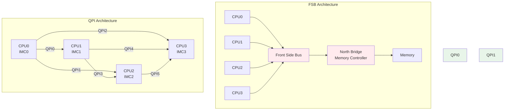

# QPI与OPI前沿趋势及互连技术竞争格局

<span class="badge-e">[Expert]</span>

<span class="red">Intel的QPI（QuickPath Interconnect）以点对点拓扑替代前端总线，开启了多路处理器直达内存的纪元；OPI（On-Package Interconnect）将这一理念压缩至封装内部，服务于CPU与PCH、CPU与FPGA的紧密耦合。如今，UPI（Ultra Path Interconnect）已在服务器市场全面替代QPI，而ARM阵营的CHI（Coherent Hub Interface）与CCIX则在嵌入式和异构计算领域与Intel分庭抗礼。</span> CXL的崛起正在模糊内存互连与I/O互连的边界，对QPI/OPI的技术遗产提出了根本性质疑。

<br>对于嵌入式系统工程师，理解QPI/OPI→UPI→CXL的演进逻辑，是把握未来5年异构SoC互联架构选型的关键。

---

## <strong>基础认知</strong>

<span class="green">QPI</span> 是Intel于2008年随Nehalem架构推出的处理器间互连，采用20-lane差分对（16 data + 4 clock），5.86 GT/s起跳，用于Xeon多路服务器和高端桌面平台。QPI以缓存一致性协议（MESIF）为核心，支持snoop和directory两种一致性模式。

<br><span class="green">UPI</span> 是QPI的后继者，2017年随Skylake-SP发布，速率提升至10.4 GT/s，lane数从20减至14（10 data + 4 clock），并引入3D XPoint内存的原生支持。

<br><span class="green">OPI</span> 并非Intel官方命名，而是业界对"On-Package Interconnect"的统称，涵盖DMI（Direct Media Interface）、Intel OPF（On-Package Fabric）等封装内互连。OPI的速率通常在4-8 GT/s，lane数少（×2/×4），用于CPU与PCH、CPU与eDRAM之间的通信。

### <strong>QPI/UPI关键参数对比</strong>

| 参数 | QPI 1.0 | QPI 1.1 | UPI 1.0 | UPI 2.0 |
|------|---------|---------|---------|---------|
| 年份 | 2008 | 2010 | 2017 | 2023 |
| 速率 | 5.86 GT/s | 6.4 GT/s | 10.4 GT/s | 16.0 GT/s |
| Lane | 20 | 20 | 14 | 14 |
| 带宽/Link | 23.4 GB/s | 25.6 GB/s | 41.6 GB/s | 64.0 GB/s |
| 一致性 | MESIF Snoop | MESIF Snoop | MESIF + Directory | MESIF + Directory |
| 内存支持 | DDR3 | DDR3 | DDR4 + Optane | DDR5 + CXL.mem |

<br><span class="blue">UPI lane数从20减至14并非性能退化，而是Intel优化了编码效率（从8b/10b改为更高效的128b/130b类编码），在更少引脚下实现更高带宽。</span>

---

## <strong>原理解析</strong>

### <strong>为什么Intel用QPI替代前端总线</strong>

<span class="blue">传统前端总线（FSB）是多处理器共享同一总线争用内存控制器的架构，随着核心数增加，总线带宽成为不可扩展的瓶颈。</span>

<br>FSB的致命缺陷：
<br>1. **仲裁冲突**：多个CPU通过同一FSB访问北桥，需仲裁器调度，延迟随CPU数线性增长
<br>2. **带宽天花板**：Core 2时代的FSB 1600 MT/s提供约12.8 GB/s，4路系统即告饱和
<br>3. **内存延迟不均**：远离北桥的CPU访问远端内存需多次跳转

<br>QPI的点对点架构：
<br>1. **每个CPU集成内存控制器（IMC）**：本地内存访问无需跨越互连
<br>2. **直达拓扑**：CPU A到CPU B的缓存一致性事务通过专用QPI link传输
<br>3. **可扩展带宽**：2路系统1条QPI，4路系统每CPU 3条QPI，带宽随规模增长



### <strong>ARM CHI与CCIX：缓存一致性互连的另一条路线</strong>

<span class="red">ARM的AMBA CHI（Coherent Hub Interface）和CCIX（Cache Coherent Interconnect for Accelerators）代表了与Intel QPI/UPI不同的技术哲学：开放标准、IP授权、生态共建。</span>

<br>CHI是ARM AMBA 5协议族的核心，定义了SoC内部各组件（CPU、GPU、NPU、DMA）之间的缓存一致性通信。CHI不使用固定的物理层，而是可映射到AXI、CCI（Cache Coherent Interconnect）或片上网络（NoC）之上。

<br>CCIX由ARM、AMD、高通、华为等企业联合推动，目标是将缓存一致性扩展到片外：
<br>- **物理层**：可采用PCIe或专用SerDes
<br>- **协议层**：CHI-based coherence protocol
<br>- **应用场景**：CPU与GPU/FPGA/AI加速器共享虚拟地址空间

<br><span class="blue">CCIX的愿景是"任何加速器都能像CPU的L3缓存一样被透明访问"，这比QPI仅限于Intel CPU之间的互联更加开放和异构友好。</span>

### <strong>CXL对QPI/OPI的替代效应</strong>

<span class="red">CXL（Compute Express Link）不是简单的新互连标准，而是用PCIe物理层承载缓存一致性协议的架构革命。</span>

<br>CXL 1.0/1.1定义三个子协议：
<br>1. **CXL.io**：兼容PCIe I/O协议，用于设备发现和配置空间访问
<br>2. **CXL.cache**：允许加速器（如GPU、NPU）以缓存行粒度访问CPU内存，实现硬件级cache coherency
<br>3. **CXL.memory**：允许CPU访问加速器附接的内存（如CXL-attached DRAM或持久内存），扩展内存池

<br>对QPI/OPI的冲击：
<br>- **UPI 2.0已集成CXL.mem支持**：Intel不再将UPI与CXL视为竞争关系，而是融合
<br>- **ARM生态跳过 proprietary fabric**：ARM服务器和嵌入式SoC可直接采用CXL/PCIe作为一致性互连
<br>- **嵌入式场景**：CXL 2.0的switching和内存池化能力，使边缘服务器能动态分配远端内存给AI加速器

<br><span class="blue">从QPI/UPI到CXL的转变，本质是"专用处理器互连"向"通用异构互连"的范式转移。</span>

---

## <strong>实战教学</strong>

### <strong>识别Intel平台互连拓扑</strong>

```bash
# 在Linux下查看NUMA拓扑和互连带宽
numactl --hardware
# available: 2 nodes (0-1)
# node 0 cpus: 0 1 2 3 ...
# node 0 size: 262144 MB
# node 0 free: 258312 MB
# node distances:
# node   0   1
#   0:  10  21   <-- 21表示跨NUMA访问延迟是本地内存的2.1倍
#   1:  21  10

# 查看UPI/QPI链路状态（需Intel-specific驱动）
cat /sys/devices/system/node/node0/cpu0/cache/index3/uevent 2>/dev/null || true

# 使用pcm（Intel Performance Counter Monitor）查看QPI/UPI带宽
# ./pcm-pcie.x -i 1
# 输出每个端口的PCIe/UPI带宽利用率
```

### <strong>ARM平台CCIX/CHI配置检查</strong>

```bash
# 查看ARM CCI/CMN（Coherent Mesh Network）拓扑
# 典型路径在/sys/devices/system/cpu/coherency
cat /sys/bus/platform/drivers/arm_cci/.../cci_info 2>/dev/null || true

# 设备树中查找CHI节点
cat /proc/device-tree/interconnect*/compatible 2>/dev/null | grep -i chi

# 对于支持CXL的ARM SoC（如Ampere Altra+）
lspci -vv | grep -i cxl
# 查找CXL根端口和端点设备
```

### <strong>为什么嵌入式ARM SoC通常不实现全硬件缓存一致性</strong>

<span class="blue">完整硬件缓存一致性（如QPI/CHI的snoop机制）需要巨大的硅面积和功耗，对电池供电的嵌入式设备是沉重负担。</span>

<br>嵌入式ARM SoC的常见替代方案：
<br>1. **IO Coherency**：仅保证DMA与CPU cache之间的一致性，通过SMMU+CCI实现，不维护CPU核心间的snoop
<br>2. **Software Coherency**：操作系统层面管理cache flush/invalidate，如Linux的dma_map_sync API
<br>3. **Zone-based Coherency**：仅对特定内存区域（如CMA）启用硬件一致性，其余区域由软件管理

<br>全硬件一致性仅在以下嵌入式场景出现：
<br>- 多路ARM服务器（Ampere Altra，128核）
<br>- 高端车规SoC（自动驾驶多传感器融合处理器）
<br>- AI加速卡（NPU与CPU共享HBM内存池）

---

## <strong>历史演进</strong>

<span class="red">QPI/UPI的15年历史，是Intel从"前端总线垄断者"到"开放异构生态参与者"的身份转变史；而ARM CHI/CCIX/CXL的崛起，则宣告了缓存一致性互连技术从专有封闭走向开放标准的新纪元。</span>

<br>2004年，AMD率先推出HyperTransport（HT）点对点互连，用直连架构挑战Intel的FSB霸权。HT的开放授权模式启发了后续CCIX的设计理念。

<br>2008年，Intel推出QPI作为Nehalem架构的标志性特性，首次在x86平台实现每个CPU的本地内存控制器。QPI的20-lane设计和MESIF协议在4路服务器上展现了卓越的可扩展性。

<br>2011年，Intel推出Sandy Bridge-EP，QPI 1.1提升至8.0 GT/s。同年ARM发布AMBA 4 ACE（AXI Coherency Extensions），为后续CHI奠定基础。

<br>2016年，CCIX Consortium成立，创始成员包括ARM、AMD、华为、Mellanox、高通、Xilinx。CCIX明确将PCIe作为可选物理层，目标直指数据中心异构计算。

<br>2017年，Intel Skylake-SP发布UPI 1.0，lane数缩减、带宽提升。此时Intel已意识到QPI的封闭生态无法对抗ARM+CCIX的开放联盟。

<br>2019年，CXL Consortium成立，Intel、AMD、ARM、Google、Microsoft等巨头悉数加入。CXL采用PCIe 5.0/6.0物理层，天然兼容现有生态，迅速取代CCIX成为主流方向。

<br>2022年，CXL 2.0引入Switching和Memory Pooling，CXL 3.0（2023）支持多级Switching和Peer-to-Peer。Intel Sapphire Rapids和AMD Genoa已原生支持CXL 1.1/2.0。

<br><span class="purple">2024年，嵌入式领域开始出现CXL试点：车规级SoC评估CXL.mem用于AI训练模型的内存扩展，边缘服务器用CXL Switch实现多加速器共享内存池。未来5年，CXL很可能成为嵌入式异构系统的标准互连——QPI/UPI/CHI的技术遗产将被CXL统一吸收，而OPI这类封装内互连则退化为SoC内部NoC的子集。</span>

---

## 小结与练习

| 要点 | 说明 |
|------|------|
| 核心概念 | QPI/UPI是Intel专有缓存一致性互连；CHI是ARM开放一致性协议；CCIX是跨厂商加速器一致性联盟 |
| 关键技能 | 通过numactl识别NUMA拓扑；区分QPI snoop与directory一致性模式；识别CXL根端口和端点 |
| 常见误区 | UPI lane减少≠性能下降，是编码效率提升；CHI≠物理层而是协议层，可映射到多种PHY；CCIX已被CXL吸纳 |
| 嵌入式影响 | 全硬件一致性在嵌入式中代价高昂，多用IO Coherency或Software Coherency；CXL.mem在边缘AI有潜力 |
| 未来趋势 | CXL将统一处理器-加速器-内存互连；QPI/UPI技术遗产融入CXL；ARM CHI继续作为SoC内部NoC基础 |

**练习**

1. 对比QPI 1.0（5.86 GT/s，20 lane，8b/10b编码）与UPI 2.0（16 GT/s，14 lane，假设128b/130b等效编码）。计算两者每link的理论带宽，并分析Intel减少lane数却提升带宽的技术手段。

2. 某4路Intel Xeon服务器使用UPI互联，配置为全互联拓扑（每CPU 3条UPI）。计算该系统的理论UPI总带宽，并分析在"所有CPU同时访问远端NUMA节点"的最坏情况下，互连网络是否会形成带宽瓶颈（假设每CPU内存带宽为200 GB/s）。

3. 假设你正在设计一款边缘AI推理服务器，需要4颗ARM CPU与2颗NPU共享64 GB DDR5内存池。在CHI+CCIX、CXL 2.0（Memory Pooling）、以及传统PCIe+DMA三种互连方案中，从cache一致性支持、内存扩展灵活性、生态成熟度三个维度做选型分析。
