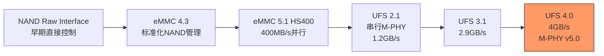

# 存储设备专用总线

[Intermediate] [Expert]

存储设备专用总线是连接嵌入式系统与持久化存储介质的核心通道。
 
从eMMC的并行NAND接口到UFS的串行M-PHY，从QPI的处理器间互联到OPI的片外内存扩展，存储总线决定了系统的启动速度、应用加载时间和数据吞吐能力。
 
理解存储总线的协议层次、时序约束、性能优化和可靠性设计，是构建高性能嵌入式存储方案的基础。
 
本类别覆盖四种核心总线：eMMC、UFS、QPI和OPI。
 

---

## <strong>本类别总线总览</strong>

| 总线 | 类型 | 最大速率 | 接口引脚 | 典型容量 | 应用场景 |
|------|------|----------|----------|----------|----------|
| eMMC | 并行NAND | HS400 400MB/s | 11（8数据+3控制） | 8GB-256GB | 手机、平板、车载信息娱乐 |
| UFS | 串行M-PHY | UFS 4.0 4GB/s | 6（2差分数据+2差分时钟+复位+供电） | 128GB-1TB | 旗舰手机、高端车载 |
| QPI | 处理器互联 | 9.6GT/s | 84（20lane×4+控制） | — | 服务器CPU互联 |
| OPI | 片外内存 | 与DDR4可比 | 与DDR4可比 | — | 嵌入式SoC片外DRAM |

---

## <strong>存储总线演进路线</strong>

### <strong>eMMC到UFS的代际对比</strong>

| 特性 | eMMC 5.1 | UFS 3.1 | UFS 4.0 |
|------|----------|---------|---------|
| 接口类型 | 并行8位 | 串行2lane | 串行2lane |
| 物理层 | HS400 | M-PHY v3.1 | M-PHY v5.0 |
| 协议层 | — | UniPro v1.8 | UniPro v2.0 |
| 顺序读 | 400MB/s | 2,100MB/s | 4,200MB/s |
| 顺序写 | 200MB/s | 1,200MB/s | 2,800MB/s |
| 随机读IOPS | 15K | 100K | 280K |
| 全双工 | 否（半双工） | 是 | 是 |
| 功耗 | 较高 | 中 | 低（M-PHY低功耗模式） |
| 成本 | 低 | 中 | 高 |

关键认知：eMMC到UFS的演进本质是"并行到串行"的范式转移——串行接口虽然 lane 数少，但可以通过提高频率和全双工操作获得更高带宽，同时降低引脚数和PCB布线难度。
 

---

## <strong>QPI与OPI：处理器级存储互联</strong>

### <strong>QPI（QuickPath Interconnect）</strong>

QPI是Intel处理器间的高速点对点互联总线，用于多路服务器中的CPU互联和内存一致性维护。
 
QPI的每个链路包含20个差分对（20lane），每个方向10lane，支持全双工传输。
 
在嵌入式领域，QPI主要出现在高端x86嵌入式平台（如Xeon D系列），用于多处理器配置。
 
QPI的设计目标是替代传统的FSB（Front Side Bus），通过点对点架构消除总线瓶颈，每个CPU拥有独立的内存控制器，通过QPI实现缓存一致性（MESIF协议）。

### <strong>OPI（On-Package Interconnect）</strong>

OPI是Intel用于SoC的片外内存接口，本质上是精简版的DDR接口，用于连接LPDDR4/5内存颗粒。
 
在嵌入式x86平台（如Atom、Core i低功耗系列）中，OPI是SoC与片外DRAM的唯一通道。
 
OPI的引脚数比标准DDR少，适合引脚受限的嵌入式SoC封装，但速率与标准DDR相当。

| 总线 | 应用领域 | 嵌入式相关性 | 现状 |
|------|----------|-------------|------|
| QPI | 服务器多CPU互联 | 低（仅高端x86） | 被UPI替代 |
| OPI | SoC片外DRAM | 中（x86嵌入式） | 被DDR5/LPDDR5接口替代 |
| eMMC | 移动/嵌入式存储 | 极高 | 主流 |
| UFS | 旗舰移动存储 | 高 | 快速增长 |

---

## <strong>eMMC的可靠性设计</strong>

eMMC不仅是一个存储接口，更是一个完整的存储管理系统。
 
与Raw NAND不同，eMMC控制器内置了：
 
- <strong>坏块管理</strong>：自动映射坏块到备用块
 
- <strong>磨损均衡</strong>：均匀分布写入操作，延长Flash寿命
 
- <strong>ECC纠错</strong>：BCH或LDPC纠错码，保障数据完整性
 
- <strong>断电保护</strong>：电容缓冲，确保突然断电时数据不丢失
 

| 可靠性机制 | 实现方式 | 用户可见性 |
|------------|----------|-----------|
| 坏块管理 | 控制器内部映射表 | 不可见 |
| 磨损均衡 | 动态/静态均衡算法 | 不可见 |
| ECC | BCH（传统）/ LDPC（高端） | 不可见（仅统计） |
| 断电保护 | 板载电容 + 原子写入 | 不可见 |
| 健康监控 | EXT_CSD寿命计数器 | 可见（CMD6读取） |

关键认知：eMMC的可靠性设计是"黑盒"——用户无需关心NAND的物理特性，控制器自动处理所有复杂性。这种抽象是eMMC在嵌入式领域成功的关键。
 

---

## <strong>小结</strong>

| 要点 | 内容 |
|------|------|
| 存储总线演进 | Raw NAND → eMMC → UFS |
| eMMC优势 | 成本低、生态成熟、引脚少、可靠性黑盒 |
| UFS优势 | 全双工、高速率、低功耗 |
| QPI定位 | 服务器CPU互联，嵌入式场景有限 |
| OPI定位 | x86 SoC片外DRAM接口 |
| 选型核心 | 容量需求 vs 性能需求 vs 成本预算 |

## <strong>练习</strong>

1. 为什么UFS的全双工特性在移动场景中比eMMC的半双工更有价值？从应用启动（读取代码）和拍照（同时写入）两个场景分析。
2. 在汽车电子中，为什么eMMC比UFS更常见？从温度范围、供应链稳定性和成本三个维度分析。
3. 比较QPI和PCIe在"处理器互联"场景中的差异。为什么Intel选择QPI而非PCIe作为CPU间互联总线？

| 题目 | 考查点 | 难度 |
|------|--------|------|
| 1 | UFS全双工优势分析 | Intermediate |
| 2 | 车载存储选型因素 | Intermediate |
| 3 | QPI vs PCIe架构差异 | Expert |

---

## <strong>学习路径</strong>

- [Intermediate] 从eMMC的HS400时序入手，理解命令/响应协议和EXT_CSD寄存器配置。
 
- [Expert] 深入研究UFS的UniPro协议栈、M-PHY物理层和SCSI命令集，理解全双工数据流。
 
- 扩展阅读：JEDEC eMMC Standard v5.1、JEDEC UFS Standard v4.0、MIPI M-PHY Specification v5.0、MIPI UniPro Specification v2.0、JEDEC LPDDR5 Standard。
 