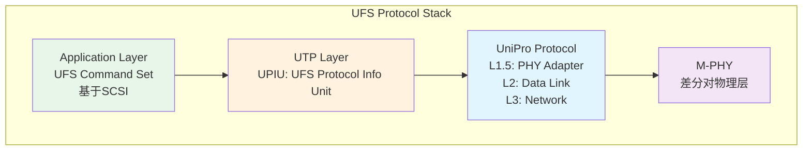

# eMMC与UFS历史演进及嵌入式存储选型

<span class="badge-i">[Intermediate]</span>

<span class="red">eMMC从MMC并行总线封装化而来，用"把SD卡焊在主板上"的思路解决了嵌入式系统对可靠存储的需求；UFS则以全双工M-PHY串行总线+SCSI命令集完成了从"MMC遗产"到"闪存原生"的跨越。</span> JEDEC标准是这一演进的立法者，从eMMC 4.5到5.1、UFS 1.0到4.0的每一步，都在用接口带宽和协议并行度的提升来匹配NAND闪存技术的迭代速度。

<br>嵌入式存储选型不是简单的"UFS比eMMC快"，而是在成本、功耗、面积、供应链成熟度之间寻找系统最优解。

---

## <strong>基础认知</strong>

<span class="green">eMMC</span>（embedded MMC）将NAND闪存、MMC控制器和FTL（Flash Translation Layer）封装在标准BGA中，对外暴露MMC并行总线（1/4/8-bit）。Host无需管理NAND的物理特性（坏块、磨损均衡、ECC），只需发送标准MMC读写命令。

<br><span class="green">UFS</span>（Universal Flash Storage）同样封装NAND+控制器，但改用M-PHY串行差分对和UniPro协议栈，命令集基于SCSI体系，支持多队列、全双工和深度命令流水线。

### <strong>eMMC规范演进</strong>

| 版本 | 年份 | 接口 | 速率 | 关键特性 |
|------|------|------|------|---------|
| eMMC 4.3 | 2009 | 8-bit | 52 MHz | HS200, 200 MB/s |
| eMMC 4.41 | 2011 | 8-bit | 52 MHz | 缓存、可靠写、分区管理 |
| eMMC 4.5 | 2011 | 8-bit DDR | 52 MHz | HS400, 400 MB/s |
| eMMC 5.0 | 2013 | 8-bit DDR | 52 MHz | 缓存大小扩展、Cache Barrier |
| eMMC 5.1 | 2015 | 8-bit DDR | 52 MHz | Command Queueing（CQ）, BKOPs |

<br>eMMC 5.1的Command Queueing（CMDQ）是向UFS多队列机制的学习：将传统单命令排队改为最多32条命令的队列，支持out-of-order完成，减少闪存通道空闲时间。

### <strong>UFS规范演进</strong>

| 版本 | 年份 | M-PHY | 速率 | 关键特性 |
|------|------|-------|------|---------|
| UFS 1.0 | 2011 | v1.0 | 1.5 Gbps/lane | 基础全双工、SCSI命令 |
| UFS 1.1 | 2012 | v1.0 | 3.0 Gbps/lane | boot分区、RPMB |
| UFS 2.0 | 2013 | v2.0 | 5.8 Gbps/lane | 2 lane、双通道 |
| UFS 2.1 | 2016 | v2.1 | 5.8 Gbps/lane | 安全写、深度睡眠 |
| UFS 3.0 | 2018 | v3.0 | 11.6 Gbps/lane | 2 lane, 2.32 GB/s |
| UFS 3.1 | 2020 | v3.0 | 11.6 Gbps/lane | Write Booster, Deep Sleep |
| UFS 4.0 | 2022 | v5.0 | 23.2 Gbps/lane | 2 lane, 4.64 GB/s |

<br><span class="blue">UFS 4.0每lane 23.2 Gbps，2 lane全双工下理论带宽4.64 GB/s，已接近PCIe 3.0 x2水平。</span> 其M-PHY v5.0采用PAM3（三电平）调制，每UI传输1.5 bit，是串行接口编码效率的重大突破。

---

## <strong>原理解析</strong>

### <strong>为什么eMMC 5.1的400 MB/s已是并行总线极限</strong>

<span class="blue">eMMC采用8-bit并行总线，52 MHz时钟下DDR模式为104 MT/s，理论带宽 = 8 × 104 MT/s × 1 Byte = 832 MB/s，但实际有效带宽约400 MB/s。</span>

<br>差距来自多重开销：
<br>1. **协议开销**：MMC命令/响应周期、CRC校验、忙等待信号
<br>2. **总线周转**：半双工模式下读操作后需切换方向，插入turnaround周期
<br>3. **信号完整性**：8根数据线+1根CMD线的skew容限限制了时钟提升空间
<br>4. **NAND通道瓶颈**：即使接口带宽充足，内部NAND通道（通常2-4通道）也难以饱和供给

<br>UFS改用串行差分对从根本上消除了并行skew问题：
<br>- M-PHY每lane仅需2根数据线（TX+/-或RX+/-）
<br>- 全双工模式消除总线周转延迟
<br>- 时钟嵌入数据流，无需单独时钟线
<br>- 速率提升仅需提高单lane速率，无需增加pin数

### <strong>UFS UniPro协议栈的分层设计</strong>



<br><span class="green">UPIU</span>（UFS Protocol Information Unit）是UFS事务的PDU格式，类似NVMe的SQE/CQE，但基于SCSI CDB结构。UPIU分为COMMAND、DATA OUT、DATA IN、RESPONSE、TASK MANAGEMENT等类型。

<br><span class="green">UniPro L2</span>提供流量控制、错误检测和重传机制，功能类似PCIe的Data Link Layer。L3负责地址路由，但在单点对点的UFS链路中作用有限。

### <strong>eMMC分区管理与UFS LUN架构差异</strong>

eMMC通过BOOT分区、RPMB（Replay Protected Memory Block）和General Purpose分区实现物理隔离：
<br>- **BOOT0/BOOT1**：只读启动镜像，由写保护寄存器控制
<br>- **RPMB**：防回滚安全存储，需通过消息认证码（MAC）访问
<br>- **GP1/GP2/GP3/GP4**：通用增强型分区，支持SLC模式仿真

<br>UFS将存储空间抽象为多个独立逻辑单元（LUN），每个LUN有独立的命令队列和属性：
<br>- **LU0**：Boot LUN A（启动用）
<br>- **LU1**：Boot LUN B（备份启动）
<br>- **LU2-LU7**：通用LUN，支持bLU（bootable）、wLU（write-protected）等属性

<br><span class="blue">UFS LUN的灵活性远超eMMC分区：LU数量可配置、每个LU独立支持写保护、逻辑空间可动态重分配。</span>

---

## <strong>实战教学</strong>

### <strong>读取eMMC EXT_CSD关键字段</strong>

```bash
# 使用mmc-utils读取eMMC扩展寄存器
mmc extcsd read /dev/mmcblk0

# 关键字段解析：
# [196] SUPPORTED_MODE：位0=HS200, 位1=HS400
# [185] HS_TIMING：0=Legacy, 1=HS, 2=HS200, 3=HS400
# [183] BUS_WIDTH：0=1-bit, 1=4-bit, 2=8-bit, 3=8-bit DDR
# [212] CMDQ_SUPPORT：bit0=Command Queueing支持
# [160..163] SEC_COUNT：总扇区数（×512 = 容量）
# [53] BKOPS_STATUS：后台操作状态，用于预测寿命
```

### <strong>嵌入式Linux配置UFS HCI驱动</strong>

```bash
# 检查UFS控制器是否被正确识别
lspci -vv | grep -i ufs
# 或查看设备树节点
cat /proc/device-tree/ufs@xxx/compatible

# 查看UFS当前Gear和速率
cat /sys/bus/platform/drivers/ufshcd/*/ufs_stats
# 示例输出：
# Gear: 4 (M-PHY速率11.6 Gbps/lane)
# Lanes: 2
# Rate: G4 (对应M-PHY v3.0/v4.0)

# 查看UFS Health Descriptor
# 需通过ufshcd debugfs接口
# cat /sys/kernel/debug/ufshcd0/dump_regs
```

### <strong>为什么某些eMMC在长时间运行后性能暴跌</strong>

<span class="blue">eMMC的FTL在空闲时执行后台垃圾回收（GC）和磨损均衡，若系统长期处于高负载、无空闲窗口，FTL被迫将GC与前台IO竞争资源，导致写放大激增。</span>

<br>典型症状：
<br>1. **写延迟抖动**：从毫秒级跳变到数百毫秒
<br>2. **IOPS骤降**：从数千降至数百
<br>3. **温度升高**：FTL持续进行NAND编程/擦除，功耗增加

<br>缓解策略：
<br>1. **eMMC 5.1 BKOPs**：主动发送BKOPS START命令，强制FTL执行维护
<br>2. **预留over-provisioning**：建议保留7%-10%物理容量不映射到逻辑空间
<br>3. **调度空闲窗口**：在系统低负载时触发discard/trim，减少FTL压力

---

## <strong>历史演进</strong>

<span class="red">eMMC与UFS的演进史，是JEDEC如何一步步将"可插拔存储协议"改造为"系统级存储方案"的商业与技术双轨历史。</span>

<br>2007年，JEDEC发布JESD84-A41（eMMC 4.3），将MMC协议封装为153-ball BGA。首批eMMC容量仅4-8 GB，用于早期智能手机。其设计哲学是"Host ignorant"——Host不需要知道NAND的任何细节。

<br>2011年，eMMC 4.5引入HS400（8-bit DDR，52 MHz），将带宽推至400 MB/s。同期JEDEC开始制定UFS 1.0，目标很明确：eMMC的并行总线已到天花板，必须转向串行化。

<br>2013年，UFS 2.0引入双lane M-PHY，带宽首次突破1 GB/s。三星Galaxy S6是首款量产UFS手机（UFS 2.0，约400 MB/s有效带宽），标志着UFS进入消费级市场。

<br>2016-2020年，UFS 2.1/3.0/3.1密集迭代。UFS 3.1的Write Booster（SLC缓存加速）借鉴了SSD的DRAM-less策略，用伪SLC模式吸收突发写负载，是UFS在嵌入式场景对抗NVMe的关键特性。

<br>2022年，UFS 4.0将M-PHY升级到v5.0（PAM3调制），带宽4.64 GB/s，同时引入VCC=2.5 V低功耗模式和更激进的Deep Sleep状态。UFS 4.0芯片（如三星KLUEG）已开始出现在旗舰手机中。

<br><span class="purple">2024年的嵌入式存储选型图景：入门级IoT（64 GB以下）仍用eMMC 5.1，因为其供应链成熟度和成本优势明显；中高端嵌入式（智能手机、车机、AR/VR）全面转向UFS 3.1/4.0；超高性能场景（边缘AI推理）则直接上NVMe PCIe SSD。JEDEC正在制定UFS 5.0，目标是将M-PHY速率翻倍至约46 Gbps/lane，继续巩固UFS在"高性能嵌入式存储"领域的定位。</span>

---

## 小结与练习

| 要点 | 说明 |
|------|------|
| 核心概念 | eMMC是MMC并行总线的BGA封装版；UFS以M-PHY串行+UniPro协议栈替代并行总线 |
| 关键技能 | 通过EXT_CSD解析eMMC能力；配置UFS HCI驱动；区分HS200/HS400/M-PHY Gear |
| 常见误区 | eMMC 5.1 CMDQ≠UFS多队列，前者是顺序提交乱序完成，后者是多队列并行提交 |
| 性能瓶颈 | eMMC 400 MB/s是并行skew+半双工开销的极限；UFS 4.0的瓶颈在NAND通道而非接口 |
| 选型趋势 | IoT/低端用eMMC；手机/车机用UFS 3.1/4.0；边缘AI用NVMe；UFS 5.0将继续提升带宽 |

**练习**

1. 对比eMMC 5.1 HS400（8-bit DDR，52 MHz）与UFS 3.1（M-PHY v4.1，2lane，11.6 Gbps/lane）的理论峰值带宽和协议开销比例。计算两者在NAND介质本身支持2 GB/s时，接口层分别造成的性能损失百分比。

2. 某嵌入式设备使用eMMC 5.1存储日志数据，运行6个月后出现写延迟从5 ms跳变到200 ms的现象。分析3种可能的根因（FTL层面），并给出对应的监控指标（EXT_CSD字段或/sys节点）和缓解方案。

3. 在以下场景中做存储选型决策，并说明理由：
   (a) 成本敏感的大规模IoT传感器节点（128 MB数据缓存）
   (b) 车规级智能座舱（需要1 TB存储，-40~85°C）
   (c) 边缘AI推理盒子（需加载20 GB模型，推理时随机读>3 GB/s）
