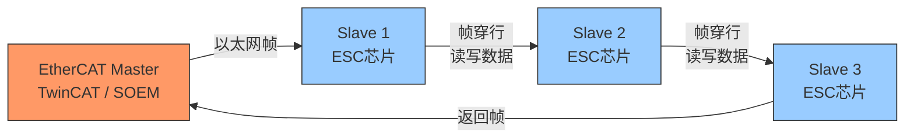
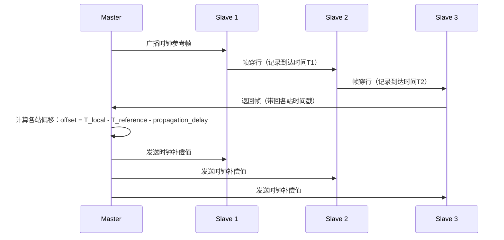
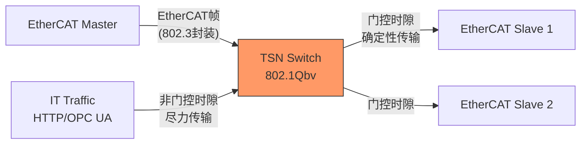

# EtherCAT历史演进与前瞻

<span class="badge-e">[Expert]</span>

<span class="red">EtherCAT</span>（Ethernet for Control Automation Technology）是工业以太网实时总线的标杆技术。
<br>
从Beckhoff的内部项目到ETG组织的全球化生态，EtherCAT用"报文穿行"架构重新定义了工业通信的实时性边界。
<br>

---

## <strong>从Beckhoff到ETG：EtherCAT的诞生与标准化</strong>

### <strong>技术起源与核心创新</strong>

<span class="red">EtherCAT</span>诞生于2003年，由德国Beckhoff Automation公司开发。
<br>
其核心创新是<span class="green">"飞读飞写"（Fly-Read-Fly-Write）</span>机制——EtherCAT帧在传输过程中经过每个从站时，从站直接在帧内读取输入数据并写入输出数据，无需接收完整帧再转发。
<br>
这一设计使得EtherCAT在标准100Mbps以太网物理层上实现了<span class="blue">亚微秒级同步精度</span>和<span class="blue">低于1微秒的通信延迟</span>。
<br>



<span class="blue">关键认知：EtherCAT的实时性不来自专用硬件，而来自协议设计的极简主义——让数据"顺路"完成交换，而非"停靠"后再出发。</span><br>

### <strong>ETG组织的全球化推动</strong>

<span class="green">EtherCAT Technology Group（ETG）</span>成立于2004年，是工业以太网领域最大的技术组织之一。
<br>
截至2025年，ETG拥有超过<span class="green">7000家会员公司</span>，覆盖控制器、驱动器、传感器、I/O模块等全品类设备。
<br>
ETG的开放策略（无需授权费、开放规范）是EtherCAT快速普及的关键。
<br>

| 时间节点 | 里程碑 | 意义 |
|----------|--------|------|
| 2003 | Beckhoff内部开发完成 | 技术原型验证 |
| 2004 | ETG成立 | 开放生态构建 |
| 2005 | 成为IEC 61158标准 | 国际标准认可 |
| 2007 | ETG会员超500家 | 产业规模初现 |
| 2010 | 成为IEC 61784-2标准 | 实时以太网标准族 |
| 2015 | ETG会员超3000家 | 全球主流化 |
| 2020 | 支持TSN集成研究 | 与标准以太网融合 |
| 2025 | ETG会员超7000家 | 工业以太网领导者 |

<span class="blue">关键认知：EtherCAT的成功证明了"开放标准+硬件芯片化"是工业总线普及的最佳路径——ETG不收取授权费，但ESC（EtherCAT Slave Controller）芯片的即插即用性降低了集成门槛。</span><br>

---

## <strong>报文穿行架构的深层原理</strong>

### <strong>为什么EtherCAT能做到亚微秒同步</strong>

传统工业以太网（如PROFINET RT）采用"存储转发"模式：
<br>
主站发送帧→从站A接收完整帧→从站A处理→从站A转发→从站B接收……
<br>
每跳都引入完整帧的接收和发送延迟。
<br>

<span class="red">EtherCAT的"穿行"架构</span>彻底改变了这一模式：
<br>
1. 帧从主站发出，以光速遍历所有从站
<br>
2. 每个从站的<span class="green">ESC芯片</span>在帧经过时，用硬件逻辑直接在帧的指定位置读写数据
<br>
3. 帧到达末端后，可选择返回主站或继续绕行
<br>

```c
// 示意：ESC芯片内部的数据交换逻辑（伪代码）
// EtherCAT帧在ESC中以硬件速度处理，无需MCU介入

// ESC芯片工作原理：
// 1. 帧到达ESC的PHY接口
// 2. ESC的帧解析引擎识别帧中的从站地址
// 3. 若匹配，在帧的Process Data区读取/写入数据（ns级）
// 4. 帧立即从ESC的另一个PHY端口转发出去（几乎无延迟）
// 5. 帧头部中的Working Counter自动递增

// 帧结构示意（简化）：
// [EtherCAT头] [命令:APRD/APWR] [地址] [数据...] [WKC] [FCS]
//                            ↑
//                     ESC在此处读写数据
```

<span class="blue">关键认知：EtherCAT的延迟公式是`T = 帧传播时间 + 从站处理时间（约50ns）`。100个从站的典型周期是1ms，而100个从站的理论最小周期可低至31.25微秒。</span><br>

### <strong>分布式时钟（DC）的同步机制</strong>

<span class="green">Distributed Clocks（DC）</span>是EtherCAT实现亚微秒同步的核心技术。
<br>
所有支持DC的从站内置本地时钟，主站通过测量帧在不同从站间的传播延迟，计算时钟偏移并进行补偿。
<br>



同步精度取决于测量精度和补偿算法的迭代收敛速度。
<br>
典型配置下，<span class="blue">100个从站的同步精度可达<100纳秒</span>，满足半导体制造、机器人协同等场景的严苛要求。
<br>

---

## <strong>与PROFINET/OPC UA的融合趋势</strong>

### <strong>工业4.0时代的协议融合</strong>

工业4.0要求<span class="red">"纵向集成"</strong>——现场设备数据需要无缝上传到MES/ERP/云平台。
<br>
EtherCAT传统上专注于现场层实时通信，而上层信息交换需要与IT协议融合。
<br>

<span class="green">EtherCAT与OPC UA的融合</span>是当前最重要的演进方向：
<br>
1. <span class="green">ETG.6100规范</span>定义了EtherCAT到OPC UA的映射
<br>
2. EtherCAT从站可通过<span class="green">OPC UA信息模型</span>暴露数据给上层系统
<br>
3. 主站作为"网关"，实时数据通过EtherCAT采集，非实时数据通过OPC UA上传
<br>

| 融合模式 | 架构 | 适用场景 |
|----------|------|----------|
| 并行运行 | EtherCAT实时 + OPC UA非实时 | 数据透明传输 |
| 协议封装 | OPC UA over EtherCAT | 统一网络层 |
| 网关转换 | EtherCAT主站内置OPC UA Server | 现场层到云端 |

<span class="blue">关键认知：EtherCAT与OPC UA不是竞争关系，而是互补——EtherCAT负责"毫秒以下的确定性"，OPC UA负责"秒级以上的语义互操作"。</span><br>

### <strong>与PROFINET的竞合关系</strong>

PROFINET和EtherCAT是工业以太网的两大主流阵营。
<br>
PROFINET背靠西门子生态，EtherCAT依托Beckhoff和开放组织。
<br>
两者在技术路线上有显著差异：
<br>

| 维度 | EtherCAT | PROFINET |
|------|----------|----------|
| 实时机制 | 报文穿行 + DC同步 | 等时同步（IRT） |
| 同步精度 | <100ns | <1us |
| 网络拓扑 | 线型/树型/环型 | 线型/星型/环型 |
| 标准以太网兼容 | 是（标准帧） | 是（标准帧+专用帧） |
| 芯片成本 | ESC芯片成熟 | ASIC成本较高 |
| 生态规模 | 7000+会员 | 西门子主导 |
| IT融合 | OPC UA映射 | 原生支持 |

<span class="blue">关键认知：EtherCAT在需要极高同步精度和大量从站的场景（如半导体、机器人）占优；PROFINET在西门子生态系统内和需要深度IT集成的场景占优。</span><br>

---

## <strong>TSN集成与下一代EtherCAT</strong>

### <strong>TSN（时间敏感网络）的工业适配</strong>

<span class="red">TSN</span>是IEEE 802.1标准族，为以太网提供确定性传输能力。
<br>
EtherCAT与TSN的集成不是"替代"，而是"增强"——EtherCAT帧可以作为TSN网络中的优先级流。
<br>

<span class="green">EtherCAT over TSN</span>的技术路线：
<br>
1. EtherCAT帧封装在标准以太网帧中（802.3帧格式）
<br>
2. TSN交换机通过<span class="green">802.1Qbv时间门控</span>为EtherCAT流分配固定时隙
<br>
3. 非实时流量被严格限制在剩余时隙中传输
<br>



<span class="blue">关键认知：TSN让EtherCAT能够穿越标准企业网络而无需专用硬件，这是"工业网络IT化"的关键一步。</span><br>

### <strong>EtherCAT G与千兆演进</strong>

<span class="green">EtherCAT G</span>是EtherCAT向千兆以太网扩展的规范，发布于2019年。
<br>
传统EtherCAT基于100BASE-TX，带宽为100Mbps；EtherCAT G将物理层升级到1000BASE-T。
<br>
这意味着：
<br>
- 相同周期下，可传输10倍的数据量
<br>
- 或相同数据量下，周期缩短到1/10
<br>
- 支持更高分辨率的伺服控制（如32轴同步）
<br>

| 规格 | EtherCAT | EtherCAT G |
|------|----------|------------|
| 物理层 | 100BASE-TX | 1000BASE-T |
| 理论带宽 | 100Mbps | 1Gbps |
| 典型周期 | 1ms | 100us |
| 单周期数据量 | ~1KB | ~10KB |
| 支持从站数 | ~65535 | ~65535 |
| 电缆要求 | CAT5 | CAT5e/CAT6 |

<span class="purple">扩展阅读：EtherCAT G的芯片生态正在成熟，Beckhoff的EtherCAT G耦合器和多家ESC供应商已推出支持产品。千兆EtherCAT将首先在高带宽场景（如视觉引导机器人、高精度运动控制）落地。</span><br>

---

## <strong>历史演进：从专用总线到开放生态</strong>

### <strong>三十年的实时通信演进</strong>

<span class="red">EtherCAT的演进映射了工业通信从专用到开放、从封闭到融合的宏观趋势。</span>
<br>

| 年代 | 技术 | 代表 | 特点 |
|------|------|------|------|
| 1980s | 现场总线 | PROFIBUS, Modbus, CAN | 专用物理层，低速率 |
| 1990s | 工业以太网雏形 | Ethernet/IP, Modbus/TCP | 标准以太网，非实时 |
| 2000s | 实时工业以太网 | EtherCAT, PROFINET, SERCOS III | 确定性传输，硬实时 |
| 2010s | 开放标准化 | EtherCAT成为IEC标准，ETG壮大 | 开放生态，芯片化 |
| 2020s | IT/OT融合 | OPC UA over EtherCAT, TSN集成 | 纵向集成，语义互操作 |
| 2025+ | 下一代实时通信 | EtherCAT G, 无线EtherCAT | 高带宽，灵活拓扑 |

<span class="blue">演进逻辑：工业通信从"专用总线解决专用问题"演进到"开放标准解决通用问题+专用增强解决特殊问题"——EtherCAT的成功在于它同时满足了实时性要求和开放性要求。</span><br>

### <strong>开源生态与软件主站</strong>

EtherCAT传统上依赖硬件主站（如Beckhoff的TwinCAT）。
<br>
近年来，<span class="green">SOEM（Simple Open EtherCAT Master）</span>和<span class="green">IGH EtherLab</span>等开源主站栈推动了EtherCAT在Linux嵌入式平台的普及。
<br>

```c
// SOEM 主站初始化示例（简化）
#include "ethercat.h"

int main(void) {
    // 初始化网卡接口
    // ec_init() 绑定到指定网卡（如 eth0）
    if (ec_init("eth0") <= 0) {
        printf("EtherCAT初始化失败\n");
        return -1;
    }
    
    // 扫描从站拓扑
    // ec_config_init() 自动发现所有从站并分配站号
    if (ec_config_init(FALSE) <= 0) {
        printf("未找到EtherCAT从站\n");
        return -1;
    }
    
    printf("发现 %d 个EtherCAT从站\n", ec_slavecount);
    
    // 配置分布式时钟（DC同步）
    // ec_configdc() 为所有支持DC的从站启用分布式时钟
    ec_configdc();
    
    // 进入周期运行
    // 典型周期：1ms 或 4ms
    while (1) {
        // 发送过程数据（PDO）
        ec_send_processdata();
        
        // 接收返回帧
        ec_receive_processdata(EC_TIMEOUTRET);
        
        // 处理从站数据...
        
        usleep(1000);  // 1ms周期
    }
    
    ec_close();
    return 0;
}
```

<span class="blue">关键认知：开源主站栈让EtherCAT从"昂贵专用控制器"变为"任何Linux板卡都可运行"——这是嵌入式领域普及的关键。</span><br>

---

## <strong>本章小结</strong>

| 要点 | 内容 |
|------|------|
| 核心创新 | 报文穿行架构，飞读飞写机制 |
| 同步能力 | 分布式时钟（DC），<100ns同步精度 |
| 标准化 | IEC 61158/61784-2，ETG开放组织 |
| IT融合 | OPC UA映射，TSN集成，纵向集成 |
| 千兆演进 | EtherCAT G，1000BASE-T物理层 |
| 开源生态 | SOEM/IGH主站栈，Linux嵌入式适配 |

## <strong>练习</strong>

1. EtherCAT的"报文穿行"架构与传统工业以太网的"存储转发"架构在延迟模型上有何本质差异？请用数学公式表达两者的延迟差异。
2. 为什么EtherCAT选择将ESC芯片作为从站的核心组件，而不是让从站MCU直接处理以太网帧？这种设计在成本和实时性之间如何权衡？
3. 在工业4.0背景下，EtherCAT如何与OPC UA和TSN协同工作？请画出一个包含现场层、控制层和信息层的融合架构图。

---

## <strong>学习路径</strong>

- <span class="badge-e">[Expert]</span> EtherCAT的精髓在于"用极简协议实现极致实时"——理解报文穿行原理后，深入DC同步机制和开源主站栈，是掌握工业实时通信的关键路径。
- <span class="purple">扩展阅读：ETG官方文档《EtherCAT Device Protocol Specification》、IEC 61158-4标准、SOEM开源项目源码。</span>