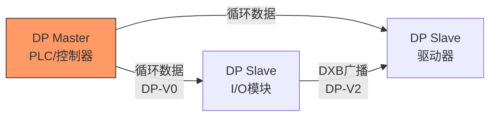
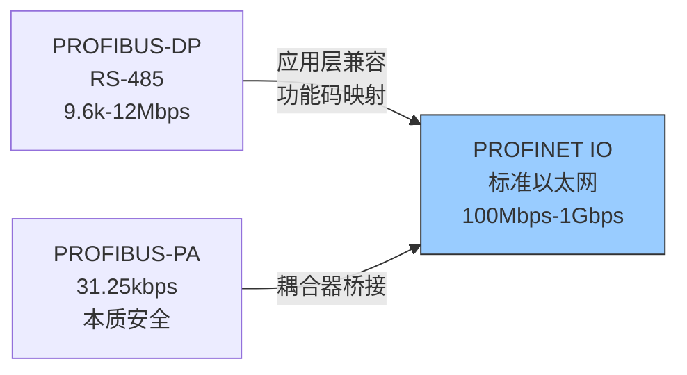
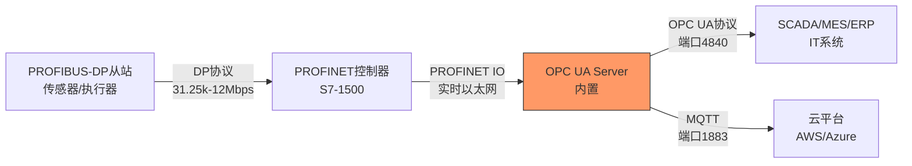

# PROFIBUS历史演进与迁移

<span class="badge-i">[Intermediate]</span> <span class="badge-e">[Expert]</span>

<span class="red">PROFIBUS</span>（Process Field Bus）是西门子主导的工业现场总线标准，曾在工厂自动化和过程自动化领域占据统治地位。
<br>
从1989年PROFIBUS-FMS的诞生到今天的PROFINET迁移浪潮，PROFIBUS的演进映射了整个工业通信从现场总线到工业以太网的转型历程。
<br>

---

## <strong>PROFIBUS-DP/PA/PA：三代变体与各自使命</strong>

### <strong>PROFIBUS-FMS：过于通用的起点</strong>

<span class="red">PROFIBUS-FMS</span>（Fieldbus Message Specification）是PROFIBUS的第一个版本，1989年由德国标准DIN 19245发布。
<br>
FMS提供了面向对象的消息服务，支持变量访问、事件通知和域上传下载。
<br>
然而，FMS过于复杂，实时性差，很快被更精简的变体取代。
<br>

<span class="blue">关键认知：FMS的失败证明了工业通信的"KISS原则"——复杂的通用服务不如简单的高速数据交换。
</span><br>

### <strong>PROFIBUS-DP：工厂自动化的主力</strong>

<span class="green">PROFIBUS-DP</span>（Decentralized Peripherals）1994年发布，是PROFIBUS最成功的变体。
<br>
DP专为高速周期性数据交换设计，采用精简的<span class="green">DP-V0/V1/V2</span>三层服务模型：
<br>

| 版本 | 发布年份 | 核心功能 | 典型周期 |
|------|----------|----------|----------|
| DP-V0 | 1994 | 循环数据交换，诊断 | 1-10ms |
| DP-V1 | 1997 | 非循环参数访问（MS1/MS2） | 循环+非循环 |
| DP-V2 | 2002 | 从站间直接通信（DXB），等时同步 | <1ms |

DP-V0的帧结构极简——仅包含设备地址、功能码和数据，没有校验和（依赖RS-485的物理层可靠性）。
<br>
DP-V2的<span class="green">DXB（Data eXchange Broadcast）</span>允许从站间直接交换数据，无需主站中转。
<br>



### <strong>PROFIBUS-PA：过程自动化的本质安全</strong>

<span class="green">PROFIBUS-PA</span>（Process Automation）1995年发布，专为过程工业（化工、制药、油气）设计。
<br>
PA的核心创新是<span class="green">Manchester编码 + 31.25kbps + 总线供电（IEC 61158-2）</span>。
<br>
<br>
31.25kbps的低速率换来的是本质安全——在爆炸危险区域，总线供电和信号传输共用一对线，且功率受限不会引燃。
<br>

| 特性 | PROFIBUS-DP | PROFIBUS-PA |
|------|-------------|-------------|
| 物理层 | RS-485，9.6kbps-12Mbps | IEC 61158-2，31.25kbps |
| 供电 | 外部24V | 总线供电（本质安全） |
| 距离 | 100-1200m | 1900m |
| 防爆 | 需隔爆措施 | 本质安全（Ex ia） |
| 领域 | 工厂自动化 | 过程自动化 |
| 互操作 | 通过DP/PA耦合器 | 通过DP/PA耦合器 |

<span class="blue">关键认知：PROFIBUS-PA的31.25kbps不是技术限制，而是安全设计——低速率意味着低功耗，低功耗意味着本质安全。
</span><br>

---

## <strong>PROFIBUS到PROFINET的迁移路径</strong>

### <strong>为什么必须迁移</strong>

PROFIBUS基于RS-485物理层，带宽最高12Mbps，从站数最多126个。
<br>
在现代工业场景中，这些约束日益成为瓶颈：
<br>
- 视频诊断、机器视觉需要>100Mbps带宽
<br>
- 大型工厂需要数千个节点的拓扑
<br>
- 远程诊断需要跨越广域网
<br>

<span class="red">PROFINET</span>是西门子推出的基于标准以太网的工业协议，与PROFIBUS在应用层完全兼容。
<br>
这意味着：PROFIBUS的GSD文件（设备描述）可以直接映射为PROFINET的GSDML文件，应用层功能码保持一致。
<br>



### <strong>三种迁移策略</strong>

| 策略 | 架构 | 适用场景 | 成本 |
|------|------|----------|------|
| 直接替换 | PROFINET主站 + PROFINET从站 | 新产线，无遗留设备 | 高 |
| 网关桥接 | PROFINET主站 + PROFIBUS网关 + DP/PA从站 | 混合系统，渐进迁移 | 中 |
| 代理模式 | PROFINET主站 + PROFIBUS代理从站 | 保留DP从站集群 | 低 |

<span class="green">网关桥接</span>是最务实的策略：
<br>
- 新控制器和上层系统使用PROFINET
<br>
- 现有PROFIBUS从站通过网关继续工作
<br>
- 故障设备更换时，优先选择PROFINET版本
<br>

```c
// PROFINET IO 设备配置概念（基于西门子TIA Portal风格伪代码）
// 注意：真实配置通过工程工具完成，非纯代码

// PROFINET IO 设备模型：
// - IO Device（从站）包含多个 Module（插槽）
// - 每个 Module 包含多个 Subslot（子插槽）
// - 每个 Subslot 包含 IO Data（输入/输出数据记录）

typedef struct {
    uint16_t slot;           // 插槽号（1-based）
    uint16_t subslot;        // 子插槽号
    uint32_t api;            // Application Process Identifier
    uint16_t data_length;    // 数据长度（字节）
    uint8_t *input_data;     // 指向输入数据缓冲区
    uint8_t *output_data;    // 指向输出数据缓冲区
} ProfinetIOSubslot;

// 典型配置：ET200SP分布式I/O
// Slot 1: 接口模块（IM）
// Slot 2: 数字量输入模块（DI 8x24VDC）
// Slot 3: 数字量输出模块（DQ 8x24VDC/0.5A）
// Slot 4: 模拟量输入模块（AI 4xU/I）
// 每个模块自动映射到过程映像区（Process Image）
```

<span class="blue">关键认知：PROFINET的"应用层兼容"是迁移的最大红利——工程师无需重新学习功能码和数据模型，只需更换物理层和配置工具。
</span><br>

---

## <strong>PROFIBUS在工业4.0中的角色</strong>

### <strong>遗留系统的持续价值</strong>

<span class="red">全球仍有超过5000万个PROFIBUS节点在运行。</span>
<br>
这些设备不可能在一夜之间被替换，因此PROFIBUS在工业4.0时代依然具有重要价值。
<br>

PROFIBUS的工业4.0角色：<br>
| 角色 | 描述 | 实现方式 |
|------|------|----------|
| 边缘采集 | 从遗留设备采集数据 | DP/PA耦合器 + PROFINET |
| 协议桥接 | 连接OT与IT | OPC UA网关 |
| 状态监测 | 预测性维护 | 振动、温度数据通过PROFIBUS上传 |
| 数字孪生 | 虚实映射 | 将PROFIBUS设备纳入数字孪生模型 |

### <strong>与OPC UA和MQTT的融合</strong>

<span class="green">OPC UA</span>是PROFIBUS向工业4.0演进的关键桥梁。
<br>
西门子推出了<span class="green">PROFIBUS DP到OPC UA的信息模型映射</span>，让遗留设备能够被上层系统语义化访问。
<br>



<span class="blue">关键认知：PROFIBUS的价值不是"被替换"，而是"被桥接"——通过PROFINET和OPC UA网关，PROFIBUS设备可以继续服务十年以上。
</span><br>

---

## <strong>历史演进：从DIN标准到全球生态</strong>

### <strong>PROFIBUS的三十年演进表</strong>

| 年代 | 事件 | 技术影响 |
|------|------|----------|
| 1987 | 德国DIN启动现场总线标准化 | 政府主导，产业联合 |
| 1989 | PROFIBUS-FMS发布（DIN 19245） | 面向对象消息服务 |
| 1994 | PROFIBUS-DP发布 | 高速循环数据，工厂自动化主力 |
| 1995 | PROFIBUS-PA发布 | 过程自动化，本质安全 |
| 1996 | PROFIBUS成为EN 50170欧洲标准 | 国际化第一步 |
| 1999 | PROFIBUS成为IEC 61158 Type 3 | 国际标准认可 |
| 2001 | PROFIdrive行规发布 | 驱动器标准化 |
| 2003 | PROFINET发布（基于以太网） | 向下一代迁移 |
| 2006 | PROFINET RT/IRT成熟 | 硬实时能力 |
| 2010 | PROFIBUS与PROFINET并行发展 | 保护投资，渐进迁移 |
| 2015 | PROFINET over TSN研究启动 | 与标准以太网融合 |
| 2020+ | PROFIBUS作为遗留协议持续运维 | 桥接而非替换 |

<span class="blue">演进逻辑：PROFIBUS的历史证明了一个工业标准的生命周期——技术先进性不是唯一决定因素，生态系统规模和保护现有投资的承诺同样重要。
</span><br>

---

## <strong>本章小结</strong>

| 要点 | 内容 |
|------|------|
| 三代变体 | FMS（通用消息）→ DP（工厂自动化）→ PA（过程自动化） |
| 物理层 | DP：RS-485（9.6k-12Mbps）；PA：IEC 61158-2（31.25kbps，本质安全） |
| 迁移路径 | PROFIBUS → PROFINET，应用层兼容，物理层升级 |
| 迁移策略 | 直接替换、网关桥接、代理模式 |
| 工业4.0角色 | 遗留设备桥接，OPC UA语义映射，数字孪生纳入 |
| 全球存量 | 超过5000万个PROFIBUS节点持续运行 |

## <strong>练习</strong>

1. PROFIBUS-DP的DP-V2相比DP-V0新增了哪些关键能力？DXB（Data eXchange Broadcast）在什么样的拓扑场景下最有价值？
2. 为什么PROFIBUS-PA选择31.25kbps作为传输速率？这一速率在本质安全设计和传输距离之间如何权衡？
3. 假设你负责一个已有200个PROFIBUS-DP从站的化工厂数字化改造项目，设计一个兼顾成本和风险的迁移方案，说明每个阶段的目标和技术选型。

---

## <strong>学习路径</strong>

- <span class="badge-i">[Intermediate]</span> 从PROFIBUS-DP的GSD文件和设备配置入手，理解DP-V0/V1/V2的服务差异。
- <span class="badge-e">[Expert]</span> 深入研究PROFINET IO的IRT等时同步机制，掌握PROFIBUS到PROFINET的网关配置和诊断。
- <span class="purple">扩展阅读：PI（PROFIBUS & PROFINET International）官方规范、IEC 61158/61784标准、西门子TIA Portal工程手册。
</span><br>