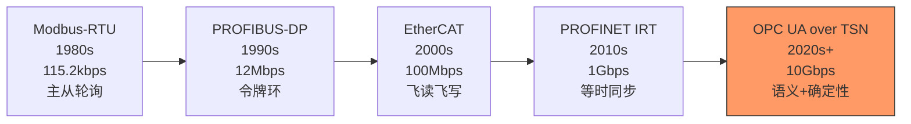

# 工业现场总线

[Intermediate] [Expert]

工业现场总线是工厂自动化和过程控制领域的专用通信协议家族。
 
从Modbus的寄存器映射到PROFIBUS的令牌环，从EtherCAT的"飞读飞写"到OPC UA的语义互操作，这些协议定义了工业设备之间的"数据高速公路"。
 
理解工业总线的实时性机制、拓扑约束和互操作标准，是设计可靠工业控制系统的核心能力。
 
本类别覆盖四种核心总线：Modbus、PROFIBUS、EtherCAT和PROFINET。
 

---

## <strong>本类别总线总览</strong>

| 总线 | 最大速率 | 拓扑 | 确定性 | 典型周期 | 典型应用 |
|------|----------|------|--------|----------|----------|
| Modbus-RTU | 115.2kbps | 主从总线 | 低 | 100ms+ | PLC与HMI、传感器 |
| Modbus-TCP | 100Mbps | 星型 | 低 | 50ms+ | 以太网扩展 |
| PROFIBUS-DP | 12Mbps | 主从令牌 | 高 | 1-10ms | 离散制造、装配线 |
| PROFIBUS-PA | 31.25kbps | 主从总线 | 中 | 100ms+ | 化工、油气、制药 |
| EtherCAT | 100Mbps | 菊花链 | 极高 | <100μs | 运动控制、CNC |
| PROFINET | 1Gbps | 星型 | 高（IRT） | <1ms | 新一代工厂网络 |

---

## <strong>工业通信协议选型</strong>

### <strong>实时性需求决定总线选择</strong>

工业场景对实时性的要求差异巨大，决定了总线选型：
 

| 应用场景 | 实时性要求 | 推荐总线 | 理由 |
|----------|------------|----------|------|
| 温度监控 | 秒级 | Modbus-RTU | 简单、低成本 |
| 装配线控制 | 10ms级 | PROFIBUS-DP | 成熟生态、确定性 |
| 机器人运动控制 | <1ms | EtherCAT | 飞读飞写、分布式时钟 |
| 机器视觉同步 | 微秒级 | EtherCAT/PROFINET IRT | 等时同步 |
| 跨厂数据采集 | 秒级 | Modbus-TCP/OPC UA | 标准以太网、IT融合 |

关键认知：工业总线的选型核心不是"带宽"，而是"确定性"——运动控制需要微秒级确定性，而温度监控可以容忍秒级延迟。选错总线的代价是产线停摆或产品质量问题。
 

### <strong>Modbus到EtherCAT的代际跃迁</strong>

---

## <strong>为什么工业4.0需要统一语义层</strong>

传统工业总线的痛点不是带宽，而是语义孤岛——Modbus的寄存器地址、PROFIBUS的GSD文件、EtherCAT的ESI文件互不兼容，导致系统集成成本高昂。
 
OPC UA通过统一的信息模型（Information Model）解决了这个问题：
 
- 将Modbus的寄存器映射为OPC UA变量节点
 
- 将PROFIBUS的GSD功能码映射为OPC UA方法节点
 
- 将EtherCAT的PDO映射为OPC UA对象节点
 

| 总线 | 原生语义 | OPC UA映射方式 |
|------|----------|----------------|
| Modbus | 寄存器地址 | 变量节点 + 地址空间 |
| PROFIBUS | GSD功能码 | 方法节点 + 设备类型 |
| EtherCAT | ESI/PDO | 对象节点 + 过程数据 |
| 传感器 | 原始ADC值 | 变量节点 + 工程单位转换 |

关键认知：OPC UA不是替代工业总线，而是"统一语义层"——它运行在现有总线之上，为IT系统（MES/ERP/云平台）提供标准化的数据访问接口。
 

---

## <strong>EtherCAT的飞读飞写机制</strong>

EtherCAT的核心创新是"on-the-fly processing"（飞读飞写）。
 
传统以太网中，帧到达每个节点后需要被完整接收、处理、再转发；而EtherCAT中，帧在传输过程中就被每个ESC（EtherCAT Slave Controller）芯片读取和修改，延迟仅为纳秒级的硬件处理时间。
 
这意味着：一个包含100个节点的EtherCAT网络，帧从主站发出到返回主站的总延迟仅约10-20μs，而传统以太网需要数毫秒。
 

| 机制 | 传统以太网 | EtherCAT |
|------|-----------|----------|
| 帧处理 | 存储-转发 | 飞读飞写 |
| 每节点延迟 | 数微秒~毫秒 | 数十纳秒 |
| 100节点总延迟 | 数毫秒 | 10-20μs |
| 时钟同步 | NTP/SNTP（毫秒级） | DC分布式时钟（亚微秒级） |
| 拓扑 | 星型/树型 | 菊花链/分支链 |

---

## <strong>小结</strong>

| 要点 | 内容 |
|------|------|
| 核心总线 | Modbus、PROFIBUS、EtherCAT、PROFINET |
| 选型核心 | 实时性需求 > 带宽需求 > 生态兼容性 |
| Modbus定位 | 简单、低成本、非实时 |
| PROFIBUS定位 | 中等实时、成熟生态、渐进迁移 |
| EtherCAT定位 | 高端实时、运动控制、确定性 |
| PROFINET定位 | 工业以太网、IRT等时、向下兼容 |
| OPC UA角色 | 统一语义层，桥接OT与IT |

## <strong>练习</strong>

1. 在一个智能工厂中，需要连接温度传感器（Modbus）、装配线PLC（PROFIBUS）、机器人控制器（EtherCAT）和MES系统（OPC UA）。设计一个多协议网关架构，说明每个协议之间的数据转换方式。
2. EtherCAT的"飞读飞写"机制相比传统主从轮询，为什么能实现<100μs的周期？从帧结构和处理时序角度分析。
3. 为什么OPC UA over TSN被认为是工业通信的终极统一方案？从语义层、传输层和确定性三个维度论证。

| 题目 | 考查点 | 难度 |
|------|--------|------|
| 1 | 多协议网关架构设计 | Expert |
| 2 | EtherCAT飞读飞写原理 | Intermediate |
| 3 | OPC UA over TSN统一架构 | Expert |

---

## <strong>学习路径</strong>

- [Intermediate] 从Modbus-RTU的寄存器映射和帧格式入手，理解主从通信和异常响应。
 
- [Expert] 深入研究EtherCAT的分布式时钟（DC）、ESC芯片架构和OPC UA信息模型映射。
 
- 扩展阅读：Modbus Protocol Specification v1.1b3、PROFIBUS-DP Specification（IEC 61158 Type 3）、EtherCAT Technology Group规范、OPC UA Specification Part 1-14。
 
