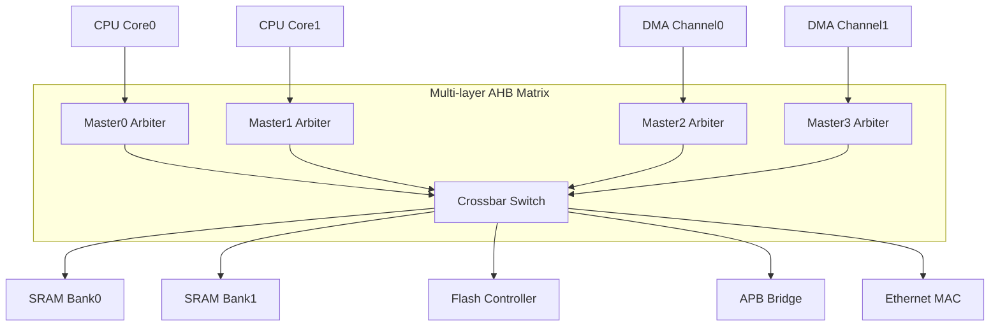
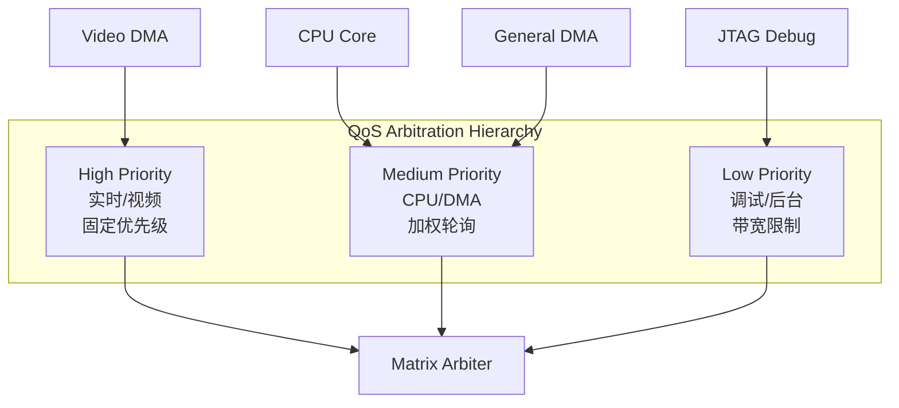
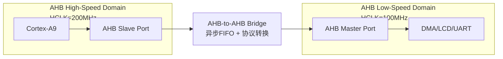

# AHB高级仲裁与QoS

<span class="badge-b">[Beginner]</span> <span class="badge-i">[Intermediate]</span> <span class="badge-e">[Expert]</span>

---

<span class="red">为什么AHB需要多级矩阵与QoS机制？</span> 随着SoC集成度提升，单一共享总线已无法满足多核CPU、多通道DMA、显示控制器等并发的带宽需求。当多个Master同时请求总线时，固定优先级会导致低优先级Master饿死；简单的轮询又会牺牲实时性。设计者引入多级AHB矩阵（Multi-layer AHB Matrix）与服务质量（Quality of Service）优先级机制，在保持AHB低门数优势的同时，实现更灵活的带宽分配与延迟控制——这是AHB从"简单共享总线"走向"可扩展互连架构"的关键一步。

---

## <strong>多级AHB矩阵架构</strong>

### <strong>单层总线的瓶颈</strong>

传统AHB采用单一共享总线，所有Master通过同一组地址/数据线访问所有Slave。<br>
当系统规模扩大时，这种架构面临三个根本性问题：

| 瓶颈类型 | 表现 | 根因 |
|---------|------|------|
| 带宽瓶颈 | 总线利用率饱和 | 单通道无法并行传输 |
| 延迟瓶颈 | 高优先级事务被阻塞 | 低优先级突发传输占用总线 |
| 仲裁瓶颈 | 仲裁器复杂度指数增长 | 所有Master竞争同一资源 |

<span class="blue">关键结论：单层AHB在4个以上Master时，有效带宽急剧下降——
<br>
因为任何时刻仅有一个Master能传输，其余Master处于等待状态。</span>

---

### <strong>Multi-layer AHB Matrix</strong>

<span class="red">多级AHB矩阵</span>是ARM推荐的AHB扩展方案，其核心思想是：
<br>
将总线分割为多个独立通道，每个Slave拥有独立的数据通路，
<br>
允许多个无冲突的Master-Slave对同时传输。



矩阵中的每个交叉点（Crosspoint）包含仲裁逻辑：<br>
当多个Master请求同一Slave时，交叉点仲裁器决定授权顺序。<br>
不同Slave之间的传输完全并行，互不影响。

| 特性 | 单层AHB | Multi-layer Matrix |
|------|---------|-------------------|
| 并行传输 | 不支持 | 支持（访问不同Slave时） |
| 仲裁位置 | 中央仲裁器 | 分布式交叉点仲裁 |
| 最大带宽 | 单通道带宽 | N通道带宽（N=Slave数） |
| 面积开销 | 最小 | 随Master×Slave增长 |
| 布线复杂度 | 低 | 高（需NxM交叉连接） |

<span class="blue">易错点：Multi-layer不是"全互联"——
<br>
同一Slave在同一时刻仍只能被一个Master访问，
<br>
真正的并行发生在"不同Master访问不同Slave"的场景。</span>

---

### <strong>主从切换与总线移交</strong>

在多级矩阵中，总线移交（Bus Handover）需要精确时序配合：<br>
当前Master完成突发传输后，仲裁器在下一个地址周期将总线授予新Master。

```verilog
// AHB总线移交时序控制模块
module ahb_handover (
    input  wire        HCLK,
    input  wire        HRESETn,
    input  wire [3:0]  hbusreq,      // 4个Master的请求
    input  wire [3:0]  hgrant,       // 当前授权状态
    input  wire [1:0]  htrans,       // 当前传输类型
    input  wire        hready,       // Slave就绪
    output reg  [3:0]  next_grant    // 下一周期授权
);

    // 仅在IDLE或LAST拍时切换总线
    wire can_switch = (htrans == 2'b00) ||           // IDLE
                      (hready && htrans == 2'b10);   // NONSEQ完成

    always @(posedge HCLK or negedge HRESETn) begin
        if (!HRESETn)
            next_grant <= 4'b0001;  // 默认Master0
        else if (can_switch)
            next_grant <= arbiter_priority(hbusreq);  // 仲裁决策
    end

    // 固定优先级仲裁：M0 > M1 > M2 > M3
    function [3:0] arbiter_priority;
        input [3:0] req;
        begin
            if (req[0]) arbiter_priority = 4'b0001;
            else if (req[1]) arbiter_priority = 4'b0010;
            else if (req[2]) arbiter_priority = 4'b0100;
            else if (req[3]) arbiter_priority = 4'b1000;
            else arbiter_priority = 4'b0000;
        end
    endfunction
endmodule
```

<span class="green">HBUSREQ</span>与<span class="green">HGRANT</span>的协作遵循"请求-授权-锁定"三阶段模型：<br>
Master检测到需要总线时拉高HBUSREQ，仲裁器在合适的边界授予HGRANT，<br>
Master在获得HGRANT后必须完成当前突发才能释放总线（锁定机制）。

---

## <strong>QoS优先级机制</strong>

### <strong>为什么需要QoS</strong>

<span class="red">服务质量（Quality of Service）</span>是SoC总线从"功能正确"走向"体验可预测"的进阶需求。<br>
在多媒体SoC中，视频流解码器需要保证每帧在16ms内完成，<br>
而CPU的缓存填充可以容忍数十微秒的延迟——<br>
没有QoS机制，CPU的突发访问可能挤占视频DMA的带宽，导致画面撕裂。

QoS在AHB中的实现维度：

| QoS维度 | 控制对象 | AHB实现方式 |
|---------|---------|------------|
| 延迟保证 | 最大响应时间 | 优先级抢占 + 超时中断 |
| 带宽保证 | 最小吞吐量 | 带宽配额计数器 |
| 公平性 |  starvation避免 | 轮询/加权轮询 |
| 紧急度 | 实时事件响应 | 最高优先级抢占 |

---

### <strong>优先级仲裁策略</strong>

AHB QoS通常采用三级优先级模型：



| 策略 | 算法 | 优点 | 缺点 | 适用场景 |
|------|------|------|------|---------|
| 固定优先级 | 优先级编号决定顺序 | 实现简单、延迟确定 | 低优先级可能饿死 | 实时系统 |
| 轮询 | 按序循环授权 | 绝对公平 | 无延迟保证 | 均衡负载 |
| 加权轮询 | 高优先级获得N次授权 | 兼顾公平与优先级 | 权重配置复杂 | 通用SoC |
| 带宽配额 | 每Master分配周期预算 | 严格带宽保证 | 需要计数器资源 | 多媒体 |

---

### <strong>嵌入式中的Master切换实例</strong>

在典型的ARM9/ARM11 SoC中，AHB矩阵连接以下Master：

```c
// AHB QoS优先级配置寄存器（典型实现）
#define AHB_QOS_BASE    0x1000_0000

// 优先级寄存器：4位/通道，0=最高，15=最低
#define QOS_PRIO_CPU    (*(volatile uint32_t *)(AHB_QOS_BASE + 0x00))
#define QOS_PRIO_DMA0   (*(volatile uint32_t *)(AHB_QOS_BASE + 0x04))
#define QOS_PRIO_DMA1   (*(volatile uint32_t *)(AHB_QOS_BASE + 0x08))
#define QOS_PRIO_LCD    (*(volatile uint32_t *)(AHB_QOS_BASE + 0x0C))

// 带宽配额寄存器：每1024周期允许的传输次数
#define QOS_QUOTA_CPU   (*(volatile uint32_t *)(AHB_QOS_BASE + 0x10))
#define QOS_QUOTA_DMA0  (*(volatile uint32_t *)(AHB_QOS_BASE + 0x14))

void init_ahb_qos(void) {
    // CPU：中等优先级，保证最小带宽
    QOS_PRIO_CPU  = 0x04;   // 优先级4
    QOS_QUOTA_CPU = 256;    // 每1024周期至少256次传输
    
    // LCD控制器：高优先级，实时显示
    QOS_PRIO_LCD  = 0x01;   // 优先级1（仅次于紧急）
    
    // DMA：低优先级，后台搬运
    QOS_PRIO_DMA0 = 0x08;   // 优先级8
    QOS_QUOTA_DMA0 = 128;   // 最小带宽配额
}
```

<span class="blue">易错点：QoS优先级配置错误会导致系统性能断崖式下降——
<br>
若将后台DMA设为最高优先级，CPU取指令会被持续打断，
<br>
整个操作系统将因CPU饥饿而崩溃。</span>

---

### <strong>AHB总线桥接器设计</strong>

<span class="red">AHB-to-AHB桥接器</strong>用于连接不同频率域或不同协议版本的AHB总线段。<br>
典型场景：CPU子系统跑在200MHz，外设子系统跑在100MHz。



桥接器核心组件：

| 组件 | 功能 | 实现要点 |
|------|------|---------|
| 异步FIFO | 跨时钟域数据缓冲 | 深度需覆盖最坏情况延迟 |
| 协议转换 | AHB5→AHB2或AHB-Lite | 信号裁剪与扩展 |
| 地址映射 | 重映射到目标地址空间 | 基地址 + 偏移量 |
| 仲裁代理 | 代表远端Master发起请求 | 透明传递优先级 |

```verilog
// AHB桥接器核心：跨时钟域FIFO
module ahb_bridge_async (
    input  wire        clk_src,      // 源时钟域
    input  wire        clk_dst,       // 目标时钟域
    input  wire        rst_n,
    // 源AHB接口
    input  wire [31:0] haddr_src,
    input  wire        hwrite_src,
    input  wire [2:0]  hburst_src,
    input  wire [2:0]  hsize_src,
    input  wire [1:0]  htrans_src,
    input  wire [31:0] hwdata_src,
    output wire [31:0] hrdata_src,
    output wire        hready_src,
    output wire [1:0]  hresp_src,
    // 目标AHB接口
    output wire [31:0] haddr_dst,
    output wire        hwrite_dst,
    output wire [2:0]  hburst_dst,
    output wire [2:0]  hsize_dst,
    output wire [1:0]  htrans_dst,
    output wire [31:0] hwdata_dst,
    input  wire [31:0] hrdata_dst,
    input  wire        hready_dst,
    input  wire [1:0]  hresp_dst
);
    // 使用异步FIFO进行跨时钟域握手
    // 写指针在源时钟域，读指针在目标时钟域
    // 格雷码编码避免亚稳态传播
    
    wire [35:0] fifo_wdata = {htrans_src, hburst_src, hsize_src, hwrite_src, haddr_src};
    wire [35:0] fifo_rdata;
    
    async_fifo #( .DEPTH(8), .WIDTH(36) ) u_cmd_fifo (
        .wclk(clk_src),  .wrst_n(rst_n),
        .rclk(clk_dst),  .rrst_n(rst_n),
        .wdata(fifo_wdata),
        .wr_en(htrans_src != 2'b00),
        .rd_en(hready_dst),
        .rdata(fifo_rdata),
        .full(), .empty()
    );
    
    assign {htrans_dst, hburst_dst, hsize_dst, hwrite_dst, haddr_dst} = fifo_rdata;
endmodule
```

---

## <strong>历史演进与趋势</strong>

AHB仲裁机制经历了从简单到复杂、从集中到分布式的演进。1999年AMBA 2.0定义了AHB的基础集中式仲裁，采用固定优先级方案，满足早期单核ARM9 SoC的需求。2003年AMBA 3.0引入AHB-Lite时，仲裁器被大幅简化——单Master场景下甚至无需仲裁。随着多核时代的来临，ARM在2004年提出Multi-layer AHB概念，将仲裁从中央节点分布到每个Slave端口，实现矩阵式并行访问。2010年AMBA 4.0时代，QoS信号正式成为AHB5的一部分，QoS值（4位）与主设备绑定，仲裁器可根据QoS等级动态调整优先级。2015年AMBA 5进一步增强了原子操作支持和TrustZone扩展，仲裁器需要同时考虑安全域与QoS等级。现代SoC设计趋势是将AHB矩阵作为AXI总线的"下游扩展"——高性能模块通过AXI互连，中速外设通过AHB矩阵挂载，这种分层架构兼顾了性能与面积效率。未来随着芯粒（Chiplet）架构普及，AHB桥接器将承担更多跨 die 的异步时钟域转换任务，QoS机制也需要适应更大延迟波动的环境。

---

## <strong>本章小结</strong>

| 要点 | 内容 |
|------|------|
| 多级矩阵 | Multi-layer AHB通过交叉开关实现多Master-多Slave并行访问 |
| 仲裁策略 | 固定优先级、轮询、加权轮询、带宽配额四种主流方案 |
| QoS机制 | 通过优先级编码与带宽计数器保障实时性与公平性 |
| 桥接器设计 | 异步FIFO + 协议转换实现跨时钟域/跨版本互联 |

## <strong>练习</strong>

| 编号 | 题目 | 难度 |
|------|------|------|
| 1 | 在8Master×8Slave的AHB矩阵中，计算完全并行传输的最大理论带宽提升倍数（相对单层总线） | <span class="badge-i">[I]</span> |
| 2 | 设计一个加权轮询仲裁器：CPU权重为4，DMA权重为2，Debug权重为1，写出Verilog核心逻辑 | <span class="badge-e">[E]</span> |
| 3 | 当AHB桥接器两端时钟频率比为3:2时，异步FIFO的最小深度应如何计算？考虑最坏情况突发传输 | <span class="badge-e">[E]</span> |

---

<span class="purple">扩展阅读：ARM AHB5规范第4章"QoS Signaling"、Synopsys DesignWare AHB Matrix IP文档、IBM CoreConnect PLB仲裁器白皮书（对比学习不同厂商的QoS实现思路）。</span>
