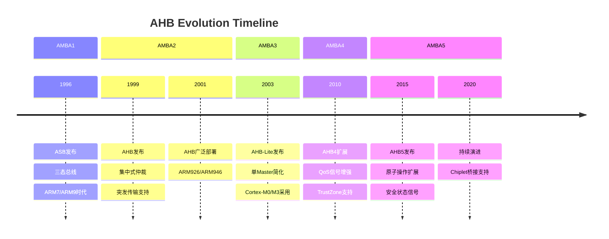
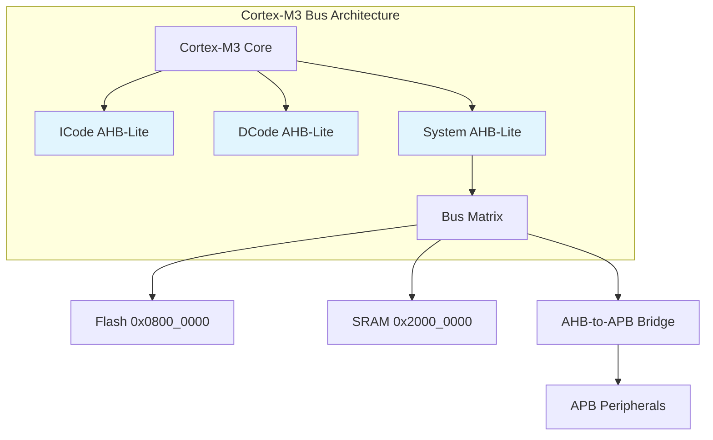
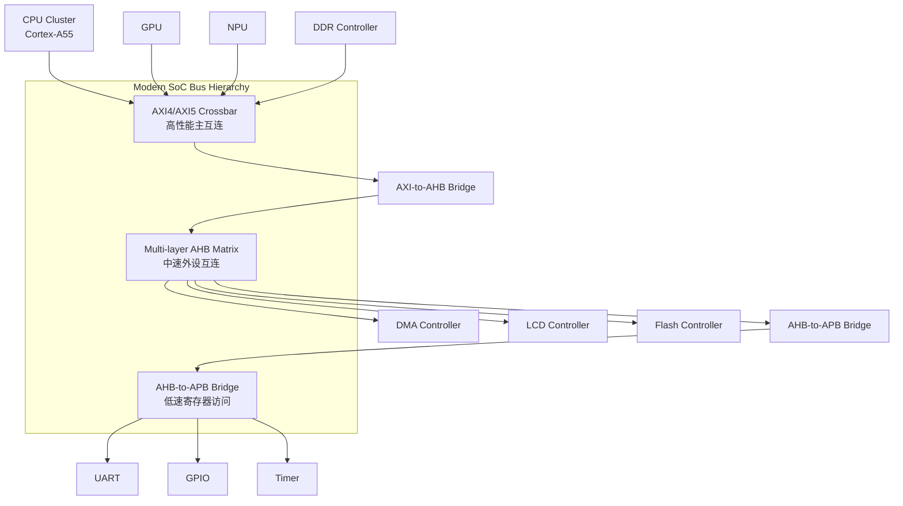

# AHB历史演进

<span class="badge-b">[Beginner]</span> <span class="badge-i">[Intermediate]</span> <span class="badge-e">[Expert]</span>

---

<span class="red">为什么AHB经历了AMBA 2→3→5的多次修订？</span> AHB的设计演进不是"功能堆砌"，而是对半导体工艺、系统架构和应用需求的持续回应。1990年代末，180nm工艺下100MHz总线已属高速；到2010年代，28nm工艺下的SoC需要多核并行、TrustZone安全域、低功耗门控。AHB从AMBA 2的"高性能共享总线"到AMBA 5的"可扩展安全互连"，每一步修订都对应着嵌入式生态的深层变革——理解这条演进线，就是理解片上互连架构如何与摩尔定律共舞。

---

## <strong>AMBA 2：AHB的诞生</strong>

### <strong>从ASB到AHB的跃迁</strong>

1999年发布的AMBA 2.0是AHB的里程碑。在此之前，AMBA 1.0使用<span class="green">ASB（ARM System Bus）</span>——
一种基于三态总线的共享架构。

| 特性 | ASB（AMBA1） | AHB（AMBA2） |
|------|-------------|-------------|
| 总线类型 | 三态双向 | 多路复用单向 |
| 仲裁方式 | 分布式 | 集中式 |
| 时钟域 | 支持异步 | 单一时钟域 |
| 突发传输 | 不支持 | 支持增量/回环 |
| 流水线 | 无 | 地址/数据分离 |
| 最高频率 | ~50MHz | ~100MHz |

<span class="blue">关键结论：AHB用多路复用单向信号取代三态总线，彻底消除了三态线的驱动竞争问题——
<br>
这是频率翻倍的核心技术决策。</span>



---

### <strong>AHB核心创新</strong>

AMBA 2定义了AHB的六大技术基石：

| 创新点 | 技术内容 | 解决的问题 |
|--------|---------|-----------|
| 集中式仲裁 | HBUSREQ/HGRANT握手 | 消除分布式仲裁的延迟不确定性 |
| 流水线传输 | 地址相位与数据相位重叠 | 提升总线利用率至接近100% |
| 突发传输 | INCR/WRAP 4/8/16拍 | 减少地址传输开销，提升带宽 |
| 分字节传输 | HSIZE支持8/16/32/64/128位 | 兼容不同数据宽度的Slave |
| SPLIT响应 | Slave请求Master放弃总线 | 避免慢速Slave阻塞总线 |
| RETRY响应 | Slave请求Master重试 | 支持临时的Slave忙状态 |

```verilog
// AMBA2 AHB典型突发传输时序（Verilog伪代码）
module ahb_burst_transfer (
    input  wire        HCLK,
    input  wire [31:0] HADDR,
    input  wire [2:0]  HBURST,   // AMBA2编码
    input  wire [2:0]  HSIZE,
    input  wire [1:0]  HTRANS,
    output reg  [31:0] next_addr
);
    // 突发地址递增逻辑
    wire [2:0] byte_per_beat = 1 << HSIZE;  // 每拍字节数
    
    always @(*) begin
        if (HBURST == 3'b011)  // INCR4
            next_addr = HADDR + byte_per_beat;
        else if (HBURST == 3'b101)  // INCR8
            next_addr = HADDR + byte_per_beat;
        else if (HBURST == 3'b111)  // INCR16
            next_addr = HADDR + byte_per_beat;
        else
            next_addr = HADDR;  // SINGLE或WRAP
    end
endmodule
```

---

## <strong>AMBA 3：AHB-Lite的简化哲学</strong>

### <strong>为什么需要AHB-Lite</strong>

2003年AMBA 3.0推出<span class="red">AHB-Lite</span>，这不是"功能阉割"，而是"精准裁剪"。
<br>
ARM Cortex-M系列MCU采用单核或简单多核架构，绝大多数场景只有一个总线主设备——CPU。
<br>
完整AHB的多Master仲裁、SPLIT/RETRY响应在这些场景下成为"冗余逻辑"。

| 信号/特性 | 完整AHB | AHB-Lite | 裁剪理由 |
|----------|---------|----------|---------|
| HBUSREQ | 有 | 无 | 单Master无需请求 |
| HGRANT | 有 | 无 | 单Master始终授权 |
| HMASTER | 有 | 无 | 无多Master标识需求 |
| SPLIT响应 | 支持 | 不支持 | 单Master无法切换 |
| RETRY响应 | 支持 | 简化ERROR | 单Master重试无意义 |
| 仲裁器 | 需要 | 不需要 | 节省面积 |

<span class="blue">关键结论：AHB-Lite门数约为完整AHB的40%——
<br>
在成本敏感的MCU中，这种裁剪直接转化为芯片面积和功耗的节省。</span>

---

### <strong>AHB-Lite在Cortex-M中的统治地位</strong>



Cortex-M3/M4/M7均使用AHB-Lite作为内部核心总线：
<br>
- ICode总线：只读，专用于指令取指
<br>
- DCode总线：读写，专用于Flash/SRAM数据访问
<br>
- System总线：通用，连接外设矩阵

```c
// STM32F1xx AHB-Lite地址映射示例
#define FLASH_BASE    0x08000000  // ICode/DCode访问
#define SRAM_BASE     0x20000000  // System总线访问
#define PERIPH_BASE   0x40000000  // APB桥接后访问

// AHB-Lite寄存器直接访问（无仲裁等待）
#define RCC_CR        (*(volatile uint32_t *)(0x40021000 + 0x00))
#define RCC_CFGR      (*(volatile uint32_t *)(0x40021000 + 0x04))

// 使能GPIOA时钟（APB桥接器转AHB-Lite访问）
void gpioa_clock_enable(void) {
    RCC_APB2ENR |= (1 << 2);  // APB2外设时钟使能
}
```

---

## <strong>AMBA 4与AMBA 5：扩展与安全</strong>

### <strong>AMBA 4的QoS与TrustZone铺垫</strong>

2010年AMBA 4.0并未大幅修改AHB协议本身，而是通过<span class="green">AXI4</span>引入了QoS信号概念。
<br>
这些概念随后被反馈到AHB生态中——
<br>
多-layer AHB矩阵开始集成4位QoS优先级输入，仲裁器可依据QoS等级动态调整授权策略。

AMBA 4时代AHB的典型增强：

| 增强项 | 来源 | AHB实现 |
|--------|------|---------|
| QoS信号 | AXI4 | 4位QoS输入到矩阵仲裁器 |
| TrustZone | ARMv7-M | HNONSEC信号区分安全/非安全访问 |
| Exclusive Access | AXI4 | 简化版原子操作支持 |

---

### <strong>AMBA 5：原子操作与扩展架构</strong>

2015年发布的AMBA 5规范将AHB提升到新的高度。
<span class="red">AHB5</span>引入的关键扩展：

| 新特性 | 信号/机制 | 应用场景 |
|--------|----------|---------|
| 扩展存储类型 | HEXTENDED[3:0] | 多核一致性内存属性 |
| 安全状态指示 | HNONSEC + 扩展 | TrustZone-M安全扩展 |
| 原子操作 | Exclusive传输序列 | 多核同步原语 |
| 停滞传输 | Stalled transaction | 调试与低功耗 |

```verilog
// AHB5 Exclusive访问序列（读-修改-写）
module ahb5_exclusive (
    input  wire        HCLK,
    input  wire        HRESETn,
    input  wire [31:0] HADDR,
    input  wire [1:0]  HTRANS,
    input  wire        HEXOKAY,      // AHB5：Exclusive OK响应
    output reg         HEXCL,        // AHB5：Exclusive请求
    output reg  [3:0]  HMASTER       // AHB5：Master标识
);
    // Exclusive读阶段
    always @(posedge HCLK) begin
        if (HTRANS == 2'b10) begin  // NONSEQ
            HEXCL  <= 1'b1;        // 标记为Exclusive访问
            HMASTER <= 4'h3;       // 当前Master ID
        end
    end
    
    // Exclusive写阶段：仅当HEXOKAY为高时写入成功
    wire excl_write_valid = (HTRANS == 2'b10) && HEXOKAY;
endmodule
```

<span class="blue">易错点：AHB5的Exclusive访问与AXI的AXLOCK机制语义不同——
<br>
AHB5依赖Slave内部的Monitor跟踪地址匹配，
<br>
而AXI使用AXID+LOCK的组合锁定通道。</span>

---

## <strong>AHB与AXI的过渡关系</strong>

### <strong> coexistence而非replacement</strong>

AHB与AXI不是"新旧替代"关系，而是"分层共存"架构：



| 层级 | 协议 | 带宽需求 | 典型负载 | 仲裁复杂度 |
|------|------|---------|---------|-----------|
| L1 | AXI4/5 | >10GB/s | CPU/GPU/DDR | 分布式，高 |
| L2 | AHB Multi-layer | ~1GB/s | DMA/LCD/Flash | 交叉点，中 |
| L3 | AHB-Lite | ~100MB/s | Cortex-M内部 | 无仲裁，低 |
| L4 | APB4/5 | ~10MB/s | UART/GPIO/Timer | 无仲裁，最低 |

---

### <strong>选型决策矩阵</strong>

工程师在新SoC设计中如何抉择AHB与AXI：

| 评估维度 | 选择AHB的条件 | 选择AXI的条件 |
|---------|--------------|--------------|
| 带宽需求 | <1GB/s，突发长度短 | >1GB/s，长突发流 |
| Master数量 | 2-8个，并发度中等 | >8个，高度并发 |
| 面积预算 | 门数敏感，成本优先 | 性能优先，面积可接受 |
| 低功耗 | 简单门控即可 | 需复杂QoS+电源域 |
| IP生态 | 已有成熟AHB IP库 | 需AXI独占功能（如QoS） |
| 安全扩展 | AHB5 TrustZone足够 | 需ACE/CHI一致性 |

<span class="purple">扩展：SiFive的RISC-V SoC中，TileLink-UH作为高速互连，
<br>
AHB-Lite作为下游外设总线——这种"高速 TileLink + 低速 AHB"的架构
<br>
与ARM的"AXI + AHB"分层思想完全一致。</span>

---

## <strong>历史演进段落</strong>

AHB总线的发展轨迹清晰地映射了嵌入式系统从单核到多核、从简单到复杂的演进历程。1996年AMBA 1.0的ASB使用三态总线，在当时0.35μm工艺和50MHz主频下足够使用，但分布式仲裁的延迟不确定性随着频率提升逐渐暴露。1999年AMBA 2.0的AHB革命性地引入集中式仲裁与流水线传输，将总线频率提升至100MHz以上，成为ARM9/ARM11时代的标配。2003年AMBA 3.0的AHB-Lite则是对MCU市场的精准回应——Cortex-M0/M3不需要复杂的多Master仲裁，去掉冗余后面积和功耗大幅下降。2010年AMBA 4.0并未直接修改AHB协议，但AXI4引入的QoS概念被多-layer AHB矩阵采纳，仲裁器开始支持动态优先级。2015年AMBA 5.0的AHB5增加了原子操作、扩展存储类型和安全状态信号，使AHB从"外设总线"升级为"可信互连组件"。进入2020年代，随着芯粒（Chiplet）和先进封装技术的发展，AHB桥接器承担了更多跨时钟域、跨电压域的互连任务，QoS机制也需要在更大延迟波动下保证服务质量。AHB的演进证明了"适度复杂"的设计理念——它不是最先进的总线，但在面积、功耗、易用性和生态成熟度之间找到了最佳平衡点。

---

## <strong>本章小结</strong>

| 要点 | 内容 |
|------|------|
| AMBA2 | AHB诞生，集中式仲裁、流水线突发、取代ASB |
| AMBA3 | AHB-Lite简化，单Master优化，Cortex-M标配 |
| AMBA4 | QoS信号引入，多-layer矩阵成熟，TrustZone铺垫 |
| AMBA5 | AHB5原子操作、Exclusive访问、安全扩展 |
| 与AXI关系 | 分层共存，AHB负责中低速外设，AXI负责高性能主通道 |

## <strong>练习</strong>

| 编号 | 题目 | 难度 |
|------|------|------|
| 1 | 对比ASB（AMBA1）与AHB（AMBA2）的总线信号差异，说明三态总线为何成为频率瓶颈 | <span class="badge-i">[I]</span> |
| 2 | AHB-Lite去掉SPLIT/RETRY后，单Master访问慢速Slave（如Flash）时如何避免总线阻塞？给出设计思路 | <span class="badge-i">[I]</span> |
| 3 | 在"AXI+AHB+APB"三层SoC中，设计地址映射方案：DDR 1GB、SRAM 128MB、寄存器空间64KB，给出各层基地址与译码逻辑 | <span class="badge-e">[E]</span> |

---

<span class="purple">扩展阅读：ARM AMBA 2/3/4/5规范官方文档、ARM Cortex-M3技术参考手册（第8章总线矩阵）、IBM CoreConnect PLB vs AHB对比分析白皮书。</span>
