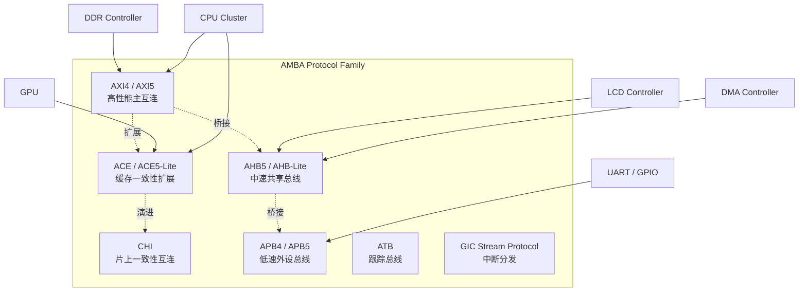
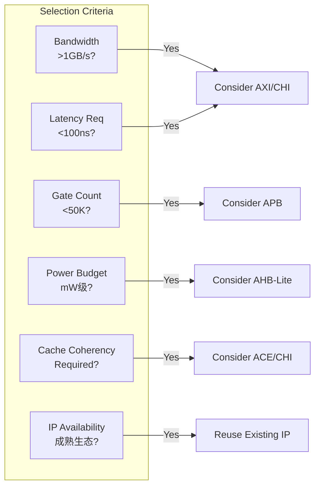
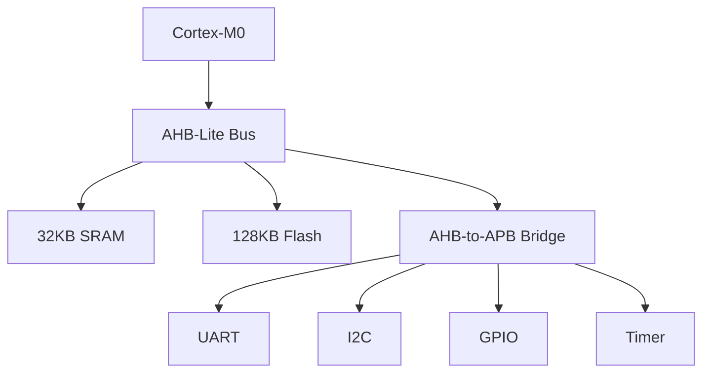
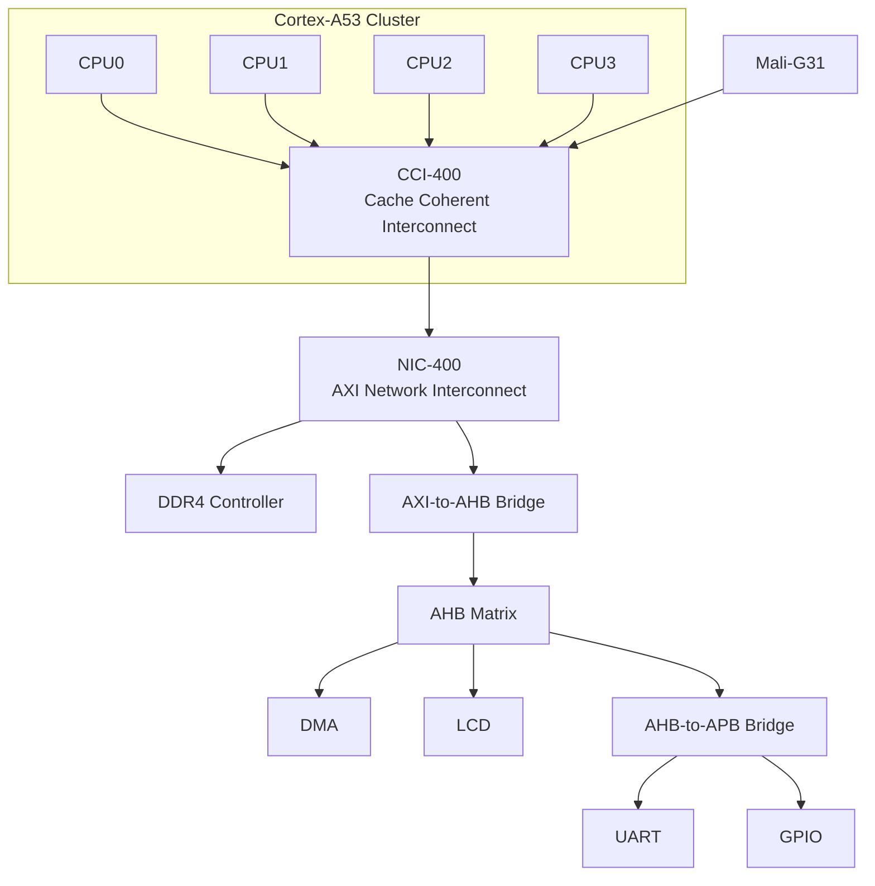

# AMBA协议族与选型

<span class="badge-b">[Beginner]</span> <span class="badge-i">[Intermediate]</span> <span class="badge-e">[Expert]</span>

---

<span class="red">为什么AMBA需要这么多总线协议？</span> SoC设计中没有"万能总线"——CPU与DDR之间需要数十GB/s的带宽和低延迟，UART寄存器访问只需要几MB/s的-simple read/write，而GPU与CPU之间又需要缓存一致性。AMBA协议族的设计哲学是"分层适配"：AXI承担高性能主干，AHB连接中速外设，APB服务低速寄存器，ACE/CHI解决多核一致性。理解各协议的适用域和权衡维度，是SoC架构师的核心能力。

---

## <strong>AMBA协议族全景</strong>

### <strong>协议族成员概览</strong>

AMBA从1996年至今已形成五代规范，定义了七种主要总线协议：



| 协议 | 版本 | 定位 | 核心特性 | 典型频率 |
|------|------|------|---------|---------|
| AXI4 | AMBA4 | 高性能主互连 | 多通道、乱序、突发 | 200-500MHz |
| AXI5 | AMBA5 | 扩展AXI4 | QoS增强、安全扩展 | 200-500MHz |
| ACE | AMBA4 | 缓存一致性 | 脏数据共享、屏障操作 | 200-500MHz |
| ACE5-Lite | AMBA5 | 简化一致性 | IO一致性、DVM | 200-500MHz |
| CHI | AMBA5 | 片上互连 | 分层拓扑、Flit传输 | 500MHz-1GHz |
| AHB5 | AMBA5 | 中速外设 | 突发传输、QoS | 50-200MHz |
| AHB-Lite | AMBA3 | 单主控简化 | 无仲裁、轻量 | 50-200MHz |
| APB5 | AMBA5 | 低速寄存器 | 两周期、低功耗 | 10-50MHz |
| APB4 | AMBA4 | 安全外设 | PPROT/PSTRB | 10-50MHz |

---

### <strong>AXI：高性能互连的王者</strong>

<span class="red">AXI（Advanced eXtensible Interface）</span>是AMBA4/5的核心协议：

| 特性 | AXI4实现 | 优势 |
|------|---------|------|
| 分离通道 | 读地址/读数据/写地址/写数据/写响应独立 | 读写并行，无冲突 |
| 突发传输 | 支持1-256拍突发 | 减少地址开销 |
| 乱序完成 | 基于ARID/AWID的乱序响应 | 提高总线利用率 |
| 多 outstanding | 支持16+未完成的传输 | 隐藏延迟 |
| QoS信号 | 4位QoS等级 | 服务质量保障 |
| 缓存信号 | ARCACHE/AWCACHE | 系统缓存策略 |

```verilog
// AXI4读通道握手示例
module axi4_read_example (
    input  wire        ACLK,
    input  wire        ARESETn,
    // AR通道（读地址）
    output reg  [31:0] ARADDR,
    output reg  [3:0]  ARID,
    output reg         ARVALID,
    input  wire        ARREADY,
    // R通道（读数据）
    input  wire [63:0] RDATA,
    input  wire [3:0]  RID,
    input  wire        RVALID,
    output reg         RREADY,
    input  wire        RLAST           // 突发最后一拍
);
    // 读地址发送状态机
    localparam IDLE = 2'b00, AR_SEND = 2'b01, R_RECV = 2'b10;
    reg [1:0] state;
    
    always @(posedge ACLK) begin
        if (!ARESETn) begin
            state   <= IDLE;
            ARVALID <= 1'b0;
            RREADY  <= 1'b0;
        end else case (state)
            IDLE: begin
                ARADDR  <= 32'h8000_0000;  // DDR基地址
                ARID    <= 4'h2;            // Master ID
                ARVALID <= 1'b1;
                if (ARREADY) state <= AR_SEND;
            end
            AR_SEND: begin
                ARVALID <= 1'b0;
                RREADY  <= 1'b1;
                if (RVALID && RLAST) state <= IDLE;
            end
        endcase
    end
endmodule
```

---

## <strong>选型矩阵：性能/面积/功耗权衡</strong>

### <strong>选型决策框架</strong>

SoC总线选型需要综合评估六个维度：



| 应用场景 | 推荐协议 | 核心理由 | 替代方案 |
|---------|---------|---------|---------|
| CPU-DDR互连 | AXI4/5 | 高带宽、低延迟、outstanding隐藏延迟 | CHI（更优一致性） |
| 多核一致性 | ACE5/CHI | 缓存脏数据共享、屏障原语 | 自定义一致性协议 |
| MCU外设总线 | AHB-Lite | 单主控、无仲裁、低门数 | Wishbone（开源生态） |
| 寄存器外设 | APB4/5 | 两周期简单访问、TrustZone安全 | AHB-Lite（更快但更大） |
| 多媒体DMA | AHB5 | 突发传输、QoS带宽保证 | AXI4（若带宽需求高） |
| 调试/跟踪 | ATB | 专用跟踪协议，不占用主总线 | 自定义JTAG扩展 |
| 中断分发 | GIC Stream | 低延迟中断路由 | AXI-Lite（通用替代） |

---

### <strong>性能与面积的量化对比</strong>

基于典型40nm工艺的综合数据（参考ARM/Synopsys公开资料）：

| 协议 | 门数（典型Master） | 最大频率 | 每拍数据宽度 | 理论峰值带宽 |
|------|------------------|---------|-------------|-------------|
| CHI | ~150K gates | 1GHz | 128-bit | 256GB/s |
| AXI4 | ~80K gates | 500MHz | 128-bit | 128GB/s |
| AHB5 | ~25K gates | 200MHz | 64-bit | 16GB/s |
| AHB-Lite | ~8K gates | 200MHz | 32-bit | 8GB/s |
| APB5 | ~2K gates | 50MHz | 32-bit | 200MB/s |

<span class="blue">关键结论：协议复杂度与门数成正比，但门数与频率并非线性——
<br>
CHI的1GHz需要深度流水线，门数是AXI4的2倍但频率仅2倍，
<br>
说明协议选择的首要考量是"功能匹配"而非"频率竞赛"。</span>

---

### <strong>功耗模型对比</strong>

总线功耗 = 动态功耗（翻转）+ 静态功耗（漏电）+ 时钟树功耗

| 功耗维度 | AXI4 | AHB-Lite | APB5 |
|---------|------|----------|------|
| 动态功耗 | 高（多通道并行翻转） | 中（单通道分时） | 低（两周期静态间隔） |
| 静态功耗 | 中（门数多，漏电大） | 低（门数少） | 最低（门数最少） |
| 时钟功耗 | 高（宽时钟树） | 低（窄时钟树） | 最低（可门控） |
| 低功耗支持 | QoS + 电源域 | 简单时钟门控 | PCLKEN + Q-Channel |

```c
// APB5低功耗接口：PCLKEN控制
// 当外设空闲时，系统可关闭PCLKEN以节省动态功耗
#define APB_PERIPH_CTRL  (*(volatile uint32_t *)0x40001000)

void apb_enter_low_power(void) {
    // 清除外设使能位，总线桥接器随后拉低PCLKEN
    APB_PERIPH_CTRL &= ~(1 << 0);
    // 外设时钟停止，总线处于静态
}

void apb_exit_low_power(void) {
    // 置位使能，桥接器恢复PCLKEN
    APB_PERIPH_CTRL |= (1 << 0);
}
```

---

## <strong>实战选型案例分析</strong>

### <strong>案例一：低功耗MCU（Cortex-M0级别）</strong>

目标：可穿戴设备，功耗<1mW，面积<1mm²



| 选型决策 | 协议 | 理由 |
|---------|------|------|
| 核心总线 | AHB-Lite | 单主控，无仲裁器，面积最小 |
| 外设总线 | APB4 | 寄存器访问，支持PPROT安全扩展 |
| 存储器 | AHB直连 | Flash/SRAM需要突发传输 |
| 一致性 | 不需要 | 单核无缓存一致性问题 |

<span class="blue">为什么不用AXI？AXI的分离通道在单Master场景下完全冗余，
<br>
门数增加5倍却没有任何性能收益。</span>

---

### <strong>案例二：应用处理器（Cortex-A53级别）</strong>

目标：智能音箱主控，4核A53 + Mali GPU，DDR4 4GB

| 选型决策 | 协议 | 理由 |
|---------|------|------|
| CPU互连 | AXI4 + ACE | 4核间缓存一致性，脏数据共享 |
| GPU互连 | ACE5-Lite | IO一致性，监听CPU缓存 |
| DDR接口 | AXI4 | 高带宽突发，QoS优先级 |
| DMA/LCD | AHB5 | 突发传输，QoS带宽保证 |
| UART/GPIO | APB4 | 低速寄存器，TrustZone安全 |



---

### <strong>案例三：数据中心加速器（Chiplet架构）</strong>

目标：AI推理加速器，多 die 封装，HBM2E存储

| 选型决策 | 协议 | 理由 |
|---------|------|------|
| Die间互连 | CHI | 分层拓扑，Flit传输，高频率 |
| HBM接口 | CHI | 原生支持高带宽存储器语义 |
| 控制面 | AXI4-Lite | 寄存器配置，轻量级 |
| 低速外设 | AHB5 | 面积适中，兼容现有IP |

<span class="purple">扩展：CHI协议采用Flit（Flow Control Unit）传输，
<br>
将请求/响应/数据分离为独立Flit类型，支持路由级QoS和死锁避免——
<br>
这是AMBA协议从"总线"走向"网络"的质变。</span>

---

## <strong>历史演进段落</strong>

AMBA协议族的发展史是一部片上互连架构的浓缩进化史。1996年AMBA 1.0仅定义了ASB和APB，面向当时简单的ARM7 SoC，三态总线ASB在50MHz以下运行良好。1999年AMBA 2.0引入AHB，用多路复用单向信号取代三态线，频率翻倍至100MHz以上，成为ARM9时代的标准。2003年AMBA 3.0是变革性的版本：AXI3首次登场，分离的读写通道与乱序完成机制彻底改变了高性能互连的设计范式；同时AHB-Lite的发布为Cortex-M MCU铺平了道路。2010年AMBA 4.0将AXI升级到AXI4，增加了QoS信号和长突发支持；ACE协议的引入首次在AMBA中定义了缓存一致性语义，使多核CPU cluster能够高效共享数据。2015年AMBA 5.0是又一次飞跃：CHI（Coherent Hub Interface）取代ACE成为新一代一致性互连标准，采用基于Flit的分层网络架构；AXI5增强了安全扩展和原子操作；AHB5和APB5分别加入了TrustZone和低功耗接口。进入2020年代，随着芯粒（Chiplet）和2.5D/3D封装的普及，CHI的Flit传输和路由能力成为跨 die 互连的理想选择，而APB5的Q-Channel接口支持外设级电源管理。AMBA协议族的演进始终遵循"分层适配"的哲学——不同性能域使用不同协议，通过桥接器无缝衔接，这种架构思想已成为整个半导体行业的共识。

---

## <strong>本章小结</strong>

| 要点 | 内容 |
|------|------|
| 协议定位 | AXI=高速主干，AHB=中速外设，APB=低速寄存器，ACE/CHI=一致性 |
| 选型维度 | 带宽、面积、功耗、延迟、一致性、IP生态六维评估 |
| AXI优势 | 多通道并行、乱序完成、高 outstanding、QoS原生支持 |
| AHB-Lite优势 | 单Master极简、低门数、Cortex-M生态成熟 |
| APB优势 | 两周期简单访问、TrustZone安全、Q-Channel低功耗 |
| 演进趋势 | CHI替代ACE成为一致性首选，Flit传输适配Chiplet架构 |

## <strong>练习</strong>

| 编号 | 题目 | 难度 |
|------|------|------|
| 1 | 为一款"智能手表SoC"选型：Cortex-M33 + 蓝牙BLE + 128KB SRAM + 4MB Flash + 心率传感器I2C。给出总线层级与协议选择，并说明面积与功耗权衡 | <span class="badge-i">[I]</span> |
| 2 | 对比AXI4与CHI在4核CPU cluster中的优劣：一致性机制、拓扑灵活性、频率上限、门数开销。给出选型建议 | <span class="badge-e">[E]</span> |
| 3 | 在AXI+AHB+APB三层架构中，AXI-to-AHB Bridge和AHB-to-APB Bridge分别需要处理哪些协议转换细节？列出信号映射表 | <span class="badge-e">[E]</span> |

---

<span class="purple">扩展阅读：ARM AMBA规范官方文档（AMBA 2/3/4/5）、Synopsys DesignWare AMBA IP产品指南、IEEE Micro论文"On-Chip Interconnects for Heterogeneous SoCs"（对比AMBA与OCN-Interconnect）。</span>
