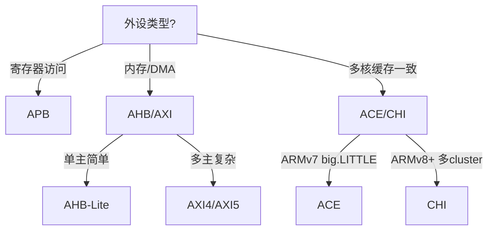

# AMBA协议族与选型

<span class="badge-i">[Intermediate]</span>

<span class="red">AMBA（Advanced Microcontroller Bus Architecture）</span> 是 ARM 定义的片上系统互连标准族，覆盖从简单外设到高性能计算的完整谱系。

---

## <strong>基础认知</strong>

### <strong>为什么AMBA成为行业标准</strong>

<span class="blue">ARM 处理器占据嵌入式市场 90% 以上份额，AMBA 作为 ARM 官方总线标准自然成为生态核心。</span>

<span class="green">AMBA 协议族全景</span>：

| 协议 | 定位 | 典型应用 |
|------|------|----------|
| APB | 低速外设 | UART、Timer、GPIO |
| AHB | 中性能 | DMA、Memory Controller |
| AXI | 高性能 | GPU、Video Codec |
| ACE | 缓存一致性 | big.LITTLE 多核 |
| CHI | 片上互联 | 服务器级多 Cluster |

---

## <strong>原理解析</strong>

### <strong>选型决策树</strong>



### <strong>性能/面积/功耗权衡</strong>

<span class="blue">APB最小面积、最低功耗；CHI最大面积、最高性能。</span>

| 指标 | APB | AHB | AXI | CHI |
|------|-----|-----|-----|-----|
| 门数 | ~500 | ~3K | ~15K | ~50K+ |
| 频率 | 低 | 中 | 高 | 极高 |
| 特性 | 简单 | 突发 | 乱序、QoS | 缓存一致性 |

---

## <strong>技术教学</strong>

### <strong>Linux 中的 AMBA 支持</strong>

```c
// Linux 内核 AMBA 设备注册
static struct amba_driver my_driver = {
    .drv.name = "my-device",
    .id_table = my_ids,
    .probe = my_probe,
};
amba_driver_register(&my_driver);
```

---

## <strong>历史演进</strong>

- <span class="green">1996 年 AMBA 1.0</span> — ASB + APB<br>
- <span class="green">1999 年 AMBA 2.0</span> — AHB 替代 ASB<br>
- <span class="green">2003 年 AMBA 3.0</span> — AXI 引入<br>
- <span class="green">2010 年 AMBA 4.0</span> — ACE 缓存一致性<br>
- <span class="green">2015 年 AMBA 5.0</span> — CHI 片上互联

---

## 小结与练习

**练习**

1. 为一个Cortex-M4 + 3个UART + 2个SPI + 1个DMA的设计选择AMBA子协议。
2. 比较AXI4和AXI5在原子操作支持上的差异。
3. 分析为什么RISC-V生态选择TileLink而非AMBA。
