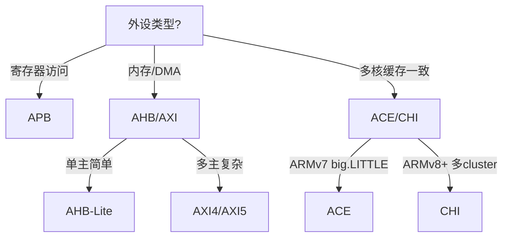

# AMBA协议族与选型

[Intermediate]

AMBA（Advanced Microcontroller Bus Architecture） 是 ARM 定义的片上系统互连标准族，覆盖从简单外设到高性能计算的完整谱系。

---

## <strong>基础认知</strong>

### <strong>协议族全景</strong>

| 协议 | 定位 | 速率 | 复杂度 |
|------|------|------|--------|
| APB | 低速外设 | 低 | 简单 |
| AHB | 中性能 | 中高 | 中等 |
| AXI | 高性能 | 高 | 复杂 |
| ACE | 缓存一致性 | 高 | 很复杂 |
| CHI | 片上互联 | 极高 | 最复杂 |

## <strong>选型决策树</strong>

## <strong>性能/面积/功耗权衡</strong>

APB最小面积、最低功耗；CHI最大面积、最高性能。

---

## <strong>小结与练习</strong>

**练习**

1. 为一个Cortex-M4 + 3个UART + 2个SPI + 1个DMA的设计选择AMBA子协议。
2. 比较AXI4和AXI5在原子操作支持上的差异。
3. 分析为什么RISC-V生态选择TileLink而非AMBA。
