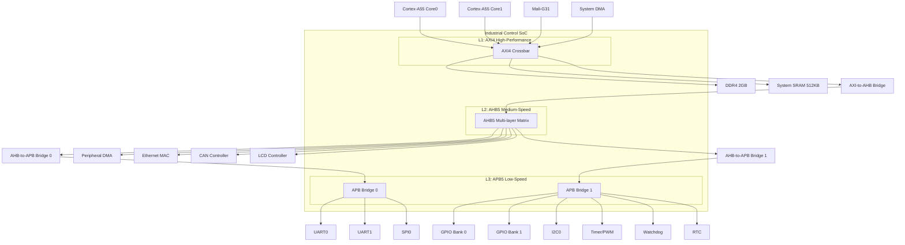
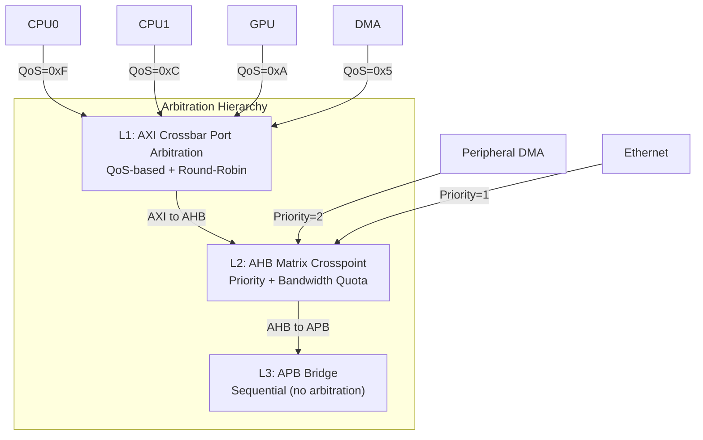

# AMBA嵌入式实战

<span class="badge-b">[Beginner]</span> <span class="badge-i">[Intermediate]</span> <span class="badge-e">[Expert]</span>

---

<span class="red">为什么SoC总线架构设计比单个协议实现更难？</span> 总线协议定义了信号握手规则，但SoC架构师需要解决的是"谁连谁、怎么连、地址怎么分"的系统级问题。一个设计精良的地址映射方案能让软件驱动开发事半功倍；一个糟糕的仲裁策略能让CPU在关键时刻被DMA饿死。AMBA嵌入式实战的核心不是背信号定义，而是掌握"总线即系统"的架构思维——从地址空间规划到仲裁策略选择，从时钟域划分到低功耗隔离，每一个决策都影响整个芯片的面积、功耗和性能。

---

## <strong>SoC总线架构设计实例</strong>

### <strong>典型嵌入式SoC总线拓扑</strong>

以一个工业控制SoC为例，展示完整的AMBA分层架构：



| 层级 | 协议 | 连接模块 | 设计目标 |
|------|------|---------|---------|
| L1 | AXI4 | CPU/GPU/DMA0/DDR | 高带宽、低延迟、支持一致性 |
| L2 | AHB5 | DMA1/Eth/CAN/LCD | 中速突发、QoS带宽保证 |
| L3 | APB5 | UART/SPI/GPIO/I2C | 低速寄存器、TrustZone安全、低功耗 |

---

### <strong>架构设计决策分析</strong>

<span class="red">为什么用三层而非两层？</span> 将APB外设直接挂在AXI Crossbar上会导致两个问题：
<br>
第一，AXI Crossbar的每个slave端口成本很高，APB外设数量多（通常>20个），会耗尽Crossbar端口资源；
<br>
第二，APB的两周期访问模式与AXI的流水线突发完全不匹配，直接连接需要复杂的协议转换桥。

| 方案对比 | 两层（AXI+APB） | 三层（AXI+AHB+APB） |
|---------|---------------|---------------------|
| Crossbar端口 | 16+（含所有APB） | 4-6（仅高性能设备） |
| 桥接器复杂度 | 复杂（AXI-to-APB） | 简单（AXI-to-AHB + AHB-to-APB） |
| APB外设扩展 | 困难（受限于Crossbar） | 灵活（增加APB Bridge即可） |
| 时钟域隔离 | 需在每个APB端口处理 | 集中在AHB-to-APB桥 |
| 面积开销 | 大 | 中等（分层优化） |

---

## <strong>地址映射规划</strong>

### <strong>地址空间分配原则</strong>

嵌入式SoC的地址映射遵循"对齐、预留、扩展"三原则：

```c
// 工业控制SoC地址映射表（32位地址空间）
#define ADDR_DDR_BASE      0x00000000  // 0x0000_0000 - 0x7FFF_FFFF: DDR 2GB
#define ADDR_SRAM_BASE     0x80000000  // 0x8000_0000 - 0x8007_FFFF: SRAM 512KB
#define ADDR_AXI_RESERVED  0x80100000  // 0x8010_0000 - 0x8FFF_FFFF: AXI预留 255MB
#define ADDR_AHB_BASE      0x90000000  // 0x9000_0000 - 0x9FFF_FFFF: AHB外设 256MB
#define ADDR_APB0_BASE     0xA0000000  // 0xA000_0000 - 0xAFFF_FFFF: APB0桥 256MB
#define ADDR_APB1_BASE     0xB0000000  // 0xB000_0000 - 0xBFFF_FFFF: APB1桥 256MB
#define ADDR_BOOTROM       0xFFF00000  // 0xFFF0_0000 - 0xFFFF_FFFF: BootROM 1MB

// AHB外设详细映射（每个外设分配64KB窗口，按4KB子窗口对齐）
#define ADDR_ETH_BASE      0x90000000  // Ethernet: 0x9000_0000 - 0x9000_FFFF
#define ADDR_CAN_BASE      0x90010000  // CAN:      0x9001_0000 - 0x9001_FFFF
#define ADDR_DMA1_BASE     0x90020000  // DMA1:     0x9002_0000 - 0x9002_FFFF
#define ADDR_LCD_BASE      0x90030000  // LCD:      0x9003_0000 - 0x9003_FFFF

// APB0外设映射（每个外设分配4KB窗口）
#define ADDR_UART0_BASE    0xA0000000  // UART0: 0xA000_0000 - 0xA000_0FFF
#define ADDR_UART1_BASE    0xA0001000  // UART1: 0xA000_1000 - 0xA000_1FFF
#define ADDR_SPI0_BASE     0xA0002000  // SPI0:  0xA000_2000 - 0xA000_2FFF

// APB1外设映射
#define ADDR_GPIO0_BASE    0xB0000000  // GPIO0: 0xB000_0000 - 0xB000_0FFF
#define ADDR_GPIO1_BASE    0xB0001000  // GPIO1: 0xB000_1000 - 0xB000_1FFF
#define ADDR_I2C0_BASE     0xB0002000  // I2C0:  0xB000_2000 - 0xB000_2FFF
#define ADDR_TIMER_BASE    0xB0003000  // Timer: 0xB000_3000 - 0xB000_3FFF
```

| 地址区域 | 基地址 | 大小 | 用途 | 对齐要求 |
|---------|--------|------|------|---------|
| DDR | 0x0000_0000 | 2GB | 主存储器 | 自然对齐 |
| SRAM | 0x8000_0000 | 512KB | 紧耦合内存 | 512KB边界 |
| AHB外设 | 0x9000_0000 | 256MB | DMA/ETH/CAN/LCD | 64KB/外设 |
| APB0 | 0xA000_0000 | 256MB | UART/SPI | 4KB/外设 |
| APB1 | 0xB000_0000 | 256MB | GPIO/I2C/Timer | 4KB/外设 |
| BootROM | 0xFFF0_0000 | 1MB | 启动代码 | 1MB边界 |

<span class="blue">关键结论：地址按4KB对齐分配是每个APB外设的标准做法——
<br>
4KB是ARM MPU的最小保护单元，也是Linux设备树（DTS）的标准粒度。
</span>

---

### <strong>地址译码器设计</strong>

地址译码器根据HADDR的高位选择激活哪个Slave：

```verilog
// AHB地址译码器：组合逻辑实现
module ahb_decoder (
    input  wire [31:0] HADDR,
    output reg  [7:0]  HSEL,       // 8个Slave选择
    output reg         default_sel // 默认响应（未命中）
);
    // 地址区域定义
    localparam DDR_BASE   = 32'h0000_0000;
    localparam SRAM_BASE  = 32'h8000_0000;
    localparam AHB_BASE   = 32'h9000_0000;
    localparam APB0_BASE  = 32'hA000_0000;
    localparam APB1_BASE  = 32'hB000_0000;
    localparam BOOT_BASE  = 32'hFFF0_0000;
    
    always @(*) begin
        HSEL = 8'b00000000;
        default_sel = 1'b0;
        
        casez (HADDR[31:28])
            4'b0000: HSEL[0] = 1'b1;  // DDR: 0x0xxx_xxxx
            4'b1000: HSEL[1] = 1'b1;  // SRAM: 0x8xxx_xxxx
            4'b1001: HSEL[2] = 1'b1;  // AHB: 0x9xxx_xxxx
            4'b1010: HSEL[3] = 1'b1;  // APB0: 0xAxxx_xxxx
            4'b1011: HSEL[4] = 1'b1;  // APB1: 0xBxxx_xxxx
            4'b1111: begin
                if (HADDR[27:24] == 4'hF)
                    HSEL[5] = 1'b1;   // BootROM: 0xFFFx_xxxx
            end
            default: default_sel = 1'b1;  // 未命中→错误响应
        endcase
    end
endmodule
```

---

## <strong>仲裁策略设计</strong>

### <strong>多层仲裁体系</strong>

现代SoC需要三级仲裁协同工作：



| 层级 | 仲裁器位置 | 策略 | 决策周期 |
|------|-----------|------|---------|
| L1 | AXI Crossbar每个Slave端口 | QoS优先 + 轮询 | 1-2 ACLK |
| L2 | AHB Matrix每个交叉点 | 固定优先级 + 带宽配额 | 1 HCLK |
| L3 | APB Bridge内部 | 顺序执行（单Master） | 2 PCLK |

---

### <strong>QoS动态优先级实例</strong>

AXI4的4位QoS信号（ARQOS/AWQOS）支持16级优先级，仲裁器据此动态调度：

```c
// QoS优先级映射与动态调整
#define QOS_REALTIME    0xF  // 最高：视频/音频实时流
#define QOS_HIGH        0xC  // 高：CPU缓存填充
#define QOS_MEDIUM      0x8  // 中：通用DMA
#define QOS_LOW         0x4  // 低：后台搬运
#define QOS_BACKGROUND  0x1  // 最低：固件更新

// 以太网MAC的QoS配置：根据帧类型动态调整
void eth_qos_config(uint8_t frame_type) {
    volatile uint32_t *qos_reg = (uint32_t *)(ADDR_ETH_BASE + 0x100);
    
    switch (frame_type) {
        case FRAME_TYPE_AVB:      // 音视频桥接
            *qos_reg = QOS_REALTIME;  // 抢占所有资源
            break;
        case FRAME_TYPE_CONTROL:  // 控制帧
            *qos_reg = QOS_HIGH;      // 仅次于实时
            break;
        case FRAME_TYPE_DATA:     // 普通数据
            *qos_reg = QOS_MEDIUM;    // 标准优先级
            break;
        default:
            *qos_reg = QOS_LOW;
    }
}
```

<span class="blue">易错点：QoS值仅在AXI Crossbar处生效——
<br>
如果AXI-to-AHB Bridge丢弃了QoS信号，AHB矩阵无法感知原始优先级，
<br>
导致关键流量被AHB层的固定优先级策略错误调度。
</span>

---

### <strong>带宽配额仲裁</strong>

对于需要严格带宽保证的模块（如LCD控制器），使用计数器配额机制：

```verilog
// AHB矩阵带宽配额仲裁器
module bandwidth_quota_arbiter (
    input  wire        HCLK,
    input  wire        HRESETn,
    input  wire [3:0]  hbusreq,       // 4个Master请求
    output reg  [3:0]  hgrant,
    // 配额配置（每1024 HCLK周期允许的传输次数）
    input  wire [9:0]  quota_m0, quota_m1, quota_m2, quota_m3
);
    reg [9:0] counter [0:3];   // 每个Master的剩余配额
    reg [9:0] cycle_cnt;        // 1024周期计数器
    
    always @(posedge HCLK) begin
        if (!HRESETn) begin
            cycle_cnt <= 10'd0;
            counter[0] <= quota_m0;
            counter[1] <= quota_m1;
            counter[2] <= quota_m2;
            counter[3] <= quota_m3;
        end else begin
            if (cycle_cnt == 10'd1023) begin
                // 配额周期重置
                cycle_cnt <= 10'd0;
                counter[0] <= quota_m0;
                counter[1] <= quota_m1;
                counter[2] <= quota_m2;
                counter[3] <= quota_m3;
            end else begin
                cycle_cnt <= cycle_cnt + 1'b1;
                // 已授权且传输完成的Master消耗配额
                if (hgrant[0] && counter[0] > 0) counter[0] <= counter[0] - 1'b1;
                if (hgrant[1] && counter[1] > 0) counter[1] <= counter[1] - 1'b1;
                if (hgrant[2] && counter[2] > 0) counter[2] <= counter[2] - 1'b1;
                if (hgrant[3] && counter[3] > 0) counter[3] <= counter[3] - 1'b1;
            end
        end
    end
    
    // 仲裁逻辑：优先选择仍有配额的最高优先级Master
    always @(*) begin
        // 简化为固定优先级 + 配额检查
        if (hbusreq[0] && counter[0] > 0) hgrant = 4'b0001;
        else if (hbusreq[1] && counter[1] > 0) hgrant = 4'b0010;
        else if (hbusreq[2] && counter[2] > 0) hgrant = 4'b0100;
        else if (hbusreq[3] && counter[3] > 0) hgrant = 4'b1000;
        else hgrant = 4'b0000;
    end
endmodule
```

---

## <strong>时钟域与低功耗设计</strong>

### <strong>跨时钟域桥接</strong>

| 时钟域边界 | 桥接器类型 | 关键技术 | 注意事项 |
|----------|-----------|---------|---------|
| AXI(200MHz)→AHB(100MHz) | 异步桥 | 双端口FIFO + 格雷码指针 | FIFO深度覆盖最大突发 |
| AHB(100MHz)→APB(50MHz) | 同步桥（分频） | 时钟使能 | PCLKEN低功耗门控 |
| APB→外设(32kHz RTC) | 异步桥 | 握手同步器 | 避免亚稳态传播 |

```c
// APB PCLKEN低功耗控制
// PCLKEN为低时，所有APB外设时钟停止，总线处于静态
#define PMC_CLK_CTRL  (*(volatile uint32_t *)0xB000_4000)

void system_enter_idle(void) {
    // 关闭APB外设时钟使能
    PMC_CLK_CTRL &= ~(0xFF << 8);  // 清除所有APB时钟
    
    // CPU进入WFI，等待中断唤醒
    __asm volatile ("wfi");
    
    // 唤醒后恢复时钟
    PMC_CLK_CTRL |= (0xFF << 8);
}
```

---

## <strong>历史演进段落</strong>

嵌入式SoC总线架构设计经历了从"总线-centric"到"网络-centric"的范式转换。1990年代的ARM7 SoC通常只有一条ASB总线，所有设备共享同一组信号，地址映射简单直接。2000年代初，随着ARM9和ARM11的流行，设计者开始将AHB与APB分层，AHB-to-APB Bridge成为标配组件，地址映射按64KB和4KB窗口对齐成为行业惯例。2010年后，多核Cortex-A系列的普及带来了AXI Crossbar的广泛应用，SoC架构从"共享总线"演变为"交换网络"，地址映射需要考虑Cache一致性区域的别名问题（Alias），仲裁策略从固定优先级升级为QoS动态调度。2015年AMBA 5发布后，CHI的Flit传输和分层拓扑开始影响高端SoC设计，但中低端嵌入式系统仍然坚守AXI+AHB+APB的三层架构，因为这种分层在面积、功耗和IP成熟度之间找到了最佳平衡。近年来，随着RISC-V的兴起，TileLink作为开源替代方案进入嵌入式领域，但AMBA凭借其庞大的IP生态和工具链支持，仍在商业SoC中占据统治地位。设计方法论上，从手写的RTL地址译码到自动化的NoC生成工具（如Arteris FlexNoC、SonicsGN），SoC总线架构设计正在从工匠艺术走向工程科学。

---

## <strong>本章小结</strong>

| 要点 | 内容 |
|------|------|
| 分层架构 | AXI+AHB+APB三层是嵌入式SoC的标准范式，兼顾性能与面积 |
| 地址映射 | 4KB对齐是APB外设的标准粒度，支持MPU保护和Linux DTS |
| 译码设计 | 组合逻辑译码器根据HADDR高位选择Slave，需处理默认错误响应 |
| 仲裁策略 | QoS动态优先级 + 带宽配额，三级仲裁协同工作 |
| 时钟域 | 异步FIFO桥接AXI→AHB，PCLKEN门控APB低功耗 |

## <strong>练习</strong>

| 编号 | 题目 | 难度 |
|------|------|------|
| 1 | 为一款"车载信息娱乐SoC"设计地址映射：Cortex-A55×4 + Mali-G31 + 4GB DDR + 2路CAN + 1路Ethernet + 4路UART + GPIO + I2C + SPI + eMMC。给出三层总线连接图和地址分配表 | <span class="badge-i">[I]</span> |
| 2 | 在AXI Crossbar中，当GPU（QoS=0x8）和CPU（QoS=0xC）同时请求DDR控制器时，设计仲裁逻辑确保CPU在8个周期内至少获得4次授权 | <span class="badge-e">[E]</span> |
| 3 | AHB-to-APB Bridge将100MHz AHB连接到50MHz APB，若AHB突发长度为8拍，APB Bridge需要多大的内部FIFO才能保证零等待传输？给出计算过程 | <span class="badge-e">[E]</span> |

---

<span class="purple">扩展阅读：ARM CoreLink NIC-400/CCI-400技术手册、Synopsys DesignWare AMBA IP配置指南、IEEE论文"Address Mapping and Arbitration in AMBA-based SoCs"、Linux设备树规范（Device Tree Source）。</span>
