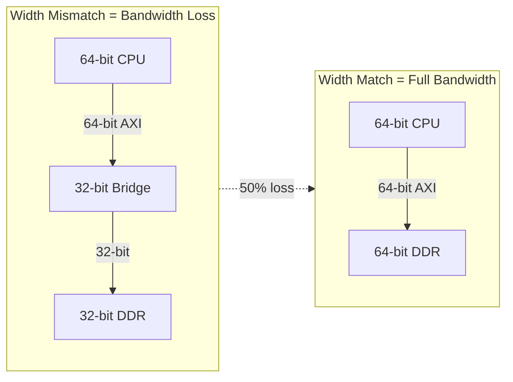
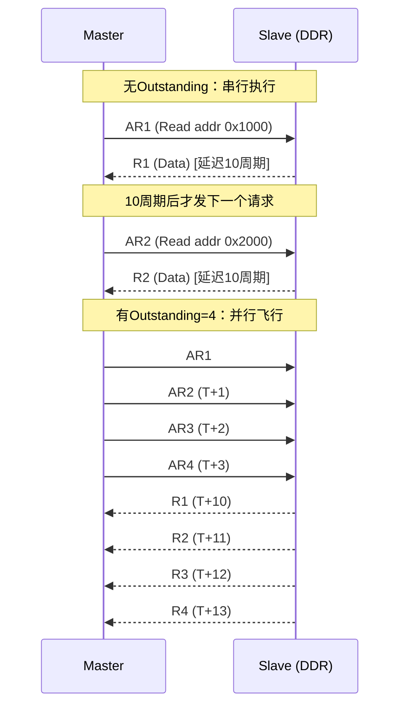
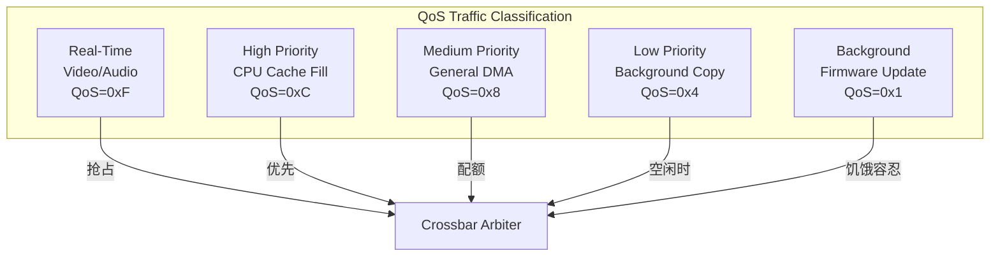

# AMBA性能优化

<span class="badge-b">[Beginner]</span> <span class="badge-i">[Intermediate]</span> <span class="badge-e">[Expert]</span>

---

<span class="red">为什么AMBA总线需要专门优化？</span> 总线协议的峰值带宽与有效带宽之间存在巨大差距——AXI4的理论峰值可能达到64GB/s，但如果突发长度短、 outstanding 少、仲裁策略差，实际利用率可能不足30%。性能优化的目标不是"跑得更快"，而是"让总线在等待最少的情况下持续满载"。AMBA性能优化的核心手段包括：带宽优化（让数据线不空闲）、延迟隐藏（用 outstanding 覆盖延迟）、QoS调优（让关键流量优先通行）——三者协同才能实现SoC总线的极致效率。

---

## <strong>带宽优化</strong>

### <strong>突发传输长度优化</strong>

<span class="red">突发传输（Burst Transfer）</span>是提升总线带宽的首要手段。
<br>
每次传输都有地址相位开销，突发越长，地址开销占比越低。

| 突发长度 | 地址相位占比 | 有效数据占比 | 相对带宽效率 |
|---------|------------|-------------|-------------|
| 1拍（SINGLE） | 50% | 50% | 1.0×（基准） |
| 4拍（INCR4） | 20% | 80% | 1.6× |
| 8拍（INCR8） | 11% | 89% | 1.78× |
| 16拍（INCR16） | 5.9% | 94.1% | 1.88× |
| 256拍（AXI4 MAX） | 0.4% | 99.6% | 1.99× |

<span class="blue">关键结论：从SINGLE提升到INCR4，带宽增益最大（+60%）；
<br>
继续提升到INCR16，边际收益递减（仅+5%）。
<br>
实际设计中，INCR8是带宽与延迟的最佳平衡点。</span>

```c
// DMA控制器突发长度配置优化
// 源：DDR（高带宽，支持长突发）
// 目的：SRAM（低延迟，支持中等突发）

typedef struct {
    uint32_t src_addr;
    uint32_t dst_addr;
    uint32_t xfer_size;      // 总传输字节数
    uint8_t  src_burst;      // 源突发长度
    uint8_t  dst_burst;      // 目的突发长度
    uint8_t  src_inc;        // 源地址递增/固定
    uint8_t  dst_inc;        // 目的地址递增/固定
} dma_config_t;

void dma_optimal_burst(dma_config_t *cfg, uint32_t total_bytes) {
    // DDR→SRAM：源用长突发最大化DDR带宽，目的用中等突发匹配SRAM
    if (total_bytes >= 256) {
        cfg->src_burst = 16;   // INCR16: 最大化DDR效率
        cfg->dst_burst = 8;    // INCR8:  SRAM最佳平衡点
    } else if (total_bytes >= 64) {
        cfg->src_burst = 8;
        cfg->dst_burst = 4;
    } else {
        cfg->src_burst = 4;
        cfg->dst_burst = 4;
    }
    
    // 地址对齐检查：突发边界对齐以避免拆分
    uint32_t src_align = cfg->src_addr & 0x3F;  // 64字节对齐检查
    uint32_t dst_align = cfg->dst_addr & 0x3F;
    
    if (src_align != 0 || dst_align != 0) {
        // 未对齐：回退到短突发或SW预处理对齐
        cfg->src_burst = 4;
        cfg->dst_burst = 4;
    }
}
```

---

### <strong>数据宽度匹配</strong>

总线数据宽度需与存储器位宽匹配，否则造成带宽浪费：



| 场景 | CPU宽度 | 总线宽度 | 存储器宽度 | 有效带宽 | 优化方案 |
|------|---------|---------|-----------|---------|---------|
| 理想匹配 | 64-bit | 64-bit | 64-bit | 100% | 无需优化 |
| 总线缩窄 | 64-bit | 32-bit | 64-bit | 50% | 加宽总线或拆分事务 |
| 存储器缩窄 | 64-bit | 64-bit | 32-bit | 50% | 双通道存储器或位宽转换 |
| 完全错位 | 128-bit | 64-bit | 32-bit | 25% | 重新设计数据通路 |

---

### <strong>读写通道并行</strong>

AXI的分离通道架构允许读写同时飞行：

```verilog
// AXI读写并行调度：CPU同时进行取指（读）和写回（写）
module axi_parallel_rw (
    input  wire        ACLK,
    input  wire        ARESETn,
    // 读通道
    output reg  [31:0] ARADDR,
    output reg         ARVALID,
    input  wire        ARREADY,
    input  wire [63:0] RDATA,
    input  wire        RVALID,
    output reg         RREADY,
    // 写通道
    output reg  [31:0] AWADDR,
    output reg         AWVALID,
    input  wire        AWREADY,
    output reg  [63:0] WDATA,
    output reg         WVALID,
    input  wire        WREADY,
    input  wire        BVALID,    // 写响应
    output reg         BREADY
);
    // 状态机：读和写完全独立，可并行推进
    localparam R_IDLE = 2'b00, R_AR = 2'b01, R_R = 2'b10;
    localparam W_IDLE = 2'b00, W_AW = 2'b01, W_W = 2'b10, W_B = 2'b11;
    reg [1:0] r_state, w_state;
    
    // 读状态机（独立于写）
    always @(posedge ACLK) begin
        if (!ARESETn) r_state <= R_IDLE;
        else case (r_state)
            R_IDLE: if (need_read)  r_state <= R_AR;
            R_AR:   if (ARVALID && ARREADY) r_state <= R_R;
            R_R:    if (RVALID && RREADY && RLAST) r_state <= R_IDLE;
        endcase
    end
    
    // 写状态机（独立于读）
    always @(posedge ACLK) begin
        if (!ARESETn) w_state <= W_IDLE;
        else case (w_state)
            W_IDLE: if (need_write) w_state <= W_AW;
            W_AW:   if (AWVALID && AWREADY) w_state <= W_W;
            W_W:    if (WVALID && WREADY && WLAST) w_state <= W_B;
            W_B:    if (BVALID && BREADY) w_state <= W_IDLE;
        endcase
    end
    
    // 读写通道信号同时有效，实现并行
    assign read_active  = (r_state != R_IDLE);
    assign write_active = (w_state != W_IDLE);
    // 两者可同时为高，AXI Crossbar负责调度
endmodule
```

<span class="blue">易错点：读和写并行时，若访问同一Slave的同一地址，
<br>
Crossbar需保证读写顺序一致性——AXI4默认不保证此顺序，
<br>
需使用AxID相同或软件显式屏障指令。</span>

---

## <strong>延迟隐藏</strong>

### <strong>Outstanding Transaction机制</strong>

<span class="red">Outstanding Transaction</span>指Master在未收到前一笔响应时就发出下一笔请求，
<br>
用后续请求"覆盖"前一请求的等待时间。



| Outstanding深度 | DDR延迟100ns@200MHz | 有效带宽提升 | 资源开销 |
|----------------|---------------------|-------------|---------|
| 1 | 20周期等待/请求 | 1.0×（基准） | 最小 |
| 4 | 5周期重叠/请求 | ~4.0× | 4个地址缓存 |
| 8 | 2.5周期重叠/请求 | ~8.0× | 8个地址缓存 |
| 16 | 1.25周期重叠/请求 | ~16.0× | 16个地址缓存 |

<span class="blue">关键结论：Outstanding深度=4可覆盖典型DDR延迟，
<br>
Outstanding深度=16适用于高延迟存储器（如NAND Flash控制器）。
<br>
超过16后边际收益极低，且Slave端需大量缓冲资源。</span>

```c
// CPU Cache控制器Outstanding配置
// L2 Cache到DDR的AXI接口，配置Outstanding深度
#define L2C_AUX_CTRL    (*(volatile uint32_t *)0x9000_0004)

void l2c_configure_outstanding(void) {
    uint32_t aux = L2C_AUX_CTRL;
    
    // 读Outstanding：8个（覆盖DDR行激活+列读取延迟）
    aux &= ~(0x7 << 12);
    aux |=  (0x3 << 12);  // 8 outstanding reads
    
    // 写Outstanding：4个（DDR写缓冲有限）
    aux &= ~(0x7 << 15);
    aux |=  (0x1 << 15);  // 4 outstanding writes
    
    L2C_AUX_CTRL = aux;
}
```

---

### <strong>乱序完成与ID管理</strong>

AXI的ARID/AWID机制允许Slave乱序响应，Master通过ID匹配重组数据：

```verilog
// AXI乱序完成重组缓冲（Reordering Buffer）
module axi_reorder_buffer (
    input  wire        ACLK,
    input  wire        ARESETn,
    input  wire [3:0]  RID,         // 来自Slave的响应ID
    input  wire [63:0] RDATA,
    input  wire        RVALID,
    output wire        RREADY,
    output reg  [63:0] ordered_data [0:15],  // ID=0~15的缓冲
    output reg         data_valid   [0:15]
);
    // 基于RID的散列缓冲，支持乱序到达的有序消费
    always @(posedge ACLK) begin
        if (RVALID) begin
            ordered_data[RID] <= RDATA;
            data_valid[RID]   <= 1'b1;
        end
    end
    
    // 按ID顺序输出（0→1→2→...）
    reg [3:0] expect_id;
    always @(posedge ACLK) begin
        if (!ARESETn)
            expect_id <= 4'd0;
        else if (data_valid[expect_id] && consumer_ready)
            expect_id <= expect_id + 1'b1;
    end
endmodule
```

| 乱序策略 | 优势 | 风险 | 适用场景 |
|---------|------|------|---------|
| 严格顺序（ID固定） | 软件简单，无重排开销 | 延迟累积 | 实时控制 |
| 有限乱序（ID窗口=4） | 平衡延迟与复杂度 | 需重排缓冲 | 通用DMA |
| 完全乱序（ID全范围） | 最大化带宽 | 重排资源大 | 高性能CPU |

---

## <strong>QoS调优</strong>

### <strong>流量分类与优先级映射</strong>

<span class="red">QoS（Quality of Service）</span>调优的本质是"在拥塞时保护关键流量"。



| 流量类型 | QoS值 | 仲裁策略 | 延迟要求 | 带宽要求 |
|---------|-------|---------|---------|---------|
| 实时音视频 | 0xF | 绝对抢占 | <1ms | 固定码率 |
| CPU I-Cache填充 | 0xD | 高优先级 | <100ns | 突发 |
| CPU D-Cache填充 | 0xC | 高优先级 | <1μs | 突发 |
| 显示控制器DMA | 0xA | 带宽配额 | <16ms/帧 | 固定带宽 |
| 通用DMA | 0x8 | 加权轮询 | <10ms | 尽力而为 |
| 网络数据包 | 0x6 | 配额+优先级 | <100μs | 突发 |
| 后台存储 | 0x4 | 最低优先级 | 无要求 | 尽力而为 |
| 固件更新 | 0x1 | 仅空闲时 | 无要求 | 极低 |

---

### <strong>动态QoS调整</strong>

静态QoS配置无法应对负载变化，需根据运行时状态动态调整：

```c
// 运行时QoS动态调整：根据FIFO水位线提升/降低优先级
#define ETH_QOS_REG     (*(volatile uint32_t *)(0x9000_1000 + 0x80))
#define ETH_FIFO_STATUS (*(volatile uint32_t *)(0x9000_1000 + 0x84))

void eth_dynamic_qos_adjust(void) {
    uint32_t fifo_level = (ETH_FIFO_STATUS >> 16) & 0xFF;  // FIFO填充水位
    
    if (fifo_level > 200) {
        // FIFO快满：提升QoS，紧急发送
        ETH_QOS_REG = 0xF;  // 实时级
    } else if (fifo_level > 100) {
        // FIFO半满：正常优先级
        ETH_QOS_REG = 0xA;  // 高优先级
    } else if (fifo_level > 10) {
        // FIFO少量：降低优先级，让出带宽
        ETH_QOS_REG = 0x6;  // 中等优先级
    } else {
        // FIFO几乎空：最低优先级
        ETH_QOS_REG = 0x2;  // 低优先级
    }
}
```

<span class="blue">易错点：QoS提升过猛会导致其他流量饿死——
<br>
实时流量（QoS=0xF）不应持续存在，仅在关键帧传输时短暂提升。
<br>
否则系统总带宽被单一流量垄断，造成系统性崩溃。</span>

---

### <strong>带宽配额与限速</strong>

对于后台流量，使用令牌桶算法限制带宽占用：

```verilog
// 令牌桶限速器：限制后台Master的带宽占用
module token_bucket_limiter (
    input  wire        HCLK,
    input  wire        HRESETn,
    input  wire        hbusreq,       // Master请求
    output reg         hgrant,        // 授权输出
    // 令牌桶配置
    input  wire [9:0]  tokens_per_cycle,  // 每周期补充令牌数
    input  wire [15:0] bucket_depth       // 桶最大容量
);
    reg [15:0] tokens;   // 当前令牌数
    reg [15:0] counter;    // 周期计数器
    
    always @(posedge HCLK) begin
        if (!HRESETn) begin
            tokens  <= bucket_depth;  // 初始满桶
            counter <= 16'd0;
        end else begin
            // 每周期补充令牌（模拟带宽配额）
            if (counter == 16'd0) begin
                if (tokens + tokens_per_cycle <= bucket_depth)
                    tokens <= tokens + tokens_per_cycle;
                else
                    tokens <= bucket_depth;
            end
            counter <= counter + 1'b1;
            
            // 授权时消耗令牌
            if (hgrant && hbusreq) begin
                if (tokens > 0)
                    tokens <= tokens - 1'b1;
            end
        end
    end
    
    // 有请求且有令牌时才授权
    always @(*) begin
        hgrant = hbusreq && (tokens > 0);
    end
endmodule
```

---

## <strong>历史演进段落</strong>

AMBA性能优化技术的发展与存储器技术、工艺节点和应用需求同步演进。1990年代，AMBA 1.0的ASB总线几乎没有优化空间——三态总线的物理限制使得频率无法突破50MHz， burst 传输尚未引入。1999年AMBA 2.0的AHB首次引入流水线突发传输，突发长度4/8/16拍成为标准优化手段，将总线利用率从50%提升到90%以上。2003年AMBA 3.0的AXI3是性能优化的里程碑：分离的读写通道使读写并行成为可能，基于ID的乱序完成机制首次在AMBA中引入，Outstanding Transaction概念让Master能够隐藏存储器延迟。2010年AMBA 4.0的AXI4将突发长度扩展到256拍，并引入QoS信号，使系统级带宽调度从"尽力而为"走向"服务质量保证"。2015年AMBA 5.0进一步增强了QoS语义，CHI协议的Flit传输和分层路由支持更大规模的 outstanding 和更细粒度的流量控制。在工程实践中，性能优化方法论也经历了从"手动调参"到"自动化分析"的转变——早期的设计者通过波形仿真调整突发长度和 outstanding 深度；现代SoC设计则使用SystemC TLM模型和AI驱动的流量分析工具，在设计阶段预测性能瓶颈。无论工具如何进化，AMBA性能优化的核心原则始终不变：最大化突发长度以摊薄地址开销、最大化 outstanding 以隐藏存储延迟、精细化QoS以保障关键流量——这三条原则构成了SoC总线性能优化的铁三角。

---

## <strong>本章小结</strong>

| 要点 | 内容 |
|------|------|
| 带宽优化 | 突发长度≥8拍、数据宽度匹配、读写通道并行 |
| 延迟隐藏 | Outstanding深度=4~16、乱序完成重组、ID管理 |
| QoS调优 | 4位QoS分级、动态水位调整、令牌桶限速 |
| 性能铁三角 | 突发长度×Outstanding深度×QoS调度 = 有效带宽 |
| 易错点 | Outstanding过深导致Slave缓冲溢出；QoS过高导致饿死 |

## <strong>练习</strong>

| 编号 | 题目 | 难度 |
|------|------|------|
| 1 | 计算AXI4在不同突发长度下的地址相位开销占比：SINGLE、INCR4、INCR16、INCR256。假设地址相位=1拍，数据相位=1拍 | <span class="badge-b">[B]</span> |
| 2 | DDR控制器延迟为150ns（300MHz总线），设计Outstanding深度使有效带宽达到峰值带宽的90%以上。给出计算过程 | <span class="badge-i">[I]</span> |
| 3 | 在多Master系统中，设计一个自适应QoS算法：根据各Master的历史带宽利用率动态调整其QoS值，防止带宽垄断同时保证实时性 | <span class="badge-e">[E]</span> |

---

<span class="purple">扩展阅读：ARM AMBA4/5性能优化应用笔记、Synopsys DesignWare DDR控制器配置指南、Micron DDR4 SDRAM数据手册（tRCD/tRP/tCL时序参数对Outstanding的影响）、IEEE论文"Outstanding Transaction Optimization for AXI-based Memory Controllers"。</span>
