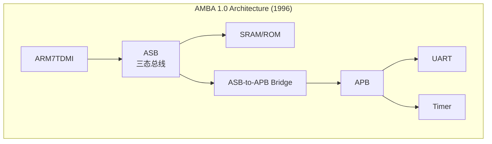
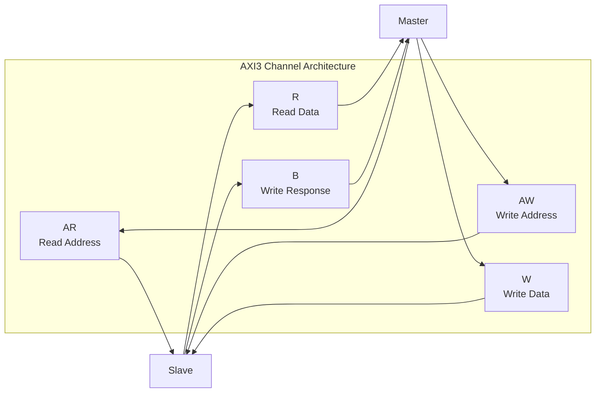
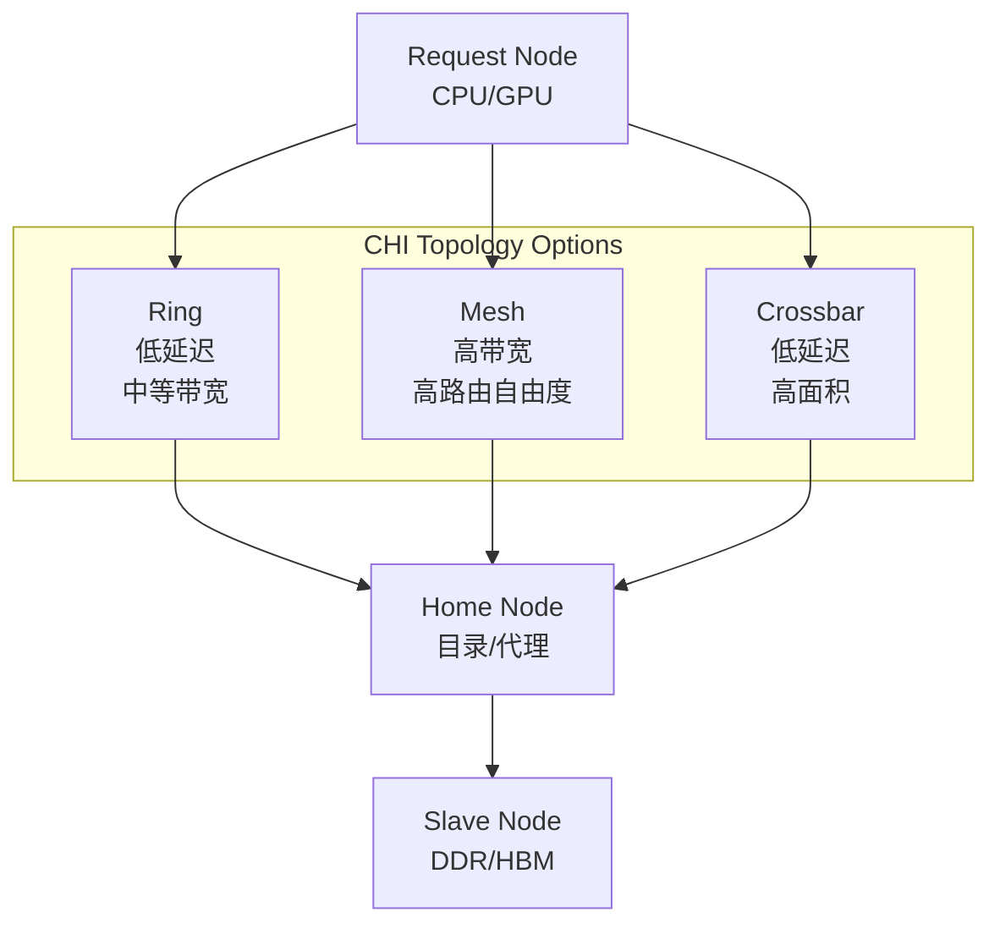
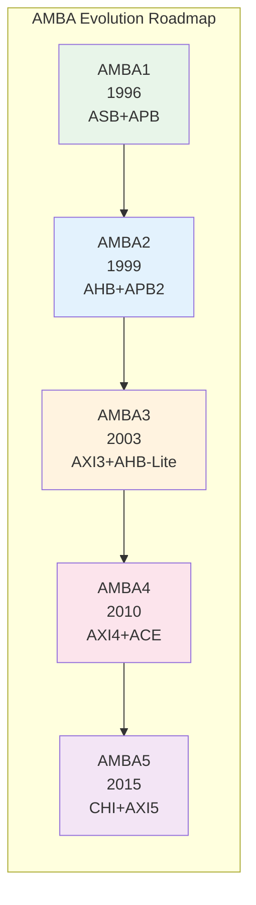

# AMBA历史演进

<span class="badge-b">[Beginner]</span> <span class="badge-i">[Intermediate]</span> <span class="badge-e">[Expert]</span>

---

<span class="red">为什么AMBA从1996年至今经历了五代演进？</span> AMBA的每一次版本升级都不是孤立的技术事件，而是对半导体工艺、系统架构和市场需求的系统性回应。从AMBA 1.0的0.35μm三态总线到AMBA 5的芯粒互联，总线协议的演进映射了嵌入式系统从单核MCU到多核异构SoC再到Chiplet封装的技术长征。理解这条从AHB到CHI的路线图，就是理解片上互连如何从"电气信号规范"进化为"系统架构语言"。

---

## <strong>AMBA 1.0：片上总线的启蒙</strong>

### <strong>ASB与APB的诞生</strong>

1996年，ARM推出AMBA 1.0规范，首次定义了片上总线的标准化接口。
<span class="red">AMBA 1.0</span>包含两个协议：

| 协议 | 全称 | 定位 | 关键技术 |
|------|------|------|---------|
| ASB | ARM System Bus | 高性能主总线 | 三态双向总线、分布式仲裁 |
| APB | Advanced Peripheral Bus | 低速外设总线 | 无流水线、两周期访问 |



AMBA 1.0的技术局限在当时是合理的：
<br>
0.35μm工艺下50MHz主频，三态总线的驱动竞争不是问题；
<br>
分布式仲裁的延迟不确定性在单核系统中可以容忍。

<span class="blue">关键结论：AMBA 1.0最大的遗产不是技术细节，而是"分层总线"架构思想——
<br>
高速主总线+低速外设总线的双层结构沿用至今。
</span>

---

## <strong>AMBA 2.0：AHB的崛起</strong>

### <strong>从三态到多路复用</strong>

1999年发布的AMBA 2.0是AHB的元年，也是AMBA从"能用"走向"好用"的转折点。

| 演进维度 | AMBA 1.0 (ASB) | AMBA 2.0 (AHB) |
|---------|---------------|---------------|
| 总线物理层 | 三态双向 | 多路复用单向 |
| 仲裁方式 | 分布式 | 集中式 (HBUSREQ/HGRANT) |
| 突发传输 | 不支持 | INCR/WRAP 4/8/16 |
| 流水线 | 无 | 地址/数据相位分离 |
| 响应类型 | 仅OKAY | OKAY/ERROR/RETRY/SPLIT |
| 典型频率 | ~50MHz | ~100MHz |

```verilog
// AMBA2 AHB集中式仲裁信号（取代ASB的分布式仲裁）
module ahb_arbiter_amba2 (
    input  wire        HCLK,
    input  wire        HRESETn,
    input  wire [3:0]  HBUSREQ,   // 4个Master请求
    output reg  [3:0]  HGRANT     // 授权信号
);
    // 固定优先级仲裁：M0 > M1 > M2 > M3
    always @(*) begin
        if (HBUSREQ[0])      HGRANT = 4'b0001;
        else if (HBUSREQ[1]) HGRANT = 4'b0010;
        else if (HBUSREQ[2]) HGRANT = 4'b0100;
        else if (HBUSREQ[3]) HGRANT = 4'b1000;
        else                 HGRANT = 4'b0000;
    end
endmodule
```

---

## <strong>AMBA 3.0：AXI与AHB-Lite</strong>

### <strong>AXI3的革命性架构</strong>

2003年AMBA 3.0是AMBA历史上最重要的版本之一。<span class="red">AXI3</span>引入了五种分离通道：

| 通道 | 方向 | 作用 |
|------|------|------|
| AR | Master→Slave | 读地址 |
| R | Slave→Master | 读数据 |
| AW | Master→Slave | 写地址 |
| W | Master→Slave | 写数据 |
| B | Slave→Master | 写响应 |



AXI3的核心创新：

| 创新点 | 技术内容 | 解决的问题 |
|--------|---------|-----------|
| 分离通道 | 读写地址/数据独立 | 读写并行，消除冲突 |
| 乱序完成 | ARID/RID匹配 | Slave可乱序响应，提升效率 |
| Outstanding | 支持多个未完成传输 | 隐藏存储器延迟 |
| 单边带信号 | 无三态，全单向 | 提升频率，简化时序 |

---

### <strong>AHB-Lite的简化</strong>

AMBA 3.0同时发布了<span class="green">AHB-Lite</span>——专为单主控MCU优化的子集：

| 裁剪项 | AHB (AMBA2) | AHB-Lite (AMBA3) | 节省 |
|--------|------------|-----------------|------|
| 仲裁信号 | HBUSREQ/HGRANT | 无 | ~30%面积 |
| SPLIT响应 | 支持 | 不支持 | 简化Slave |
| RETRY响应 | 支持 | 简化为ERROR | 简化Master |
| 多主控 | 支持 | 不支持 | 去掉仲裁器 |

```c
// Cortex-M0 AHB-Lite总线矩阵配置（无仲裁器）
#define SYS_AHB_CTRL  (*(volatile uint32_t *)0xE000_E008)

// AHB-Lite无需仲裁配置，Master始终拥有总线
// 地址译码器直接根据HADDR选择Slave
void sys_ahb_init(void) {
    // 仅需配置地址映射，无优先级/配额设置
    SYS_AHB_CTRL = 0x00000001;  // 使能总线矩阵
}
```

<span class="blue">关键结论：AHB-Lite的门数约为完整AHB的40%，
<br>
成为Cortex-M0/M3/M4的标准总线——这是"恰到好处"设计的典范。
</span>

---

## <strong>AMBA 4.0：QoS与ACE</strong>

### <strong>AXI4的性能增强</strong>

2010年AMBA 4.0对AXI进行了三项关键增强：

| 增强项 | AXI3 | AXI4 | 影响 |
|--------|------|------|------|
| 突发长度 | 最大16拍 | 最大256拍 | 长突发提升DDR效率 |
| QoS信号 | 无 | 4位ARQOS/AWQOS | 服务质量调度 |
| 传输宽度 | 固定 | 支持窄传输 | 兼容不同宽度设备 |
| 写交织 | 支持 | 去除（简化） | 降低Slave复杂度 |

---

### <strong>ACE：缓存一致性入场</strong>

<span class="red">ACE（AXI Coherency Extensions）</span>是AMBA 4.0最具战略意义的协议——
<br>
首次在AMBA中定义了硬件缓存一致性语义。

| ACE特性 | 技术内容 | 应用场景 |
|--------|---------|---------|
| 脏数据共享 | 允许Cache之间直接传递脏行 | 多核CPU cluster |
| 屏障操作 | DMB/DSB硬件化 | 内存排序保证 |
| 分布式虚拟内存 | SMMU与Cache联动 | IO虚拟化 |
| 系统缓存 | 支持外部System Cache | 异构加速器 |

```verilog
// ACE一致性请求示例：读共享（ReadShared）
module ace_coherent_read (
    input  wire        ACLK,
    input  wire        ARVALID,
    output wire        ARREADY,
    output reg  [3:0]  ARDOMAIN,   // ACE：一致性域
    output reg  [1:0]  ARBAR,       // ACE：屏障类型
    output reg  [3:0]  ARSNOOP      // ACE：一致性请求类型
);
    // ARSNOOP编码：ReadShared = 4'b0001
    // 表示Master希望读取数据并进入Shared状态
    // 如果其他Cache有脏副本，需通过CD通道转发
    
    always @(*) begin
        ARDOMAIN = 4'b0001;   // Inner Shareable域
        ARBAR    = 2'b00;     // 非屏障访问
        ARSNOOP  = 4'b0001;   // ReadShared
    end
endmodule
```

---

## <strong>AMBA 5.0：CHI与下一代互连</strong>

### <strong>CHI：从总线到网络</strong>

2015年AMBA 5.0发布了<span class="red">CHI（Coherent Hub Interface）</span>——
<br>
这不是AXI的升级，而是全新的互连架构。

| 维度 | AXI4/ACE | CHI |
|------|---------|-----|
| 传输单元 | 基于Burst | 基于Flit |
| 拓扑结构 | Crossbar为主 | 支持Ring/Mesh/Torus |
| 路由方式 | 地址译码 | 基于TargetID的路由 |
| 一致性协议 | MOESI简化 | 完整MOESI |
| 错误处理 | 响应信号 | 带内Retry/Error Flit |
| 频率上限 | ~500MHz | ~1GHz+ |



---

### <strong>从AHB到CHI的路线图</strong>



AMBA协议的演进路线与ARM处理器架构的演进完全同步：

| 年代 | ARM处理器 | AMBA协议 | 设计目标 |
|------|----------|---------|---------|
| 1996 | ARM7TDMI | AMBA1 (ASB+APB) | 简单MCU |
| 1999 | ARM926EJ | AMBA2 (AHB+APB2) | 中速嵌入式 |
| 2003 | ARM11/Cortex-M | AMBA3 (AXI3+AHB-Lite) | 多核/低功耗MCU |
| 2010 | Cortex-A9/A15 | AMBA4 (AXI4+ACE) | 多核应用处理器 |
| 2015 | Cortex-A53/A73 | AMBA5 (CHI+AXI5) | 异构SoC/服务器 |
| 2020+ | Neoverse/Cortex-X | AMBA5扩展 | 芯粒/数据中心 |

---

### <strong>AHB到CHI的过渡关系</strong>

| 应用场景 | 旧方案 (AMBA2/3) | 新方案 (AMBA4/5) | 过渡驱动力 |
|---------|-----------------|-----------------|-----------|
| CPU-DDR互连 | AHB Multi-layer | AXI4 Crossbar | 带宽需求增长10倍 |
| 多核一致性 | SW维护 (无硬件一致性) | ACE/CHI | 多核成为标配 |
| IO外设 | APB2 | APB4/5 + TrustZone | 安全需求 |
| MCU内部 | AHB-Lite | AHB5 (扩展) | 低功耗+安全 |
| 加速器互连 | AXI4 | CHI | 异构计算 |

<span class="purple">扩展：RISC-V生态中的TileLink协议正在挑战AMBA在开源领域的垄断地位，
<br>
但AMBA凭借其庞大的商业IP生态（Synopsys/Cadence/ARM的数千个验证过的IP核），
<br>
仍将在商业SoC中保持统治地位至少到2030年。
</span>

---

## <strong>历史演进段落</strong>

AMBA从1996年到2025年近三十年的发展，完整地映射了嵌入式和移动计算领域的技术跃迁。1996年的AMBA 1.0诞生于ARM7时代，当时的SoC只需要连接CPU、SRAM和简单外设，三态总线ASB在0.35μm工艺下完全够用。1999年AMBA 2.0的AHB是对半导体工艺进入0.18μm时代的回应——频率提升到100MHz以上后，三态总线的驱动竞争成为致命瓶颈，多路复用单向信号和集中式仲裁成为必然选择。2003年AMBA 3.0的AXI3则是多核时代的先声，ARM11开始探索多处理器配置，分离的读写通道和乱序完成机制为后来的多核互连奠定了技术基础；同期发布的AHB-Lite精准切入了正在爆发的MCU市场，Cortex-M0/M3系列凭借极简的AHB-Lite总线实现了超低成本。2010年AMBA 4.0的ACE协议是移动计算时代的产物，Cortex-A9/A15的多核cluster需要硬件缓存一致性来支撑Android/Linux的高效运行，ACE的MOESI状态机和屏障操作成为移动SoC的标配。2015年AMBA 5.0的CHI则是ARM向服务器和基础设施市场扩张的信号，Neoverse处理器需要比AXI更高频率、更大规模的互连，CHI的Flit传输和分层拓扑支持了从8核到128核的扩展。近年来，随着芯粒（Chiplet）架构和先进封装技术的成熟，AMBA协议也在向跨die互连演进——CHI的Flit天然适合 Serializer/Deserializer（SerDes）传输，而APB5的Q-Channel支持了芯粒级的电源管理。AMBA的演进史证明了一个设计哲学：总线协议不是越新越好，而是"在正确的时间为正确的市场提供正确的复杂度"——AHB-Lite在AMBA5时代仍在出货数十亿颗MCU，就是最好的例证。

---

## <strong>本章小结</strong>

| 要点 | 内容 |
|------|------|
| AMBA1 | ASB三态总线+APB，片上总线的启蒙 |
| AMBA2 | AHB取代ASB，集中式仲裁+突发传输，频率翻倍 |
| AMBA3 | AXI3分离通道+乱序完成，AHB-Lite单Master优化 |
| AMBA4 | AXI4长突发+QoS，ACE引入硬件缓存一致性 |
| AMBA5 | CHI基于Flit的分层网络，AXI5安全扩展，APB5低功耗 |
| 演进规律 | 与ARM处理器代际同步，从总线→网络，从单核→芯粒 |

## <strong>练习</strong>

| 编号 | 题目 | 难度 |
|------|------|------|
| 1 | 对比AMBA1的ASB与AMBA2的AHB信号差异，说明三态总线在物理层上的三个固有缺陷 | <span class="badge-i">[I]</span> |
| 2 | AXI3的分离通道架构如何支撑Outstanding Transaction？画出2个读请求和1个写请求在5个通道上的时序图 | <span class="badge-i">[I]</span> |
| 3 | 在"8核Neoverse服务器SoC"中，对比ACE和CHI的一致性实现差异：拓扑结构、传输单元、延迟模型、扩展性上限 | <span class="badge-e">[E]</span> |

---

<span class="purple">扩展阅读：ARM AMBA规格书完整系列（AMBA 1/2/3/4/5）、ARM Cortex-A53技术参考手册（总线接口章节）、IBM CORECONNECT架构对比白皮书、IEEE论文"Evolution of On-Chip Interconnects: From Buses to Networks"、CHI协议官方培训材料（ARM Learning Center）。
</span>
