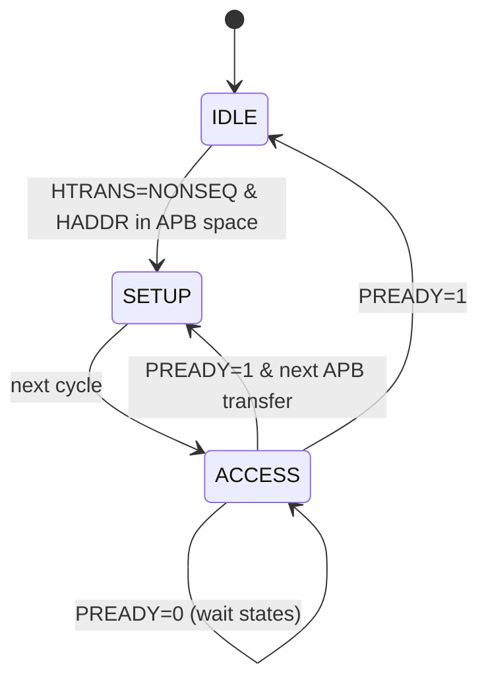

# APB逻辑级与桥接器

<span class="badge-i">[Intermediate]</span>

<span class="red">APB（Advanced Peripheral Bus）</span> 是 AMBA 家族中最简单的总线，专为低速外设设计。

---

## <strong>基础认知</strong>

### <strong>APB 传输时序</strong>

```
        T1      T2      T3
PCLK    |       |       |
PSEL    |______/‾‾‾‾‾‾‾\_____  选中从设备
PENABLE |____________/‾‾‾‾‾‾‾\  使能
PWRITE  |‾‾‾‾‾‾‾‾‾‾‾‾‾‾‾‾‾‾‾‾‾  写操作
PWDATA  |====DATA=============  数据
PRDATA  |                     读数据
PREADY  |____________/‾‾‾‾‾‾‾  从设备就绪
```

<span class="blue">APB 传输固定为两个周期（Setup + Access）</span>，无流水线，无突发。

### <strong>APB2/3/4/5 差异</strong>

| 版本 | 新增特性 |
|------|----------|
| APB2 | 基础协议 |
| APB3 | PREADY（从设备可扩展周期） |
| APB4 | PPROT（保护类型）、PSTRB（字节选通） |
| APB5 | PWAKEUP（低功耗唤醒）、PCHK（校验） |

---

## <strong>原理解析</strong>

### <strong>AHB-to-APB Bridge 状态机</strong>



<span class="red">Bridge 将 AHB 的流水线突发传输转换为 APB 的单周期访问。</span>

---

## <strong>软硬件实战</strong>

### <strong>Verilog Bridge 设计</strong>

```verilog
// AHB-to-APB Bridge 简化逻辑
always @(posedge HCLK) begin
    if (HTRANS == NONSEQ && HADDR inside [APB_BASE:APB_END]) begin
        apb_psel <= 1;
        apb_paddr <= HADDR;
        apb_pwrite <= HWRITE;
        apb_pwdata <= HWDATA;
    end
end
```

---

## <strong>历史演进</strong>

- <span class="green">AMBA 1.0</span> — APB 作为 ASB 的从设备总线<br>
- <span class="green">AMBA 2.0</span> — APB2 独立定义<br>
- <span class="green">AMBA 3.0</span> — APB3 引入 PREADY<br>
- <span class="green">AMBA 4.0</span> — APB4 增加安全扩展<br>
- <span class="green">AMBA 5.0</span> — APB5 支持低功耗

---

## 小结与练习

**练习**

1. 画出APB4写传输的完整时序图（含PPROT和PSTRB）。
2. 分析为什么APB不能有流水线传输。
3. 设计一个APB GPIO控制器的寄存器映射。
