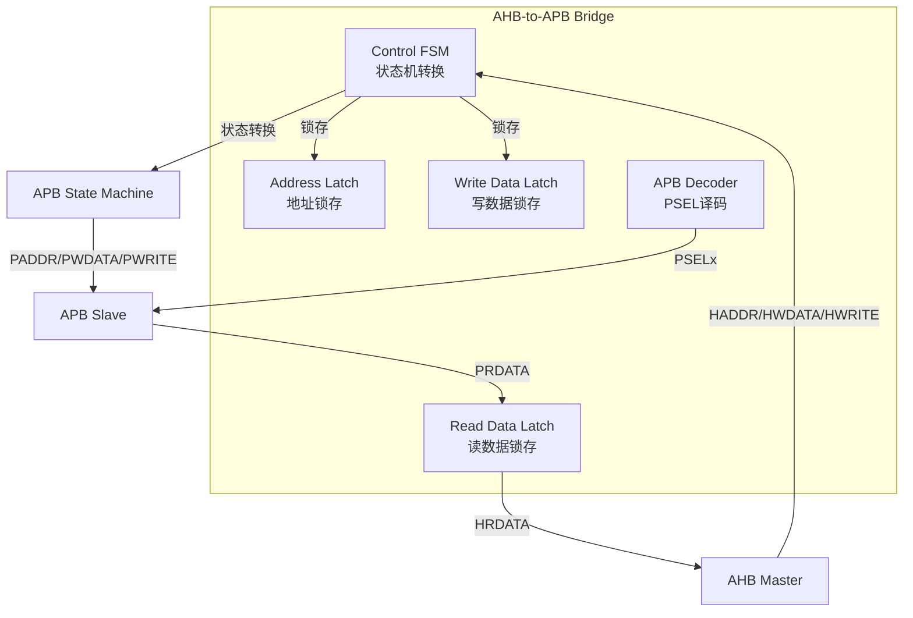
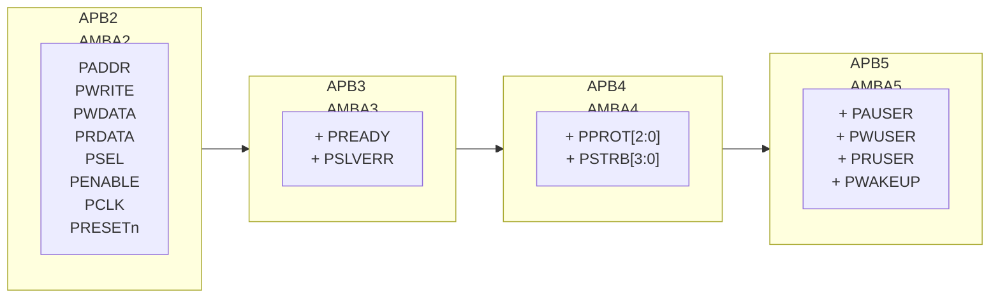
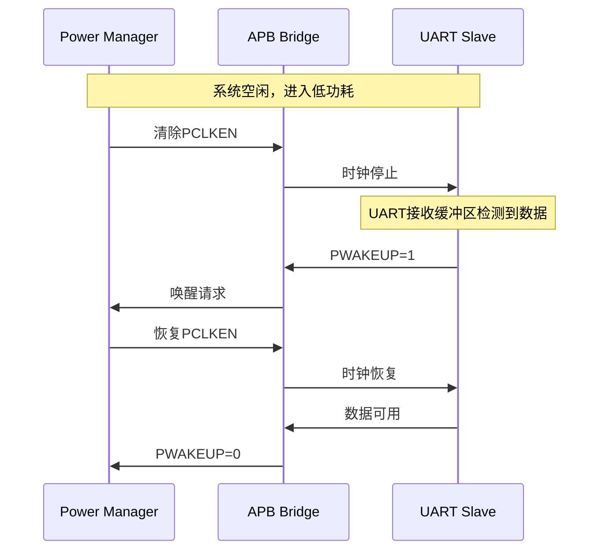

# APB逻辑级与桥接器

<span class="badge-b">[Beginner]</span> <span class="badge-i">[Intermediate]</span> <span class="badge-e">[Expert]</span>

---

<span class="red">为什么APB需要专门的桥接器设计？</span> APB的哲学是"简单、低速、静态"——它不支持流水线、突发传输或多 outstanding，一次读写固定需要Setup+Access两个周期。当APB外设需要挂载在AHB或AXI总线下时，桥接器必须将高速主总线的流水线事务"降速"为APB的两周期访问，同时处理时钟域差异、协议转换和低功耗信号传递。APB桥接器不是简单的"信号转发"，而是"协议翻译器"——理解AHB/AXI与APB在时序语义上的本质差异，是设计可靠桥接器的关键。

---

## <strong>APB桥接器设计</strong>

### <strong>AHB-to-APB桥接器架构</strong>

<span class="red">AHB-to-APB Bridge</span>是最常见的APB桥接器，将AHB的突发流水线世界转换为APB的两周期静态世界。



桥接器的核心职责：

| 转换维度 | AHB侧 | APB侧 | 桥接器处理 |
|---------|-------|-------|-----------|
| 传输周期 | 1拍/地址（流水线） | 2拍固定（Setup+Access） | 插入等待状态（HREADY=0） |
| 突发传输 | INCR/WRAP支持 | 不支持 | 拆分为单次访问序列 |
| 数据宽度 | 32/64/128位 | 32位（典型） | 位宽转换或多次访问 |
| 响应类型 | HRESP[1:0] | PSLVERR | 错误码映射 |
| 写掩码 | HWSTRB（部分实现） | PSTRB（APB4） | 字节使能传递 |

---

### <strong>桥接器状态机设计</strong>

```verilog
// AHB-to-APB桥接器核心状态机
module ahb2apb_bridge (
    input  wire        HCLK,          // AHB时钟（通常更快）
    input  wire        PCLK,          // APB时钟（通常更慢或相等）
    input  wire        HRESETn,
    // AHB Slave接口
    input  wire [31:0] HADDR,
    input  wire        HWRITE,
    input  wire [2:0]  HSIZE,
    input  wire [2:0]  HBURST,
    input  wire [1:0]  HTRANS,
    input  wire [31:0] HWDATA,
    output reg  [31:0] HRDATA,
    output reg         HREADY,
    output reg  [1:0]  HRESP,
    // APB Master接口
    output reg  [31:0] PADDR,
    output reg         PWRITE,
    output reg         PSEL,
    output reg         PENABLE,
    output reg  [31:0] PWDATA,
    input  wire [31:0] PRDATA,
    input  wire        PREADY,
    input  wire        PSLVERR
);
    // 状态定义
    localparam IDLE    = 3'b000;
    localparam AHB_REQ = 3'b001;  // 捕获AHB请求
    localparam APB_SETUP = 3'b010; // APB Setup周期
    localparam APB_ACCESS = 3'b011; // APB Access周期
    localparam AHB_RESP  = 3'b100; // 返回AHB响应
    
    reg [2:0] state;
    reg [31:0] latched_addr;
    reg [31:0] latched_wdata;
    reg        latched_write;
    
    // 主状态机（HCLK域）
    always @(posedge HCLK or negedge HRESETn) begin
        if (!HRESETn) begin
            state <= IDLE;
            PSEL    <= 1'b0;
            PENABLE <= 1'b0;
            HREADY  <= 1'b1;  // 默认准备好
        end else case (state)
            IDLE: begin
                // 检测AHB传输请求（NONSEQ或SEQ）
                if (HTRANS == 2'b10 || HTRANS == 2'b11) begin
                    state <= AHB_REQ;
                    HREADY <= 1'b0;  // 拉低等待
                    // 锁存AHB信号
                    latched_addr  <= HADDR;
                    latched_wdata <= HWDATA;
                    latched_write <= HWRITE;
                end
            end
            
            AHB_REQ: begin
                // 进入APB Setup周期
                state  <= APB_SETUP;
                PADDR  <= latched_addr;
                PWRITE <= latched_write;
                PWDATA <= latched_wdata;
                PSEL   <= 1'b1;   // 选择APB从机
                PENABLE <= 1'b0;  // Setup阶段PENABLE=0
            end
            
            APB_SETUP: begin
                // 进入APB Access周期
                state   <= APB_ACCESS;
                PENABLE <= 1'b1;  // Access阶段PENABLE=1
            end
            
            APB_ACCESS: begin
                if (PREADY) begin
                    // APB传输完成
                    state  <= AHB_RESP;
                    PSEL   <= 1'b0;
                    PENABLE <= 1'b0;
                    HRDATA <= PRDATA;  // 锁存读数据
                    HRESP  <= PSLVERR ? 2'b01 : 2'b00;  // ERROR或OKAY
                end
                // 若PREADY=0，保持Access状态（等待周期）
            end
            
            AHB_RESP: begin
                // 恢复HREADY，准备下一次传输
                state  <= IDLE;
                HREADY <= 1'b1;
            end
        endcase
    end
endmodule
```

<span class="blue">关键结论：桥接器状态机有4个核心状态——
<br>
IDLE捕获请求、AHB_REQ锁存信号、APB_SETUP发送地址、APB_ACCESS完成传输。
<br>
每个AHB访问至少被延长2个HCLK周期（APB的Setup+Access）。
</span>

---

### <strong>突发传输拆分</strong>

当AHB发起突发传输时，桥接器需将其拆分为APB单次访问序列：

```c
// AHB突发到APB单次的拆分逻辑（伪代码）
void ahb_burst_to_apb_single(uint32_t start_addr, uint8_t burst_type, uint8_t num_beats) {
    uint32_t addr = start_addr;
    uint32_t beat_size = get_beat_size(burst_type);  // 每拍字节数
    
    for (int i = 0; i < num_beats; i++) {
        // 每次循环执行一次完整的APB Setup+Access
        apb_setup_cycle(addr);   // T1: 置PSEL=1, PENABLE=0
        apb_access_cycle(addr);  // T2: 置PENABLE=1, 等待PREADY
        
        // 计算下一拍地址
        addr += beat_size;
        
        // AHB侧持续拉低HREADY直到整个突发完成
        if (i == num_beats - 1)
            hready_release();  // 最后一批才释放HREADY
    }
}
```

| AHB突发类型 | APB等效操作 | 周期代价（HCLK:APB同频） |
|-----------|-----------|------------------------|
| SINGLE | 1次APB访问 | 2 HCLK |
| INCR4 | 4次APB访问 | 8 HCLK |
| INCR8 | 8次APB访问 | 16 HCLK |
| INCR16 | 16次APB访问 | 32 HCLK |

<span class="blue">易错点：突发拆分时地址递增步长由HSIZE决定——
<br>
HSIZE=010（32位）时步长=4字节；HSIZE=001（16位）时步长=2字节。
<br>
桥接器必须正确解析HSIZE，否则导致数据错位。
</span>

---

## <strong>APB版本差异</strong>

### <strong>APB2到APB5的信号演进</strong>

<span class="red">APB协议</span>从AMBA2到AMBA5经历了五次修订，每次增加关键信号：

| 版本 | 年份 | 新增信号 | 解决的问题 |
|------|------|---------|-----------|
| APB2 | 1999 | 基础9信号 | 低速外设寄存器访问 |
| APB3 | 2003 | PREADY, PSLVERR | 慢速Slave等待、错误报告 |
| APB4 | 2010 | PPROT[2:0], PSTRB[3:0] | TrustZone安全、字节掩码 |
| APB5 | 2015 | PAUSER, PWUSER, PRUSER, PWAKEUP | 用户扩展、低功耗唤醒 |



---

### <strong>PPROT安全域信号</strong>

APB4引入的<span class="green">PPROT[2:0]</span>是TrustZone系统的核心信号：

| 位 | 名称 | 0 | 1 | 应用场景 |
|----|------|---|---|---------|
| [0] | 特权级 | Normal | Privileged | OS内核vs用户态 |
| [1] | 安全域 | Secure | Non-secure | TrustZone隔离 |
| [2] | 指令/数据 | Data | Instruction | 指令获取保护 |

```c
// TrustZone APB外设：基于PPROT的安全访问控制
#define SECURE_CTRL  (*(volatile uint32_t *)(APB_BASE + 0x00))
#define NS_CTRL      (*(volatile uint32_t *)(APB_BASE + 0x04))

// 安全世界访问（PPROT[1]=0）
void secure_periph_write(uint32_t value) {
    // 桥接器传递PPROT=3'b000（Secure, Privileged, Data）
    SECURE_CTRL = value;  // 允许访问
}

// 非安全世界访问（PPROT[1]=1）
void nonsecure_periph_write(uint32_t value) {
    // 桥接器传递PPROT=3'b010（Non-secure, Privileged, Data）
    NS_CTRL = value;  // 仅能访问NS_CTRL寄存器
    // 若试图写SECURE_CTRL，桥接器或Slave返回PSLVERR
}
```

---

### <strong>PSTRB写字节掩码</strong>

APB4的<span class="green">PSTRB[3:0]</span>支持32位总线上的部分字节写入：

| PSTRB | 写入字节 | 保持不变 |
|-------|---------|---------|
| 4'b0001 | byte[7:0] | byte[31:8] |
| 4'b0010 | byte[15:8] | byte[31:0] except [15:8] |
| 4'b0100 | byte[23:16] | 其余字节 |
| 4'b1000 | byte[31:24] | 其余字节 |
| 4'b1100 | byte[31:16] | byte[15:0] |
| 4'b1111 | byte[31:0] | 无（全写） |

```verilog
// APB Slave支持PSTRB的部分写入逻辑
module apb_slave_with_strb (
    input  wire        PCLK,
    input  wire        PRESETn,
    input  wire [31:0] PADDR,
    input  wire        PWRITE,
    input  wire        PSEL,
    input  wire        PENABLE,
    input  wire [31:0] PWDATA,
    input  wire [3:0]  PSTRB,       // APB4新增
    output reg  [31:0] PRDATA,
    input  wire        PREADY,
    output reg         PSLVERR
);
    reg [31:0] reg_file [0:15];  // 16个32位寄存器
    
    always @(posedge PCLK) begin
        if (PSEL && PENABLE && PWRITE && PREADY) begin
            // 基于PSTRB的按字节写入
            if (PSTRB[0]) reg_file[PADDR[5:2]][7:0]   <= PWDATA[7:0];
            if (PSTRB[1]) reg_file[PADDR[5:2]][15:8]  <= PWDATA[15:8];
            if (PSTRB[2]) reg_file[PADDR[5:2]][23:16] <= PWDATA[23:16];
            if (PSTRB[3]) reg_file[PADDR[5:2]][31:24] <= PWDATA[31:24];
        end
    end
    
    always @(*) begin
        PRDATA = reg_file[PADDR[5:2]];
    end
endmodule
```

---

## <strong>低功耗接口</strong>

### <strong>APB5的PWAKEUP与Q-Channel</strong>

<span class="red">APB5</span>引入了系统级低功耗支持：

| 信号 | 方向 | 功能 |
|------|------|------|
| PWAKEUP | Slave→System | 外设请求系统唤醒 |
| PCLKEN | System→APB | 时钟使能（低功耗时关闭） |



```c
// APB5低功耗唤醒控制（Linux设备驱动视角）
#define UART_PWAKEUP_CTRL  (*(volatile uint32_t *)(UART_BASE + 0x10))

// 配置UART在接收到数据时触发PWAKEUP
void uart_enable_wakeup(void) {
    // 使能接收中断与PWAKEUP联动
    UART_PWAKEUP_CTRL |= (1 << 0);  // WAKEUP_EN
    
    // 系统可安全进入WFI/WFE
    system_enter_sleep();
}

// 中断服务程序
void UART_IRQHandler(void) {
    if (UART_PWAKEUP_CTRL & (1 << 1)) {
        // 清除唤醒标志
        UART_PWAKEUP_CTRL &= ~(1 << 1);
        // 正常读取数据
        uint8_t data = UART_RDR;
    }
}
```

<span class="blue">易错点：PCLKEN关闭期间，APB总线上的信号必须保持稳定——
</br>

如果Master在PCLKEN=0时改变PADDR/PWRITE，
<br>
时钟恢复后的第一个上升沿会采样到错误状态。
</span>

---

## <strong>历史演进段落</strong>

APB桥接器的设计演进是AMBA协议从"单一功能"走向"系统整合"的缩影。1999年AMBA 2.0的APB2仅定义了基础读写信号，当时的AHB-to-APB Bridge只是简单的两周期状态机，没有等待周期也没有错误处理，因为所有外设都是快速寄存器。2003年AMBA 3.0引入APB3后，桥接器复杂度显著增加——PREADY支持意味着桥接器必须处理不定长的等待状态，PSLVERR要求错误传播路径，这使得桥接器从组合逻辑升级为时序状态机。2010年AMBA 4.0的APB4给桥接器带来了TrustZone挑战：PPROT信号需要在AHB→APB转换时正确提取并传递，PSTRB的字节掩码需要桥接器解析HSIZE/HWSTRB后生成。2015年AMBA 5.0的APB5进一步引入了低功耗信号PWAKEUP，桥接器成为系统电源管理的关键节点，需要在PCLKEN关闭时保持信号稳定、在PWAKEUP触发时快速恢复时钟。从RTL实现角度看，早期的APB桥接器只需几十行代码，现代APB5桥接器则包含数百行状态机、时钟门控控制和跨域同步逻辑。在SoC设计工具链中，APB桥接器也从手写RTL演变为自动生成——Synopsys的CoreAssembler和ARM的CoreLink可自动生成带完整协议转换的桥接器，但理解其内部工作原理仍是调试总线死锁和时序违例的必备技能。

---

## <strong>本章小结</strong>

| 要点 | 内容 |
|------|------|
| 桥接器核心 | 状态机转换：AHB流水线→APB两周期，拆突发为单次序列 |
| APB版本差异 | APB2基础→APB3等待/错误→APB4安全/掩码→APB5低功耗唤醒 |
| PPROT | TrustZone安全域信号，3位定义特权/安全/指令属性 |
| PSTRB | 4位写字节掩码，支持32位总线上的部分字节写入 |
| 低功耗 | PCLKEN时钟门控 + PWAKEUP唤醒请求，桥接器需保持稳定 |

## <strong>练习</strong>

| 编号 | 题目 | 难度 |
|------|------|------|
| 1 | 画出AHB-to-APB桥接器的完整状态机转换图（4状态），标注每个状态的输出信号值 | <span class="badge-b">[B]</span> |
| 2 | 对比APB2与APB4的信号差异：PPROT和PSTRB分别解决了什么设计痛点？给出TrustZone外设的Verilog实现片段 | <span class="badge-i">[I]</span> |
| 3 | AHB Master发起INCR8突发（HSIZE=32位，HBURST=INCR8），AHB时钟100MHz，APB时钟50MHz。计算桥接器完成整个突发所需的最少HCLK周期，并说明如何优化状态机减少等待 | <span class="badge-e">[E]</span> |

---

<span class="purple">扩展阅读：ARM AMBA APB4/5规范（桥接器章节）、Synopsys DesignWare AHB-to-APB Bridge数据手册、ARM CoreLink SDK-100 APB桥接器参考设计、IEEE论文"Low-Power APB Bridge Design for IoT SoCs"。
</span>
