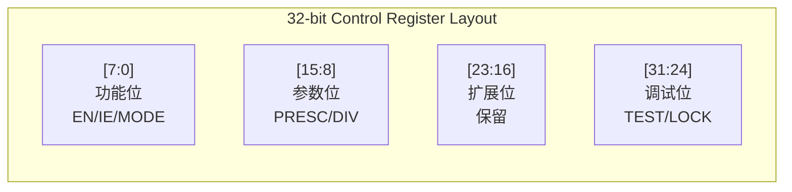
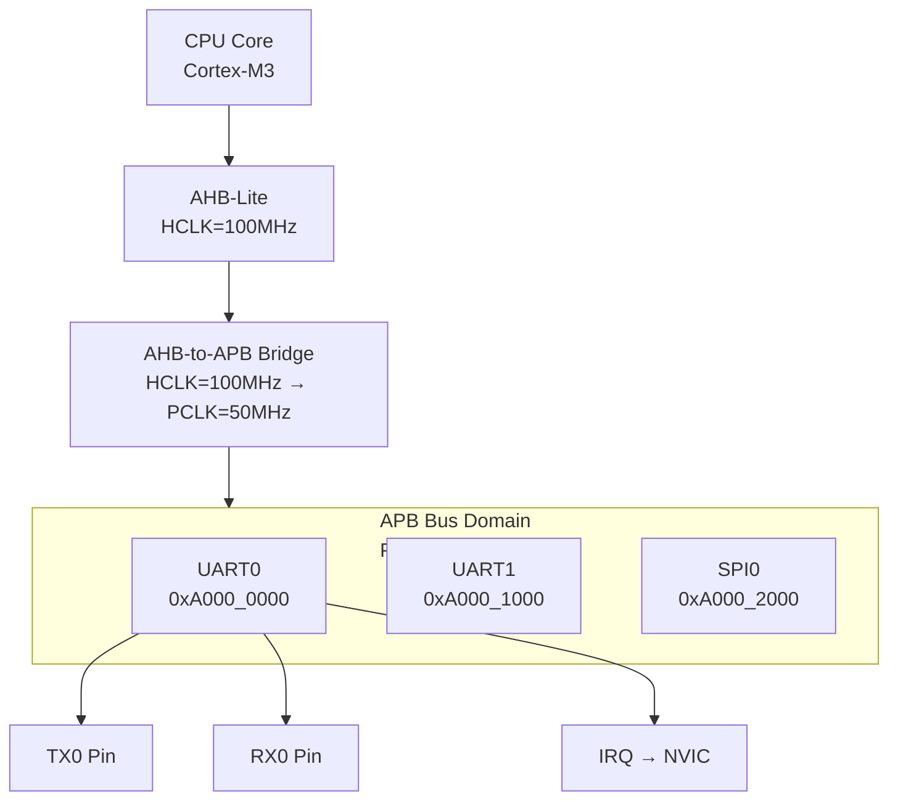

# APB嵌入式实战案例

<span class="badge-b">[Beginner]</span> <span class="badge-i">[Intermediate]</span> <span class="badge-e">[Expert]</span>

---

<span class="red">为什么寄存器映射设计是APB实战的核心？</span> APB总线的全部功能就是"读写寄存器"——没有突发、没有乱序、没有缓存一致性，只有简单的两周期Setup+Access。因此，APB嵌入式实战的本质是"如何用一组32位寄存器控制一个外设"。GPIO的每个引脚对应一个bit，UART的波特率由分频寄存器决定，Timer的周期由重载寄存器控制。一套设计良好的寄存器映射方案能让软件驱动开发事半功倍；一套糟糕的映射会让驱动工程师在移位和掩码操作中痛苦不堪。理解"寄存器即接口"的设计哲学，是APB嵌入式实战的第一课。

---

## <strong>寄存器映射设计</strong>

### <strong>设计原则</strong>

<span class="red">寄存器映射（Register Map）</span>是软件与外设之间的契约，需遵循五项原则：

| 原则 | 内容 | 违反后果 |
|------|------|---------|
| 对齐 | 寄存器按4字节（32位）对齐 | 非对齐访问触发硬件异常 |
| 粒度 | 每个控制域独立寄存器 | 共享寄存器导致竞态 |
| 原子性 | 关键操作单寄存器完成 | 多寄存器操作非原子 |
| 可读性 | 状态寄存器只读，控制寄存器读写 | 误写状态导致不可预期行为 |
| 默认值 | 复位后外设处于安全状态 | 默认使能导致系统不稳定 |

```c
// 典型APB外设寄存器映射模板（以32位Timer为例）
#define TIMER_BASE      0xA000_3000

// 控制寄存器（读写）
#define TIMER_CTRL      (*(volatile uint32_t *)(TIMER_BASE + 0x00))
#define   TIMER_CTRL_EN     (1 << 0)   // 使能位
#define   TIMER_CTRL_IE     (1 << 1)   // 中断使能
#define   TIMER_CTRL_MODE   (1 << 2)   // 0=单次，1=周期
#define   TIMER_CTRL_PRESC  (0xFF << 8) // 预分频[15:8]

// 重载寄存器（只写，影子寄存器）
#define TIMER_RELOAD    (*(volatile uint32_t *)(TIMER_BASE + 0x04))

// 当前计数值寄存器（只读）
#define TIMER_CNT       (*(volatile uint32_t *)(TIMER_BASE + 0x08))

// 状态寄存器（只读，写1清除）
#define TIMER_STATUS    (*(volatile uint32_t *)(TIMER_BASE + 0x0C))
#define   TIMER_STATUS_MATCH  (1 << 0)   // 计数匹配
#define   TIMER_STATUS_OVFL   (1 << 1)   // 溢出

// 捕获寄存器（只读）
#define TIMER_CAP       (*(volatile uint32_t *)(TIMER_BASE + 0x10))
```

---

### <strong>寄存器位域设计</strong>

位域分配遵循"功能分组、预留扩展"原则：



| 位域 | 范围 | 用途 | 示例 |
|------|------|------|------|
| 使能位 | [0] | 外设总开关 | TIMER_EN |
| 中断位 | [1] | 中断使能 | TIMER_IE |
| 模式位 | [2:3] | 工作模式 | 0=单次, 1=周期, 2=PWM |
| 参数位 | [8:15] | 分频/阈值 | PRESCALER |
| 状态位 | [16:19] | 只读状态 | RUNNING/DONE |
| 保留位 | [20:27] | 未来扩展 | 写0读忽略 |
| 调试位 | [28:31] | 测试/锁定 | TEST_MODE |

<span class="blue">易错点：保留位必须实现"写0读忽略"——
<br>
若保留位可读可写，未来版本扩展时可能导致旧软件误操作。
<br>
ARM架构参考手册（ARM ARM）将此列为硬件设计强制要求。</span>

---

### <strong>影子寄存器与缓冲</strong>

对于需要原子更新的多字段配置，使用影子寄存器（Shadow Register）：

```verilog
// Timer外设：影子寄存器实现原子更新
module apb_timer (
    input  wire        PCLK,
    input  wire        PRESETn,
    input  wire [31:0] PADDR,
    input  wire        PSEL,
    input  wire        PENABLE,
    input  wire        PWRITE,
    input  wire [31:0] PWDATA,
    output reg  [31:0] PRDATA,
    input  wire        PREADY,
    output wire        PSLVERR,
    output wire        timer_irq
);
    // 控制寄存器（立即生效）
    reg        ctrl_en, ctrl_ie, ctrl_mode;
    reg [7:0]  ctrl_presc;
    
    // 影子寄存器（写入后立即生效，但计数器在下周期加载）
    reg [31:0] reload_shadow;
    reg [31:0] reload_active;  // 实际加载到计数器的值
    
    // 计数器
    reg [31:0] counter;
    reg [7:0]  prescale_cnt;
    
    // APB寄存器访问
    always @(posedge PCLK) begin
        if (PSEL && PENABLE && PWRITE) begin
            case (PADDR[3:0])
                4'h0: begin  // CTRL寄存器
                    ctrl_en    <= PWDATA[0];
                    ctrl_ie    <= PWDATA[1];
                    ctrl_mode  <= PWDATA[2];
                    ctrl_presc <= PWDATA[15:8];
                end
                4'h4: begin  // RELOAD影子寄存器
                    reload_shadow <= PWDATA;
                end
                // 其他寄存器...
            endcase
        end
    end
    
    // 计数器逻辑：在匹配时加载影子值（原子更新）
    always @(posedge PCLK) begin
        if (!PRESETn) begin
            counter <= 32'd0;
            prescale_cnt <= 8'd0;
        end else if (ctrl_en) begin
            if (prescale_cnt >= ctrl_presc) begin
                prescale_cnt <= 8'd0;
                if (counter == 32'd0) begin
                    counter <= reload_active;  // 加载激活值
                    reload_active <= reload_shadow;  // 更新阴影
                end else begin
                    counter <= counter - 1'b1;
                end
            end else begin
                prescale_cnt <= prescale_cnt + 1'b1;
            end
        end
    end
    
    assign timer_irq = (counter == 32'd0) && ctrl_ie;
endmodule
```

---

## <strong>GPIO控制器挂载APB</strong>

### <strong>GPIO寄存器映射实例</strong>

以8引脚GPIO Bank为例，展示完整的APB寄存器设计：

```c
#define GPIO0_BASE      0xB000_0000

// 数据寄存器（读写）
#define GPIO0_DATA      (*(volatile uint32_t *)(GPIO0_BASE + 0x00))
// 方向寄存器：1=输出，0=输入
#define GPIO0_DIR       (*(volatile uint32_t *)(GPIO0_BASE + 0x04))
// 上拉使能
#define GPIO0_PULLUP    (*(volatile uint32_t *)(GPIO0_BASE + 0x08))
// 中断使能
#define GPIO0_IE        (*(volatile uint32_t *)(GPIO0_BASE + 0x0C))
// 中断边沿选择：0=电平，1=边沿
#define GPIO0_EDGE      (*(volatile uint32_t *)(GPIO0_BASE + 0x10))
// 中断状态（写1清除）
#define GPIO0_IS        (*(volatile uint32_t *)(GPIO0_BASE + 0x14))
// 复用功能选择（每引脚2位）
#define GPIO0_MUX       (*(volatile uint32_t *)(GPIO0_BASE + 0x18))

// GPIO引脚位掩码
#define GPIO_PIN_0      (1 << 0)
#define GPIO_PIN_1      (1 << 1)
// ...
#define GPIO_PIN_7      (1 << 7)
```

| 寄存器 | 偏移 | 类型 | 复位值 | 功能 |
|--------|------|------|--------|------|
| DATA | 0x00 | R/W | 0x00 | 引脚电平（输入时读外部，输出时写驱动） |
| DIR | 0x04 | R/W | 0x00 | 方向控制（0=输入，1=输出） |
| PULLUP | 0x08 | R/W | 0x00 | 上拉电阻使能 |
| IE | 0x0C | R/W | 0x00 | 中断使能 |
| EDGE | 0x10 | R/W | 0x00 | 中断触发方式 |
| IS | 0x14 | R/W1C | 0x00 | 中断状态，写1清除 |
| MUX | 0x18 | R/W | 0x00 | 引脚复用选择 |

<span class="blue">关键结论：GPIO_DATA寄存器的"读写共用"需要特别处理——
<br>
读DATA返回引脚实际电平（经输入缓冲），写DATA只影响DIR=1的输出引脚，
<br>
DIR=0的引脚写入值被硬件忽略。</span>

---

### <strong>GPIO Verilog实现</strong>

```verilog
// APB GPIO控制器：8引脚Bank
module apb_gpio (
    input  wire        PCLK,
    input  wire        PRESETn,
    input  wire [31:0] PADDR,
    input  wire        PSEL,
    input  wire        PENABLE,
    input  wire        PWRITE,
    input  wire [31:0] PWDATA,
    output reg  [31:0] PRDATA,
    input  wire        PREADY,
    output wire        PSLVERR,
    // GPIO引脚
    inout  wire [7:0]  gpio_pin,
    output wire        gpio_irq
);
    // 寄存器
    reg [7:0] reg_data;       // 输出锁存
    reg [7:0] reg_dir;        // 方向
    reg [7:0] reg_pullup;     // 上拉
    reg [7:0] reg_ie;         // 中断使能
    reg [7:0] reg_edge;       // 边沿/电平选择
    reg [7:0] reg_is;         // 中断状态
    reg [15:0] reg_mux;       // 复用选择（每引脚2位）
    
    // 输入同步（消除亚稳态）
    reg [7:0] gpio_sync0, gpio_sync1;
    always @(posedge PCLK) begin
        gpio_sync0 <= gpio_pin;   // 第一级同步
        gpio_sync1 <= gpio_sync0; // 第二级同步
    end
    
    // 三态驱动：DIR=1时驱动输出，DIR=0时高阻
    assign gpio_pin[0] = reg_dir[0] ? reg_data[0] : 1'bz;
    assign gpio_pin[1] = reg_dir[1] ? reg_data[1] : 1'bz;
    // ... 重复到pin7
    
    // APB寄存器访问
    always @(posedge PCLK) begin
        if (PSEL && PENABLE && PWRITE) begin
            case (PADDR[4:0])
                5'h00: reg_data   <= PWDATA[7:0];
                5'h04: reg_dir    <= PWDATA[7:0];
                5'h08: reg_pullup <= PWDATA[7:0];
                5'h0C: reg_ie    <= PWDATA[7:0];
                5'h10: reg_edge  <= PWDATA[7:0];
                5'h14: reg_is    <= reg_is & ~PWDATA[7:0];  // 写1清除
                5'h18: reg_mux   <= PWDATA[15:0];
            endcase
        end
    end
    
    // 读数据：输出DATA寄存器值或输入引脚状态
    always @(*) begin
        case (PADDR[4:0])
            5'h00: PRDATA = {24'd0, reg_data};
            5'h04: PRDATA = {24'd0, reg_dir};
            5'h08: PRDATA = {24'd0, reg_pullup};
            5'h0C: PRDATA = {24'd0, reg_ie};
            5'h10: PRDATA = {24'd0, reg_edge};
            5'h14: PRDATA = {24'd0, reg_is};
            5'h18: PRDATA = {16'd0, reg_mux};
            default: PRDATA = 32'd0;
        endcase
    end
    
    // 中断检测：边沿或电平
    reg [7:0] gpio_prev;
    wire [7:0] edge_detect = gpio_sync1 & ~gpio_prev;  // 上升沿
    wire [7:0] level_detect = gpio_sync1;              // 高电平
    
    always @(posedge PCLK) begin
        if (!PRESETn) begin
            gpio_prev <= 8'd0;
            reg_is    <= 8'd0;
        end else begin
            gpio_prev <= gpio_sync1;
            // 边沿触发：检测到边沿且IE使能
            reg_is <= reg_is | ((reg_edge ? edge_detect : level_detect) & reg_ie);
        end
    end
    
    assign gpio_irq = |reg_is;  // 任意位触发中断
    assign PSLVERR = 1'b0;
endmodule
```

---

## <strong>UART控制器挂载APB</strong>

### <strong>UART寄存器映射实例</strong>

```c
#define UART0_BASE      0xA000_0000

// 发送保持寄存器（只写）
#define UART0_THR       (*(volatile uint32_t *)(UART0_BASE + 0x00))
// 接收缓冲寄存器（只读）
#define UART0_RBR       (*(volatile uint32_t *)(UART0_BASE + 0x00))
// 中断使能寄存器（读写）
#define UART0_IER       (*(volatile uint32_t *)(UART0_BASE + 0x04))
#define   UART_IER_RDAIE    (1 << 0)   // 接收数据可用中断
#define   UART_IER_THREIE   (1 << 1)   // 发送保持空中断
#define   UART_IER_RLSIE    (1 << 2)   // 接收线状态中断
// 中断状态/ FIFO控制（读写）
#define UART0_IIR_FCR   (*(volatile uint32_t *)(UART0_BASE + 0x08))
// 线控制寄存器（读写）
#define UART0_LCR       (*(volatile uint32_t *)(UART0_BASE + 0x0C))
#define   UART_LCR_DLAB     (1 << 7)   // 分频锁存访问位
#define   UART_LCR_WLEN8    (3 << 0)   // 8位数据
// 分频锁存器低字节（DLAB=1时访问）
#define UART0_DLL       (*(volatile uint32_t *)(UART0_BASE + 0x00))
// 分频锁存器高字节（DLAB=1时访问）
#define UART0_DLM       (*(volatile uint32_t *)(UART0_BASE + 0x04))
// 线状态寄存器（只读）
#define UART0_LSR       (*(volatile uint32_t *)(UART0_BASE + 0x14))
#define   UART_LSR_DR       (1 << 0)   // 数据就绪
#define   UART_LSR_THRE     (1 << 5)   // 发送保持寄存器空
#define   UART_LSR_TEMT     (1 << 6)   // 发送器空
```

<span class="blue">经典设计：16550兼容UART使用DLAB位复用寄存器地址——
<br>
DLAB=0时，偏移0x00访问THR/RBR；DLAB=1时，偏移0x00/0x04访问DLL/DLM。
<br>
这种"地址复用"节省地址空间，但增加了软件复杂度。</span>

---

### <strong>波特率配置实战</strong>

```c
// UART波特率配置：APB时钟50MHz，目标波特率115200
#define APB_CLK_HZ      50000000
#define BAUD_TARGET     115200

void uart0_init(uint32_t baudrate) {
    // 进入分频锁存访问模式
    UART0_LCR |= UART_LCR_DLAB;
    
    // 计算分频值：divisor = APB_CLK / (16 * baudrate)
    uint32_t divisor = APB_CLK_HZ / (16 * baudrate);
    
    UART0_DLL = divisor & 0xFF;       // 低字节
    UART0_DLM = (divisor >> 8) & 0xFF; // 高字节
    
    // 退出DLAB模式，配置8N1
    UART0_LCR = UART_LCR_WLEN8;  // 8位数据，无校验，1位停止
    
    // 使能FIFO，触发深度=8字节
    UART0_IIR_FCR = 0x07;  // FIFO Enable + 清除Rx/Tx FIFO
    
    // 使能接收中断
    UART0_IER = UART_IER_RDAIE;
}

// 发送一个字符（轮询方式）
void uart0_putc(char c) {
    // 等待发送保持寄存器空
    while (!(UART0_LSR & UART_LSR_THRE));
    UART0_THR = c;  // 写入触发发送
}

// 中断服务程序：接收数据
void UART0_IRQHandler(void) {
    while (UART0_LSR & UART_LSR_DR) {
        char c = UART0_RBR;  // 读取清除中断
        rx_buffer[rx_head++] = c;
    }
}
```

| 波特率 | 分频值（50MHz APB） | 实际波特率 | 误差 |
|--------|-------------------|-----------|------|
| 9600 | 325 | 9605 | +0.05% |
| 19200 | 163 | 19172 | -0.15% |
| 38400 | 81 | 38580 | +0.47% |
| 57600 | 54 | 57870 | +0.47% |
| 115200 | 27 | 115740 | +0.47% |

<span class="blue">易错点：分频值取整导致波特率误差——
<br>
当APB时钟不是波特率的整数倍时，误差累积可能导致帧错误。
<br>
解决方案：使用小数分频（Fractional Divider）或选择可整除的APB时钟。</span>

---

### <strong>UART挂载到APB总线</strong>



| 连接特性 | 实现要点 |
|---------|---------|
| 时钟域 | APB Bridge完成100MHz HCLK到50MHz PCLK的分频 |
| 地址译码 | PSEL0 = (PADDR[31:12] == 20'hA0000) |
| 中断路由 | UART IRQ通过APB Bridge → AHB → NVIC |
| 波特率精度 | PCLK频率直接影响分频精度，需选择可整除值 |

---

## <strong>历史演进段落</strong>

APB嵌入式实战案例的设计方法论经历了从"硬件-centric"到"软件驱动协同设计"的范式转换。1990年代的ASIC设计中，寄存器映射通常由硬件工程师独立完成，软件驱动被动适应——这导致了大量设计不合理的寄存器（如一个32位寄存器混杂了控制位和状态位、关键操作需要跨多个寄存器才能完成）。2000年代初，随着ARM926和ARM1136的普及，硬件/软件协同设计（HW/SW Codesign）理念开始影响寄存器映射设计，16550 UART寄存器布局成为事实标准（尽管最初为PC设计），因为它已被无数驱动程序兼容。2010年后，CMSIS（Cortex Microcontroller Software Interface Standard）的推出统一了ARM Cortex-M系列的寄存器访问范式，设备驱动使用结构体指针访问寄存器块，寄存器映射必须严格按4字节对齐。2015年ARM推出CoreLink SDK，包含自动生成寄存器RTL和驱动代码的工具链，寄存器设计从手工编码走向模型驱动——SystemRDL和IP-XACT成为寄存器描述的标准格式。在开源领域，RISC-V的PLIC/CLINT中断控制器和SiFive UART展示了不同于AMBA的寄存器设计风格，但APB的地址译码和访问时序仍然被广泛采用。现代APB实战的核心挑战已从"如何设计寄存器"转向"如何验证寄存器"——UVM验证平台需要覆盖每个寄存器的读写、置位/清除、复位值和保留位测试，这占用了SoC验证工作的相当大比例。

---

## <strong>本章小结</strong>

| 要点 | 内容 |
|------|------|
| 寄存器原则 | 4字节对齐、功能分组、原子操作、只读状态、安全默认 |
| GPIO设计 | DATA/DIR/PULLUP/IE/EDGE/IS六寄存器标准布局，三态驱动 |
| UART设计 | 16550兼容布局，DLAB复用DLL/DLM，FIFO+中断驱动 |
| 波特率计算 | divisor = APB_CLK / (16 * baudrate)，注意取整误差 |
| 挂载要点 | APB Bridge分频、地址译码、中断路由 |

## <strong>练习</strong>

| 编号 | 题目 | 难度 |
|------|------|------|
| 1 | 为一个16引脚GPIO Bank设计完整寄存器映射（含DATA/DIR/PU/IE/EDGE/IS/MUX），画出寄存器位域图 | <span class="badge-b">[B]</span> |
| 2 | APB时钟48MHz，目标波特率230400。计算DLL/DLM值，分析波特率误差。若要求误差<0.1%，应如何调整APB时钟？ | <span class="badge-i">[I]</span> |
| 3 | 设计一个带FIFO的APB UART控制器（8字节Tx FIFO + 8字节Rx FIFO），写出完整的Verilog状态机和寄存器映射 | <span class="badge-e">[E]</span> |

---

<span class="purple">扩展阅读：ARM PrimeCell UART (PL011)技术参考手册、ARM CMSIS规范（寄存器访问模式）、16550 UART数据手册（National Semiconductor）、Synopsys DW_apb_uart参考设计、SystemRDL 2.0规范（寄存器描述语言）。</span>
