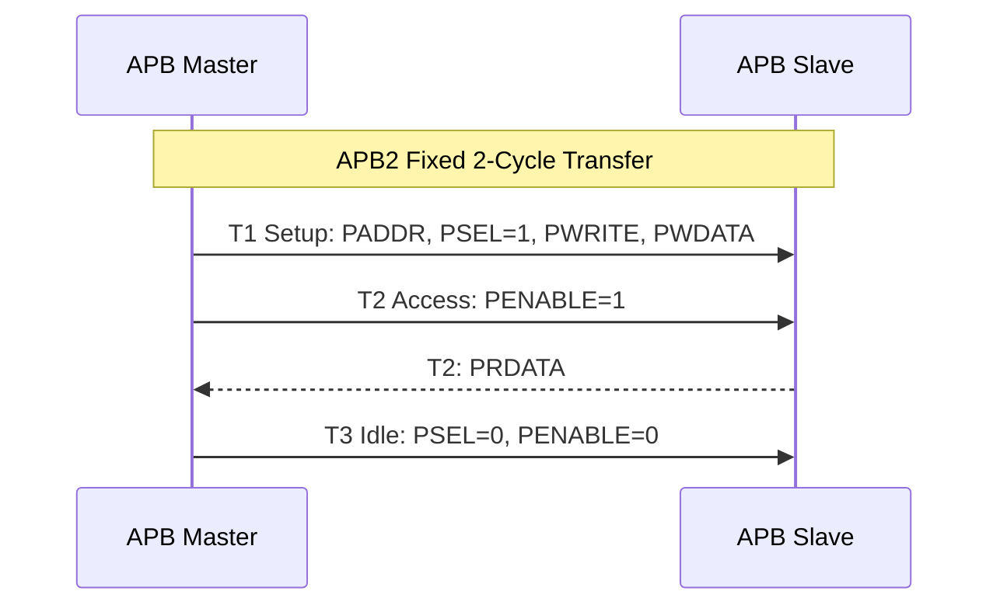
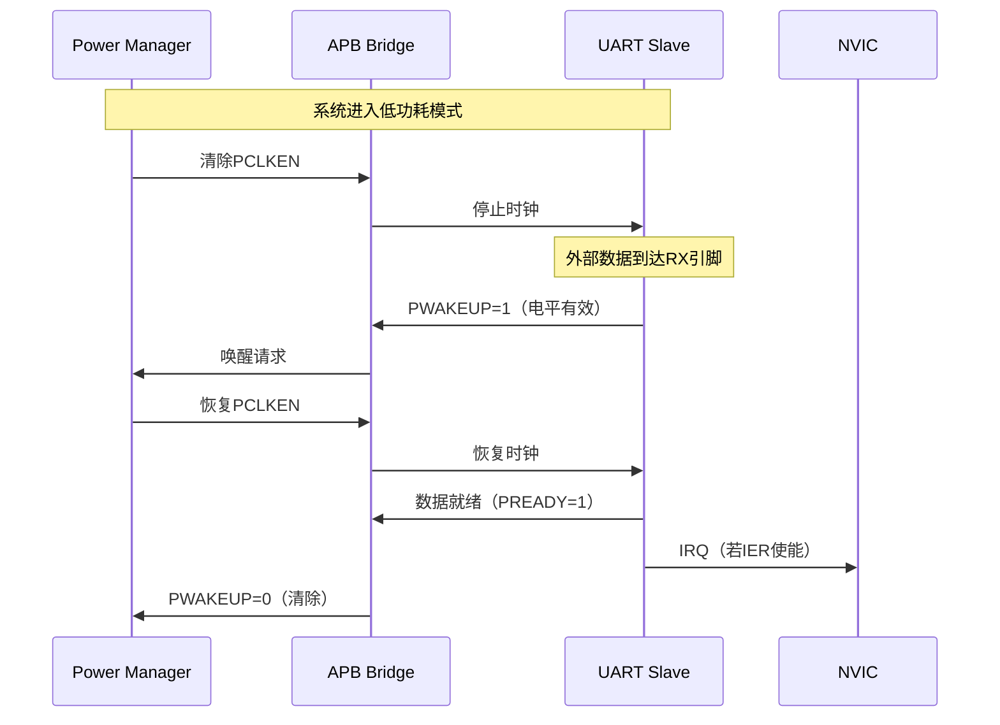

# APB历史演进

<span class="badge-b">[Beginner]</span> <span class="badge-i">[Intermediate]</span> <span class="badge-e">[Expert]</span>

---

<span class="red">为什么APB在AMBA家族中"改动最小"却"不可或缺"？</span> APB从AMBA2到AMBA5的演进没有AXI那样颠覆性的架构变革，但每一次修订都精准回应了嵌入式系统的核心需求：APB3解决慢速外设等待问题，APB4解决TrustZone安全隔离，APB5解决物联网低功耗。APB的演进哲学是"够用即好"——它不需要追赶AXI的性能，只需要在"简单访问寄存器"这个赛道上做到极致。理解APB的渐进式演进，就是理解嵌入式系统中"80%的功能只需要20%的复杂度"这一设计真理。

---

## <strong>APB2：基础两周期模型</strong>

### <strong>AMBA2 APB的设计初衷</strong>

1999年AMBA 2.0定义的<span class="red">APB2</span>是AMBA家族中最简单的协议——
<br>
它只有9根信号，不支持等待状态，没有错误响应，仅用于低速外设寄存器访问。

| 信号 | 方向 | 位宽 | 功能 |
|------|------|------|------|
| PCLK | 输入 | 1 | 总线时钟 |
| PRESETn | 输入 | 1 | 异步复位 |
| PADDR | 输出 | 32 | 目标地址 |
| PSELx | 输出 | 1 | 从机选择（每从机一根） |
| PENABLE | 输出 | 1 | 传输使能 |
| PWRITE | 输出 | 1 | 1=写，0=读 |
| PWDATA | 输出 | 32 | 写数据 |
| PRDATA | 输入 | 32 | 读数据 |



APB2的核心假设：所有外设寄存器访问都在1个PCLK周期内完成。
<br>
这在1999年是成立的——Flash控制器、UART、Timer都是快速寄存器。
<br>
但随着工艺进步和外设复杂化，这个假设逐渐失效。

---

## <strong>APB3：等待状态与错误响应</strong>

### <strong>PREADY与PSLVERR的引入</strong>

2003年AMBA 3.0的<span class="red">APB3</span>引入了最重要的两个信号：

| 新信号 | 方向 | 功能 | 解决的问题 |
|--------|------|------|-----------|
| PREADY | Slave→Master | 从机就绪 | 慢速外设（如Flash）需要多周期 |
| PSLVERR | Slave→Master | 传输错误 | 非法地址或权限违例 |

```verilog
// APB3 Slave支持等待状态
module apb3_slave_with_wait (
    input  wire        PCLK,
    input  wire        PRESETn,
    input  wire [31:0] PADDR,
    input  wire        PSEL,
    input  wire        PENABLE,
    input  wire        PWRITE,
    input  wire [31:0] PWDATA,
    output reg  [31:0] PRDATA,
    output reg         PREADY,       // APB3新增
    output reg         PSLVERR,      // APB3新增
    // 内部接口
    output reg  [7:0]  internal_addr,
    input  wire [31:0] internal_rdata,
    output reg         internal_req,
    input  wire        internal_done
);
    reg [1:0] wait_cnt;
    
    always @(posedge PCLK) begin
        if (!PRESETn) begin
            PREADY  <= 1'b1;
            PSLVERR <= 1'b0;
            wait_cnt <= 2'd0;
        end else if (PSEL && !PENABLE) begin
            // Setup阶段：发起内部请求
            internal_req <= 1'b1;
            internal_addr <= PADDR[9:2];
            PREADY <= 1'b0;  // 准备拉低，进入等待
        end else if (PSEL && PENABLE && !PREADY) begin
            // Access阶段：等待内部完成
            if (internal_done) begin
                PREADY  <= 1'b1;
                PRDATA  <= internal_rdata;
                PSLVERR <= (PADDR > 32'h0000_03FF);  // 越界错误
            end
        end else if (!PSEL) begin
            PREADY <= 1'b1;  // Idle时默认就绪
        end
    end
endmodule
```

| 场景 | APB2行为 | APB3行为 |
|------|---------|---------|
| 快速寄存器 | 固定2周期 | 2周期（PREADY=1） |
| 慢速Flash | 非法（无法等待） | N周期（PREADY延迟拉高） |
| 非法地址 | 返回无效数据 | 返回PSLVERR=1 |
| 权限违例 | 无检测 | PSLVERR报告 |

<span class="blue">关键结论：APB3的PREADY不是"可选功能"而是"必备信号"——
<br>
现代SoC中几乎所有APB外设都需要PREADY支持，
<br>
因为跨时钟域桥接和内部状态机都需要可变延迟。</span>

---

## <strong>APB4：TrustZone与字节掩码</strong>

### <strong>PPROT安全域信号</strong>

2010年AMBA 4.0的<span class="red">APB4</span>为嵌入式安全带来了革命性扩展。
<br>
<span class="green">PPROT[2:0]</span>是TrustZone系统的核心基础设施：

| 位 | 名称 | 0 | 1 | TrustZone作用 |
|----|------|---|---|--------------|
| [0] | 特权级 | Normal | Privileged | 区分用户态/OS内核访问 |
| [1] | 安全域 | Secure | Non-secure | TrustZone世界隔离 |
| [2] | 数据类型 | Data | Instruction | 指令获取保护 |

```c
// TrustZone APB外设：基于PPROT的访问控制
#define TZPC_BASE       0xB000_4000
#define TZPC_DECPROT0   (*(volatile uint32_t *)(TZPC_BASE + 0x800))

// 配置外设0为安全外设（仅Secure世界可访问）
void tzpc_config_periph0_secure(void) {
    // TZPC_DECPROT0[0]=0: 安全外设
    // 非安全Master访问时，APB Bridge传递PPROT[1]=1，
    // 安全外设检测PPROT[1]=1，返回PSLVERR
    TZPC_DECPROT0 &= ~(1 << 0);
}

// 非安全世界试图访问安全外设
void ns_access_secure_periph(void) {
    // 非安全驱动写入：PPROT=3'b010 (Non-secure)
    // 安全外设返回PSLVERR=1，触发HardFault或SError
    SECURE_REG = 0x1234;  // 失败！
}
```

---

### <strong>PSTRB写字节掩码</strong>

<span class="green">PSTRB[3:0]</span>支持32位APB总线上的部分字节写入：

| PSTRB | 写入字节 | 应用场景 |
|-------|---------|---------|
| 4'b0001 | byte[7:0] | 字符设备（UART数据寄存器） |
| 4'b0010 | byte[15:8] | 高位字节配置 |
| 4'b0011 | byte[15:0] | 16位外设 |
| 4'b1111 | byte[31:0] | 32位寄存器全写 |

```verilog
// APB4 Slave：支持PSTRB的部分写入
module apb4_regfile (
    input  wire        PCLK,
    input  wire        PRESETn,
    input  wire [31:0] PADDR,
    input  wire        PSEL,
    input  wire        PENABLE,
    input  wire        PWRITE,
    input  wire [31:0] PWDATA,
    input  wire [3:0]  PSTRB,        // APB4新增
    input  wire [2:0]  PPROT,        // APB4新增
    output reg  [31:0] PRDATA,
    output wire        PREADY,
    output wire        PSLVERR
);
    reg [31:0] regs [0:31];  // 32个32位寄存器
    
    wire secure_access = !PPROT[1];  // PPROT[1]=0为Secure
    wire addr_valid = (PADDR[31:10] == 22'hB00000);  // 地址范围检查
    
    assign PSLVERR = PSEL && PENABLE && (!addr_valid || 
                     (secure_access && regs[PADDR[6:2]][31] == 1'b1));
    // 寄存器bit[31]=1表示仅Secure可访问
    
    always @(posedge PCLK) begin
        if (PSEL && PENABLE && PWRITE && !PSLVERR) begin
            // 按PSTRB逐字节写入
            if (PSTRB[0]) regs[PADDR[6:2]][7:0]   <= PWDATA[7:0];
            if (PSTRB[1]) regs[PADDR[6:2]][15:8]  <= PWDATA[15:8];
            if (PSTRB[2]) regs[PADDR[6:2]][23:16] <= PWDATA[23:16];
            if (PSTRB[3]) regs[PADDR[6:2]][31:24] <= PWDATA[31:24];
        end
    end
    
    always @(*) begin
        PRDATA = regs[PADDR[6:2]];
    end
    
    assign PREADY = 1'b1;  // 本Slave无等待
endmodule
```

---

## <strong>APB5：低功耗与扩展</strong>

### <strong>PWAKEUP唤醒机制</strong>

2015年AMBA 5.0的<span class="red">APB5</span>引入了系统级低功耗信号：

| 新信号 | 方向 | 功能 | 低功耗场景 |
|--------|------|------|-----------|
| PWAKEUP | Slave→System | 外设请求唤醒 | UART接收到数据 |
| PCLKEN | System→Slave | 时钟使能 | 空闲时关闭外设时钟 |
| PAUSER | Master→Slave | 地址用户扩展 | 自定义路由 |
| PWUSER | Master→Slave | 写数据用户扩展 | 带外信息 |
| PRUSER | Slave→Master | 读数据用户扩展 | 带外状态 |



---

### <strong>PCLKEN低功耗时钟门控</strong>

<span class="green">PCLKEN</span>是APB5最重要的低功耗特性——
<br>
它允许系统在空闲时动态关闭APB外设的时钟：

```c
// APB5低功耗控制（Linux设备驱动示例）
#define PMC_BASE          0xB000_5000
#define PMC_APB_CLKEN     (*(volatile uint32_t *)(PMC_BASE + 0x00))
#define PMC_APB_WAKEEN    (*(volatile uint32_t *)(PMC_BASE + 0x04))

// 外设时钟使能位定义
#define PMC_EN_UART0      (1 << 0)
#define PMC_EN_UART1      (1 << 1)
#define PMC_EN_GPIO0      (1 << 8)
#define PMC_EN_GPIO1      (1 << 9)

void apb_clock_enable(uint32_t mask) {
    PMC_APB_CLKEN |= mask;
}

void apb_clock_disable(uint32_t mask) {
    PMC_APB_CLKEN &= ~mask;
}

// 进入系统睡眠：关闭所有APB时钟，保留PWAKEUP响应
void system_enter_sleep(void) {
    // 仅保留中断控制器和RTC时钟
    PMC_APB_CLKEN = PMC_EN_RTC;
    
    // 配置PWAKEUP响应
    PMC_APB_WAKEEN = PMC_EN_UART0 | PMC_EN_GPIO0;
    
    // CPU进入WFI
    __asm volatile ("wfi");
    
    // 唤醒后恢复所有时钟
    PMC_APB_CLKEN = 0xFFFFFFFF;
}
```

<span class="blue">关键结论：PCLKEN是"建议性"而非"强制性"信号——
<br>
Slave可选择忽略PCLKEN继续运行（如RTC必须持续计数），
<br>
但功耗敏感的Slave应在PCLKEN=0时停止内部操作。
</span>

---

## <strong>APB演进对比总结</strong>

| 特性 | APB2 (1999) | APB3 (2003) | APB4 (2010) | APB5 (2015) |
|------|------------|------------|------------|------------|
| 等待周期 | 不支持 | PREADY支持 | PREADY | PREADY |
| 错误响应 | 不支持 | PSLVERR | PSLVERR | PSLVERR |
| 安全扩展 | 无 | 无 | PPROT[2:0] | PPROT[2:0] |
| 字节掩码 | 无 | 无 | PSTRB[3:0] | PSTRB[3:0] |
| 低功耗 | 无 | 无 | 无 | PWAKEUP/PCLKEN |
| 用户扩展 | 无 | 无 | 无 | PAUSER/PWUSER/PRUSER |
| 典型应用 | 简单MCU | 通用外设 | TrustZone SoC | IoT低功耗 |

---

## <strong>历史演进段落</strong>

APB的历史演进是一部"简单协议持续增值"的教科书。1999年AMBA 2.0定义APB2时，设计者刻意保持极简——9根信号、2周期固定时序、无等待无错误——这使得APB2的Slave可以用不到50个门实现，成为成本敏感MCU的理想选择。2003年AMBA 3.0的APB3是对现实复杂性的妥协：Flash存储器和复杂状态机外设无法在1个周期内响应，PREADY的引入打破了"固定2周期"的纯洁性，但换来了协议的实用性。2010年AMBA 4.0的APB4则是安全需求的产物——ARM TrustZone技术在Cortex-A系列中的成功推广，迫使APB也必须支持安全域隔离，PPROT[2:0]的设计虽增加了Slave复杂度，但为整个SoC安全架构提供了统一基础。2015年AMBA 5.0的APB5则精准踩中了物联网（IoT）爆发的时间点——数以亿计的电池供电设备需要纳安级待机功耗，PCLKEN和PWAKEUP使APB外设能够参与系统级电源管理，从"被动耗电组件"转变为"可管理功耗节点"。在工程实践中，APB各版本的兼容性策略也值得关注：APB5 Slave可以向下兼容APB4/3/2 Master（忽略不支持的新信号），而APB2 Slave连接APB5 Master时需要桥接器处理缺失的PREADY——这种"后向兼容"设计使ARM生态系统能平滑升级，无需一次性替换所有IP核。从设计方法论角度，APB的演进证明了"最小可行协议"的价值——与其一开始追求功能完备，不如先发布极简版本占领市场，再根据真实需求逐步扩展。

---

## <strong>本章小结</strong>

| 要点 | 内容 |
|------|------|
| APB2 | 基础9信号，固定2周期，适合简单快速寄存器 |
| APB3 | +PREADY等待 +PSLVERR错误，支持慢速外设 |
| APB4 | +PPROT安全域 +PSTRB字节掩码，TrustZone必备 |
| APB5 | +PWAKEUP唤醒 +PCLKEN时钟门控 +USER扩展，IoT低功耗 |
| 演进哲学 | 极简起步，按需扩展，严格后向兼容 |

## <strong>练习</strong>

| 编号 | 题目 | 难度 |
|------|------|------|
| 1 | 列出APB2到APB5的完整信号集（18个信号），标注每个版本新增的6个信号 | <span class="badge-b">[B]</span> |
| 2 | 分析APB4的PPROT在TrustZone系统中的工作流程：非安全Master试图写安全外设时，Bridge、Slave和系统分别如何响应？ | <span class="badge-i">[I]</span> |
| 3 | 设计一个APB5低功耗UART控制器：支持PCLKEN门控和PWAKEUP唤醒，写出完整的Verilog状态机和功耗分析（动态/静态功耗对比） | <span class="badge-e">[E]</span> |

---

<span class="purple">扩展阅读：ARM AMBA APB2/3/4/5规范完整版、ARM TrustZone技术白皮书（APB安全扩展章节）、ARM Cortex-M23技术参考手册（APB5低功耗接口）、Synopsys DW_apb_gpio参考设计（含PPROT/PSTRB实现）。</span>
