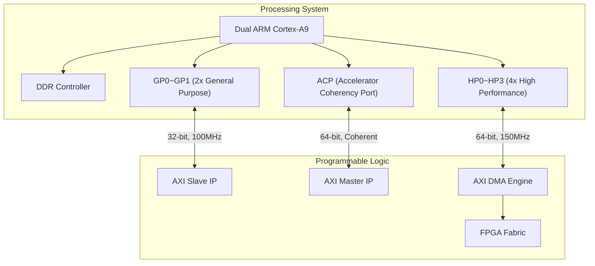

# AXI嵌入式实战——Zynq PS-PL接口

<span class="badge-e">[E]</span> <span class="badge-m">[M]</span>

---

<span class="red">为什么片上互连需要从 AXI 的一致性扩展走向 CHI？</span> 当 SoC 从单芯片多 Cluster 扩展到多芯片/机架级部署时，AXI 的 snoop 广播机制面临带宽与扇出爆炸。设计者需要一种基于包交换、支持目录过滤、可扩展至百核以上的互连协议。CHI 通过请求/响应/数据分离的 Flit 格式与分层拓扑，将一致性域从片上推向系统级。AXI5 则在非一致性路径上补全原子操作与资源分区，共同构成 ARM 基础设施战略的互连双翼。<br>
### Zynq架构：PS与PL互联拓扑

Zynq-7000 是 Xilinx 的"处理器+FPGA"融合芯片，
<br>
<span class="red">PS（Processing System）</span>侧跑ARM Cortex-A9，
<br>
PL（Programmable Logic）侧是Artix-7/Kintex-7 FPGA fabric。
<br>



PS和PL之间通过AXI总线桥接，
<br>
PL里的IP核可以像访问内存一样访问PS侧的DDR。
<br>

---

### GP/HP/ACP接口差异

| 接口 | 方向 | 数据宽度 | 最大频率 | 一致性 | 用途 |
|------|------|----------|----------|--------|------|
| GP（General Purpose） | PS↔PL | 32-bit | ~100MHz | 无 | 寄存器控制、低速数据 |
| HP（High Performance） | PS→PL | 64-bit | ~150MHz | 无 | DMA大块数据传输 |
| ACP（Accelerator Coherency Port） | PS↔PL | 64-bit | ~150MHz | 有 | 共享缓存、加速器 |

<span class="blue">关键差异：只有ACP支持缓存一致性，GP/HP的数据PS侧CPU是看不到缓存同步的。</span><br>

#### GP接口时序特点

```verilog
// GP port is AXI4-Lite only
// Single beat, no burst, 32-bit data
// Latency: ~10-20 cycles (through PS interconnect)
```

GP口本质是AXI4-Lite，适合：
<br>
- 配置PL侧IP的寄存器（如设置DMA源地址）
<br>
- 少量状态查询（如读取IP的版本号）
<br>

#### HP接口时序特点

```verilog
// HP port supports full AXI4 burst
// 64-bit data, up to 16-beat burst
// Max theoretical BW = 150MHz × 8B = 1.2GB/s
```

HP口是PL→DDR的数据高速公路，适合：
<br>
- 视频帧缓冲读写
<br>
- ADC/DMA大批量数据采集
<br>
- 网络包缓冲
<br>

#### ACP接口一致性模型

```
CPU Cache <---> L2 Cache <---> ACP <---> PL IP
     ^                            ^
     |                            |
     +------ Cache Coherent ------+  (ACP)
```

ACP是连接PL与L2缓存的通道，
<br>
PL通过ACP访问DDR时，会自动与CPU缓存做一致性同步。
<br>

---

### Vivado AXI Interconnect配置

Xilinx Vivado 提供两种AXI互连IP：

| 特性 | AXI Interconnect | AXI SmartConnect |
|------|------------------|------------------|
| 协议支持 | AXI3/4/Lite | 仅AXI4/Lite |
| 配置复杂度 | 高（可微调每通道） | 低（自动优化） |
| 面积/资源 | 较大 | 较小 |
| 性能 | 稍低 | 更高（自动pipeline） |
| 推荐使用 | 遗留设计 | 新设计（Vivado 2016+） |

<span class="purple">扩展</span>：SmartConnect会自动插入pipeline stage和clock crossing，
<br>
在异步时钟域之间自动做CDC（Clock Domain Crossing）。
<br>

#### Vivado Block Design 示例

```tcl
# Tcl script to create AXI interconnect in Vivado
# Connect Zynq PS HP0 to AXI DMA in PL

# Create SmartConnect
set smart_conn [create_bd_cell -type ip -vlnv xilinx.com:ip:smartconnect:1.0 smartconn_0]
set_property -dict [list \
    CONFIG.NUM_SI {1} \
    CONFIG.NUM_MI {1} \
    CONFIG.NUM_MI {1} \
] $smart_conn

# Connect PS HP0 to SmartConnect slave
connect_bd_intf_net [get_bd_intf_pins processing_system7_0/M_AXI_GP0] \
    [get_bd_intf_pins smartconn_0/S00_AXI]

# Connect SmartConnect master to AXI DMA
connect_bd_intf_net [get_bd_intf_pins smartconn_0/M00_AXI] \
    [get_bd_intf_pins axi_dma_0/S_AXI_LITE]
```

---

### Linux设备树：axi-bus节点

Zynq在Linux设备树中，PL侧的AXI IP通过 <span class="red">`axi` bus 节点</span> 描述。
<br>

```dts
// arch/arm/boot/dts/zynq-7000.dtsi (excerpt)
/ {
    amba_pl: amba_pl@0 {
        #address-cells = <1>;
        #size-cells = <1>;
        compatible = "simple-bus";
        ranges;

        axi_dma_0: dma@40400000 {
            compatible = "xlnx,axi-dma-1.00.a";
            reg = <0x40400000 0x10000>;
            #dma-cells = <1>;
            interrupt-parent = <&intc>;
            interrupts = <0 29 4>;
            dma-coherent;    // <-- marks buffer as cache-coherent
        };

        my_ip_0: my-ip@43c00000 {
            compatible = "vendor,my-ip";
            reg = <0x43c00000 0x10000>;
            clocks = <&clkc 15>;
        };
    };
};
```

| 属性 | 含义 |
|------|------|
| `reg` | AXI地址空间，`<base size>` |
| `dma-coherent` | 标记该DMA为缓存一致（仅ACP可用） |
| `interrupts` | GIC中断号配置 |
| `clocks` | 时钟源引用 |

<span class="blue">易错点：`dma-coherent` 只对有ACP连接的设计有效，
<br>
如果DMA挂在HP口却加了这个属性，内核会尝试做不必要的flush操作。</span>
<br>

---

### 性能测量：AXI DMA带宽测试

#### 使用 `dd` 命令测试DMA吞吐

```bash
# 测试从PL DMA到内存的写入速度
# /dev/my_dma_device 是PL侧AXI DMA的char设备

dd if=/dev/zero of=/dev/my_dma_device bs=1M count=1000
# 输出示例：
# 1048576000 bytes (1.0 GB) copied, 0.42 s, 2.5 GB/s

# 反向测试：从DMA读取
dd if=/dev/my_dma_device of=/dev/null bs=1M count=1000
```

#### 使用 `fio` 做更精确的带宽/延迟测试

```bash
# fio job file: dma-test.fio
[global]
ioengine=sync
direct=1
bs=1M

[dma-write]
filename=/dev/my_dma_device
rw=write
runtime=30

[dma-read]
filename=/dev/my_dma_device
rw=read
runtime=30
```

```bash
fio dma-test.fio
# 输出解读：
# write: IOPS=1234, BW=1234MiB/s
# read:  IOPS=5678, BW=5678MiB/s
# slat/clat: 提交延迟和完成延迟
```

| 指标 | 正常范围 | 异常排查 |
|------|----------|----------|
| 写带宽 | ~1.0-1.2GB/s | 检查burst长度、Outstanding深度 |
| 读带宽 | ~1.0-1.2GB/s | 检查Interconnect仲裁、DDR配置 |
| 延迟 | <5us | >10us说明有阻塞或等待状态 |

---

### 坑点：HP接口缓存一致性问题

#### 问题场景

```c
CPU writes data to DDR @0x1000
PL DMA reads from DDR @0x1000 via HP port
Result: DMA reads stale data (from DDR, not from CPU cache)
```

<span class="red">HP口不走缓存一致性路径</span>，
<br>
CPU写数据到DDR后，数据可能还在L1/L2 cache里，
<br>
PL通过HP口读DDR拿到的是旧数据。
<br>

#### 解决方案

```c
#include <linux/dma-mapping.h>

// Solution 1: Flush CPU cache before DMA starts
dma_sync_single_for_device(dev, dma_handle, size, DMA_TO_DEVICE);
// CPU cache -> flushed to DDR

// Solution 2: Invalidate after DMA completes
dma_sync_single_for_cpu(dev, dma_handle, size, DMA_FROM_DEVICE);
// DDR -> invalidated from CPU cache, force re-read
```

| 方向 | 需要的操作 | Linux API |
|------|------------|-----------|
| CPU → PL | Flush cache | `dma_sync_single_for_device()` |
| PL → CPU | Invalidate cache | `dma_sync_single_for_cpu()` |

```c
// Complete DMA flow with cache management
void *cpu_buf = kmalloc(size, GFP_KERNEL);
dma_addr_t dma_handle = dma_map_single(dev, cpu_buf, size, DMA_BIDIRECTIONAL);

// CPU writes data
memset(cpu_buf, 0xAA, size);

// Flush before DMA starts
dma_sync_single_for_device(dev, dma_handle, size, DMA_TO_DEVICE);

// Trigger PL DMA
dmaengine_submit(tx);

// Wait for completion
dma_async_issue_pending(chan);
wait_for_completion(&done);

// Invalidate before CPU reads
dma_sync_single_for_cpu(dev, dma_handle, size, DMA_FROM_DEVICE);

// Now cpu_buf has fresh data from PL
```

<span class="blue">最佳实践：如果PL需要频繁与CPU交换数据，优先用ACP口。
<br>
ACP口虽然带宽略低于HP，但省去了软件手动flush/invalidate的开销。</span>
<br>

---

**学习路径提示**：<br>
- <span class="badge-e">[E]</span> 读者：掌握GP/HP/ACP的选择依据，会配Vivado SmartConnect。<br>
- <span class="badge-m">[M]</span> 读者：深入理解缓存一致性陷阱，能在驱动代码中正确使用flush/invalidate API。<br>

---

## 历史演进与发展趋势

AXI5 与 ACE（AXI Coherency Extensions）代表了 ARM 从单芯片一致性到系统级一致性的战略跨越。2011 年，随着 Cortex-A15 引入 big.LITTLE 架构，多簇（Cluster）处理器之间共享数据的需求催生了 ACE 协议，它在 AXI4 基础上新增 snoop 通道（AC/CR/CD），使外部主设备能够监听并维护缓存一致性。2013 年，面向服务器与网络基础设施的 ACE-Lite 发布，允许 I/O 主设备参与一致性域而无需完整缓存。2015 年 AMBA 5 将 ACE 演进为 CHI（Coherent Hub Interface），同时推出 AXI5 作为非一致性互连的顶峰规范。AXI5 继承了 AXI4 的全部优势，并新增原子事务、MPAM 资源分区和扩展用户信号，为 PCIe/CCIX 等片外一致性协议提供统一的片上接口。ACE 与 CHI 的协同，使 ARM 生态实现了从 Cortex-A 手机 SoC 到 Neoverse 数据中心处理器的一致性全覆盖，成为片上互连技术发展的前沿标杆。

---

## 本章小结

| 要点 | 内容 |
|------|------|
| AXI5 演进 | 新增原子操作、MPAM 内存分域、Trace 标签，面向基础设施级互连 |
| ACE 定位 | 在 AXI4 基础上扩展 Snoop 通道，实现多 Cluster 缓存一致性 |
| CHI 升级 | AMBA 5 CHI 将请求/响应/数据分离为独立包格式，支持机架级互连 |
| 一致性域 | Inner Shareable、Outer Shareable、Non-Shareable 三级域划分 |

## 练习

1. ACE 的 AC/CR/CD Snoop 通道如何与 AXI 原有五通道协同工作？画出 Cache Line 失效的完整序列图。
2. AXI5 的原子操作相比 AXI4 的 Locked 传输在实现上有何优势？为什么服务器 CPU 需要这一特性？
3. CHI 协议采用基于包的 Flit 传输而非 AXI 的信号级握手，这种设计如何支持更大规模的互连拓扑？
