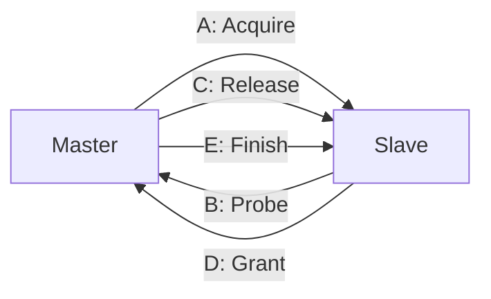

# TileLink逻辑级与原子操作

<span class="badge-e">[Expert]</span>

<span class="red">TileLink</span> 是 SiFive（源自 Berkeley）提出的开源片上互连协议，为 RISC-V 生态提供缓存一致性支持。

---

## <strong>基础认知</strong>

### <strong>为什么RISC-V选择TileLink</strong>

<span class="blue">RISC-V 作为开放指令集，需要同样开放的总线标准。</span> TileLink 由 Berkeley 的 RISC-V 团队设计，与 RISC-V 缓存一致性扩展天然匹配。

### <strong>权限模型</strong>

| 权限 | 缩写 | 允许操作 |
|------|------|----------|
| 无 | N | 无 |
| 读 | R | 读取 |
| 写 | W | 写入 |
| 读+写 | RW | 读写 |
| 执行 | X | 取指 |
| 读+执行 | RX | 代码段 |

---

## <strong>原理解析</strong>

### <strong>TileLink 五个通道</strong>



<span class="green">TileLink 使用五通道消息传递</span>实现缓存一致性，比 AXI ACE 的六通道更精简。

### <strong>LR/SC原子操作</strong>

<span class="blue">TileLink 原生支持 Load-Reserved / Store-Conditional</span>，实现无锁同步。

```
Core A: LR [addr]  → 保留地址
Core B: SC [addr]  → 检测保留失效，返回失败
Core A: SC [addr]  → 成功写入
```

---

## <strong>历史演进</strong>

- <span class="green">2015 年 TileLink 1.0</span> — Berkeley 提出，三通道（Acquire/Grant/Finish）<br>
- <span class="green">2017 年 TileLink 2.0</span> — 五通道模型，支持缓存一致性<br>
- <span class="green">2019 年 TileLink-UH</span> — 用户级/托管级扩展，权限模型细化<br>
- <span class="green">2021 年 TileLink-C</span> — CHI 兼容模式，支持 ARM 生态

---

## 小结与练习

**练习**

1. 比较 TileLink TL-C 和 AXI ACE 在缓存一致性消息上的差异。
2. 分析为什么 RISC-V 选择 TileLink 而非直接采用 ACE。
3. 设计一个 TileLink 总线矩阵的仲裁策略。
