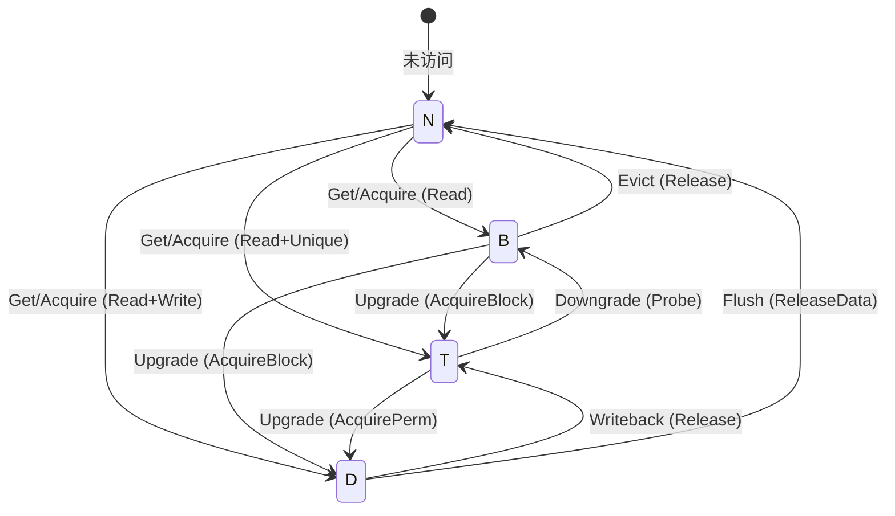
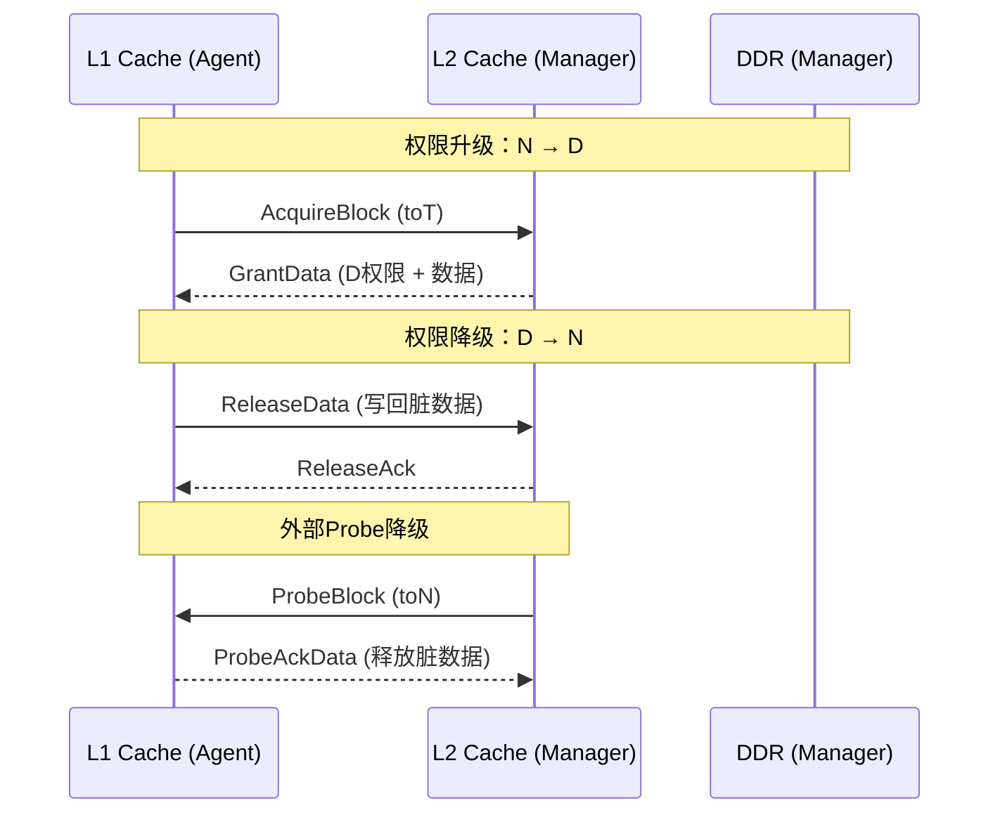
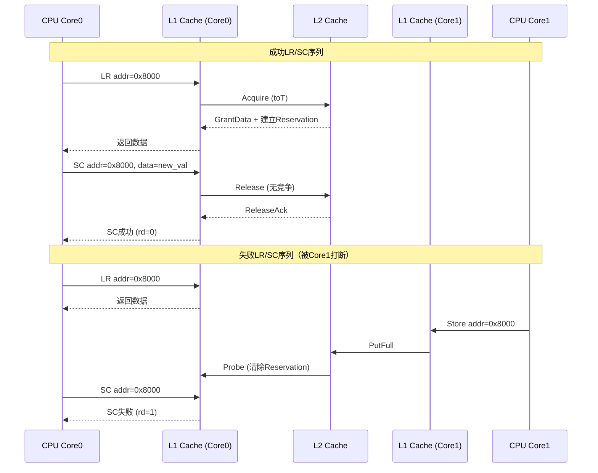
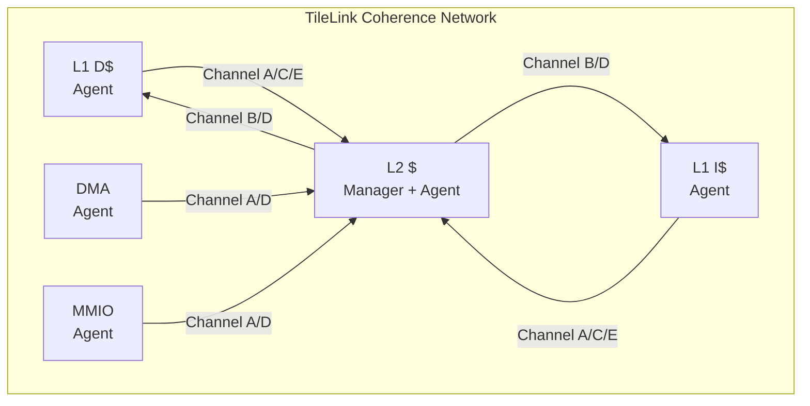

# TileLink逻辑级与原子操作

<span class="badge-b">[Beginner]</span> <span class="badge-i">[Intermediate]</span> <span class="badge-e">[Expert]</span>

---

<span class="red">为什么TileLink需要"权限模型"而非简单的主从信号？</span> TileLink的设计哲学与AMBA截然不同——它不是为"点对点读写"而生，而是为"缓存一致性系统"而生。在RISC-V多核SoC中，每个核心有自己的L1缓存，这些缓存可能持有同一内存地址的副本，有的副本可能是"脏"的（修改过但未写回）。TileLink的权限模型定义了每个Agent对某个缓存行的访问权限（None/Branch/Trunk/Tip），原子操作（LR/SC）则保证了多核对共享变量的互斥访问。理解TileLink的权限状态机和原子操作语义，是进入RISC-V缓存一致性世界的钥匙。

---

## <strong>TileLink权限模型</strong>

### <strong>权限状态机</strong>

<span class="red">TileLink权限模型</span>定义了四个权限等级，描述Agent对缓存行的控制能力：

| 权限 | 名称 | 读能力 | 写能力 | 传递能力 | 典型位置 |
|------|------|--------|--------|---------|---------|
| N | None | 无 | 无 | 无 | 未缓存 |
| B | Branch | 有（可能过期） | 无 | 有（可给子节点） | L2缓存（Inclusive） |
| T | Trunk | 有（最新） | 无 | 有（可给子节点） | L2缓存（Exclusive） |
| D | Dirty（旧称Tip） | 有（最新） | 有 | 有（可给子节点） | L1缓存 |



<span class="blue">关键结论：TileLink的权限等级与MOESI缓存一致性状态一一对应——
<br>
N=Invalid, B=Shared, T=Exclusive, D=Modified。
<br>
这种映射使TileLink能够直接驱动标准缓存控制器。
</span>

---

### <strong>权限升级与降级</strong>

权限的变更通过TileLink消息完成：



| 消息类型 | 方向 | 作用 | 权限变化 |
|---------|------|------|---------|
| AcquireBlock | Agent→Manager | 请求数据块 | N/B→T, N/B/T→D |
| AcquirePerm | Agent→Manager | 请求权限（已有数据） | B/T→D |
| Grant/GrantData | Manager→Agent | 授权 | Manager降级 |
| Release/ReleaseData | Agent→Manager | 释放 | Agent降级 |
| Probe/ProbeBlock | Manager→Agent | 强制降级 | Agent被动降级 |
| ProbeAck | Agent→Manager | 确认降级 | — |

---

### <strong>权限代理实现</strong>

```verilog
// TileLink权限状态机（L1 Cache Agent）
module tl_permission_fsm (
    input  wire        clock,
    input  wire        reset,
    // TileLink Channel A（请求）
    input  wire [2:0]  a_opcode,     // Acquire/Get/PutFull/PutPartial
    input  wire [1:0]  a_param,      // 权限目标（toB/toT/toN）
    // TileLink Channel B（Probe）
    input  wire [2:0]  b_opcode,     // Probe/ProbeBlock
    input  wire [1:0]  b_param,      // 目标权限
    // TileLink Channel C（释放）
    output reg  [2:0]  c_opcode,
    output reg  [1:0]  c_param,
    output reg         c_valid,
    // TileLink Channel D（授权）
    input  wire [2:0]  d_opcode,     // Grant/GrantData/ReleaseAck
    // 内部状态
    output reg  [1:0]  perm_state,   // 0=N, 1=B, 2=T, 3=D
    output reg         has_dirty_data
);
    localparam PERM_N = 2'b00;
    localparam PERM_B = 2'b01;
    localparam PERM_T = 2'b10;
    localparam PERM_D = 2'b11;
    
    // 权限升级：响应Grant
    always @(posedge clock) begin
        if (reset) begin
            perm_state <= PERM_N;
            has_dirty_data <= 1'b0;
        end else if (d_opcode == 3'b100) begin  // GrantData
            case (a_param)  // 目标权限
                2'b00: perm_state <= PERM_B;
                2'b01: perm_state <= PERM_T;
                2'b10: begin
                    perm_state <= PERM_D;
                    has_dirty_data <= 1'b1;
                end
            endcase
        end else if (b_opcode == 3'b100) begin  // ProbeBlock
            // 被动降级
            case (b_param)
                2'b00: begin  // toN
                    if (perm_state == PERM_D) begin
                        // 脏数据写回
                        c_opcode <= 3'b100;  // ProbeAckData
                        c_param  <= 2'b10;   // TtoN
                        c_valid  <= 1'b1;
                        has_dirty_data <= 1'b0;
                    end
                    perm_state <= PERM_N;
                end
                2'b01: begin  // toB
                    if (perm_state == PERM_D) begin
                        c_opcode <= 3'b100;
                        c_param  <= 2'b11;   // TtoB
                        c_valid  <= 1'b1;
                        has_dirty_data <= 1'b0;
                    end
                    perm_state <= PERM_B;
                end
            endcase
        end
    end
endmodule
```

---

## <strong>原子操作</strong>

### <strong>为什么需要LR/SC</strong>

<span class="red">Load-Reserved/Store-Conditional（LR/SC）</span>是RISC-V定义的原子操作原语，
<br>
TileLink在总线层面对其提供硬件支持。

传统原子操作的问题：
<br>
- 读-改-写序列在总线上是非原子的，可能被其他Master打断
<br>
- 锁总线（Bus Lock）导致严重的性能下降

LR/SC的解决方案：
<br>
- LR：读取地址并"预订"（Reservation），硬件建立监视
<br>
- SC：条件写入——仅当监视未被其他写入打断时才成功



| 操作 | RISC-V指令 | TileLink消息 | 成功条件 |
|------|-----------|-------------|---------|
| LR | lr.w/d | Get + 建立Reservation | 始终成功（建立监视） |
| SC | sc.w/d | PutFull/Partial + 检查Reservation | 监视未被清除 |

---

### <strong>TileLink原子操作消息</strong>

TileLink-UH（Uncached Heavyweight）支持六种原子操作：

| 操作 | TileLink Opcode | 语义 | 应用场景 |
|------|----------------|------|---------|
| Arithmetic FetchAdd | 2 | 读取旧值并加上增量 | 计数器累加 |
| Arithmetic FetchAnd | 3 | 读取旧值并按位与 | 位掩码清零 |
| Arithmetic FetchOr | 4 | 读取旧值并按位或 | 位掩码置位 |
| Arithmetic FetchXor | 5 | 读取旧值并按位异或 | 位翻转 |
| Arithmetic FetchMin/Max | 6 | 读取旧值并取最小/大 | 最大值追踪 |
| Logical Swap | 7 | 交换新旧值 | 锁变量 |

```c
// RISC-V LR/SC实现自旋锁（通过TileLink传输）
typedef struct {
    volatile uint32_t lock;
} spinlock_t;

void spinlock_init(spinlock_t *sl) {
    sl->lock = 0;
}

void spinlock_acquire(spinlock_t *sl) {
    uint32_t expected = 0;
    uint32_t new_val = 1;
    
    while (1) {
        // LR：读取并预订
        uint32_t old = __lr_w((uint32_t *)&sl->lock);
        
        if (old != 0) {
            // 锁已被持有，自旋等待
            continue;
        }
        
        // SC：尝试写入
        uint32_t success = __sc_w(new_val, (uint32_t *)&sl->lock);
        
        if (success == 0) {
            // SC成功，获取锁
            break;
        }
        // SC失败，重试
    }
}

void spinlock_release(spinlock_t *sl) {
    __sync_synchronize();  // 内存屏障
    sl->lock = 0;
}
```

---

### <strong>缓存一致性代理</strong>

在多级缓存系统中，TileLink代理（Agent）负责维护一致性：



| 角色 | 职责 | 典型实现 |
|------|------|---------|
| Client Agent | 发起请求，维护本地缓存状态 | L1 Cache |
| Manager Agent | 处理请求，管理全局权限 | L2 Cache |
| Fuzzer | 验证一致性协议正确性 | 形式化验证工具 |

---

## <strong>历史演进段落</strong>

TileLink权限模型和原子操作的设计根植于Berkeley的RISC-V生态构建历程。2011年，当RISC-V指令集刚刚在Berkeley孵化时，研究者就意识到开源处理器需要一套开源的缓存一致性协议——现有的AMBA ACE虽然功能完备，但受限于ARM的商业授权条款，无法被学术界自由研究和教学。2014年，Berkeley的硬件研究组开始设计TileLink，其权限模型直接借鉴了学术界经过形式化验证的MOESI变体，但采用了更简洁的四级状态（N/B/T/D）。2016年TileLink 1.0发布时，LR/SC的原子操作支持成为其与AMBA的关键差异化特性——TileLink将LR/SC的Reservation机制内建在协议中，而ACE需要通过外部Monitor实现。2017年SiFive将TileLink商业化，其FU540 SoC展示了TileLink在真实芯片中的可行性。2018年TileLink 1.7版本引入了UH/UL（Uncached Heavyweight/Lightweight）分层，使TileLink既能支持复杂的多级缓存一致性，又能以极简模式服务简单外设。2019年，RISC-V基金会正式将TileLink纳入官方生态系统推荐协议（而非强制标准），这种"推荐但不强制"的策略使TileLink在开源社区和学术界迅速普及。TileLink权限模型的独特之处在于它的"可组合性"——设计者可以选择仅实现UL模式（无一致性）以节省面积，也可以实现完整的UH模式（全一致性），这种灵活性在AMBA生态中是不存在的（ACE是"全有或全无"）。未来随着RISC-V向量扩展（RVV）和乱序执行处理器的普及，TileLink的原子操作和权限模型将面临更大并发压力，但其在开源生态中的基础设施地位已经确立。

---

## <strong>本章小结</strong>

| 要点 | 内容 |
|------|------|
| 权限模型 | N(None)/B(Branch)/T(Trunk)/D(Dirty)四级，对应MOESI |
| 消息类型 | Acquire/Grant/Release/Probe四组，实现权限升级/降级 |
| 原子操作 | LR/SC序列保证多核互斥，TileLink-UH支持6种原子操作码 |
| 一致性代理 | Client Agent发起请求，Manager Agent维护全局状态 |
| 设计哲学 | 可组合性：UL极简 + UH全功能，按需实现 |

## <strong>练习</strong>

| 编号 | 题目 | 难度 |
|------|------|------|
| 1 | 画出TileLink权限状态转换图：N→B→T→D的完整升级路径，标注每条边对应的TileLink消息 | <span class="badge-b">[B]</span> |
| 2 | 在双核系统中，Core0执行LR后，Core1的哪些操作会导致Core0的SC失败？列出所有TileLink消息组合 | <span class="badge-i">[I]</span> |
| 3 | 设计一个TileLink L2 Cache Manager的权限仲裁模块：处理来自4个L1 Agent的并发Acquire请求，实现无死锁的权限升级调度 | <span class="badge-e">[E]</span> |

---

<span class="purple">扩展阅读：SiFive TileLink规格书1.7.1版、Berkeley Rocket Chip Generator文档、RISC-V "A"扩展规范（原子操作指令）、IEEE论文"TileLink: A Free and Open Coherence Protocol"。</span>
