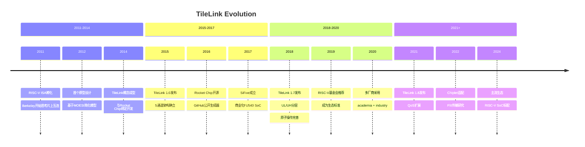
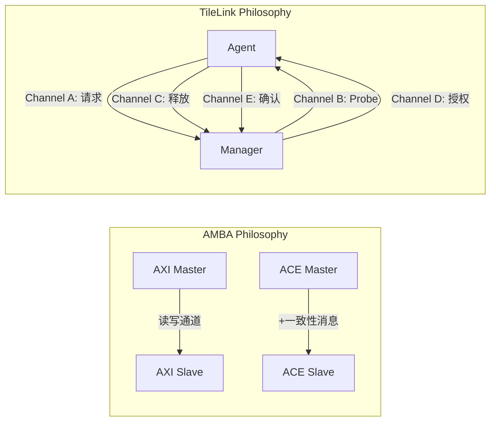
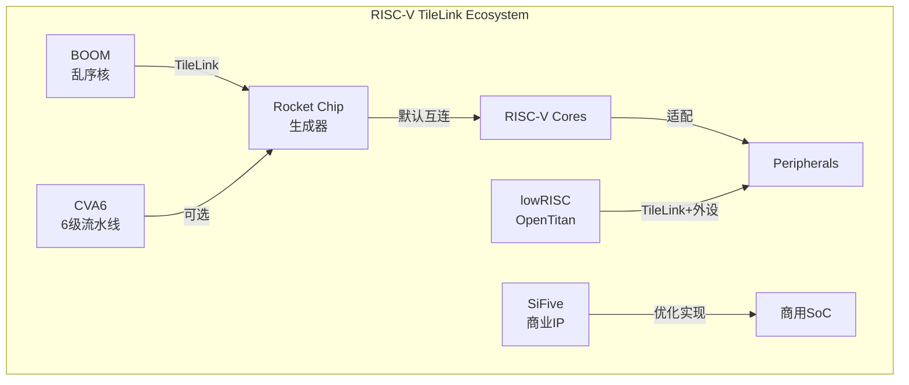
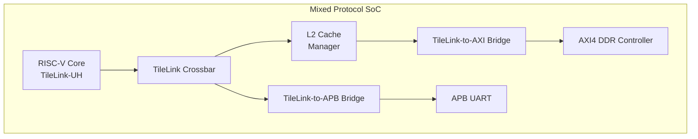

# TileLink历史演进与生态

<span class="badge-b">[Beginner]</span> <span class="badge-i">[Intermediate]</span> <span class="badge-e">[Expert]</span>

---

<span class="red">为什么学术界需要一套独立于AMBA的总线协议？</span> 2010年代初，RISC-V指令集在Berkeley诞生，但研究人员很快发现：设计开源CPU需要开源的片上互连协议，而AMBA ACE受ARM商业授权约束，无法在学术论文和教学实验中自由使用。TileLink的诞生不是技术竞赛的产物，而是学术自由的产物——它证明了一件事：即使没有ARM的IP帝国，学术界也能设计出与AMBA ACE功能对等甚至更灵活的缓存一致性协议。从Berkeley的Rocket Chip到SiFive的商用SoC，TileLink从学术原型成长为RISC-V生态的"默认互连标准"，这是开源硬件运动最重要的基础设施成就之一。

---

## <strong>从Berkeley到RISC-V标准</strong>

### <strong>学术起源</strong>

<span class="red">TileLink</span>诞生于Berkeley的并行计算实验室，其设计目标非常明确：

| 目标 | AMBA ACE局限 | TileLink解决方案 |
|------|-------------|-----------------|
| 开源授权 | ARM商业授权，学术使用受限 | BSD开源协议，完全自由 |
| 教学可用 | 文档保密，仅 licensee可见 | 公开规范，GitHub源码 |
| 形式化验证 | 无官方验证模型 | 配套TLA+规范，可机械验证 |
| 灵活性 | 固定拓扑（Crossbar为主） | 支持任意拓扑生成 |
| 可组合性 | ACE=全功能或不可用 | UL/UH分层，按需实现 |



---

### <strong>关键版本里程碑</strong>

| 版本 | 年份 | 核心变化 | 影响 |
|------|------|---------|------|
| TileLink 0.5 | 2014 | 内部原型 | 仅Rocket Chip使用 |
| TileLink 1.0 | 2015 | 5通道架构 | 首次公开规范 |
| TileLink 1.5 | 2016 | 引入TL-C/TL-U/TL-UL | 分层模式 |
| TileLink 1.7 | 2018 | UH/UL正式化 | 工业级可用 |
| TileLink 1.8 | 2021 | QoS扩展 | 多媒体SoC适配 |
| TileLink 2.0 (研究) | 2024 | Flit传输 | Chiplet/NoC方向 |

---

## <strong>与AXI的对比</strong>

### <strong>架构差异</strong>

TileLink与AXI/ACE不是"竞争关系"，而是"不同设计哲学"的产物：



| 维度 | AXI4/ACE | TileLink-UH | 设计哲学差异 |
|------|---------|-------------|------------|
| 通道数 | 5（AR/R/AW/W/B）+ ACE扩展 | 5（A/B/C/D/E） | AXI按功能分，TileLink按事务阶段分 |
| 拓扑 | Crossbar为主 | 任意（由生成器决定） | AXI固定硬件，TileLink软件生成 |
| 一致性 | ACE协议复杂 | 内建于权限模型 | AXI+ACE=两协议，TileLink=一协议 |
| 授权 | ARM商业 | BSD开源 | 封闭vs开放 |
| IP生态 | 数千个验证IP | 增长中（开源为主） | 成熟vs新兴 |
| 验证 | 厂商自验证 | TLA+形式化验证 | 经验vs数学 |

---

### <strong>功能对等性分析</strong>

| 功能 | AXI实现 | TileLink实现 | 等价性 |
|------|---------|-------------|--------|
| 突发读 | AR→R通道 | A→D通道 | 等价 |
| 突发写 | AW→W→B通道 | A→D通道 | 等价 |
| 乱序完成 | ARID/RID | Source ID | 等价 |
| 缓存一致性 | ACE: ReadShared/ReadUnique | Acquire(toB/toT/toN) | 等价 |
| 脏数据转发 | ACE: CD通道 | C通道 ReleaseData | 等价 |
| 原子操作 | ACE: AtomicTransaction | UH: Arithmetic Logical | 等价 |
| 屏障操作 | ACE: Barrier | TileLink: Fence隐含 | 简化 |

<span class="blue">关键结论：TileLink-UH与ACE在功能上完全对等——
<br>
任何能用ACE实现的系统，都能用TileLink-UH实现，
<br>
且TileLink的TLA+规范可被形式化验证工具自动检查。
</span>

---

### <strong>代码风格对比</strong>

```verilog
// AXI4读事务（Verilog）
module axi_read (
    output reg  [31:0] ARADDR,
    output reg         ARVALID,
    input  wire        ARREADY,
    input  wire [63:0] RDATA,
    input  wire        RVALID,
    output reg         RREADY,
    input  wire        RLAST
);
    // 需分别管理AR和R通道的握手
    always @(posedge ACLK) begin
        if (state == AR_SEND) begin
            ARVALID <= 1'b1;
            if (ARREADY) state <= R_RECV;
        end else if (state == R_RECV) begin
            RREADY <= 1'b1;
            if (RVALID && RLAST) state <= IDLE;
        end
    end
endmodule

// TileLink Acquire事务（Chisel/Scala）
// 使用Rocket Chip的TileLink库
class TLAquireExample extends Module {
    val io = IO(new Bundle {
        val tl = new TLBundleA(32, 64)  // 32位地址, 64位数据
    })
    
    // TileLink Channel A: 一次请求包含所有信息
    io.tl.a.valid := state === s_req
    io.tl.a.bits.opcode := TLMessages.AcquireBlock  // 请求类型
    io.tl.a.bits.param := TLPermissions.toT          // 目标权限
    io.tl.a.bits.address := addr
    io.tl.a.bits.source := id                        // Source ID
    io.tl.a.bits.size := log2Ceil(64).U             // 传输大小
    
    // 响应在Channel D返回，通过Source ID匹配
    when(io.tl.d.valid && io.tl.d.bits.source === id) {
        state := s_done
    }
}
```

<span class="blue">易错点：TileLink的Channel A同时承载读请求和写请求——
<br>
不像AXI那样分离AR/AW通道，TileLink通过Opcode区分操作类型，
<br>
这种设计减少了通道数量，但增加了单通道复杂度。
</span>

---

## <strong>RISC-V生态中的TileLink</strong>

### <strong>开源项目采用情况</strong>

| 项目 | 组织 | TileLink用途 | 状态 |
|------|------|-------------|------|
| Rocket Chip | Berkeley | 默认互连，L1/L2一致性 | 活跃维护 |
| BOOM | Berkeley | 乱序核的缓存一致性 | 活跃维护 |
| CVA6 | ETH Zurich | 可选TileLink互连 | 活跃 |
| XiangShan | 中科院 | 高性能RISC-V SoC | 活跃 |
| lowRISC | lowRISC CIC | 安全SoC（OpenTitan） | 活跃 |
| SiFive Core | SiFive | 商业RISC-V核 | 产品化 |



---

### <strong>SiFive商用化路径</strong>

SiFive将Berkeley的学术原型转化为工业级产品：

| 产品 | 年份 | TileLink配置 | 市场定位 |
|------|------|-------------|---------|
| FE310 | 2016 | TL-UL（无一致性） | MCU/IoT |
| FU540 | 2018 | TL-UH（4核一致性） | 应用处理器 |
| U74 | 2020 | TL-UH（多簇一致性） | 边缘计算 |
| P550 | 2021 | TL-UH + CHI桥接 | 高性能 |

```c
// SiFive FU540 TileLink地址映射示例
#define CLINT_BASE      0x02000000  // Core-Local Interruptor
#define PLIC_BASE       0x0C000000  // Platform-Level Interrupt Controller
#define UART0_BASE      0x10010000  // UART (TileLink-UL)
#define GPIO_BASE       0x10060000  // GPIO (TileLink-UL)
#define DRAM_BASE       0x80000000  // DDR (TileLink-UH)

// 通过TileLink访问外设寄存器
#define UART0_TXFIFO    (*(volatile uint32_t *)(UART0_BASE + 0x00))

void uart0_putc(char c) {
    // TileLink-UL：简化访问，无一致性开销
    while (UART0_TXFIFO & (1 << 31));  // 等待FIFO非满
    UART0_TXFIFO = c;
}
```

---

## <strong>TileLink的未来方向</strong>

### <strong>与AMBA的共存策略</strong>

现代RISC-V SoC中，TileLink与AMBA常通过桥接器共存：

| 场景 | 方案 | 桥接器 |
|------|------|--------|
| RISC-V核+ARM外设IP | TileLink-UH + AXI4 Bridge | TileLink-to-AXI |
| 混合SoC | TileLink内部互连 + AXI外部DDR | 协议转换桥 |
| 纯RISC-V | 全TileLink | 无需桥接 |



<span class="purple">扩展：Chiplet时代，TileLink研究组正在探索基于Flit的传输模式——
<br>
将TileLink消息打包为固定大小的Flit，通过SerDes跨die传输，
<br>
这是TileLink从"片内互连"走向"片间互连"的技术路线。
</span>

---

## <strong>历史演进段落</strong>

TileLink从学术原型到工业标准的演进，是开源硬件运动最成功的案例之一。2011年，当Krste Asanovic教授的团队开始设计RISC-V时，他们面临一个尴尬的现实：要教学片上系统设计，需要一套学生可以自由修改、实验和发表论文的互连协议，而AMBA ACE的保密协议使其完全不适用于学术场景。2014年的TileLink 0.5是Berkeley内部的原型，基于简化的MOESI状态机和5通道消息架构，与Rocket Chip生成器深度绑定。2015年TileLink 1.0的发布是开源硬件社区的重要时刻——规范的BSD授权意味着任何厂商都可以免费使用、修改甚至闭源衍生，这种开放性吸引了第一批商业用户。2016年Rocket Chip在GitHub开源后，学术界迅速形成了围绕TileLink的研究生态——从形式化验证（使用TLA+证明协议无死锁）到自动化设计空间探索（用Chisel参数化生成不同配置的互连）。2017年SiFive的成立标志着TileLink从学术走向商业，其FE310和FU540芯片证明了TileLink在真实硅片上的可靠性和性能竞争力。2018年TileLink 1.7的UL/UH分层是对市场需求的精准回应——IoT MCU只需要UL模式，而应用处理器需要UH的一致性支持，这种可组合性使TileLink能够覆盖从$1 MCU到$100应用处理器的全市场。2019年RISC-V基金会将TileLink列为推荐协议（而非强制标准），这种"推荐"策略尊重了厂商的选择自由，同时也确认了TileLink在RISC-V生态中的核心地位。进入2020年代，随着中国科学院计算技术研究所的XiangShan（香山）处理器和阿里巴巴平头哥的玄铁系列SoC采用TileLink，TileLink在中国RISC-V生态中建立了强大影响力。TileLink的演进证明了开源协议在商业世界的可行性——它不是"业余替代品"，而是经过严格形式化验证、在数十亿颗芯片中运行的工业级协议。

---

## <strong>本章小结</strong>

| 要点 | 内容 |
|------|------|
| 学术起源 | Berkeley为RISC-V设计的开源缓存一致性协议 |
| 版本演进 | 0.5原型→1.0公开→1.7工业级→1.8 QoS扩展 |
| 与AXI对比 | 功能对等，架构不同：TileLink按事务阶段分通道，AXI按功能分通道 |
| 开源优势 | BSD授权、TLA+形式化验证、Chisel参数化生成 |
| 生态现状 | Rocket Chip/BOOM/lowRISC/SiFive/XiangShan广泛采用 |
| 未来方向 | Chiplet Flit传输、TileLink-to-AXI桥接、QoS增强 |

## <strong>练习</strong>

| 编号 | 题目 | 难度 |
|------|------|------|
| 1 | 对比TileLink 5通道（A/B/C/D/E）与AXI 5通道（AR/R/AW/W/B）的语义映射：哪些TileLink消息对应AXI的ARVALID/ARREADY握手？ | <span class="badge-i">[I]</span> |
| 2 | 为什么TileLink采用BSD而非GPL开源协议？分析这对商业采用率的影响，对比AMBA的商业授权模式 | <span class="badge-i">[I]</span> |
| 3 | 在"TileLink + AXI"混合SoC中，设计TileLink-to-AXI桥接器的信号映射表：将TileLink Channel A的AcquireBlock消息转换为AXI的AR通道信号，列出所有字段对应关系 | <span class="badge-e">[E]</span> |

---

<span class="purple">扩展阅读：SiFive TileLink规格书1.7.1版、Berkeley Rocket Chip Generator论文（IEEE Micro 2016）、lowRISC OpenTitan文档（TileLink在硬件安全中的应用）、RISC-V International官方推荐协议列表、IEEE论文"A Free and Open Coherence Protocol: TileLink"。
</span>
