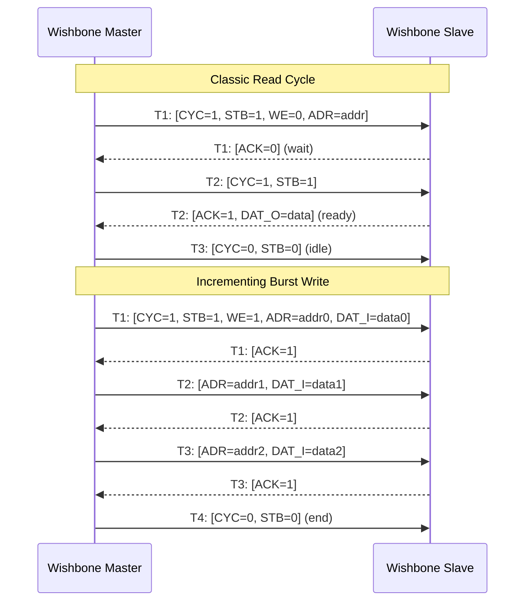
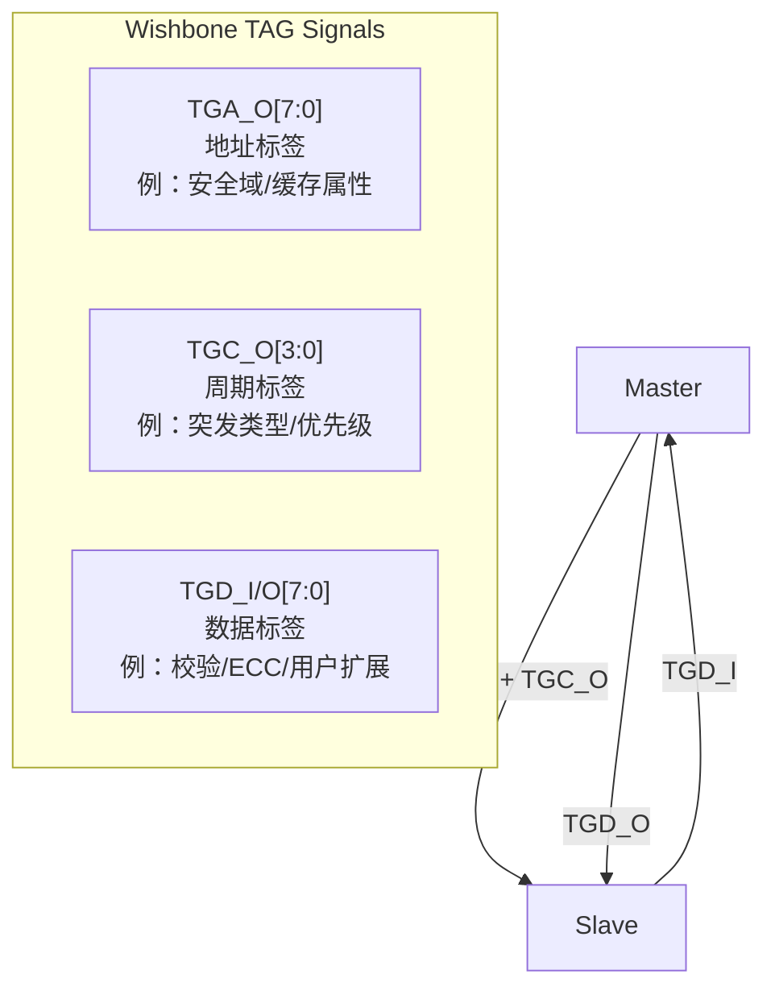
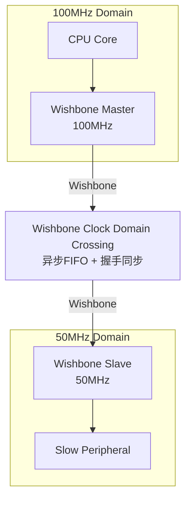

# Wishbone逻辑级与时序分析

<span class="badge-b">[Beginner]</span> <span class="badge-i">[Intermediate]</span> <span class="badge-e">[Expert]</span>

---

<span class="red">为什么Wishbone在1990年代诞生至今仍被广泛使用？</span> Wishbone不是性能最高的总线协议，也不是功能最丰富的——但它是最"透明"的。1997年Silicore发布的Wishbone规范仅有不到20页，定义了清晰的握手信号和周期类型，没有复杂的流水线、突发传输或缓存一致性。这种极简主义使Wishbone成为FPGA和ASIC教学、OpenCores IP集成、以及快速原型开发的首选总线。理解Wishbone的周期类型、TAG机制和跨时钟域处理，是掌握"够用即可"设计哲学的最佳入口。

---

## <strong>Wishbone周期类型</strong>

### <strong>经典周期类型</strong>

<span class="red">Wishbone</span>定义了四种基本周期类型，覆盖绝大多数嵌入式场景：

| 周期类型 | 名称 | 特征 | 周期数 | 适用场景 |
|---------|------|------|--------|---------|
| Classic | 经典周期 | 单次读写，无流水线 | 2+ | 简单外设、教学 |
| Constant Address Burst | 定址突发 | 同一地址多次读写 | 2+N | FIFO/队列 |
| Incrementing Burst | 增量突发 | 地址递增的多拍传输 | 2+N | 存储器块传输 |
| End-of-Burst | 突发结束 | 标记突发最后一拍 | 1 | 突发边界 |



---

### <strong>信号定义与握手规则</strong>

Wishbone采用<span class="green">主从握手</span>机制，核心信号极简：

| 信号 | 方向 | 宽度 | 功能 |
|------|------|------|------|
| CLK_I | 系统→所有 | 1 | 总线时钟 |
| RST_I | 系统→所有 | 1 | 同步复位 |
| CYC_O | Master→Slave | 1 | 总线周期有效 |
| STB_O | Master→Slave | 1 | 选通信号（指示有效传输） |
| WE_O | Master→Slave | 1 | 1=写，0=读 |
| ADR_O | Master→Slave | 可变 | 目标地址 |
| DAT_I | Slave→Master | 可变 | 读数据 |
| DAT_O | Master→Slave | 可变 | 写数据 |
| ACK_I | Slave→Master | 1 | 传输完成确认 |
| ERR_I | Slave→Master | 1 | 错误响应（可选） |
| RTY_I | Slave→Master | 1 | 重试响应（可选） |

```verilog
// Wishbone Classic周期状态机
module wb_master_classic (
    input  wire        CLK_I,
    input  wire        RST_I,
    // Wishbone输出
    output reg         CYC_O,
    output reg         STB_O,
    output reg         WE_O,
    output reg  [31:0] ADR_O,
    output reg  [31:0] DAT_O,
    // Wishbone输入
    input  wire [31:0] DAT_I,
    input  wire        ACK_I,
    input  wire        ERR_I,
    input  wire        RTY_I,
    // 控制
    input  wire        req_valid,
    input  wire        req_write,
    input  wire [31:0] req_addr,
    input  wire [31:0] req_wdata,
    output reg         resp_valid,
    output reg  [31:0] resp_rdata
);
    localparam IDLE  = 2'b00;
    localparam REQ   = 2'b01;  // 发起请求
    localparam WAIT  = 2'b10;  // 等待响应
    localparam DONE  = 2'b11;  // 完成
    
    reg [1:0] state;
    
    always @(posedge CLK_I) begin
        if (RST_I) begin
            state   <= IDLE;
            CYC_O   <= 1'b0;
            STB_O   <= 1'b0;
            resp_valid <= 1'b0;
        end else case (state)
            IDLE: begin
                resp_valid <= 1'b0;
                if (req_valid) begin
                    state <= REQ;
                    CYC_O <= 1'b1;
                    STB_O <= 1'b1;
                    WE_O  <= req_write;
                    ADR_O <= req_addr;
                    DAT_O <= req_wdata;
                end
            end
            
            REQ: begin
                // STB_O在请求周期保持有效
                if (ACK_I || ERR_I) begin
                    // Slave立即响应（无等待）
                    state <= DONE;
                    CYC_O <= 1'b0;
                    STB_O <= 1'b0;
                    resp_valid <= 1'b1;
                    resp_rdata <= DAT_I;
                end else if (RTY_I) begin
                    // Slave请求重试
                    state <= IDLE;  // 回到IDLE重新请求
                    CYC_O <= 1'b0;
                    STB_O <= 1'b0;
                end
                // 若ACK/ERR/RTY都为0，保持REQ状态（等待周期）
            end
            
            DONE: begin
                state <= IDLE;
                resp_valid <= 1'b0;
            end
        endcase
    end
endmodule
```

<span class="blue">关键结论：Wishbone的握手核心是CYC_O + STB_O与ACK_I的配合——
<br>
Master在CYC_O有效期间发起STB_O，Slave在准备好时拉高ACK_I，
<br>
ACK_I=1的时钟沿即传输完成边界。
</span>

---

### <strong>Burst周期详解</strong>

增量突发（Incrementing Burst）是Wishbone最高效的传输模式：

```verilog
// Wishbone增量突发Master
module wb_master_burst (
    input  wire        CLK_I,
    input  wire        RST_I,
    output reg         CYC_O,
    output reg         STB_O,
    output reg         WE_O,
    output reg  [31:0] ADR_O,
    output reg  [31:0] DAT_O,
    input  wire [31:0] DAT_I,
    input  wire        ACK_I,
    // 突发控制
    input  wire        burst_req,
    input  wire [31:0] burst_addr,
    input  wire [3:0]  burst_len,     // 突发长度 1-16
    input  wire        burst_we,
    input  wire [31:0] burst_wdata [0:15]
);
    reg [3:0] beat_cnt;
    reg [31:0] current_addr;
    
    always @(posedge CLK_I) begin
        if (RST_I) begin
            CYC_O <= 1'b0;
            STB_O <= 1'b0;
            beat_cnt <= 4'd0;
        end else if (!CYC_O && burst_req) begin
            // 突发开始
            CYC_O <= 1'b1;
            STB_O <= 1'b1;
            WE_O  <= burst_we;
            ADR_O <= burst_addr;
            DAT_O <= burst_wdata[0];
            current_addr <= burst_addr;
            beat_cnt <= 4'd0;
        end else if (CYC_O && ACK_I) begin
            // 突发进行中
            if (beat_cnt == burst_len - 1) begin
                // 最后一拍
                CYC_O <= 1'b0;
                STB_O <= 1'b0;
            end else begin
                // 下一拍
                beat_cnt <= beat_cnt + 1'b1;
                current_addr <= current_addr + 4;  // 32位=4字节
                ADR_O <= current_addr + 4;
                DAT_O <= burst_wdata[beat_cnt + 1];
            end
        end
    end
endmodule
```

| 突发参数 | 范围 | 说明 |
|---------|------|------|
| 地址对齐 | 4/8/16字节 | 突发起始地址必须对齐到突发大小 |
| 地址增量 | 4字节（32位） | 每拍地址+4，对应32位数据宽度 |
| 最大长度 | 协议未限定 | 由Master/Slave实现决定 |
| 终止条件 | CYC_O拉低 | Master拉低CYC_O结束突发 |

---

## <strong>TAG机制</strong>

### <strong>为什么需要TAG</strong>

<span class="red">TAG（Transfer Attribute Group）</span>是Wishbone的扩展机制，
<br>
允许在不修改核心信号的情况下增加带外信息。

| TAG信号 | 方向 | 宽度 | 用途 |
|--------|------|------|------|
| TGD_I | Slave→Master | 可变 | 数据阶段带外信息 |
| TGD_O | Master→Slave | 可变 | 数据阶段带外信息 |
| TGA_O | Master→Slave | 可变 | 地址阶段带外信息 |
| TGC_O | Master→Slave | 可变 | 周期阶段带外信息 |



---

### <strong>TAG应用实例：安全域标识</strong>

```verilog
// Wishbone TAG实现TrustZone安全扩展
module wb_slave_with_tag (
    input  wire        CLK_I,
    input  wire        RST_I,
    input  wire        CYC_I,
    input  wire        STB_I,
    input  wire        WE_I,
    input  wire [31:0] ADR_I,
    input  wire [31:0] DAT_I,
    output reg  [31:0] DAT_O,
    output reg         ACK_O,
    // TAG信号
    input  wire [2:0]  TGA_I,        // 地址标签：安全属性
    input  wire [3:0]  TGC_I         // 周期标签：传输类型
);
    // TGA_I编码：
    // [0]: 0=Normal, 1=Privileged
    // [1]: 0=Secure, 1=Non-secure
    // [2]: 0=Data, 1=Instruction
    
    wire is_secure_access = (TGA_I[1] == 1'b0);
    wire is_privileged    = (TGA_I[0] == 1'b1);
    
    // 寄存器文件：部分寄存器仅Secure可访问
    reg [31:0] secure_regs [0:7];
    reg [31:0] ns_regs [0:7];       // Non-secure寄存器
    
    always @(posedge CLK_I) begin
        if (RST_I) begin
            ACK_O <= 1'b0;
        end else if (CYC_I && STB_I && !ACK_O) begin
            if (ADR_I[7] == 1'b0 && !is_secure_access) begin
                // 试图非安全访问安全寄存器
                ACK_O <= 1'b1;
                DAT_O <= 32'hDEAD_BEEF;  // 错误标记
            end else begin
                ACK_O <= 1'b1;
                if (WE_I) begin
                    if (ADR_I[7] == 1'b0)
                        secure_regs[ADR_I[6:2]] <= DAT_I;
                    else
                        ns_regs[ADR_I[6:2]] <= DAT_I;
                end else begin
                    if (ADR_I[7] == 1'b0)
                        DAT_O <= secure_regs[ADR_I[6:2]];
                    else
                        DAT_O <= ns_regs[ADR_I[6:2]];
                end
            end
        end else begin
            ACK_O <= 1'b0;
        end
    end
endmodule
```

<span class="blue">关键结论：TAG机制是Wishbone的"未来-proof"设计——
<br>
核心协议1997年定稿后从未修改，所有新功能通过TAG扩展实现，
<br>
这使得Wishbone既保持稳定又具备可扩展性。
</span>

---

## <strong>跨时钟域处理</strong>

### <strong>Wishbone时钟域桥接</strong>

Wishbone系统常需要连接不同频率的模块：



| CDC方案 | 方法 | 延迟 | 适用场景 |
|--------|------|------|---------|
| 同步桥 | 时钟使能（PCLKEN等效） | 1-2周期 | 整数倍频 |
| 异步FIFO | 双端口RAM + 格雷码 | 3-5周期 | 任意频率比 |
| 握手同步 | 两级触发器链 | 2-3周期 | 单次传输 |

---

### <strong>异步Wishbone桥设计</strong>

```verilog
// 异步Wishbone桥：100MHz → 50MHz
module wb_async_bridge (
    // 主域接口 (100MHz)
    input  wire        CLK_M,
    input  wire        RST_M,
    input  wire        CYC_M,
    input  wire        STB_M,
    input  wire        WE_M,
    input  wire [31:0] ADR_M,
    input  wire [31:0] DAT_M,
    output reg  [31:0] DAT_M_O,
    output reg         ACK_M,
    // 从域接口 (50MHz)
    input  wire        CLK_S,
    input  wire        RST_S,
    output reg         CYC_S,
    output reg         STB_S,
    output reg         WE_S,
    output reg  [31:0] ADR_S,
    output reg  [31:0] DAT_S,
    input  wire [31:0] DAT_S_I,
    input  wire        ACK_S
);
    // 请求同步：主域→从域
    reg req_toggle_m;
    reg [2:0] req_sync_s;
    wire req_pulse_s = req_sync_s[2] ^ req_sync_s[1];
    
    // 响应同步：从域→主域
    reg ack_toggle_s;
    reg [2:0] ack_sync_m;
    wire ack_pulse_m = ack_sync_m[2] ^ ack_sync_m[1];
    
    // 主域：发起请求
    always @(posedge CLK_M) begin
        if (RST_M) begin
            req_toggle_m <= 1'b0;
            ACK_M <= 1'b0;
        end else if (CYC_M && STB_M && !ACK_M) begin
            req_toggle_m <= ~req_toggle_m;  // 翻转触发
        end else if (ack_pulse_m) begin
            ACK_M <= 1'b1;
            DAT_M_O <= DAT_S_I;
        end else if (!CYC_M) begin
            ACK_M <= 1'b0;
        end
    end
    
    // 从域：同步请求并执行
    always @(posedge CLK_S) begin
        if (RST_S) begin
            req_sync_s <= 3'b000;
            ack_toggle_s <= 1'b0;
            CYC_S <= 1'b0;
            STB_S <= 1'b0;
        end else begin
            req_sync_s <= {req_sync_s[1:0], req_toggle_m};
            
            if (req_pulse_s && !CYC_S) begin
                // 捕获主域请求
                CYC_S <= 1'b1;
                STB_S <= 1'b1;
                WE_S  <= WE_M;
                ADR_S <= ADR_M;
                DAT_S <= DAT_M;
            end else if (CYC_S && ACK_S) begin
                // 完成，发送响应
                CYC_S <= 1'b0;
                STB_S <= 1'b0;
                ack_toggle_s <= ~ack_toggle_s;
            end
        end
    end
    
    // 主域：同步响应
    always @(posedge CLK_M) begin
        if (RST_M)
            ack_sync_m <= 3'b000;
        else
            ack_sync_m <= {ack_sync_m[1:0], ack_toggle_s};
    end
endmodule
```

<span class="blue">易错点：跨时钟域Wishbone桥不能依赖单周期握手——
<br>
必须使用脉冲同步（Toggle Synchronizer）或异步FIFO，
<br>
直接对ACK信号打两拍会导致周期丢失或重复采样。
</span>

---

### <strong>时序分析与约束</strong>

Wishbone接口的时序约束要点：

| 参数 | 定义 | 典型值 | 约束方法 |
|------|------|--------|---------|
| T_setup | ADR/DAT建立时间 | 2ns | SDC set_input_delay |
| T_hold | ADR/DAT保持时间 | 0.5ns | SDC set_input_delay -min |
| T_clk-q | 时钟到输出延迟 | 1.5ns | SDC set_output_delay |
| T_ack | Slave响应延迟 | 1-10周期 | 状态机验证 |

```tcl
# Wishbone接口SDC时序约束示例
# 主时钟
set wb_clk_period 10.0  ;# 100MHz = 10ns周期
set wb_clk [get_ports CLK_I]
create_clock -name wb_clk -period $wb_clk_period $wb_clk

# 输入延迟：ADR, STB, WE, DAT（相对于时钟）
set_input_delay -clock wb_clk -max 2.0 [get_ports {ADR_I[*] STB_I WE_I DAT_I[*]}]
set_input_delay -clock wb_clk -min 0.5 [get_ports {ADR_I[*] STB_I WE_I DAT_I[*]}]

# 输出延迟：DAT_O, ACK_O, ERR_O
set_output_delay -clock wb_clk -max 2.0 [get_ports {DAT_O[*] ACK_O ERR_O}]
set_output_delay -clock wb_clk -min 0.5 [get_ports {DAT_O[*] ACK_O ERR_O}]

# 多周期路径：突发传输中ADR_O可在ACK后下一周期改变
set_multicycle_path -setup 1 -hold 0 -from [get_ports ADR_O[*]] -to [get_ports ACK_I]
```

---

## <strong>历史演进段落</strong>

Wishbone总线的发展史是一部"开源极简主义"的坚持史。1997年，Ward T. Wheeler在Silicore公司发布了Wishbone规范的首个版本，其设计动机非常明确：当时工业界被AMBA和IBM CoreConnect等商业协议垄断，小型FPGA开发者和学术研究人员无法获得授权，迫切需要一套自由、简单、文档公开的总线标准。Wishbone的设计直接面向FPGA实现——所有信号都是单向的（无三态），握手逻辑可以用最少的LUT实现，这使得在Xilinx Spartan或Altera Cyclone等低端FPGA上构建完整SoC成为可能。1999年，Wishbone B版本发布，定义了经典周期和突发周期类型，TAG机制也在此时引入。2002年，Wishbone从Silicore独立出来，由OpenCores组织维护，成为开源硬件运动的核心基础设施。2009年，Wishbone B.3版本发布，这是目前最广泛使用的版本，规范文档仅23页，却完整定义了周期类型、TAG扩展和示例实现。在2010年代，随着RISC-V和TileLink的兴起，有人预测Wishbone会逐渐消亡，但事实是Wishbone在FPGA教学和OpenCores生态中持续繁荣——OpenCores仓库中有超过500个Wishbone兼容IP核，涵盖CPU（OpenRISC、LM32）、外设（UART、SPI、Ethernet）和存储器控制器。Wishbone的跨时钟域处理在2010年后也有了成熟方案，OpenCores社区贡献了多种CDC桥接实现，从简单的握手同步到完整的异步FIFO。Wishbone的设计哲学"保持简单"使其能够穿越技术周期——当AMBA协议越来越复杂（从AXI到CHI）、文档越来越厚时，Wishbone的20页规范依然是FPGA新手的最佳入门材料。

---

## <strong>本章小结</strong>

| 要点 | 内容 |
|------|------|
| 周期类型 | Classic（单次）、Constant Burst（定址）、Incrementing Burst（增量） |
| 握手核心 | CYC_O + STB_O → ACK_I，ACK=1的时钟沿为传输完成 |
| TAG机制 | TGA（地址）、TGC（周期）、TGD（数据）三组扩展信号 |
| 跨时钟域 | Toggle Synchronizer脉冲同步、异步FIFO、时钟使能三种方案 |
| 时序约束 | SDC中设置input/output delay，突发传输配置多周期路径 |
| 设计哲学 | 极简、透明、FPGA友好，核心规范20页覆盖全部功能 |

## <strong>练习</strong>

| 编号 | 题目 | 难度 |
|------|------|------|
| 1 | 画出Wishbone Classic读周期和写周期的完整时序图（CLK/CYC/STB/WE/ADR/DAT/ACK），标注Setup和Access阶段 | <span class="badge-b">[B]</span> |
| 2 | 用TAG信号TGA[2:0]实现一个Wishbone外设的安全域访问控制，画出地址解码逻辑和权限检查真值表 | <span class="badge-i">[I]</span> |
| 3 | 设计一个100MHz-to-33MHz的Wishbone异步桥接器，使用异步FIFO而非脉冲同步，计算FIFO最小深度（考虑最大突发长度8拍） | <span class="badge-e">[E]</span> |

---

<span class="purple">扩展阅读：Wishbone B.3规范（OpenCores官方文档）、OpenCores IP核仓库（wishbone-compatible标签）、FPGA Prototyping by SystemVerilog Examples（第8章Wishbone设计）、IEEE论文"A Comparison of AMBA AHB and Wishbone Buses"。
</span>
