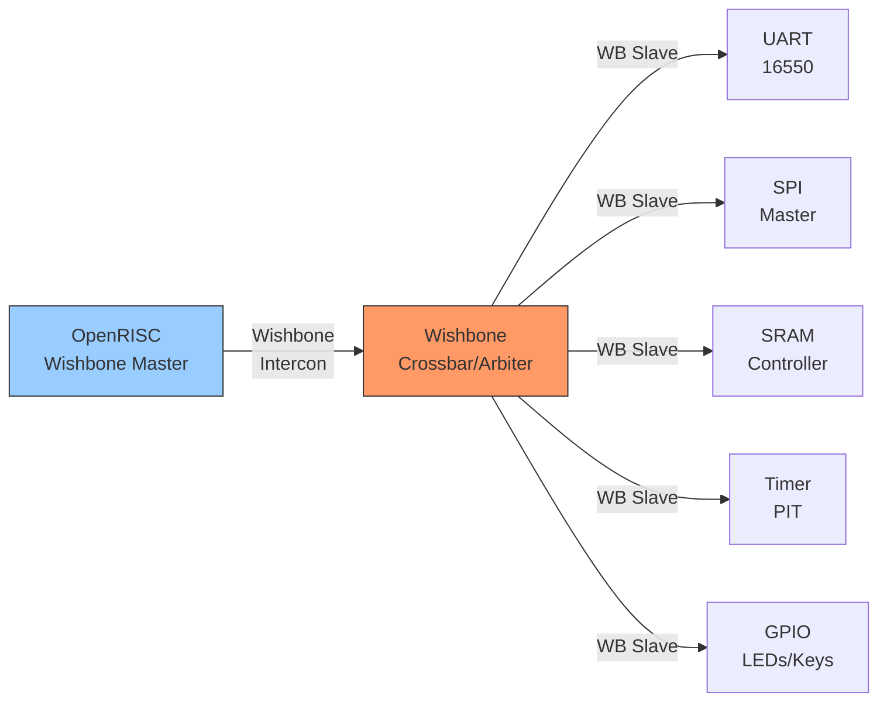
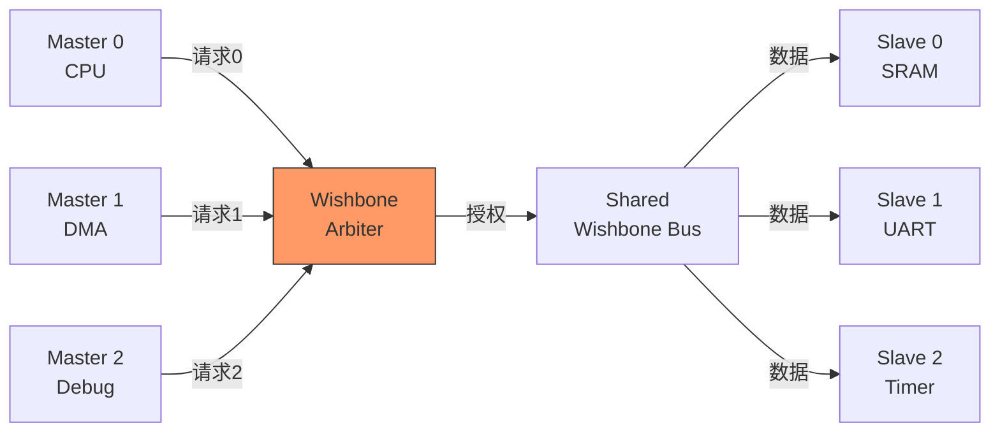
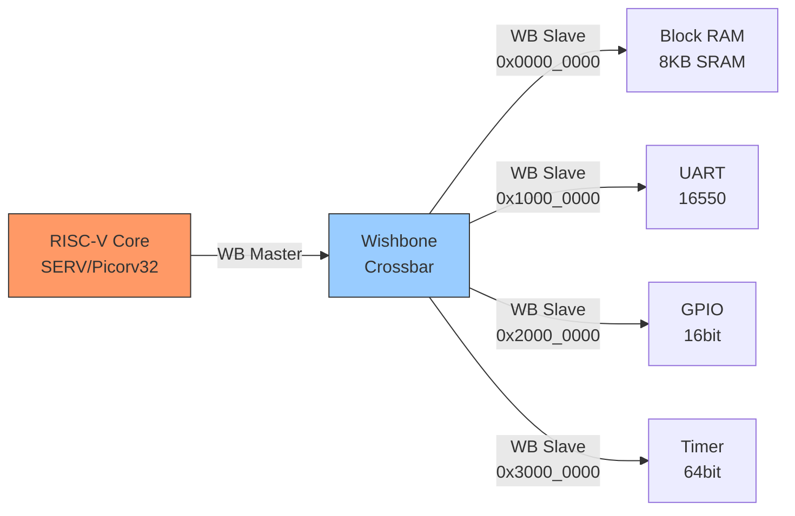

# Wishbone嵌入式实战案例

<span class="badge-i">[Intermediate]</span> <span class="badge-e">[Expert]</span>

<span class="red">Wishbone</span>是开源硬件社区最广泛使用的片上总线标准。

由OpenCores组织在1990年代末定义，Wishbone以其极简的信号集和灵活的互联方式，成为FPGA原型设计和开源SoC项目的首选总线。

从OpenRISC到RISC-V，从简单的LED控制器到复杂的多核SoC，Wishbone在开源硬件生态中扮演着AXI在商用SoC中的角色。

---

## <strong>OpenCores IP集成：Wishbone互联的生态系统</strong>

### <strong>OpenCores与Wishbone的关系</strong>

<span class="green">OpenCores</span>是开源硬件IP的最大仓库，托管了数千个开源Verilog/VHDL设计。

Wishbone是OpenCores推荐的片上互联标准——任何提交到OpenCores的IP，只要支持Wishbone接口，就可以与其他Wishbone IP即插即用。

| IP类型 | 代表项目 | Wishbone接口 | 应用场景 |
|--------|----------|--------------|----------|
| 处理器 | OpenRISC 1200 | Master | 开源软核CPU |
| 处理器 | RISC-V (SERV等) | Master | 极简RISC-V实现 |
| UART | 16550 compatible | Slave | 串口通信 |
| SPI | SPI Master/Slave | Slave | Flash/传感器 |
| Timer | PIT/PWM | Slave | 定时/脉宽调制 |
| GPIO | Simple GPIO | Slave | LED/按键 |
| Memory | SRAM/SDRAM Ctrl | Slave | 存储控制 |
| Ethernet | ETH MAC | Slave | 网络接口 |
| Video | VGA/LCD Ctrl | Slave | 显示控制 |



<span class="blue">关键认知：Wishbone的生态系统价值在于"组合即系统"——从OpenCores下载一个处理器核、一个UART、一个SRAM控制器，用Wishbone互联，即可构成一个可运行的最小SoC。
</span><br>

### <strong>Wishbone信号集：极简之美</strong>

Wishbone标准仅定义了少量必需信号：

| 信号 | 方向（Master→Slave） | 功能 |
|------|----------------------|------|
| CLK_I | → | 全局时钟 |
| RST_I | → | 全局复位 |
| ADR_O | → | 地址总线 |
| DAT_O | → | 写数据 |
| DAT_I | ← | 读数据 |
| WE_O | → | 写使能（1=写，0=读） |
| SEL_O | → | 字节选择（字节对齐访问） |
| STB_O | → | 选通（请求有效） |
| ACK_I | ← | 应答（传输完成） |
| CYC_O | → | 总线周期（占用总线） |

```verilog
// Wishbone Slave接口示例：简单GPIO控制器
module wb_gpio (
    // Wishbone接口
    input         clk_i,
    input         rst_i,
    input  [31:0] adr_i,      // 地址（低4位用于寄存器选择）
    input  [31:0] dat_i,      // 写入数据
    output [31:0] dat_o,      // 读出数据
    input         we_i,       // 写使能
    input  [3:0]  sel_i,      // 字节选择
    input         stb_i,      // 选通
    output reg    ack_o,      // 应答
    input         cyc_i,      // 总线周期
    // GPIO引脚
    output reg [15:0] gpio_out,
    input      [15:0] gpio_in,
    output reg [15:0] gpio_dir  // 1=输出, 0=输入
);

    // 寄存器地址映射
    localparam REG_DATA = 4'h0;  // 0x00: GPIO数据寄存器
    localparam REG_DIR  = 4'h4;  // 0x04: GPIO方向寄存器
    localparam REG_IN   = 4'h8;  // 0x08: GPIO输入寄存器（只读）

    wire [3:0] reg_addr = adr_i[3:0];
    wire wb_valid = cyc_i & stb_i;

    // Wishbone读写逻辑
    always @(posedge clk_i or posedge rst_i) begin
        if (rst_i) begin
            ack_o     <= 1'b0;
            gpio_out  <= 16'h0000;
            gpio_dir  <= 16'h0000;  // 默认输入
        end else begin
            ack_o <= wb_valid & ~ack_o;  // 单周期应答

            if (wb_valid & we_i) begin
                case (reg_addr)
                    REG_DATA: begin
                        // 仅更新方向为输出的位
                        gpio_out <= (dat_i[15:0] & gpio_dir) | (gpio_out & ~gpio_dir);
                    end
                    REG_DIR:  gpio_dir  <= dat_i[15:0];
                endcase
            end
        end
    end

    // 读数据输出
    assign dat_o = (reg_addr == REG_DATA) ? gpio_out :
                   (reg_addr == REG_DIR)  ? gpio_dir :
                   (reg_addr == REG_IN)   ? gpio_in  :
                   32'h00000000;

endmodule
```

<span class="blue">关键认知：Wishbone的"单周期应答"模式（ack_o在下一个时钟沿返回）是最简单的实现方式，但主频受限；"多周期等待"模式（插入wait states）可以支持慢速外设。
</span><br>

---

## <strong>Wishbone仲裁器设计：多Master共享总线</strong>

### <strong>轮询仲裁器的实现</strong>

当多个Wishbone Master需要访问共享Slave时，需要仲裁器。

Wishbone支持多种互联拓扑：点对点、共享总线、Crossbar。



```verilog
// Wishbone轮询仲裁器（Round-Robin Arbiter）
// 支持3个Master共享1个Slave端口

module wb_arbiter_rr (
    input clk,
    input rst,
    // Master 0接口
    input         m0_cyc,
    input         m0_stb,
    output reg    m0_ack,
    // Master 1接口
    input         m1_cyc,
    input         m1_stb,
    output reg    m1_ack,
    // Master 2接口
    input         m2_cyc,
    input         m2_stb,
    output reg    m2_ack,
    // 共享Slave接口（输出到Slave）
    output reg    s_cyc,
    output reg    s_stb,
    input         s_ack
);

    // 仲裁状态
    reg [1:0] grant;  // 当前授权的主机编号
    reg [1:0] next_grant;
    
    // 请求向量
    wire [2:0] request = {m2_cyc & m2_stb, m1_cyc & m1_stb, m0_cyc & m0_stb};
    wire [2:0] grant_vec = (grant == 2'd0) ? 3'b001 :
                           (grant == 2'd1) ? 3'b010 :
                           (grant == 2'd2) ? 3'b100 : 3'b000;

    // 轮询仲裁逻辑：选择下一个有请求的Master
    always @(*) begin
        if (grant == 2'd0) begin
            if (request[1]) next_grant = 2'd1;
            else if (request[2]) next_grant = 2'd2;
            else if (request[0]) next_grant = 2'd0;
            else next_grant = 2'd0;
        end else if (grant == 2'd1) begin
            if (request[2]) next_grant = 2'd2;
            else if (request[0]) next_grant = 2'd0;
            else if (request[1]) next_grant = 2'd1;
            else next_grant = 2'd1;
        end else begin
            if (request[0]) next_grant = 2'd0;
            else if (request[1]) next_grant = 2'd1;
            else if (request[2]) next_grant = 2'd2;
            else next_grant = 2'd2;
        end
    end

    // 状态机和信号路由
    always @(posedge clk or posedge rst) begin
        if (rst) begin
            grant <= 2'd0;
            m0_ack <= 1'b0;
            m1_ack <= 1'b0;
            m2_ack <= 1'b0;
        end else begin
            // 当当前传输完成（s_ack返回），切换到下一个Master
            if (s_ack) begin
                grant <= next_grant;
            end
            
            // 应答只返回给当前授权的Master
            m0_ack <= s_ack & (grant == 2'd0);
            m1_ack <= s_ack & (grant == 2'd1);
            m2_ack <= s_ack & (grant == 2'd2);
        end
    end

    // 路由选中的Master信号到Slave
    always @(*) begin
        case (grant)
            2'd0: begin s_cyc = m0_cyc; s_stb = m0_stb; end
            2'd1: begin s_cyc = m1_cyc; s_stb = m1_stb; end
            2'd2: begin s_cyc = m2_cyc; s_stb = m2_stb; end
            default: begin s_cyc = 1'b0; s_stb = 1'b0; end
        endcase
    end

endmodule
```

<span class="blue">关键认知：轮询仲裁器的公平性在于"不因优先级而饿死"——每个Master在轮到自己时获得相同的时间片，适合对称负载的系统；非对称负载时，加权轮询或固定优先级可能更合适。
</span><br>

---

## <strong>开源FPGA实战：构建最小SoC</strong>

### <strong>基于Wishbone的最小FPGA SoC</strong>

以下是一个可在FPGA上运行的最小SoC设计，包含RISC-V处理器、UART、SRAM和GPIO。



```verilog
// Wishbone Crossbar 地址映射（Verilog参数化）
module wb_crossbar (
    input clk, rst,
    // Master接口
    wishbone_if.slave  m0,  // CPU
    // Slave接口
    wishbone_if.master s0,  // BRAM @ 0x0000_0000 - 0x0000_1FFF
    wishbone_if.master s1,  // UART @ 0x1000_0000 - 0x1000_0FFF
    wishbone_if.master s2,  // GPIO @ 0x2000_0000 - 0x2000_0FFF
    wishbone_if.master s3   // TIMER @ 0x3000_0000 - 0x3000_0FFF
);

    // 地址解码
    wire sel_bram  = (m0.adr[31:13] == 19'h0);      // 0x0000_0000
    wire sel_uart  = (m0.adr[31:12] == 20'h10000);  // 0x1000_0000
    wire sel_gpio  = (m0.adr[31:12] == 20'h20000);  // 0x2000_0000
    wire sel_timer = (m0.adr[31:12] == 20'h30000);  // 0x3000_0000

    // 路由信号
    assign s0.cyc = m0.cyc & sel_bram;
    assign s0.stb = m0.stb & sel_bram;
    assign s0.adr = m0.adr;
    assign s0.dat_o = m0.dat_o;
    assign s0.we  = m0.we;
    assign s0.sel = m0.sel;

    // ... 其他Slave路由类似 ...

    // 读数据返回（多路选择）
    assign m0.dat_i = sel_bram  ? s0.dat_i :
                      sel_uart  ? s1.dat_i :
                      sel_gpio  ? s2.dat_i :
                      sel_timer ? s3.dat_i :
                      32'hDEAD_BEEF;  // 未映射地址返回特征值

    // 应答返回
    assign m0.ack = s0.ack | s1.ack | s2.ack | s3.ack;

endmodule
```

<span class="blue">关键认知：Wishbone Crossbar的地址解码极其简单——高位地址译码选择Slave，低位地址传递给Slave内部寻址。这种简单性是FPGA实现的理想选择。
</span><br>

### <strong>RISC-V与Wishbone的集成</strong>

```c
// 最小SoC的启动代码（RISC-V汇编）
// 假设UART在0x1000_0000，GPIO在0x2000_0000

    .section .text
    .global _start

_start:
    // 初始化栈指针
    li sp, 0x00002000      // BRAM顶部作为栈

    // 配置GPIO方向：低8位输出，高8位输入
    li t0, 0x20000004      // GPIO_DIR寄存器地址
    li t1, 0x000000FF      // 低8位输出
    sw t1, 0(t0)

    // 点亮LED（低8位输出1）
    li t0, 0x20000000      // GPIO_DATA寄存器地址
    li t1, 0x00000055      // 交替点亮模式
    sw t1, 0(t0)

    // 初始化UART：115200, 8N1
    li t0, 0x10000000      // UART基地址
    li t1, 0x00000083      // 访问DLL/DLM
    sb t1, 3(t0)           // LCR = 0x83
    li t1, 0x0000001A      // DLL = 26 (50MHz/16/115200)
    sb t1, 0(t0)           // DLL
    sb x0, 1(t0)           // DLM = 0
    li t1, 0x00000003      // 8N1
    sb t1, 3(t0)           // LCR

    // 发送"Hello"
    li t0, 0x10000000
    li t2, 'H'
    sb t2, 0(t0)
    li t2, 'e'
    sb t2, 0(t0)
    li t2, 'l'
    sb t2, 0(t0)
    li t2, 'l'
    sb t2, 0(t0)
    li t2, 'o'
    sb t2, 0(t0)

halt:
    j halt
```

<span class="purple">扩展阅读：LiteX是开源SoC构建框架，基于Migen（Python HDL），自动生成Wishbone互联、CSR（Config/Status Register）总线、以太网MAC等IP集成。
</span><br>

---

## <strong>为什么需要Wishbone</strong>

### <strong>开源硬件的"总线语言"</strong>

<span class="red">Wishbone不是技术最优的总线，而是生态最友好的总线。</span>

在开源硬件领域，Wishbone的存在意义：

| 维度 | AXI4 | Wishbone | 开源场景偏好 |
|------|------|----------|--------------|
| 信号数量 | ~50+ | ~10 | Wishbone |
| 学习曲线 | 陡峭（5通道、突发、ID） | 平缓（单周期） | Wishbone |
| 开源IP支持 | 有限（ARM生态） | 丰富（OpenCores） | Wishbone |
| FPGA资源 | 较多 | 极少 | Wishbone |
| 验证复杂度 | 高 | 低 | Wishbone |
| 高性能场景 | 优秀 | 一般 | AXI4 |

<span class="blue">关键认知：Wishbone的存在不是为了与AXI竞争性能，而是为了让"每个人都能设计SoC"——用Verilog写100行代码即可实现一个完整的Wishbone Master或Slave。
</span><br>

---

## <strong>本章小结</strong>

| 要点 | 内容 |
|------|------|
| 核心信号 | CLK, RST, ADR, DAT_I/O, WE, SEL, STB, ACK, CYC |
| 互联拓扑 | 点对点、共享总线（仲裁器）、Crossbar |
| 开源生态 | OpenCores, OpenRISC, RISC-V, LiteX |
| 仲裁策略 | 轮询、固定优先级、加权轮询 |
| FPGA实战 | Verilog实现Wishbone Slave + Crossbar + CPU集成 |
| 与AXI关系 | 互补而非竞争，开源FPGA用Wishbone，ASIC用AXI |

## <strong>练习</strong>

1. Wishbone的ACK信号必须在多少个时钟周期内返回？如果Slave无法在单周期内完成访问（如访问慢速SPI Flash），应该如何修改Wishbone握手时序？
2. 在一个包含CPU（Master）、DMA（Master）和SRAM（Slave）的系统中，设计一个固定优先级仲裁器（DMA优先级高于CPU）。与轮询仲裁器相比，这种设计在什么场景下更优？什么场景下可能导致CPU饿死？
3. 使用Verilog实现一个支持4个Master和4个Slave的Wishbone Crossbar，包含地址译码和读数据返回的多路选择器。画出地址映射表并说明每个Slave的地址范围。

---

## <strong>学习路径</strong>

- <span class="badge-i">[Intermediate]</span> 从Wishbone B3规范入手，在FPGA上实现一个简单的GPIO Slave和共享总线Master访问。
- <span class="badge-e">[Expert]</span> 深入研究Wishbone流水线模式（pipelined）、Block Read/Write传输、以及Wishbone与AXI的桥接设计。
- <span class="purple">扩展阅读：Wishbone B3 Specification（OpenCores）、OpenRISC 1200参考设计、LiteX SoC Builder文档、ZipCPU博客。
</span><br>