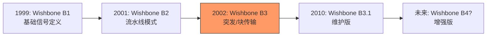
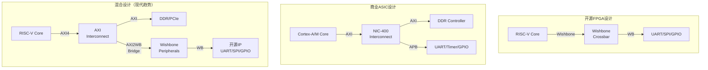

# Wishbone历史演进

<span class="badge-i">[Intermediate]</span> <span class="badge-e">[Expert]</span>

<span class="red">Wishbone</span>从1990年代末的OpenCores项目到今天的现代SoC设计，经历了从专有到开放、从简单到可扩展的演进。

作为开源硬件社区事实标准的片上总线，Wishbone与AXI/APB共存于现代FPGA和ASIC设计中，各自服务于不同的设计哲学和技术约束。

---

## <strong>从1990s到现代：Wishbone标准的三代演进</strong>

### <strong>Wishbone的诞生：开源硬件的呼唤</strong>

<span class="red">Wishbone</span>诞生于1990年代末，由Richard Herveille和Wade D. Peterson在OpenCores社区开发。

当时，FPGA正在从简单的胶合逻辑演进到可承载完整SoC的平台，但缺乏一个简单、开放、免费的片上总线标准。

| 年代 | 版本 | 关键特性 | 影响 |
|------|------|----------|------|
| 1999 | Wishbone B1 | 初始规范 | 基本信号定义 |
| 2001 | Wishbone B2 | 流水线模式 | 支持流水线传输 |
| 2002 | Wishbone B3 | 突发传输、块读写 | 当前主流版本 |
| 2010 | Wishbone B3.1 | 小修正 | 兼容性维护 |
| 2015+ | Wishbone B4（草案） | 更高速、更灵活 | 未正式发布 |



<span class="blue">关键认知：Wishbone的版本演进极其保守——B3规范2002年发布后在20多年里几乎未变，这种稳定性是开源硬件生态可积累性的基石。
</span><br>

### <strong>Wishbone B3的核心增强</strong>

Wishbone B3相比B1的关键扩展：

| 特性 | B1 | B3 | 意义 |
|------|-----|-----|------|
| 传输模式 | 经典（单周期） | 经典 + 流水线 | 提升主频 |
| 突发传输 | 无 | 支持（CTI/BTE） | 连续地址优化 |
| 块读写 | 无 | 支持 | 大数据量传输 |
| 字节选择 | 必需 | 必需 | 灵活访问宽度 |
| TAG信号 | 无 | 可选 | 用户扩展 |

```verilog
// Wishbone B3 流水线模式时序
// 流水线模式下，Master可以在收到ACK之前发起下一个请求

// 时序对比：
// 经典模式：ADR-STB-ACK -> 下一个ADR-STB-ACK
// 流水线模式：ADR0-STB0 -> ADR1-STB1 -> ACK0 -> ACK1
//              ↑ 重叠 ↑

// 流水线模式接口额外信号
// STALL_I: Slave尚未准备好接收新请求
// 当STALL_I=1时，Master必须保持当前ADR和STB不变
```

<span class="blue">关键认知：流水线模式是Wishbone从"低速FPGA玩具"演进到"可用SoC总线"的关键——它允许Master以接近每周期一个事务的速率连续传输，而不受Slave响应延迟限制。
</span><br>

---

## <strong>Wishbone与AXI/APB共存：开源与商业的生态分工</strong>

### <strong>三种总线的定位差异</strong>

| 维度 | Wishbone | APB | AXI4 |
|------|----------|-----|------|
| 发起者 | OpenCores | ARM | ARM |
| 定位 | 开源/教育/FPGA | 低速外设 | 高性能SoC |
| 信号数量 | ~10（必需） | ~15 | ~50+ |
| 突发传输 | 可选 | 无 | 原生支持 |
| 流水线 | 可选 | 无 | 原生支持 |
| 多主仲裁 | 需外部实现 | 无（单主） | 原生支持（5通道） |
| QoS | 无 | 无 | 原生支持 |
| 开源生态 | 极丰富 | 中等 | 有限（ARM授权） |
| FPGA资源 | 极少 | 少 | 较多 |
| 学习难度 | 低 | 低 | 高 |



### <strong>AXI-to-Wishbone桥接：开源IP的商业化之路</strong>

现代FPGA设计中，常见的架构是"AXI主干 + Wishbone外围"——处理器和高速外设使用AXI，而开源低速外设IP保留Wishbone接口。

```verilog
// AXI4-Lite to Wishbone B3 Bridge（概念性设计）
// 将ARM/FPGA SoC的AXI接口转换为开源Wishbone IP的接口

module axi_lite_to_wishbone (
    // AXI4-Lite Slave接口
    input         aclk,
    input         aresetn,
    input  [31:0] awaddr,
    input         awvalid,
    output reg    awready,
    input  [31:0] wdata,
    input  [3:0]  wstrb,
    input         wvalid,
    output reg    wready,
    output reg [1:0] bresp,
    output reg    bvalid,
    input         bready,
    input  [31:0] araddr,
    input         arvalid,
    output reg    arready,
    output reg [31:0] rdata,
    output reg [1:0] rresp,
    output reg    rvalid,
    input         rready,
    // Wishbone Master接口
    output reg [31:0] wb_adr,
    output reg [31:0] wb_dat_o,
    input      [31:0] wb_dat_i,
    output reg        wb_we,
    output reg [3:0]  wb_sel,
    output reg        wb_stb,
    input             wb_ack,
    output reg        wb_cyc
);

    // AXI写事务状态机
    // 阶段1：接收地址（AW通道）
    // 阶段2：接收数据（W通道）
    // 阶段3：Wishbone访问
    // 阶段4：返回响应（B通道）
    
    // AXI读事务状态机
    // 阶段1：接收地址（AR通道）
    // 阶段2：Wishbone读访问
    // 阶段3：返回数据（R通道）

    // 关键映射：
    // AXI AW/ARADDR -> Wishbone ADR
    // AXI WDATA     -> Wishbone DAT_O
    // AXI RDATA     <- Wishbone DAT_I
    // AXI WSTRB     -> Wishbone SEL
    // AXI AW/ARVALID -> Wishbone STB + CYC
    // AXI B/RVALID  <- Wishbone ACK

endmodule
```

<span class="blue">关键认知：AXI-to-Wishbone桥的存在证明了两种总线的互补性——AXI提供高性能基础设施，Wishbone提供丰富的开源IP库，桥接器让两者在同一个SoC中共存。
</span><br>

---

## <strong>开源硬件社区的角色</strong>

### <strong>Wishbone作为开源硬件的"普通话"</strong>

Wishbone在开源硬件社区中的角色，类似于C语言在系统编程中的角色——不是最先进的，但是最通用的。

| 开源项目 | Wishbone角色 | 规模 |
|----------|--------------|------|
| OpenRISC | 原生总线 | 完整SoC |
| RISC-V (LiteX) | 默认互联 | 完整SoC框架 |
| ZipCPU | 原生总线 | 轻量CPU |
| FuseSoC | 标准接口 | IP管理系统 |
| Opentitan | 部分使用 | 安全芯片 |
| NEORV32 | 原生总线 | 教学级RISC-V |

```c
// LiteX框架自动生成Wishbone互联（Python配置）
// 这是现代开源SoC设计的主流方式

from litex.soc.integration.soc_core import SoCCore
from litex.soc.integration.builder import Builder
from litex.soc.cores.uart import UART
from litex.soc.cores.gpio import GPIOOut

# 创建一个基于Wishbone的最小SoC
soc = SoCCore(
    cpu_type="vexriscv",      # RISC-V CPU
    clk_freq=100e6,             # 100MHz
    integrated_rom_size=0x8000,  # 32KB ROM
    integrated_sram_size=0x4000, # 16KB SRAM
)

# 添加UART（自动连接到Wishbone总线）
soc.add_uart(name="uart", baudrate=115200)

# 添加GPIO（自动连接到Wishbone总线）
soc.add_gpio(name="gpio", pads=soc.platform.request("user_led"))

# 自动生成Wishbone地址映射、互联、CSR总线
builder = Builder(soc)
builder.build()
```

<span class="purple">扩展阅读：LiteX用Python描述SoC架构，自动生成Wishbone/AXI互联、CSR寄存器映射、设备树、甚至软件启动代码，是现代开源SoC设计的"瑞士军刀"。
</span><br>

---

## <strong>历史演进：二十五年开源总线之路</strong>

### <strong>从反ARM到共生共荣</strong>

| 年代 | 事件 | 开源社区态度 |
|------|------|--------------|
| 1999 | Wishbone B1发布 | 开源硬件需要免费总线 |
| 2002 | Wishbone B3发布 | 与AMBA竞争 |
| 2005 | OpenRISC 1200成熟 | Wishbone生态繁荣 |
| 2010 | ARM Cortex-M+FPGA | 商业IP进入FPGA |
| 2015 | RISC-V+LiteX | Wishbone+AXI混合 |
| 2020 | CH32V307等国产RISC-V | 低成本SoC普及 |
| 2025+ | 开源EDA+开源工艺 | 全开源芯片流片 |

<span class="blue">演进逻辑：Wishbone与AMBA的关系从"竞争"演进到"共生"——开源社区不再追求取代商业标准，而是在标准之间建立桥梁，让不同来源的IP能够协同工作。
</span><br>

---

## <strong>本章小结</strong>

| 要点 | 内容 |
|------|------|
| 起源 | 1999年OpenCores，Richard Herveille |
| 版本演进 | B1→B2(流水线)→B3(突发/块传输)→B3.1(维护) |
| 核心哲学 | 极简、开放、免费 |
| 与AXI关系 | 互补而非竞争，AXI主干+Wishbone外围是主流 |
| 与APB关系 | Wishbone信号数与APB相当，但功能更丰富 |
| 开源生态 | OpenCores, LiteX, FuseSoC, NEORV32 |
| 现代趋势 | AXI-to-Wishbone桥接，混合架构 |

## <strong>练习</strong>

1. Wishbone B3的流水线模式与经典模式在时序上有何本质差异？请画出两种模式下Master连续读取4个地址的时序图，并比较总线利用率。
2. 为什么开源社区在2000年代初期需要Wishbone，而不是直接使用ARM的AMBA总线？除了授权费用之外，还有哪些技术和生态因素？
3. 在现代RISC-V SoC设计中，LiteX框架选择Wishbone作为默认互联总线。请分析如果改用AXI4作为默认总线，对FPGA资源消耗、开源IP兼容性和开发学习曲线分别会产生什么影响。

---

## <strong>学习路径</strong>

- <span class="badge-i">[Intermediate]</span> 从Wishbone B3规范入手，理解经典模式与流水线模式的时序差异。
- <span class="badge-e">[Expert]</span> 深入研究AXI-to-Wishbone桥接器设计、Wishbone流水线深度优化、以及多主仲裁的 starvation-free 保证。
- <span class="purple">扩展阅读：Wishbone B3 Specification（OpenCores）、LiteX文档、FuseSoC用户指南、ZipCPU博客《The Anatomy of a Wishbone Bus》。
</span><br>