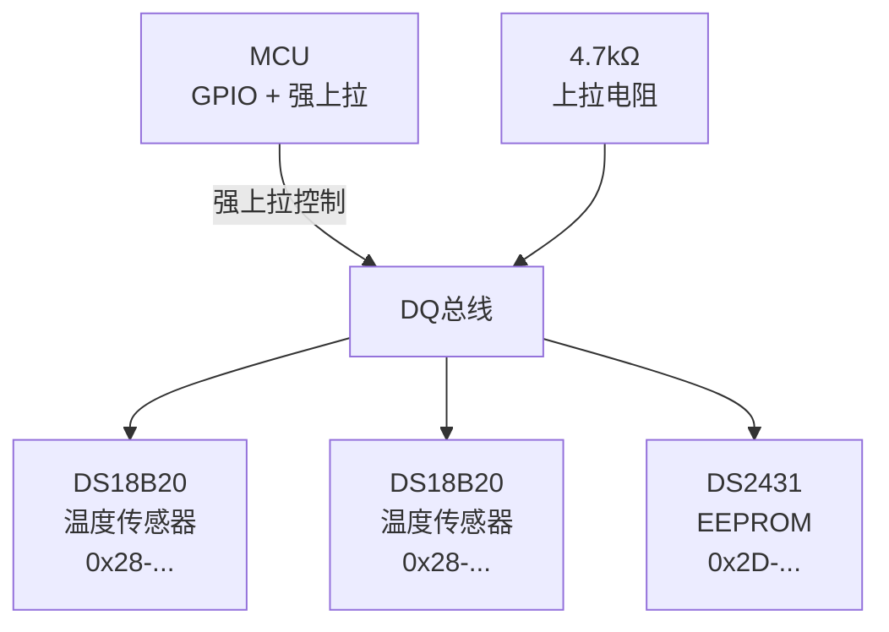

# 1-Wire 基础认知与单线协议 [B]

> **本章学习目标**：
> - 理解 1-Wire 单线供电+通信的极简设计
> - 掌握 ROM ID 的唯一标识与设备搜索机制
> - 了解 1-Wire 在温度传感和门禁系统中的典型应用

---

## 1-Wire 的诞生：一根线解决所有问题

---

### <strong>为什么需要 1-Wire：极致简化的末端接入</strong>

1-Wire由 Dallas Semiconductor（现 Maxim Integrated，2021 年被 Analog Devices 收购）在1990年代设计，
 
定位是"用最少的物理连接实现设备识别和数据采集"。
 

典型应用场景：
 
* DS18B20温度传感器：仅需 1 根线 + 地线，即可通信和供电
 
* 门禁系统的iButton：不锈钢外壳封装，防水防腐蚀
 
* 机房环境监测：数十个温度探头并联在同一根线上
 

类比：1-Wire 如同"单管供暖系统"——一根管道同时送热水和回水信息，每个房间有唯一编号，系统自动识别哪个房间在呼叫。
 

---

### <strong>1-Wire 的物理层：寄生供电与强上拉</strong>

1-Wire的核心电气特性：
 

| 参数 | 值 | 说明 |
| --- | --- | --- |
| 数据线 | DQ | 单线，开漏驱动 |
| 供电方式 | 寄生供电 / 外部 VCC | 大部分设备支持寄生供电 |
| 上拉电阻 | 4.7kΩ | 标准值 |
| 通信速率 | 16.3 kbps（标准） | 低速但可靠 |
| 设备数 | 理论无上限 | 实际受总线电容限制 |

寄生供电：设备在 DQ 为高时通过内部电容充电，在 DQ 为低时用储存的能量工作。写操作时需要 MCU 提供强上拉（MOSFET 直连 VCC）。
 

---

### <strong>ROM ID：64-bit 全球唯一标识</strong>

每个 1-Wire 设备出厂时烧录 64-bit ROM ID：
 

| 字段 | 长度 | 含义 |
| --- | --- | --- |
| 家族码 | 8 bit | 设备类型（0x28=温度传感器，0x2D=EEPROM） |
| 序列号 | 48 bit | 全球唯一，出厂烧录 |
| CRC | 8 bit | 前 56 bit 的校验和 |

搜索算法：Master 发送搜索命令后，所有设备同时响应。通过逐位比较和冲突检测，Master 可以在 N 个周期内找到所有设备的 ROM ID。
 

---

## 本章小结

| 概念 | 一句话总结 |
| --- | --- |
| 1-Wire | Maxim 提出的单线串行总线，供电+通信共用一根线 |
| 寄生供电 | DQ 为高时充电，为低时用储能工作 |
| ROM ID | 64-bit 全球唯一标识（家族码+序列号+CRC） |
| 搜索算法 | 逐位比较+冲突检测，自动发现总线上所有设备 |
| 强上拉 | 写操作时需要 MCU 提供额外电流 |

---

## 练习

1. 为什么 1-Wire 适合远距离温度传感（>50m），而 I2C 不适合？
2. 设计一个机房温度监测系统：10 个 DS18B20 并联在同一根 DQ 线上，画出总线拓扑。
3. 1-Wire 的搜索算法如何在 10 个设备、64-bit ROM ID 的情况下工作？估算搜索时间。
