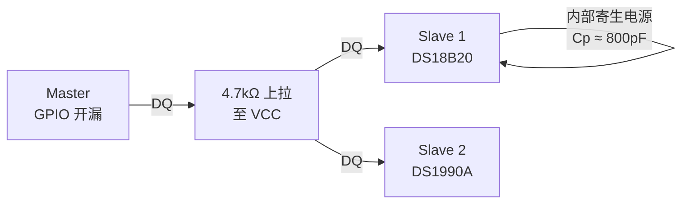

```mermaid
gantt
    title 1-Wire Reset + Presence 时序
    dateFormat X
    axisFormat %s μs
    section Master
    Reset (下拉)         :a1, 0, 480
    等待                :a2, 480, 60
    采样 Presence       :crit, a3, 540, 240
    section Slave
    检测 Reset          :b1, 0, 480
    Presence (下拉)     :crit, b2, 480, 120
    释放                :b3, 600, 120
```

# 1-Wire是什么——单线供电+通信的独特架构

<span class="badge-b">[B]</span> <span class="badge-i">[I]</span> <span class="badge-e">[E]</span> <span class="badge-m">[M]</span>

<span class="red">1-Wire 是总线协议中的异类：一根线同时完成供电和数据通信。</span><br>
Dallas Semiconductor（现 Maxim Integrated）在 1990 年代提出这一架构。<br>
它用寄生电源省去了 VCC 线，让两线（DQ + GND）系统成为可能。<br>
在测温、门禁、资产追踪等对布线极度敏感的场景中，1-Wire 不可替代。

---

## 核心定义与价值

<span class="red">1-Wire 定义：单线（DQ）同时承载数据和寄生电源，主设备通过上拉电阻+强下拉驱动总线。</span>

| 属性 | 值 |
|------|-----|
| 数据线 | <span class="green">DQ</span>（单线双向） |
| 回流 | <span class="green">GND</span>（必须有） |
| 供电方式 | <span class="green">寄生电源</span>（DQ 线充电）或外部 VCC（可选） |
| 拓扑 | 线性总线，可挂多设备 |
| 寻址 | 64-bit ROM ID 唯一标识 |
| 速率 | 标准 16.3 kbps；过驱动模式 142 kbps |
| 典型距离 | 几十米到百米（取决于上拉电阻和线缆） |

<br>

<span class="blue">1-Wire 的价值：极端省线。</span><br>
一根双绞线（DQ+GND）就能同时给传感器供电并读回温度。<br>
在 IoT 节点密集布线、机柜测温、冷链追踪中，省一根 VCC 就是省一层成本。<br>

---

### 类比：单车道隧道

想象一条只能单向通行的隧道。<br>
两个方向的车不能同时走，必须有"会车规则"。<br>
1-Wire 的时分复用就是这个规则：主设备先"发号施令"（强下拉），然后释放总线让从设备"回应"（上拉高/低）。<br>
<span class="blue">会车规则 = 1-Wire 的时隙协议。</span><br>
隧道两边的"蓄电库"（寄生电容）让从设备在主设备沉默时仍有能量发出回应。<br>

---

## 核心机制原理解析

### <strong>1. 电气层：上拉电阻 + 强下拉 + 寄生电源</strong>

<span class="red">1-Wire 总线空闲时由主设备侧的上拉电阻拉至高电平。</span><br>
主设备通信时通过开漏输出强下拉 DQ 到 GND；从设备同样以开漏方式回应。<br>



<br>

| 电气参数 | 典型值 | 说明 |
|----------|--------|------|
| 上拉电阻 | 4.7 kΩ | 标准速率，5 m 距离 |
| 强下拉电流 | 4 mA（最小） | Master 开漏 MOSFET 驱动能力 |
| 寄生电容 | 800 pF | DS18B20 内部储能 |
| 逻辑高 | > 2.2V | VCC = 3.3V/5V 时 |
| 逻辑低 | < 0.3V | 强下拉保证 |

<br>

<span class="blue">寄生电源原理：DQ 高电平时，从设备内部二极管向电容充电；DQ 低电平时，电容放电维持从设备工作。</span><br>

---

### <strong>2. 1-Wire 时隙概览</strong>

<span class="red">1-Wire 通信由三种基本时隙组成：Reset/Presence、Write、Read。</span><br>
所有时序以微秒（μs）级精确控制。<br>

| 时隙类型 | 主设备动作 | 从设备动作 | 关键参数 |
|----------|-----------|-----------|----------|
| <span class="green">Reset</span> | 下拉 480 μs | 回复 Presence 60-240 μs | 主设备释放后等待 |
| <span class="green">Write 1</span> | 下拉 1-15 μs → 释放 | 无 | 主设备写"1" |
| <span class="green">Write 0</span> | 下拉 60-120 μs | 无 | 主设备写"0" |
| <span class="green">Read</span> | 下拉 1 μs → 释放 → 采样 | 下拉 0/释放 1 | 15 μs 内采样 |

<br>



---

### <strong>3. 典型器件家族</strong>

| 器件 | 功能 | 特点 |
|------|------|------|
| <span class="green">DS18B20</span> | 数字温度传感器 | -55°C ~ +125°C，精度 ±0.5°C，12-bit |
| <span class="green">DS1990A</span> | iButton 序列号 | 64-bit 唯一 ROM ID，门禁/资产追踪 |
| <span class="green">DS2431</span> | 1 kb EEPROM | 4 页 × 32 byte，OTP 模式 |
| <span class="green">DS2482</span> | I2C 到 1-Wire 桥 | 用 I2C 控制 1-Wire 总线，省 GPIO |

---

### <strong>4. 与 I2C 对比</strong>

| 维度 | <span class="green">1-Wire</span> | <span class="green">I2C</span> |
|------|---------|---------|
| 线数 | 1（DQ）+ GND | 2（SDA + SCL）+ GND |
| 寻址 | 64-bit ROM ID | 7-bit 或 10-bit 地址 |
| 速率 | 16.3 kbps（标准） | 100/400 kHz |
| 距离 | 可达百米 | 通常 < 5 m |
| 供电 | 寄生电源 | 必须外部 VCC |
| 节点数 | 理论上百 | 理论 128/1024 |
| 拓扑 | 线性为主 | 线性或星型 |
| 典型场景 | 测温、门禁、少线场景 | 板内传感器、PMIC、EEPROM |

<br>

<span class="blue">1-Wire 的核心差异化：省线到极致（仅 DQ+GND），代价是速率极低。</span><br>
当你看到只有一根数据线连到传感器时，优先考虑 1-Wire。<br>

---

## 技术教学与实战

### <strong>Linux w1-gpio 驱动概述</strong>

Linux 内核通过 <span class="green">w1-gpio</span> 驱动支持 GPIO 模拟 1-Wire Master。<br>

```c
// drivers/w1/masters/w1-gpio.c 核心时序（简化）
static void w1_write_bit(struct w1_master *dev, u8 bit) {
    if (bit) {
        gpio_set_value(dev->pin, 0);   // 下拉
        udelay(6);                       // Write 1 slot: 6 μs 低
        gpio_set_value(dev->pin, 1);   // 释放
        udelay(64);                      // 剩余 slot 时间
    } else {
        gpio_set_value(dev->pin, 0);   // 下拉
        udelay(60);                      // Write 0 slot: 60 μs 低
        gpio_set_value(dev->pin, 1);   // 释放
        udelay(10);                      // 恢复
    }
}
```

---

### <strong>设备树绑定</strong>

```dts
onewire@0 {
    compatible = "w1-gpio";
    gpios = <&gpio0 15 GPIO_ACTIVE_HIGH>;
    status = "okay";
};
```

---

## 嵌入式专属实战场景

### <strong>场景：机柜多点温度监测</strong>

某数据中心机柜内 8 个测温点，用一根双绞线串联全部 DS18B20。<br>
优势：仅需 DQ + GND 走线，无需每个传感器单独供电线。<br>
主设备通过 Search ROM 遍历总线获取全部 ROM ID，再逐一轮询温度。<br>

---

## 历史演进与前沿

| 年代 | 事件 | 影响 |
|------|------|------|
| 1990s | Dallas Semiconductor 提出 1-Wire | 寄生电源概念诞生 |
| 1996 | DS18B20 发布 | 数字测温标准化 |
| 2001 | Maxim 收购 Dallas | 延续产品线 |
| 2010s | Linux w1 子系统成熟 | sysfs 接口标准化 |
| 2020+ | 与 IoT 结合 | 低功耗场景持续有需求 |

<span class="purple">扩展阅读：Maxim/Dallas AN162 "1-Wire Design Guide"，详述寄生电源与线缆选择。</span><br>

---

## 本章小结

| 主题 | 要点 |
|------|------|
| 1-Wire 定义 | 单线 DQ 同时供电和数据通信 |
| 寄生电源 | DQ 高电平充电，低电平电容放电供能 |
| 典型器件 | DS18B20（温度）、DS1990A（iButton ID）、DS2431（EEPROM） |
| 与 I2C 对比 | 更省线、更慢、距离更长、必须寄生或外部 VCC |
| Linux 驱动 | w1-gpio 用 GPIO 模拟时序，sysfs 暴露设备 |
| 关键时序 | Reset 480 μs，Write 1 ≈ 6 μs 低，Write 0 ≈ 60 μs 低 |

---

## 练习

1. 为什么 1-Wire 能只用一根线通信，而 I2C 必须两根？寄生电源原理是什么？
2. 上拉电阻的作用是什么？如果去掉上拉电阻会发生什么？
3. 对比 DS18B20 与典型 I2C 温度传感器（如 LM75）在布线成本上的差异。
4. 1-Wire 的"强下拉"与 I2C 的开漏下拉在电气设计上有什么异同？
