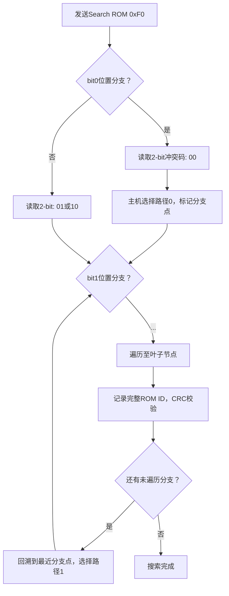
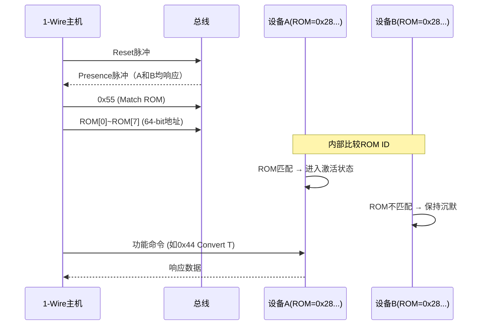

# 1-Wire-ROM-ID与设备搜索 [B]

> **本章学习目标**：
> - 掌握<span class="red">64-bit ROM ID</span>的位域结构与CRC8校验原理
> - 理解<span class="red">搜索ROM算法</span>的分支检测与二进制遍历流程
> - 运用<span class="red">Match ROM</span>直接寻址指定设备，避免全总线广播

---

## 64-bit ROM ID结构

---

### <strong>ROM ID的位域定义与唯一性保障</strong>

<span class="red">1-Wire ROM ID</span>是每个设备出厂时烧录的64-bit全球唯一标识。
<br>
其结构分为三个逻辑段：家族码（8-bit）、序列号（48-bit）、CRC8（8-bit）。
<br>

<span class="blue">ROM ID的设计哲学：前8-bit家族码标识设备类型（如温度传感器、EEPROM），
<br>
中间48-bit序列号由厂商分配保证唯一性，
<br>
末8-bit CRC用于传输完整性校验。
</span><br>

**64-bit ROM ID位域分解表：**

| 位域 | 位号 | 长度 | 功能 | 示例值 |
| --- | --- | --- | --- | --- |
| 家族码 | 0~7 | 8 bit | 标识设备类型 | 0x28 = DS18B20 |
| 序列号 | 8~55 | 48 bit | 厂商分配唯一号 | 0x000102030405 |
| CRC8 | 56~63 | 8 bit | 前56-bit校验 | 0xXX |

**常见1-Wire设备家族码表：**

| 家族码 | 设备型号 | 功能类型 |
| --- | --- | --- |
| 0x01 | DS1990A | 序列号/iButton |
| 0x05 | DS2405 | 单地址开关 |
| 0x10 | DS18S20 | 9-bit精度温度传感器 |
| 0x28 | DS18B20 | 12-bit精度温度传感器 |
| 0x2D | DS2431 | 1Kbit EEPROM |
| 0x3B | DS1825 | 可编程分辨率温度传感器 |
| 0x42 | DS28EA00 | 带PIO的温度传感器 |

<span class="orange"><strong>1. 家族码的协议作用</strong></span><br>
主机通过家族码判断设备支持的命令集。
<br>
例如收到家族码0x28后，主机知道该设备支持
<span class="green">Convert T（0x44）</span>和
<span class="green">Read Scratchpad（0xBE）</span>命令。
<br>

<span class="orange"><strong>2. 48-bit序列号的分配策略</strong></span><br>
Maxim/Dallas Semiconductor保证每个出厂设备的48-bit序列号全球唯一。
<br>
2<sup>48</sup> ≈ 2.8×10<sup>14</sup>的地址空间，足以支撑数十年的全球生产而不重复。
<br>

---

### <strong>CRC8校验：ROM ID完整性验证</strong>

<span class="red">CRC8（Maxim/Dallas 1-Wire CRC）</span>是ROM ID的校验机制，
<br>
生成多项式为 <span class="green">x<sup>8</sup> + x<sup>5</sup> + x<sup>4</sup> + 1</span>（二进制 0x31，初始值 0x00）。
<br>

```c
// 文件：onewire_crc8.c
// 功能：1-Wire CRC8计算与校验
#include <stdint.h>

/* CRC8生成多项式: x^8 + x^5 + x^4 + 1 = 0x31 */
#define CRC8_POLY  0x31
#define CRC8_INIT  0x00

uint8_t onewire_crc8(const uint8_t *data, int len)
{
    uint8_t crc = CRC8_INIT;
    int i, j;
    
    for (i = 0; i < len; i++) {
        crc ^= data[i];
        for (j = 0; j < 8; j++) {
            if (crc & 0x80)
                crc = (crc << 1) ^ CRC8_POLY;
            else
                crc <<= 1;
        }
    }
    return crc;
}

/* 校验64-bit ROM ID的完整性 */
int onewire_verify_rom(const uint8_t rom[8])
{
    uint8_t crc = onewire_crc8(rom, 7);  /* 前7字节参与计算 */
    return (crc == rom[7]) ? 0 : -1;       /* 第8字节为CRC */
}
```

<span class="blue">CRC8的校验范围：仅前56-bit（家族码+序列号）参与计算，
<br>
计算结果应等于ROM ID的最高字节（bit 56~63）。
<br>
主机读取ROM ID后必须执行CRC校验，否则可能使用损坏的地址。
</span><br>

---

## 搜索ROM算法

---

### <strong>搜索ROM的分支检测原理</strong>

<span class="red">搜索ROM（Search ROM，0xF0）</span>是1-Wire总线最核心的发现机制，
<br>
允许主机在不知任何设备地址的情况下枚举总线上的全部设备。
<br>

<span class="blue">搜索ROM的本质：基于二进制树的深度优先遍历，
<br>
利用总线"线与"特性检测每个bit位置是否存在分支。
</span><br>



**冲突码含义与总线行为：**

| 读取值 | 含义 | 总线状态 |
| --- | --- | --- |
| 00 | 冲突：部分设备发送0，部分发送1 | 存在分支 |
| 01 | 一致：所有设备发送0 | 无分支，值为0 |
| 10 | 一致：所有设备发送1 | 无分支，值为1 |
| 11 | 错误：无设备响应 | 总线空或故障 |

<span class="orange"><strong>1. 冲突检测的电气基础</strong></span><br>
1-Wire总线为Open-Drain线与。
<br>
当两个设备在同一bit位发送不同值时，
<br>
发送0的设备拉低总线，发送1的设备无法拉高（Open-Drain）。
<br>
主机读取到0，但随后读取"补码"bit时也会读到0，
<br>
因此组合码为00（冲突）。
<br>

<span class="orange"><strong>2. 搜索深度与复杂度</strong></span><br>
最坏情况下，N个设备的搜索需要约 <span class="green">N × 64</span> 个bit周期的交互。
<br>
对于少量设备（≤10），搜索时间在毫秒级。
<br>
对于大量设备（>50），搜索时间可能超过1秒。
<br>

---

### <strong>搜索ROM的C语言实现</strong>

```c
// 文件：onewire_search.c
// 功能：1-Wire搜索ROM算法完整实现
#include <stdint.h>
#include <string.h>

#define OW_CMD_SEARCH_ROM   0xF0
#define OW_MAX_DEVICES      16

/* 底层时序函数（由平台实现） */
extern uint8_t ow_reset(void);
extern void ow_write_bit(uint8_t bit);
extern uint8_t ow_read_bit(void);
extern void ow_write_byte(uint8_t byte);

/* 搜索状态机 */
typedef struct {
    uint8_t rom[8];          /* 当前搜索路径 */
    int last_discrepancy;   /* 最后冲突位置 */
    int last_family_discrepancy;
    int last_device_flag;
} ow_search_state_t;

int ow_search_rom(ow_search_state_t *state, uint8_t *rom_id)
{
    int id_bit, cmp_id_bit;
    int id_bit_number = 1;
    int last_zero = 0;
    int rom_byte_num = 0;
    int rom_byte_mask = 1;
    int search_direction;
    uint8_t crc8 = 0;
    
    if (!ow_reset())
        return 0;   /* 总线无设备 */
    
    ow_write_byte(OW_CMD_SEARCH_ROM);
    
    do {
        /* 读取2-bit冲突码 */
        id_bit = ow_read_bit();
        cmp_id_bit = ow_read_bit();
        
        if (id_bit == 1 && cmp_id_bit == 1)
            return 0;   /* 无设备响应 */
        
        if (id_bit != cmp_id_bit) {
            /* 无冲突，所有设备该bit一致 */
            search_direction = id_bit;
        } else {
            /* 冲突：id_bit == cmp_id_bit == 0 */
            if (id_bit_number < state->last_discrepancy) {
                /* 沿用上次选择 */
                search_direction = (state->rom[rom_byte_num] & rom_byte_mask) ? 1 : 0;
                if (search_direction == 0)
                    last_zero = id_bit_number;
            } else if (id_bit_number == state->last_discrepancy) {
                search_direction = 1;   /* 上次选0，这次选1 */
            } else {
                search_direction = 0;   /* 首次到达此分支，默认选0 */
                last_zero = id_bit_number;
            }
        }
        
        /* 写入选择方向 */
        ow_write_bit(search_direction);
        
        /* 记录到ROM缓冲区 */
        if (search_direction == 1)
            state->rom[rom_byte_num] |= rom_byte_mask;
        else
            state->rom[rom_byte_num] &= ~rom_byte_mask;
        
        /* 推进到下一个bit */
        rom_byte_mask <<= 1;
        if (rom_byte_mask == 0) {
            rom_byte_num++;
            rom_byte_mask = 1;
        }
        
        id_bit_number++;
    } while (rom_byte_num < 8);
    
    state->last_discrepancy = last_zero;
    
    /* 校验CRC */
    if (onewire_crc8(state->rom, 7) != state->rom[7])
        return -1;   /* CRC错误 */
    
    memcpy(rom_id, state->rom, 8);
    return 1;   /* 成功找到1个设备 */
}
```

<span class="blue">搜索算法的核心逻辑：
<br>
1. 每次冲突时主机选择0或1作为路径
<br>
2. 用栈记录分支点，找到设备后回溯
<br>
3. 重复直到last_discrepancy=0，所有路径遍历完毕
</span><br>

---

## Match ROM直接寻址

---

### <strong>Skip ROM vs Match ROM vs Search ROM</strong>

<span class="red">1-Wire总线</span>提供三种设备寻址命令，各自适用于不同场景。
<br>

**1-Wire ROM命令对比表：**

| 命令 | 代码 | 适用场景 | 风险 |
| --- | --- | --- | --- |
| Read ROM | 0x33 | 总线只有1个设备 | 多设备时冲突 |
| Match ROM | 0x55 | 已知目标地址，精准寻址 | 地址错误则无响应 |
| Skip ROM | 0xCC | 总线只有1个设备，或广播 | 多设备时数据冲突 |
| Search ROM | 0xF0 | 未知设备数量，需枚举 | 耗时较长 |
| Alarm Search | 0xEC | 仅响应报警标志置位的设备 | 需配合功能命令 |

<span class="orange"><strong>1. Match ROM的精准寻址时序</strong></span><br>



<span class="blue">Match ROM的核心价值：在多设备总线上避免广播冲突，
<br>
仅目标设备响应后续功能命令，其他设备忽略。
</span><br>

<span class="orange"><strong>2. Skip ROM的广播风险</strong></span><br>
当总线存在多个设备时，Skip ROM后的功能命令会被所有设备同时执行。
<br>
对于"读取"类命令，多个设备同时驱动总线会导致数据冲突。
<br>
仅适用于"写入"类命令（如同时触发所有温度传感器转换）。
<br>

---

### <strong>多设备温度轮询的寻址策略</strong>

```c
// 文件：onewire_match_rom.c
// 功能：Match ROM直接寻址多设备

#define OW_CMD_MATCH_ROM    0x55
#define OW_CMD_SKIP_ROM     0xCC
#define DS18B20_CONVERT_T   0x44
#define DS18B20_READ_SCRATCHPAD 0xBE

/* 已知的3个DS18B20 ROM ID */
uint8_t sensor_roms[3][8] = {
    {0x28, 0x01, 0x02, 0x03, 0x04, 0x05, 0x06, 0xXX},
    {0x28, 0x11, 0x12, 0x13, 0x14, 0x15, 0x16, 0xXX},
    {0x28, 0x21, 0x22, 0x23, 0x24, 0x25, 0x26, 0xXX},
};

void ds18b20_convert_all(void)
{
    /* 广播：同时触发所有传感器温度转换 */
    ow_reset();
    ow_write_byte(OW_CMD_SKIP_ROM);
    ow_write_byte(DS18B20_CONVERT_T);
    /* 等待750ms（12-bit精度典型转换时间） */
}

int ds18b20_read_temp(const uint8_t *rom, float *temp)
{
    uint8_t scratchpad[9];
    int i;
    
    /* Match ROM精准寻址 */
    ow_reset();
    ow_write_byte(OW_CMD_MATCH_ROM);
    for (i = 0; i < 8; i++)
        ow_write_byte(rom[i]);
    
    /* 读取Scratchpad */
    ow_write_byte(DS18B20_READ_SCRATCHPAD);
    for (i = 0; i < 9; i++)
        scratchpad[i] = ow_read_byte();
    
    /* CRC校验 */
    if (onewire_crc8(scratchpad, 8) != scratchpad[8])
        return -1;
    
    /* 计算温度：12-bit有符号，0.0625°C/LSB */
    int16_t raw = (scratchpad[1] << 8) | scratchpad[0];
    *temp = raw * 0.0625f;
    return 0;
}
```

<span class="blue">寻址策略优化：
<br>
转换阶段用Skip ROM广播同时触发所有传感器，
<br>
读取阶段用Match ROM逐个精准寻址，
<br>
兼顾效率与数据完整性。
</span><br>

---

## 本章小结

| 概念 | 一句话总结 |
| --- | --- |
| 家族码 | ROM ID低8-bit，标识设备类型（0x28=DS18B20） |
| 序列号 | 中间48-bit，厂商分配的全球唯一标识 |
| CRC8 | 最高8-bit，多项式0x31，校验前56-bit完整性 |
| Search ROM | 0xF0，二进制树遍历，自动枚举总线全部设备 |
| 冲突码 | 00=分支存在，01=全0，10=全1，11=总线空 |
| Match ROM | 0x55+64-bit地址，精准选中单个设备 |
| Skip ROM | 0xCC，广播命令，多设备时读取会冲突 |

---

## 练习

1. 某1-Wire设备ROM ID为 `0x28 0x3A 0x8C 0x01 0x00 0x00 0x88`，请计算CRC8校验字节（提示：多项式0x31，初始值0x00）。
2. 总线上有3个DS18B20，搜索ROM算法在第一轮遍历后找到第一个设备。请描述回溯到第二台设备的完整流程（需经过哪些bit位置的重新选择）。
3. 为什么Skip ROM后的Read Scratchpad命令在多设备总线上会产生数据冲突？请从1-Wire总线电气特性（Open-Drain线与）角度解释。
