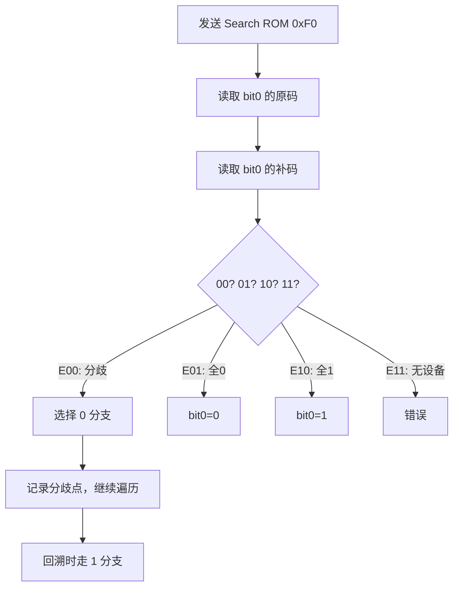

# 1-Wire怎么做——时隙、ROM-ID与搜索算法

<span class="badge-b">[B]</span> <span class="badge-i">[I]</span> <span class="badge-e">[E]</span> <span class="badge-m">[M]</span>

<span class="red">知道 1-Wire 是什么之后，必须掌握"怎么做"——精确的时隙、64-bit 身份标识、以及总线上多设备的搜索算法。</span><br>
这三个机制是 1-Wire 从"能亮灯"到"能组网"的质变点。

---

## 核心定义与价值

<span class="red">1-Wire 时隙（Time Slot）是主从设备交换单个 bit 的最小时间单元，所有通信建立在精确的 μs 级时序之上。</span><br>
<span class="red">ROM ID 是每个 1-Wire 从设备出厂烧录的 64-bit 全球唯一标识。</span><br>
<span class="red">Search ROM 是主设备在总线上逐个发现从设备的二进制树遍历算法。</span><br>

---

## 核心机制原理解析

```mermaid
gantt
    title Reset + Presence 精确时序
    dateFormat X
    axisFormat %s μs
    section DQ 电平
    Master 下拉 480 μs     :a1, 0, 480
    Master 释放上拉        :a2, 480, 60
    Slave Presence 下拉     :crit, b1, 540, 120
    Slave 释放             :b2, 660, 60
    Master 采样窗口         :crit, c1, 540, 240
    总线恢复高电平          :d1, 720, 160
```

### <strong>1. 初始化时序：Reset + Presence</strong>

<span class="red">每次通信必须以 Reset 序列开始，主设备发送 480 μs 低电平脉冲，从设备以 Presence 脉冲回应。</span>



<br>

| 阶段 | 时间参数 | 容差 |
|------|----------|------|
| 主设备 Reset 低电平 | 480-960 μs | 最小 480 μs |
| 主设备释放后等待 | 15-60 μs | 让总线恢复 |
| 从设备 Presence 延迟 | 15-60 μs | 检测 Reset 后响应 |
| 从设备 Presence 低电平 | 60-240 μs | 主设备在 480+60 ~ 480+240 μs 窗口采样 |
| 恢复时间 | > 480 μs | 保证总线回到高电平 |

<br>

<span class="blue">主设备必须在 Presence 窗口内采样 DQ：若低电平持续 = 有从设备在线；若始终高电平 = 总线空闲。</span><br>

---

### <strong>2. 写时隙：Write 1 vs Write 0</strong>

<span class="red">写时隙以主设备下拉 DQ 起始，持续时间的不同编码 bit 0 或 bit 1。</span>



<br>

```mermaid
gantt
    title 写时隙对比
    dateFormat X
    axisFormat %s μs
    section Write 1
    Master 下拉           :a1, 0, 6
    Master 释放           :a2, 6, 64
    恢复高电平            :a3, 70, 10
    section Write 0
    Master 下拉           :b1, 0, 60
    Master 释放           :b2, 60, 10
    恢复高电平            :b3, 70, 10
```

| 写类型 | 主设备下拉时间 | 总线低电平持续时间 | 从设备行为 |
|--------|---------------|-------------------|-----------|
| <span class="green">Write 1</span> | 1-15 μs（典型 6 μs） | 短 | 不动作，总线被上拉拉高 |
| <span class="green">Write 0</span> | 60-120 μs（典型 60 μs） | 长 | 保持被动，总线维持低 |

<br>

<span class="blue">写时隙总长度约 60-120 μs，标准速率下每秒约写 16k bit。</span><br>
从设备在写时隙中不驱动总线，仅被动接收。<br>

---

### <strong>3. 读时隙：主设备采样从设备回应</strong>

<span class="red">读时隙由主设备发起：先下拉 1 μs 启动，然后释放，在 15 μs 内采样 DQ 电平。</span><br>
从设备根据要发送的 bit 值，决定在此期间下拉（0）或释放（1）。<br>

| 阶段 | 时间 | 动作 |
|------|------|------|
| 主设备下拉 | 1 μs | 启动读时隙 |
| 主设备释放 | — | 切换为输入 |
| 从设备响应 | 0-15 μs | 0=下拉，1=释放 |
| 主设备采样 | < 15 μs | 必须在从设备释放前完成 |
| 恢复 | 剩余 slot 时间 | 回到高电平 |

```mermaid
gantt
    title 读时隙时序
    dateFormat X
    axisFormat %s μs
    section Master
    下拉 1 μs             :a1, 0, 1
    释放                  :a2, 1, 1
    采样窗口              :crit, a3, 2, 13
    等待恢复              :a4, 15, 55
    section Slave (bit=0)
    下拉回应              :b1, 2, 13
    释放                  :b2, 15, 55
    section Slave (bit=1)
    不驱动               :c1, 2, 13
    上拉拉高             :c2, 15, 55
```

<br>



<span class="blue">读时隙的采样窗口极窄：主设备必须在 15 μs 内完成采样，否则总线会被上拉电阻拉回高电平，无法区分从设备是否曾下拉。</span><br>

---

### <strong>4. 64-bit ROM ID 结构</strong>

<span class="red">每个 1-Wire 从设备出厂烧录不可更改的 64-bit ROM ID，格式如下：</span>

```
| Family Code (8 bit) | Serial Number (48 bit) | CRC (8 bit) |
|       Byte 0        |     Byte 1..6          |   Byte 7    |
|       LSB first      |      MSB last          |   LSB last  |
```

| 字段 | 位宽 | 含义 | 示例（DS18B20） |
|------|------|------|-----------------|
| <span class="green">Family Code</span> | 8 bit | 器件家族标识 | 0x28 |
| <span class="green">Serial Number</span> | 48 bit | 唯一序列号 | 工厂激光烧录 |
| <span class="green">CRC</span> | 8 bit | 前 56 bit 的 CRC-8 | 校验完整性 |

<br>

<span class="blue">Family Code 是器件类别的 DNA：DS18B20 = 0x28，DS1990A = 0x01，DS2431 = 0x2D。</span><br>
主设备可通过 Match ROM（0x55）匹配特定设备，或 Skip ROM（0xCC）广播命令。<br>

---

### <strong>5. Search ROM 算法：二进制树遍历</strong>

<span class="red">当总线上挂有多个从设备时，Search ROM（0xF0）通过二进制树遍历逐个发现 ROM ID。</span><br>

算法核心：每轮发送 Search ROM 命令后，所有从设备同时回应 ROM ID 的每一位。<br>
若所有设备该位相同（全 0 或全 1），主设备直接读取该位。<br>
若存在分歧（有的 0 有的 1），主设备先走"0"分支，记录分歧点，回溯时走"1"分支。<br>



<span class="blue">N 个设备的搜索复杂度为 O(N × 64)，最坏情况下每 bit 都可能出现分歧。</span><br>

---

## 技术教学与实战

### <strong>Linux w1-gpio + sysfs 接口</strong>

```bash
# 加载驱动后，sysfs 自动创建设备目录
$ ls /sys/bus/w1/devices/
28-0000055c2f7f  w1_bus_master1

# 28-0000055c2f7f = Family Code 0x28 (DS18B20) + 序列号

# 读取温度
$ cat /sys/bus/w1/devices/28-0000055c2f7f/w1_slave
f4 01 4b 46 7f ff 0c 10 1c : crc=1c YES
f4 01 4b 46 7f ff 0c 10 1c t=31375

# t=31375 表示 31.375°C（0.03125°C/LSB，12-bit 分辨率）
```

---

### <strong>DS18B20 完整读取流程</strong>

```
1. Master 发送 Reset（480 μs 低）
2. Slave 回应 Presence（60-240 μs 低）
3. Master 发送 Skip ROM（0xCC）或 Match ROM（0x55 + ROM ID）
4. Master 发送 Convert T（0x44）→ 启动温度转换
5. 等待 750 ms（12-bit 分辨率最大转换时间）
6. Master 再次 Reset + Presence
7. Master 发送 Skip ROM（0xCC）
8. Master 发送 Read Scratchpad（0xBE）
9. 读取 9 byte Scratchpad（含温度 LSByte/MSByte + CRC）
10. 验证 CRC，计算温度值
```

---

## 嵌入式专属实战场景

### <strong>场景：多点温度搜索与轮询</strong>

总线上 4 个 DS18B20，开机时 Search ROM 遍历获取全部 ROM ID：<br>

```python
import os
import glob

base = '/sys/bus/w1/devices/'
devices = [d for d in os.listdir(base) if d.startswith('28-')]

for dev in devices:
    path = os.path.join(base, dev, 'w1_slave')
    with open(path) as f:
        lines = f.readlines()
    if 'YES' in lines[0]:
        temp_raw = lines[1].split('t=')[1]
        temp_c = int(temp_raw) / 1000.0
        print(f"{dev}: {temp_c:.3f}°C")
```

---

## 历史演进与前沿

| 年代 | 进展 | 影响 |
|------|------|------|
| 1990s | Search ROM 算法提出 | 单总线多设备成为可能 |
| 2000s | Linux w1 子系统 | sysfs 接口标准化 |
| 2010s | 过驱动模式 | 速率提升至 142 kbps |
| 2020+ | DS2484 等新型 Master | I2C 桥接，降低 GPIO 时序要求 |

<span class="purple">扩展阅读：Maxim AN187 "1-Wire Search Algorithm" 完整描述了二进制树遍历的代码实现。</span><br>

---

## 本章小结

| 主题 | 要点 |
|------|------|
| Reset | 主设备 480 μs 低，从设备 60-240 μs Presence 回应 |
| Write 1 | 下拉 1-15 μs，短脉冲 |
| Write 0 | 下拉 60-120 μs，长脉冲 |
| Read | 主设备下拉 1 μs → 释放 → 15 μs 内采样 |
| ROM ID | 8-bit Family + 48-bit Serial + 8-bit CRC |
| Search ROM | 二进制树遍历，O(N×64)，处理总线多设备 |
| Linux 接口 | w1-gpio + sysfs，自动枚举 ROM ID |

---

## 练习

1. 画出 Write 1 和 Write 0 的波形对比，标注时间参数。
2. 为什么读时隙中主设备必须先下拉 1 μs 再释放？从设备能否主动发起读时隙？
3. 总线上有 3 个设备，ROM ID 分别为 ...0...、...1...、...1...，Search ROM 如何遍历？
4. DS18B20 的 Scratchpad 中温度数据为什么是 16-bit，分辨率是多少？
5. 若主设备采样窗口超过 15 μs，会导致什么错误？
