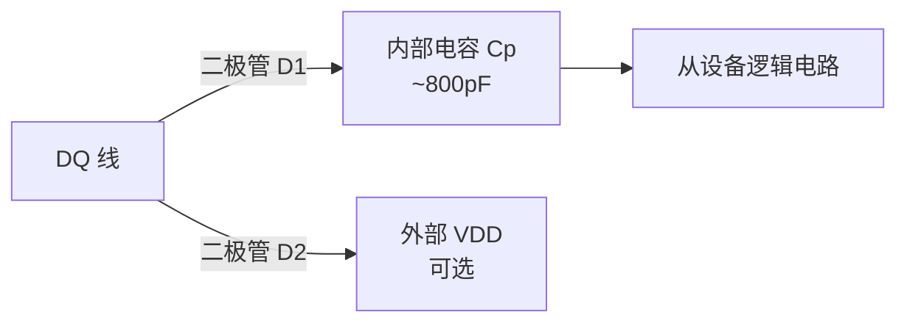
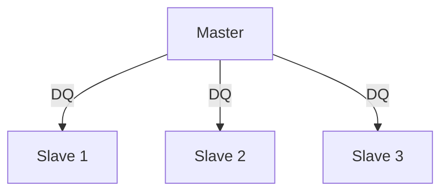

# 1-Wire为什么能长距离——寄生电源与阻抗匹配

<span class="badge-b">[B]</span> <span class="badge-i">[I]</span> <span class="badge-e">[E]</span> <span class="badge-m">[M]</span>

<span class="red">1-Wire 能跑百米，而 I2C 通常几米就崩溃——这不是运气，是电气设计的选择。</span><br>
寄生电源、上拉电阻与线缆阻抗的精密配合，让单线在长距离上仍可靠通信。<br>
理解"为什么能长距离"，是 1-Wire 工程部署的关键。

---

## 核心定义与价值

<span class="red">1-Wire 的长距离能力来自三个设计选择：寄生电源替代 VCC 供电、开漏拓扑容忍长线缆容性负载、上拉电阻可随距离调整。</span><br>

| 距离 | 推荐上拉电阻 | 线缆类型 | 节点数 |
|------|-------------|----------|--------|
| < 5 m | 4.7 kΩ | 普通双绞线 | < 20 |
| 5-30 m | 2.2 kΩ | 屏蔽双绞线 | < 10 |
| 30-100 m | 1 kΩ | 低电容双绞线 | < 5 |
| > 100 m | 需 1-Wire 耦合器 | 专用线缆 | 1-2 |

<br>

---

## 核心机制原理解析

### <strong>1. 寄生电源原理详解</strong>

<span class="red">寄生电源不是省线的妥协，而是让总线在高阻长线缆上仍能恢复的电气策略。</span><br>

DS18B20 内部寄生电源结构：<br>



<br>

| 阶段 | DQ 状态 | 内部电容 | 从设备供电来源 |
|------|---------|----------|--------------|
| 总线空闲 | 高电平（上拉） | 充电 | 外部 DQ 线 |
| 通信（DQ 低） | 低电平（主设备下拉） | 放电 | 电容 Cp 储能 |
| 转换期间 | 高电平 | 充电 | DQ 线 + 电容 |

<br>

<span class="blue">寄生电源的关键：电容必须足够大，在最长低电平期间维持从设备工作。</span><br>
DS18B20 的 Convert T（0x44）期间最长低电平时间 = 750 ms，寄生电容需支持此期间的漏电流。<br>
若使用外部 VDD（DQ 的 D2 路径），可大幅增强转换精度稳定性。<br>

---

### <strong>2. 上拉电阻与线缆长度的权衡</strong>

<span class="red">上拉电阻越小，驱动电流越大，长线缆上的 RC 充电越快；但电阻过小会导致主设备下拉时功耗过大、电压无法拉低到逻辑 0。</span><br>

线缆模型：分布电阻 R_cable + 分布电容 C_cable。<br>

RC 时间常数：
```
τ = (R_pullup || R_cable) × C_total
```

| 线缆长度 | 估算 C_total | 4.7kΩ 时 τ | 1kΩ 时 τ |
|----------|-------------|-----------|---------|
| 5 m | ~150 pF | 0.7 μs | 0.15 μs |
| 50 m | ~1.5 nF | 7 μs | 1.5 μs |
| 100 m | ~3 nF | 14 μs | 3 μs |

<br>

<span class="blue">1-Wire 时隙最短边沿要求 < 1 μs，因此 100 m + 4.7kΩ 时 τ = 14 μs 会导致边沿严重畸变。</span><br>
换用 1kΩ 上拉，τ 降至 3 μs，虽然仍不理想，但可通过降低速率补偿。<br>

---

### <strong>3. 强下拉 vs 弱上拉的电气设计</strong>

| 参数 | 强下拉（Master） | 弱上拉（电阻） |
|------|------------------|---------------|
| 驱动方式 | 开漏 MOSFET，导通电阻 < 100 Ω | 无源电阻 |
| 电流 | 可达数十 mA | VCC / R_pullup |
| 速度控制 | 快（决定下降沿） | 慢（决定上升沿） |
| 功耗 | 仅下拉时耗电 | 持续静态电流 |

<br>

<span class="blue">1-Wire 的上升沿永远比下降沿慢——这是开漏拓扑的宿命。</span><br>
长线缆场景下，上升沿可能长达数十 μs，限制了最高通信速率。<br>
过驱动模式（Overdrive）通过缩短时隙强行提速，但仅适用于短距离。<br>

---

### <strong>4. 拓扑：线性 vs 星型</strong>

<span class="red">1-Wire 推荐线性总线拓扑（Daisy Chain），星型拓扑因反射和阻抗不连续而限制严重。</span><br>


线性总线：各节点串联，反射最小，阻抗连续。<br>



星型拓扑：多分支从同一节点引出，阻抗不连续导致信号反射。<br>
<span class="blue">星型每个分支长度应 < 3 m，总线总长 < 30 m；否则信号完整性严重恶化。</span><br>

---

### <strong>5. 与 I2C 距离限制的根本对比</strong>

| 因素 | <span class="green">1-Wire</span> | <span class="green">I2C</span> |
|------|---------|---------|
| 速率 | 16 kbps（慢 = 容忍长延迟） | 100-400 kHz（快 = 对边沿敏感） |
| 上拉 | 可调 1kΩ-4.7kΩ | 通常固定 4.7kΩ-10kΩ |
| 拓扑弹性 | 寄生电源支持任意节点位置 | 需外部 VCC 到每个节点 |
| 电气规范 | 较宽松 | I2C 标准严格定义容性负载 < 400 pF |
| 信号完整性 | 低速容忍反射 | 高速要求阻抗匹配 |

<br>

<span class="blue">1-Wire 能跑百米的根本原因：低速（16 kbps）使长线缆的 RC 延迟不再是致命问题。</span><br>
I2C 的 400 kHz 意味着每位仅 2.5 μs，任何 > 1 μs 的上升沿都会吃掉信号裕量。<br>

---

## 技术教学与实战

### <strong>上拉电阻选型计算</strong>

已知：线缆 50 m，分布电容 30 pF/m，目标上升沿 < 5 μs。

```
τ = R_pullup × C_total = R × (50 × 30pF) = R × 1.5nF
要求 τ < 5 μs → R < 5μs / 1.5nF ≈ 3.3 kΩ
```

<span class="blue">同时验证下拉电流：I_pull = 5V / 3.3kΩ = 1.5 mA，主设备 MOSFET 能轻松拉低。</span><br>
选 2.2 kΩ 是保守折中。<br>

---

## 嵌入式专属实战场景

### <strong>场景：冷库 50 m 温度传感器布线</strong>

环境：-30°C 冷库，8 个 DS18B20，最远节点 50 m。<br>

设计决策：<br>

- 线缆：CAT5 双绞线一对（DQ+GND），剩余线对做冗余<br>
- 上拉：2.2 kΩ 近 Master 端<br>
- 拓扑：线性 Daisy Chain，拒绝星型<br>
- 供电：外部 VDD 到每个节点（冷库寄生电源不稳定）<br>
- 速率：标准模式，不开启过驱动<br>

---

## 历史演进与前沿

| 年代 | 进展 | 意义 |
|------|------|------|
| 1990s | 寄生电源概念 | 省去 VCC 线，革命性简化布线 |
| 2000s | 1-Wire 耦合器 | 解决 > 100 m 距离的信号完整性 |
| 2010s | 有源上拉 | 主设备在上升沿提供短暂强上拉，加速充电 |
| 2020+ | 低电容专用线缆 | 分布电容 < 15 pF/m，进一步延长距离 |

<span class="purple">扩展阅读：Maxim AN148 "1-Wire Voltage Levels and Power Requirements"
</span><br>

---

## 本章小结

| 主题 | 要点 |
|------|------|
| 寄生电源 | DQ 高电平充电，低电平电容放电供能 |
| 上拉电阻 | 距离越长，电阻越小（5m→4.7kΩ, 100m→1kΩ） |
| RC 时间常数 | 限制上升沿速度，决定最大通信速率 |
| 强下拉 vs 弱上拉 | 下降沿快，上升沿慢；长线缆上升沿是瓶颈 |
| 拓扑 | 线性 Daisy Chain 最优，星型限制严重 |
| 与 I2C 对比 | 1-Wire 慢=容忍长距离，I2C 快=限制短距离 |
| 前沿 | 有源上拉、低电容线缆、1-Wire 耦合器 |

---

## 练习

1. 计算 100 m 线缆（50 pF/m）配 1kΩ 上拉的 RC 时间常数。若要求上升沿 < 10 μs，上拉电阻最大多少？
2. 寄生电源在 Convert T 期间如何维持从设备工作？若电容不足会发生什么？
3. 为什么星型拓扑对 1-Wire 的伤害远大于线性拓扑？
4. 有源上拉如何改善长距离通信？画出概念电路。
5. 若强制给 100 m 总线开 Overdrive 模式，预期会出现什么现象？
