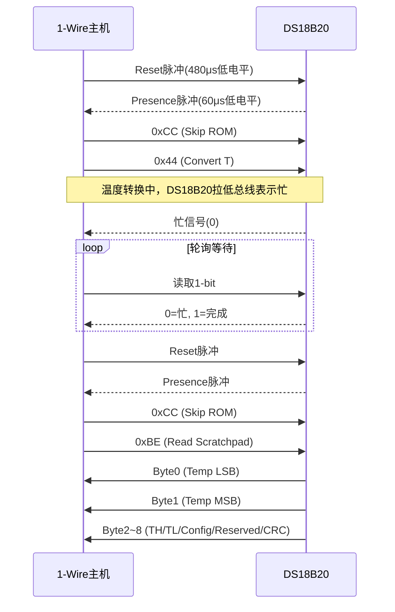
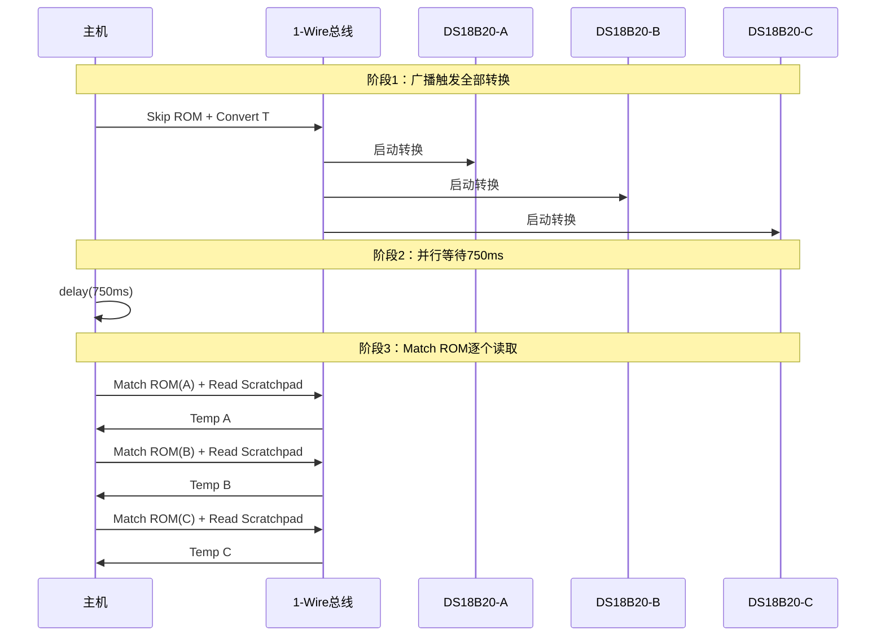

# 1-Wire实战：温度传感器 [B→I]

> **本章学习目标**：
> - 掌握<span class="red">DS18B20</span>的温度转换时序与分辨率配置机制
> - 理解Linux内核<span class="red">w1-gpio</span>驱动的GPIO bit-banging实现原理
> - 实现<span class="red">多设备温度轮询</span>的Shell脚本与sysfs自动化读取

---

## DS18B20时序与分辨率

---

### <strong>DS18B20的硬件架构与温度量化原理</strong>

<span class="red">DS18B20</span>是Maxim/Dallas Semiconductor推出的数字温度传感器，
<br>
采用单总线（1-Wire）接口，无需外部ADC即可输出数字温度值。
<br>

<span class="blue">DS18B20的核心原理：片上集成温度传感元件、
<br>
10-bit至12-bit ADC、以及1-Wire接口控制器，
<br>
输出温度值以16-bit补码格式存储在9字节Scratchpad中。
<br>
分辨率可通过配置寄存器编程为9/10/11/12-bit。
<br>
</span><br>

**DS18B20 Scratchpad寄存器映射表：**

| 字节 | 名称 | 内容 | 说明 |
| --- | --- | --- | --- |
| 0 | Temp LSB | 温度值低8位 | bit7~4为整数低位，bit3~0为小数 |
| 1 | Temp MSB | 温度值高8位 | 有符号扩展 |
| 2 | TH Register | 高温报警阈值 | 用户可配置 |
| 3 | TL Register | 低温报警阈值 | 用户可配置 |
| 4 | Configuration | 分辨率配置 | R1/R0决定精度 |
| 5~7 | Reserved | 保留 | 内部使用 |
| 8 | CRC | CRC8校验 | 前8字节校验 |

**分辨率配置与转换时间对照表：**

| R1 | R0 | 分辨率 | 精度 | 转换时间 | LSB增量 |
| --- | --- | --- | --- | --- | --- |
| 0 | 0 | 9-bit | 0.5°C | 93.75 ms | 0.5°C |
| 0 | 1 | 10-bit | 0.25°C | 187.5 ms | 0.25°C |
| 1 | 0 | 11-bit | 0.125°C | 375 ms | 0.125°C |
| 1 | 1 | 12-bit | 0.0625°C | 750 ms | 0.0625°C |

<span class="orange"><strong>1. 温度数据的16-bit格式</strong></span><br>
12-bit分辨率时，bit11~4为整数部分（有符号），
<br>
bit3~0为小数部分（0.0625°C/LSB）。
<br>
例如 `0x0190` = 0000 0001 1001 0000b，
<br>
整数=25，小数=0，即 25.0000°C。
<br>

<span class="orange"><strong>2. 负数温度的补码表示</strong></span><br>
-25.0625°C 的16-bit表示：
<br>
原码 `0x0191` → 按位取反 `0xFE6E` → +1 = `0xFE6F`。
<br>
主机读取后需做符号扩展：`if (raw & 0x8000) raw |= 0xF000;`
<br>

---

### <strong>DS18B20温度转换完整时序</strong>

<span class="red">温度转换</span>需要"启动→等待→读取"三阶段，
<br>
总线时序严格遵循1-Wire协议规范。
<br>



<span class="orange"><strong>1. 转换启动</strong></span><br>
发送 <span class="green">Skip ROM（0xCC）</span> + <span class="green">Convert T（0x44）</span> 后，
<br>
DS18B20开始内部ADC转换。
<br>
转换期间总线被拉低表示"忙"，释放后表示"完成"。
<br>

<span class="orange"><strong>2. 忙信号轮询（强上拉替代）</strong></span><br>
经典1-Wire要求主机在转换期间提供"强上拉"（MOSFET直接接VCC），
<br>
因为寄生供电的DS18B20在转换时耗电约1mA，上拉电阻无法维持。
<br>
独立供电（VDD接3.3V）的DS18B20无需强上拉，可直接轮询总线状态。
<br>

<span class="orange"><strong>3. Scratchpad读取</strong></span><br>
转换完成后发送 <span class="green">Read Scratchpad（0xBE）</span>，
<br>
DS18B20依次输出9字节数据。
<br>
主机收到后应立即执行CRC8校验，确认数据完整性。
<br>

---

### <strong>分辨率配置的C代码实现</strong>

```c
// 文件：ds18b20_resolution.c
// 功能：DS18B20分辨率配置与温度读取
#include <stdint.h>

#define DS18B20_SKIP_ROM        0xCC
#define DS18B20_CONVERT_T       0x44
#define DS18B20_READ_SCRATCHPAD 0xBE
#define DS18B20_WRITE_SCRATCHPAD 0x4E
#define DS18B20_COPY_SCRATCHPAD 0x48

/* 底层1-Wire时序（平台相关） */
extern uint8_t ow_reset(void);
extern void ow_write_byte(uint8_t byte);
extern uint8_t ow_read_byte(void);
extern void ow_strong_pullup(uint8_t enable);
extern void delay_ms(uint32_t ms);
extern uint8_t onewire_crc8(const uint8_t *data, int len);

/* 配置分辨率：9/10/11/12-bit */
int ds18b20_set_resolution(uint8_t resolution)
{
    uint8_t config;
    uint8_t scratchpad[3];
    
    switch (resolution) {
        case 9:  config = 0x1F; break;   /* R1=0, R0=0 */
        case 10: config = 0x3F; break;   /* R1=0, R0=1 */
        case 11: config = 0x5F; break;   /* R1=1, R0=0 */
        case 12: config = 0x7F; break;   /* R1=1, R0=1 */
        default: return -1;
    }
    
    ow_reset();
    ow_write_byte(DS18B20_SKIP_ROM);
    ow_write_byte(DS18B20_WRITE_SCRATCHPAD);
    ow_write_byte(0x00);        /* TH = 0 */
    ow_write_byte(0x00);        /* TL = 0 */
    ow_write_byte(config);      /* Configuration */
    
    ow_reset();
    ow_write_byte(DS18B20_SKIP_ROM);
    ow_write_byte(DS18B20_COPY_SCRATCHPAD);  /* 写入EEPROM */
    delay_ms(10);                /* EEPROM写入约10ms */
    
    return 0;
}

float ds18b20_read_temp(void)
{
    uint8_t scratchpad[9];
    int16_t raw;
    
    /* 启动转换 */
    ow_reset();
    ow_write_byte(DS18B20_SKIP_ROM);
    ow_write_byte(DS18B20_CONVERT_T);
    ow_strong_pullup(1);         /* 寄生供电需强上拉 */
    delay_ms(750);               /* 12-bit最大转换时间 */
    ow_strong_pullup(0);
    
    /* 读取Scratchpad */
    ow_reset();
    ow_write_byte(DS18B20_SKIP_ROM);
    ow_write_byte(DS18B20_READ_SCRATCHPAD);
    for (int i = 0; i < 9; i++)
        scratchpad[i] = ow_read_byte();
    
    /* CRC校验 */
    if (onewire_crc8(scratchpad, 8) != scratchpad[8])
        return -999.0f;          /* CRC错误 */
    
    /* 解析温度 */
    raw = (scratchpad[1] << 8) | scratchpad[0];
    if (raw & 0x8000)            /* 符号扩展 */
        raw |= 0xF000;
    
    return (float)raw * 0.0625f;
}
```

<span class="blue">代码关键点：寄生供电模式下必须启用强上拉，
<br>
否则转换期间1mA电流会将总线电压拉至低于DS18B20工作电压，导致复位。
</span><br>

---

## 1-Wire内核驱动：w1-gpio

---

### <strong>w1-gpio驱动的架构与设备树配置</strong>

<span class="red">w1-gpio</span>是Linux内核的1-Wire主控制器驱动，
<br>
通过GPIO bit-banging模拟1-Wire时序。
<br>

<span class="blue">w1-gpio的本质：利用内核高精度定时器（hrtimer）和GPIO子系统，
<br>
在用户态无需关心微秒级时序细节，通过sysfs访问1-Wire设备。
<br>
</span><br>

**w1-gpio设备树配置：**

```dts
// 文件：arch/arm/boot/dts/myboard.dts

&gpio0 {
    w1_pins: w1-pins {
        pins = "gpio4";           /* 使用GPIO4作为1-Wire总线 */
        function = "gpio";
        bias-pull-up;             /* 内部上拉使能 */
    };
};

onewire@0 {
    compatible = "w1-gpio";
    gpios = <&gpio0 4 GPIO_ACTIVE_HIGH>;
    pinctrl-names = "default";
    pinctrl-0 = <&w1_pins>;
    status = "okay";
};
```

<span class="orange"><strong>1. 内核配置选项</strong></span><br>
编译内核时需启用：
<br>
* <span class="green">CONFIG_W1</span> — 1-Wire总线支持
<br>
* <span class="green">CONFIG_W1_MASTER_GPIO</span> — GPIO主控制器
<br>
* <span class="green">CONFIG_W1_SLAVE_THERM</span> — DS18B20温度传感器驱动
<br>

<span class="orange"><strong>2. sysfs设备节点结构</strong></span><br>
1-Wire设备在内核中注册为 `w1_bus_masterX` 下的子设备，
<br>
每个设备的ROM ID作为目录名。
<br>

```bash
$ ls /sys/bus/w1/devices/
28-000102030405  28-001112131415  w1_bus_master1

$ ls /sys/bus/w1/devices/28-000102030405/
id        name      power     subsystem temperature  uevent
```

---

### <strong>Linux sysfs温度读取代码</strong>

```c
// 文件：w1_sysfs_read.c
// 功能：通过sysfs读取DS18B20温度
#include <stdio.h>
#include <stdlib.h>
#include <string.h>

#define W1_THERM_PATH "/sys/bus/w1/devices/28-000102030405/temperature"

float w1_read_temperature_sysfs(void)
{
    FILE *fp;
    char buf[256];
    int temp_milli;
    
    fp = fopen(W1_THERM_PATH, "r");
    if (!fp) {
        perror("fopen temperature");
        return -999.0f;
    }
    
    if (fgets(buf, sizeof(buf), fp) == NULL) {
        fclose(fp);
        return -999.0f;
    }
    fclose(fp);
    
    /* sysfs输出格式：整数，单位为千分之一摄氏度 */
    /* 例如 "25625\n" = 25.625°C */
    temp_milli = atoi(buf);
    
    return (float)temp_milli / 1000.0f;
}

/* Shell脚本方式 */
```

```bash
#!/bin/bash
# 文件：read_all_ds18b20.sh
# 功能：轮询所有DS18B20传感器

W1_BASE="/sys/bus/w1/devices"

for sensor in ${W1_BASE}/28-*; do
    if [ -d "$sensor" ]; then
        rom=$(basename "$sensor")
        temp_raw=$(cat "${sensor}/temperature" 2>/dev/null)
        
        if [ -n "$temp_raw" ]; then
            temp=$(echo "scale=3; $temp_raw / 1000" | bc)
            echo "${rom}: ${temp}°C"
        else
            echo "${rom}: READ ERROR"
        fi
    fi
done
```

<span class="blue">w1-gpio的优势：内核自动处理1-Wire时序、
<br>
Search ROM枚举设备、CRC校验、温度换算，
<br>
用户态只需读取一个sysfs文件即可获得标准浮点温度值。
</span><br>

---

## 多设备温度轮询

---

### <strong>多DS18B20总线的轮询策略</strong>

<span class="red">多设备轮询</span>的核心挑战：总线上所有传感器共享同一数据线，
<br>
转换期间总线被占用，必须串行执行。
<br>

<span class="blue">最优策略：广播触发全部转换 → 并行等待 → 逐个Match ROM读取。
<br>
相比逐个"触发+等待+读取"，可减少(N-1)×转换时间的总延迟。
<br>
</span><br>

**轮询策略对比表：**

| 策略 | 流程 | 总延迟（N设备，12-bit） | 适用场景 |
| --- | --- | --- | --- |
| 串行逐个 | (转换+等待+读取) × N | N × 750ms + 读取开销 | 简单实现 |
| 广播触发+串行读取 | 转换×1 + 等待×1 + 读取×N | 750ms + N × 50ms | 推荐 |
| 异步中断 | 中断触发读取，主循环空闲 | 事件驱动 | 实时系统 |



---

### <strong>Linux多设备轮询C代码</strong>

```c
// 文件：multi_ds18b20_poll.c
// 功能：多DS18B20高效轮询
#include <stdio.h>
#include <dirent.h>
#include <unistd.h>

#define W1_DEVICES_DIR "/sys/bus/w1/devices"
#define ROM_PREFIX "28-"

int poll_all_sensors(void)
{
    DIR *dir;
    struct dirent *ent;
    char path[256];
    char temp_buf[32];
    FILE *fp;
    
    dir = opendir(W1_DEVICES_DIR);
    if (!dir) {
        perror("opendir");
        return -1;
    }
    
    /* 阶段1：广播触发转换（通过第一个设备的w1_master） */
    /* 实际由w1内核驱动自动处理，用户态只需触发同步 */
    
    /* 阶段2：等待转换完成 */
    usleep(750000);   /* 12-bit分辨率最大转换时间 */
    
    /* 阶段3：逐个读取 */
    while ((ent = readdir(dir)) != NULL) {
        if (strncmp(ent->d_name, ROM_PREFIX, 3) != 0)
            continue;
        
        snprintf(path, sizeof(path),
                 "%s/%s/temperature",
                 W1_DEVICES_DIR, ent->d_name);
        
        fp = fopen(path, "r");
        if (!fp) continue;
        
        if (fgets(temp_buf, sizeof(temp_buf), fp)) {
            int milli = atoi(temp_buf);
            printf("%s: %.3f°C\n",
                   ent->d_name,
                   (float)milli / 1000.0f);
        }
        fclose(fp);
    }
    
    closedir(dir);
    return 0;
}
```

---

### <strong>历史演进：从DS1820到DS18B20的精度革命</strong>

<span class="red">Dallas Semiconductor温度传感器</span>经历了三代精度演进：
<br>

| 型号 | 年份 | 分辨率 | 接口 | 供电方式 | 关键改进 |
| --- | --- | --- | --- | --- | --- |
| DS1820 | 1996 | 9-bit (0.5°C) | 1-Wire | 寄生/外部 | 首款数字温度传感器 |
| DS18S20 | 2000 | 9-bit (0.5°C) | 1-Wire | 寄生/外部 | 与DS1820引脚兼容 |
| DS18B20 | 2005 | 9~12-bit | 1-Wire | 寄生/外部 | 可编程分辨率 |
| DS28EA00 | 2010 | 12-bit | 1-Wire | 外部 | 带2路PIO |
| DS18B20-PAR | 2015 | 9~12-bit | 1-Wire | 纯寄生 | 优化寄生供电 |

<span class="blue">演进本质：从固定9-bit（0.5°C步进）到可编程12-bit（0.0625°C），
<br>
分辨率提升16倍，转换时间从约200ms增加到750ms，
<br>
精度与速度的权衡由用户根据应用场景自主选择。
<br>
</span><br>

---

## 本章小结

| 概念 | 一句话总结 |
| --- | --- |
| Scratchpad | DS18B20的9字节数据缓冲，Byte0~1为温度，Byte8为CRC |
| 12-bit分辨率 | R1=R0=1，0.0625°C/LSB，转换时间750ms |
| 强上拉 | 寄生供电时转换期间需MOSFET强驱总线至VCC |
| w1-gpio | Linux内核1-Wire GPIO bit-banging驱动 |
| sysfs温度 | /sys/bus/w1/devices/28-XX/temperature，单位千分之一摄氏度 |
| 广播+串行读取 | Skip ROM同时触发转换，Match ROM逐个读取，总延迟最小 |

---

## 练习

1. DS18B20 Scratchpad读取结果为 `0xFF 0xFF 0x50 0x80 0x7F`。请解析温度值（提示：注意符号扩展和补码）。
2. 某系统有10个DS18B20，采用12-bit分辨率。分别计算"串行逐个策略"和"广播触发+串行读取策略"的总轮询延迟。
3. w1-gpio驱动使用GPIO bit-banging而非硬件1-Wire外设。请分析bit-banging的时序精度来源，并说明在什么场景下可能需要专用1-Wire硬件主控。
