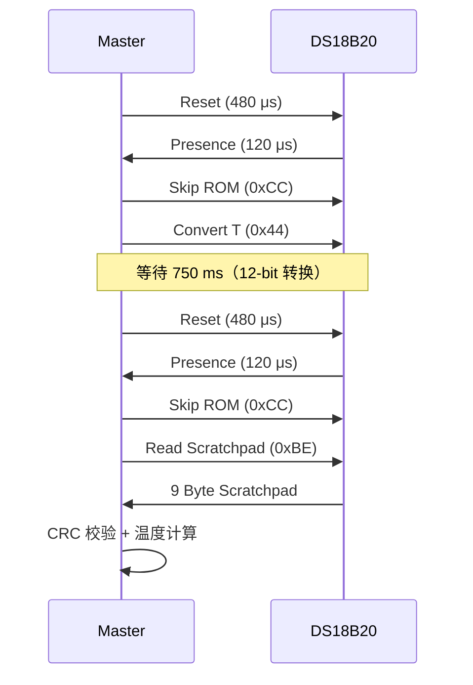
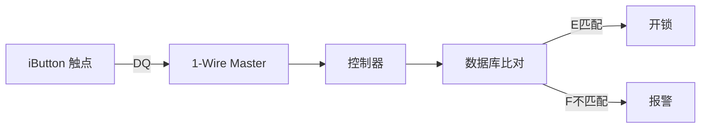

# 1-Wire往哪去——实战应用与生态演进

<span class="badge-b">[B]</span> <span class="badge-i">[I]</span> <span class="badge-e">[E]</span> <span class="badge-m">[M]</span>

<span class="red">1-Wire 不是过时的古董，而是在特定场景中不可替代的工具。</span><br>
DS18B20 测温、iButton 门禁、工业多点监控——这些实战场景今天仍在大量部署。<br>
理解 1-Wire 的应用边界和替代选型，是工程师做技术决策的依据。

---

## 核心定义与价值

<span class="red">1-Wire 的核心应用价值：在"布线极简、距离中等、速率要求低、成本敏感"的场景中，用最少线缆完成供电+通信+寻址。</span><br>

---

## 核心机制原理解析

### <strong>1. DS18B20 温度传感器完整读取流程</strong>



<br>

Scratchpad 前两个字节：

| Byte | 内容 | 说明 |
|------|------|------|
| 0 | Temperature LSB | bit3..0 = 小数位，bit7..4 = 个位 |
| 1 | Temperature MSB | bit7..0 = 符号扩展（负数补 1） |

<br>

温度计算（12-bit 默认）：
```
Temp = ((MSB << 8) | LSB) / 16.0   // 单位 °C，分辨率 0.0625°C
```

<span class="blue">DS18B20 的 12-bit 分辨率对应 750 ms 转换时间；可降低分辨率换取速度（9-bit = 93.75 ms）。</span><br>

---

### <strong>2. iButton 门禁系统（DS1990A）</strong>

<span class="red">DS1990A 是一个只有 ROM ID 的 1-Wire 器件，本质上是一个"电子钥匙"。</span><br>

工作流程：<br>

1. 用户将 iButton 触碰读卡器（1-Wire 触点）<br>
2. Master 发送 Reset + Read ROM（0x33）</span><br>
3. DS1990A 回应 64-bit ROM ID<br>
4. 控制器比对 ROM ID 是否在白名单中<br>
5. 匹配 → 开锁；不匹配 → 拒绝<br>



---

### <strong>3. 工业监控中的多点温度采集</strong>

某变电站变压器油温监测：<br>

- 8 台变压器，每台 4 个测温点<br>
- 总线长度 80 m，线性拓扑<br>
- 上拉 1.5 kΩ，外部 VDD 供电<br>
- 每 30 秒轮询一次全部 32 个节点<br>

轮询时间估算：<br>

```
每节点：Reset(1ms) + Convert(750ms) + Reset + Read(约 5ms) ≈ 756 ms
32 节点串行轮询 ≈ 32 × 756 ms ≈ 24.2 s
```

<span class="blue">为满足 30 秒周期，采用并行总线或缩短转换分辨率。</span><br>

---

### <strong>4. 与 I2C/SPI 的替代选型对比</strong>

| 场景 | 推荐总线 | 理由 |
|------|----------|------|
| 板内 EEPROM/RTC | I2C | 速率快，标准器件多 |
| 板内 ADC/Flash | SPI | 速率高，全双工 |
| 3-10 m 温度传感器 × N | 1-Wire | 省 VCC 线，布线极简 |
| 50+ m 工业传感器 | RS-485 | 差分，抗干扰，速率可调 |
| 超低功耗节点 | 1-Wire / I2C | 视传感器生态而定 |

---

### <strong>5. 1-Wire 在 IoT 低功耗场景的角色</strong>

<span class="red">1-Wire 的低速恰恰是 IoT 低功耗的优势：通信时间短 = 射频模块唤醒时间可忽略。</span><br>

现代 IoT 设计中的 1-Wire 角色：<br>

- 作为传感器前端总线，收集多点环境数据<br>
- MCU 通过 SPI/I2C 读取 1-Wire 桥接芯片（如 DS2484），无需精确 GPIO 时序<br>
- NB-IoT/LoRa 网关聚合 1-Wire 传感器数据后无线回传<br>

---

## 技术教学与实战

### <strong>Python 读取 DS18B20 完整代码</strong>

```python
import os
import glob
import time

BASE_DIR = '/sys/bus/w1/devices/'
DEVICE_FOLDER = glob.glob(BASE_DIR + '28*')

def read_temp(device_file):
    with open(device_file + '/w1_slave') as f:
        lines = f.readlines()
    while lines[0].strip()[-3:] != 'YES':
        time.sleep(0.2)
        with open(device_file + '/w1_slave') as f:
            lines = f.readlines()
    temp_pos = lines[1].find('t=')
    if temp_pos != -1:
        temp_str = lines[1][temp_pos+2:]
        return float(temp_str) / 1000.0
    return None

for dev in DEVICE_FOLDER:
    rom = os.path.basename(dev)
    temp = read_temp(dev)
    print(f"{rom}: {temp:.3f}°C")
```

---

## 嵌入式专属实战场景

### <strong>场景：农业大棚多点温控系统</strong>

需求：20 个大棚，每棚 4 个温度点，总预算有限。<br>
方案：每棚 Raspberry Pi Zero + 1-Wire 总线 + 4× DS18B20。<br>
成本：传感器约 ¥8/个，布线仅需 CAT5 双绞线。<br>
数据通过 WiFi 汇聚到中心服务器。<br>

---

## 历史演进与前沿

| 年代 | 事件 | 意义 |
|------|------|------|
| 1996 | DS18B20 发布 | 数字温度传感标准化 |
| 2000s | iButton 生态成熟 | 门禁、资产追踪规模化 |
| 2010s | Linux w1 子系统 | 开源生态接入 |
| 2020+ | 1-Wire + IoT 桥接 | DS2484 等 I2C 桥降低主设备时序要求 |
| 未来 | 单芯片集成 | SoC 内置 1-Wire Master，GPIO 不再是瓶颈 |

<span class="purple">扩展阅读：Maxim 的 "1-Wire Software Resource" 页面，含 Search ROM、CRC 计算的 C 代码参考实现。</span><br>

---

## 本章小结

| 主题 | 要点 |
|------|------|
| DS18B20 流程 | Reset → Skip ROM → Convert T → 等待 → Reset → Read Scratchpad → CRC 校验 |
| iButton | DS1990A 64-bit ROM ID = 电子钥匙，Read ROM 读取 |
| 工业监控 | 线性总线 + 外部 VDD + 长上拉轮询 |
| 选型 | 省线场景选 1-Wire，板内高速选 SPI/I2C，远距离选 RS-485 |
| IoT 角色 | 前端传感器总线，桥接到 MCU 后无线回传 |
| 前沿 | I2C 桥接芯片、SoC 内置 Master |

---

## 练习

1. 写出 DS18B20 从 Reset 到读出温度的完整命令序列（含 ROM 命令和功能命令）。
2. 32 个 DS18B20 串行轮询，12-bit 分辨率下总周期约多少？如何优化到 < 10 s？
3. 为什么 iButton 适合门禁而不适合支付系统？从安全性角度分析。
4. 设计一个"大棚温控"方案：对比纯 1-Wire、纯 I2C、混合方案的成本与布线差异。
5. DS2484 I2C-1-Wire 桥解决了什么问题？在什么场景下必选？
