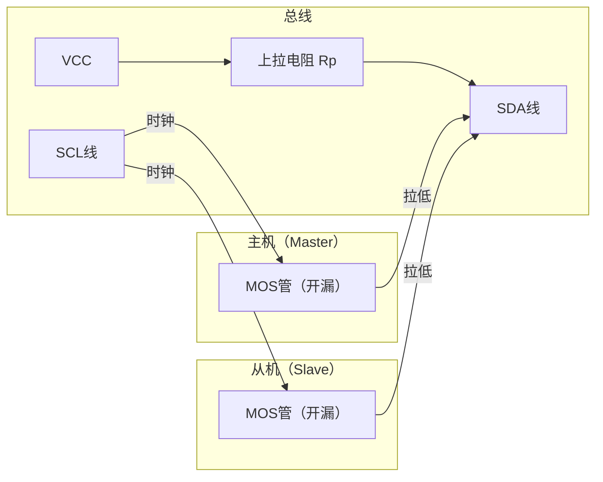
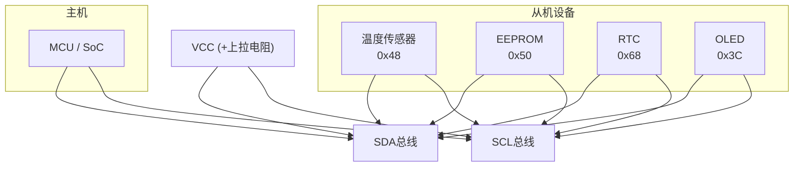

# I2C 基础认知与物理层 [B]

> **本章学习目标**：
> - 理解 I2C（Inter-Integrated Circuit） 的设计初衷与两线架构
> - 掌握 SDA/SCL 的 开漏驱动 与上拉电阻计算
> - 了解 I2C 在嵌入式传感器网络中的典型拓扑

---

## I2C 的诞生与历史演进

---

### <strong>为什么需要 I2C：从并行到串行的降本革命</strong>

I2C 由 Philips 公司（现 NXP）的 Alberto Ciribini 和 Wouter van der Bussche 在 1982 年设计。

在 I2C 出现之前，芯片间通信使用 并行总线（如 Intel 的 Multibus）：
* 8-bit 数据 + 16-bit 地址 + 控制信号 = 30+ 根线
* PCB 走线密集，成本高
* 引脚有限的消费级芯片（如电视遥控器 IC）无法承受

I2C 用 2 根线（SDA + SCL）替代 30 根并行线，使电视机内部的 100+ 个芯片互联成为可能。

类比：I2C 如同"公交车专用道"——所有设备共用同一对线路，通过地址区分目的地，而不是为每个设备修一条专用路。

---

### <strong>I2C 的物理层：开漏驱动与上拉电阻</strong>

开漏（Open-Drain）驱动是 I2C 的核心电气特性。

| 电气参数 | 标准模式 | 快速模式 | 快速模式+ | 含义 |
| --- | --- | --- | --- | --- |
| 最高速率 | 100 kHz | 400 kHz | 1 MHz | SCL 时钟频率 |
| 上拉电压 | 5V / 3.3V | 5V / 3.3V / 1.8V | 1.8V / 1.2V | 总线逻辑高电平 |
| 最大总线电容 | 400 pF | 400 pF | 550 pF | 限制总线长度和设备数 |
| 上拉电阻范围 | 1kΩ ~ 10kΩ | 1kΩ ~ 10kΩ | 0.5kΩ ~ 2kΩ | 权衡速度与功耗 |

上拉电阻计算公式：Rp(min) = (VCC - VOL(max)) / IOL = (3.3V - 0.4V) / 3mA ≈ 970Ω

---

### <strong>I2C 的总线拓扑与设备地址</strong>

I2C 总线是 "多主多从"架构：
* 同一总线可挂多个 Master（仲裁机制解决冲突）
* 同一总线可挂最多 127 个 Slave（7-bit 地址）
* 广播地址 0x00 可呼叫所有 Slave

---

## 本章小结

| 概念 | 一句话总结 |
| --- | --- |
| I2C | Philips 1982 年提出的两线串行总线 |
| SDA/SCL | 数据线/时钟线，开漏驱动需外接上拉 |
| 开漏 | 只能拉低不能拉高，实现线与逻辑 |
| 多主多从 | 最多 127 设备，通过地址区分 |
| 上拉电阻 | 计算：Rp = (VCC - VOL) / IOL |

---

## 练习

1. 为什么 I2C 使用开漏驱动而不是推挽驱动？如果两设备同时输出高会怎样？
2. 计算 I2C 总线最大长度：总线电容 400pF，每 cm 走线电容 2pF，上拉电阻 4.7kΩ。
3. 在 I2C 总线上挂 3 个设备（0x48、0x50、0x68），画出总线拓扑图并标注地址。
